> **Model Completeness: F (25%)**
> Some sections may be empty due to missing model entities.
> - No interfaces defined on components → interface-spec doc empty
> - No requirements defined
> - Actors defined but missing goals/descriptions
> - 17/17 components missing description/responsibilities
> Run the extraction pipeline or manually add behaviors/interfaces/constraints.

# Logical Architecture: Src (manifest)

## Layer Structure

| Order | Layer | Technologies | Directories |
|-------|-------|-------------|-------------|
| 0 | data | — | — |

## Component Allocation

### unassigned

| Component | Kind | Files | Responsibilities |
|-----------|------|-------|------------------|
| Behavior (src-manifest-COMP-16) | service | 1 files | — |
| Blocks (src-manifest-COMP-17) | service | 3 files | — |
| Body Hints (src-manifest-COMP-18) | service | 1 files | — |
| Call Graph (src-manifest-COMP-19) | service | 1 files | — |
| Chains (src-manifest-COMP-20) | service | 1 files | — |
| Display (src-manifest-COMP-21) | service | 1 files | — |
| Generator (src-manifest-COMP-22) | service | 1 files | — |
| Grouping (src-manifest-COMP-23) | service | 1 files | — |
| Interfaces (src-manifest-COMP-24) | service | 1 files | — |
| Kt Scanner (src-manifest-COMP-25) | service | 2 files | — |
| Metrics (src-manifest-COMP-26) | service | 1 files | — |
| Multi Scanner (src-manifest-COMP-27) | service | 1 files | — |
| Protocol (src-manifest-COMP-28) | service | 1 files | — |
| Recursive (src-manifest-COMP-29) | service | 1 files | — |
| Scan Cache (src-manifest-COMP-30) | service | 1 files | — |
| Slicers (src-manifest-COMP-32) | service | 1 files | — |
| Ts Scanner (src-manifest-COMP-33) | service | 1 files | — |

## Inter-Component Interfaces

*No interfaces defined.*

## Dependency Graph

```mermaid
graph TD
    src-manifest-COMP-32["Slicers"]
    src-manifest-COMP-18["Body Hints"]
    src-manifest-COMP-32 --> src-manifest-COMP-18
    src-manifest-COMP-24["Interfaces"]
    src-manifest-COMP-22["Generator"]
    src-manifest-COMP-24 --> src-manifest-COMP-22
    src-manifest-COMP-21["Display"]
    src-manifest-COMP-22 --> src-manifest-COMP-21
    src-manifest-COMP-23["Grouping"]
    src-manifest-COMP-24 --> src-manifest-COMP-23
    src-manifest-COMP-19["Call Graph"]
    src-manifest-COMP-28["Protocol"]
    src-manifest-COMP-19 --> src-manifest-COMP-28
    src-manifest-COMP-17["Blocks"]
    src-manifest-COMP-17 --> src-manifest-COMP-18
    src-manifest-COMP-32 --> src-manifest-COMP-22
    src-manifest-COMP-30["Scan Cache"]
    src-manifest-COMP-16["Behavior"]
    src-manifest-COMP-30 --> src-manifest-COMP-16
    src-manifest-COMP-32 --> src-manifest-COMP-23
    src-manifest-COMP-17 --> src-manifest-COMP-22
    src-manifest-COMP-25["Kt Scanner"]
    src-manifest-COMP-33["Ts Scanner"]
    src-manifest-COMP-25 --> src-manifest-COMP-33
    src-manifest-COMP-17 --> src-manifest-COMP-23
    src-manifest-COMP-29["Recursive"]
    src-manifest-COMP-29 --> src-manifest-COMP-21
    src-manifest-COMP-19 --> src-manifest-COMP-32
    src-manifest-COMP-27["Multi Scanner"]
    src-manifest-COMP-27 --> src-manifest-COMP-17
    src-manifest-COMP-24 --> src-manifest-COMP-27
    src-manifest-COMP-26["Metrics"]
    src-manifest-COMP-27 --> src-manifest-COMP-26
    src-manifest-COMP-29 --> src-manifest-COMP-25
    src-manifest-COMP-30 --> src-manifest-COMP-32
    src-manifest-COMP-19 --> src-manifest-COMP-33
    src-manifest-COMP-25 --> src-manifest-COMP-29
    src-manifest-COMP-30 --> src-manifest-COMP-33
    src-manifest-COMP-30 --> src-manifest-COMP-19
    src-manifest-COMP-26 --> src-manifest-COMP-22
    src-manifest-COMP-20["Chains"]
    src-manifest-COMP-22 --> src-manifest-COMP-20
    src-manifest-COMP-23 --> src-manifest-COMP-20
    src-manifest-COMP-26 --> src-manifest-COMP-28
    src-manifest-COMP-27 --> src-manifest-COMP-16
    src-manifest-COMP-24 --> src-manifest-COMP-29
    src-manifest-COMP-29 --> src-manifest-COMP-18
    src-manifest-COMP-32 --> src-manifest-COMP-29
    src-manifest-COMP-29 --> src-manifest-COMP-23
    src-manifest-COMP-25 --> src-manifest-COMP-21
    src-manifest-COMP-29 --> src-manifest-COMP-20
    src-manifest-COMP-17 --> src-manifest-COMP-29
    src-manifest-COMP-27 --> src-manifest-COMP-32
    src-manifest-COMP-26 --> src-manifest-COMP-33
    src-manifest-COMP-27 --> src-manifest-COMP-33
    src-manifest-COMP-22 --> src-manifest-COMP-24
    src-manifest-COMP-23 --> src-manifest-COMP-24
    src-manifest-COMP-27 --> src-manifest-COMP-19
    src-manifest-COMP-32 --> src-manifest-COMP-21
    src-manifest-COMP-29 --> src-manifest-COMP-27
    src-manifest-COMP-19 --> src-manifest-COMP-25
    src-manifest-COMP-17 --> src-manifest-COMP-21
    src-manifest-COMP-25 --> src-manifest-COMP-18
    src-manifest-COMP-32 --> src-manifest-COMP-25
    src-manifest-COMP-26 --> src-manifest-COMP-29
    src-manifest-COMP-17 --> src-manifest-COMP-25
    src-manifest-COMP-25 --> src-manifest-COMP-22
    src-manifest-COMP-25 --> src-manifest-COMP-23
    src-manifest-COMP-22 --> src-manifest-COMP-30
    src-manifest-COMP-25 --> src-manifest-COMP-20
    src-manifest-COMP-19 --> src-manifest-COMP-18
    src-manifest-COMP-23 --> src-manifest-COMP-17
    src-manifest-COMP-30 --> src-manifest-COMP-18
    src-manifest-COMP-19 --> src-manifest-COMP-22
    src-manifest-COMP-24 --> src-manifest-COMP-20
    src-manifest-COMP-19 --> src-manifest-COMP-23
    src-manifest-COMP-26 --> src-manifest-COMP-21
    src-manifest-COMP-29 --> src-manifest-COMP-30
    src-manifest-COMP-25 --> src-manifest-COMP-27
    src-manifest-COMP-30 --> src-manifest-COMP-22
    src-manifest-COMP-30 --> src-manifest-COMP-28
    src-manifest-COMP-32 --> src-manifest-COMP-20
    src-manifest-COMP-26 --> src-manifest-COMP-25
    src-manifest-COMP-22 --> src-manifest-COMP-16
    src-manifest-COMP-23 --> src-manifest-COMP-16
    src-manifest-COMP-17 --> src-manifest-COMP-20
    src-manifest-COMP-32 --> src-manifest-COMP-27
    src-manifest-COMP-26 --> src-manifest-COMP-18
    src-manifest-COMP-23 --> src-manifest-COMP-32
    src-manifest-COMP-27 --> src-manifest-COMP-18
    src-manifest-COMP-17 --> src-manifest-COMP-27
    src-manifest-COMP-26 --> src-manifest-COMP-23
    src-manifest-COMP-27 --> src-manifest-COMP-22
    src-manifest-COMP-25 --> src-manifest-COMP-30
    src-manifest-COMP-26 --> src-manifest-COMP-20
    src-manifest-COMP-27 --> src-manifest-COMP-28
    src-manifest-COMP-19 --> src-manifest-COMP-29
    src-manifest-COMP-30 --> src-manifest-COMP-29
    src-manifest-COMP-24 --> src-manifest-COMP-30
    src-manifest-COMP-24 --> src-manifest-COMP-17
    src-manifest-COMP-26 --> src-manifest-COMP-27
    src-manifest-COMP-32 --> src-manifest-COMP-30
    src-manifest-COMP-17 --> src-manifest-COMP-30
    src-manifest-COMP-19 --> src-manifest-COMP-21
    src-manifest-COMP-30 --> src-manifest-COMP-21
    src-manifest-COMP-24 --> src-manifest-COMP-16
    src-manifest-COMP-29 --> src-manifest-COMP-24
    src-manifest-COMP-30 --> src-manifest-COMP-25
    src-manifest-COMP-27 --> src-manifest-COMP-29
    src-manifest-COMP-23 --> src-manifest-COMP-30
    src-manifest-COMP-26 --> src-manifest-COMP-30
    src-manifest-COMP-24 --> src-manifest-COMP-32
    src-manifest-COMP-22 --> src-manifest-COMP-17
    src-manifest-COMP-22 --> src-manifest-COMP-26
    src-manifest-COMP-23 --> src-manifest-COMP-26
    src-manifest-COMP-19 --> src-manifest-COMP-20
    src-manifest-COMP-27 --> src-manifest-COMP-21
    src-manifest-COMP-29 --> src-manifest-COMP-17
    src-manifest-COMP-29 --> src-manifest-COMP-26
    src-manifest-COMP-30 --> src-manifest-COMP-23
    src-manifest-COMP-30 --> src-manifest-COMP-20
    src-manifest-COMP-27 --> src-manifest-COMP-25
    src-manifest-COMP-22 --> src-manifest-COMP-28
    src-manifest-COMP-23 --> src-manifest-COMP-28
    src-manifest-COMP-25 --> src-manifest-COMP-24
    src-manifest-COMP-19 --> src-manifest-COMP-27
    src-manifest-COMP-29 --> src-manifest-COMP-16
    src-manifest-COMP-30 --> src-manifest-COMP-27
    src-manifest-COMP-22 --> src-manifest-COMP-32
    src-manifest-COMP-32 --> src-manifest-COMP-24
    src-manifest-COMP-22 --> src-manifest-COMP-33
    src-manifest-COMP-23 --> src-manifest-COMP-33
    src-manifest-COMP-27 --> src-manifest-COMP-23
    src-manifest-COMP-17 --> src-manifest-COMP-24
    src-manifest-COMP-22 --> src-manifest-COMP-19
    src-manifest-COMP-23 --> src-manifest-COMP-19
    src-manifest-COMP-25 --> src-manifest-COMP-17
    src-manifest-COMP-27 --> src-manifest-COMP-20
    src-manifest-COMP-29 --> src-manifest-COMP-32
    src-manifest-COMP-19 --> src-manifest-COMP-30
    src-manifest-COMP-29 --> src-manifest-COMP-19
    src-manifest-COMP-23 --> src-manifest-COMP-29
    src-manifest-COMP-24 --> src-manifest-COMP-26
    src-manifest-COMP-25 --> src-manifest-COMP-16
    src-manifest-COMP-32 --> src-manifest-COMP-17
    src-manifest-COMP-32 --> src-manifest-COMP-26
    src-manifest-COMP-26 --> src-manifest-COMP-24
    src-manifest-COMP-17 --> src-manifest-COMP-26
    src-manifest-COMP-19 --> src-manifest-COMP-16
    src-manifest-COMP-24 --> src-manifest-COMP-28
    src-manifest-COMP-23 --> src-manifest-COMP-21
    src-manifest-COMP-25 --> src-manifest-COMP-32
    src-manifest-COMP-32 --> src-manifest-COMP-16
    src-manifest-COMP-32 --> src-manifest-COMP-28
    src-manifest-COMP-17 --> src-manifest-COMP-16
    src-manifest-COMP-22 --> src-manifest-COMP-25
    src-manifest-COMP-23 --> src-manifest-COMP-25
    src-manifest-COMP-17 --> src-manifest-COMP-28
    src-manifest-COMP-25 --> src-manifest-COMP-19
    src-manifest-COMP-27 --> src-manifest-COMP-30
    src-manifest-COMP-26 --> src-manifest-COMP-17
    src-manifest-COMP-24 --> src-manifest-COMP-33
    src-manifest-COMP-17 --> src-manifest-COMP-32
    src-manifest-COMP-22 --> src-manifest-COMP-18
    src-manifest-COMP-23 --> src-manifest-COMP-18
    src-manifest-COMP-24 --> src-manifest-COMP-19
    src-manifest-COMP-32 --> src-manifest-COMP-33
    src-manifest-COMP-32 --> src-manifest-COMP-19
    src-manifest-COMP-17 --> src-manifest-COMP-33
    src-manifest-COMP-23 --> src-manifest-COMP-22
    src-manifest-COMP-22 --> src-manifest-COMP-23
    src-manifest-COMP-26 --> src-manifest-COMP-16
    src-manifest-COMP-17 --> src-manifest-COMP-19
    src-manifest-COMP-29 --> src-manifest-COMP-22
    src-manifest-COMP-29 --> src-manifest-COMP-28
    src-manifest-COMP-26 --> src-manifest-COMP-32
    src-manifest-COMP-19 --> src-manifest-COMP-24
    src-manifest-COMP-22 --> src-manifest-COMP-27
    src-manifest-COMP-23 --> src-manifest-COMP-27
    src-manifest-COMP-30 --> src-manifest-COMP-17
    src-manifest-COMP-30 --> src-manifest-COMP-24
    src-manifest-COMP-24 --> src-manifest-COMP-21
    src-manifest-COMP-26 --> src-manifest-COMP-19
    src-manifest-COMP-25 --> src-manifest-COMP-26
    src-manifest-COMP-24 --> src-manifest-COMP-25
    src-manifest-COMP-29 --> src-manifest-COMP-33
    src-manifest-COMP-22 --> src-manifest-COMP-29
    src-manifest-COMP-18 --> src-manifest-COMP-17
    src-manifest-COMP-19 --> src-manifest-COMP-17
    src-manifest-COMP-19 --> src-manifest-COMP-26
    src-manifest-COMP-25 --> src-manifest-COMP-28
    src-manifest-COMP-30 --> src-manifest-COMP-26
    src-manifest-COMP-24 --> src-manifest-COMP-18
    src-manifest-COMP-27 --> src-manifest-COMP-24
```

