> **Model Completeness: F (25%)**
> Some sections may be empty due to missing model entities.
> - No interfaces defined on components → interface-spec doc empty
> - No requirements defined
> - Actors defined but missing goals/descriptions
> - 13/13 components missing description/responsibilities
> Run the extraction pipeline or manually add behaviors/interfaces/constraints.

# Logical Architecture: Src (orchestration)

## Layer Structure

| Order | Layer | Technologies | Directories |
|-------|-------|-------------|-------------|
| 0 | data | — | — |

## Component Allocation

### unassigned

| Component | Kind | Files | Responsibilities |
|-----------|------|-------|------------------|
| Auto Enrich (src-orchestration-COMP-1) | service | 1 files | — |
| Behavior Decompose (src-orchestration-COMP-2) | service | 1 files | — |
| Behavior Flows (src-orchestration-COMP-3) | service | 1 files | — |
| Capability Inference (src-orchestration-COMP-4) | service | 1 files | — |
| Compaction (src-orchestration-COMP-5) | service | 1 files | — |
| Decompose (src-orchestration-COMP-6) | service | 1 files | — |
| Deep Decompose (src-orchestration-COMP-7) | service | 1 files | — |
| Enrich (src-orchestration-COMP-8) | service | 1 files | — |
| Enrichment Context (src-orchestration-COMP-9) | service | 1 files | — |
| Naming Context (src-orchestration-COMP-10) | service | 1 files | — |
| Pipeline (src-orchestration-COMP-11) | service | 1 files | — |
| Trigger Detection (src-orchestration-COMP-12) | service | 1 files | — |
| Use Case Inference (src-orchestration-COMP-13) | service | 1 files | — |

## Inter-Component Interfaces

*No interfaces defined.*

## Dependency Graph

```mermaid
graph TD
    src-orchestration-COMP-11["Pipeline"]
    src-orchestration-COMP-8["Enrich"]
    src-orchestration-COMP-11 --> src-orchestration-COMP-8
    src-orchestration-COMP-4["Capability Inference"]
    src-orchestration-COMP-11 --> src-orchestration-COMP-4
    src-orchestration-COMP-10["Naming Context"]
    src-orchestration-COMP-12["Trigger Detection"]
    src-orchestration-COMP-10 --> src-orchestration-COMP-12
    src-orchestration-COMP-6["Decompose"]
    src-orchestration-COMP-10 --> src-orchestration-COMP-6
    src-orchestration-COMP-1["Auto Enrich"]
    src-orchestration-COMP-10 --> src-orchestration-COMP-1
    src-orchestration-COMP-9["Enrichment Context"]
    src-orchestration-COMP-9 --> src-orchestration-COMP-1
    src-orchestration-COMP-9 --> src-orchestration-COMP-12
    src-orchestration-COMP-9 --> src-orchestration-COMP-6
    src-orchestration-COMP-3["Behavior Flows"]
    src-orchestration-COMP-11 --> src-orchestration-COMP-3
    src-orchestration-COMP-11 --> src-orchestration-COMP-9
    src-orchestration-COMP-11 --> src-orchestration-COMP-10
    src-orchestration-COMP-13["Use Case Inference"]
    src-orchestration-COMP-10 --> src-orchestration-COMP-13
    src-orchestration-COMP-2["Behavior Decompose"]
    src-orchestration-COMP-10 --> src-orchestration-COMP-2
    src-orchestration-COMP-5["Compaction"]
    src-orchestration-COMP-10 --> src-orchestration-COMP-5
    src-orchestration-COMP-9 --> src-orchestration-COMP-13
    src-orchestration-COMP-10 --> src-orchestration-COMP-11
    src-orchestration-COMP-9 --> src-orchestration-COMP-5
    src-orchestration-COMP-9 --> src-orchestration-COMP-2
    src-orchestration-COMP-9 --> src-orchestration-COMP-11
    src-orchestration-COMP-7["Deep Decompose"]
    src-orchestration-COMP-10 --> src-orchestration-COMP-7
    src-orchestration-COMP-9 --> src-orchestration-COMP-7
    src-orchestration-COMP-11 --> src-orchestration-COMP-12
    src-orchestration-COMP-11 --> src-orchestration-COMP-1
    src-orchestration-COMP-11 --> src-orchestration-COMP-6
    src-orchestration-COMP-10 --> src-orchestration-COMP-8
    src-orchestration-COMP-10 --> src-orchestration-COMP-4
    src-orchestration-COMP-10 --> src-orchestration-COMP-3
    src-orchestration-COMP-9 --> src-orchestration-COMP-8
    src-orchestration-COMP-9 --> src-orchestration-COMP-4
    src-orchestration-COMP-11 --> src-orchestration-COMP-13
    src-orchestration-COMP-10 --> src-orchestration-COMP-9
    src-orchestration-COMP-9 --> src-orchestration-COMP-3
    src-orchestration-COMP-11 --> src-orchestration-COMP-5
    src-orchestration-COMP-11 --> src-orchestration-COMP-2
    src-orchestration-COMP-9 --> src-orchestration-COMP-10
    src-orchestration-COMP-11 --> src-orchestration-COMP-7
```

