> **Model Completeness: F (25%)**
> Some sections may be empty due to missing model entities.
> - No interfaces defined on components → interface-spec doc empty
> - No requirements defined
> - Actors defined but missing goals/descriptions
> - 21/21 components missing description/responsibilities
> Run the extraction pipeline or manually add behaviors/interfaces/constraints.

# Logical Architecture: Src (pipeline)

## Layer Structure

| Order | Layer | Technologies | Directories |
|-------|-------|-------------|-------------|
| 0 | data | — | — |

## Component Allocation

### unassigned

| Component | Kind | Files | Responsibilities |
|-----------|------|-------|------------------|
| Allocate (src-pipeline-COMP-16) | service | 2 files | — |
| Artifacts (src-pipeline-COMP-18) | service | 1 files | — |
| Cache (src-pipeline-COMP-19) | service | 1 files | — |
| Context Gen (src-pipeline-COMP-20) | service | 1 files | — |
| Contract (src-pipeline-COMP-21) | service | 2 files | — |
| Coordinator (src-pipeline-COMP-23) | service | 1 files | — |
| Corrections (src-pipeline-COMP-24) | service | 1 files | — |
| Decompose (src-pipeline-COMP-25) | service | 3 files | — |
| Emit (src-pipeline-COMP-27) | service | 2 files | — |
| Global Learning (src-pipeline-COMP-29) | service | 2 files | — |
| Infer (src-pipeline-COMP-30) | service | 2 files | — |
| Lessons (src-pipeline-COMP-33) | service | 1 files | — |
| Observe (src-pipeline-COMP-34) | service | 2 files | — |
| Protocol (src-pipeline-COMP-36) | service | 1 files | — |
| Regen Score (src-pipeline-COMP-37) | service | 1 files | — |
| Relate (src-pipeline-COMP-38) | service | 2 files | — |
| Report (src-pipeline-COMP-40) | service | 1 files | — |
| Requirements Derive (src-pipeline-COMP-41) | service | 1 files | — |
| Specify (src-pipeline-COMP-42) | service | 2 files | — |
| Synthesize (src-pipeline-COMP-44) | service | 2 files | — |
| Validate (src-pipeline-COMP-46) | service | 2 files | — |

## Inter-Component Interfaces

*No interfaces defined.*

## Dependency Graph

```mermaid
graph TD
    src-pipeline-COMP-20["Context Gen"]
    src-pipeline-COMP-30["Infer"]
    src-pipeline-COMP-20 --> src-pipeline-COMP-30
    src-pipeline-COMP-33["Lessons"]
    src-pipeline-COMP-36["Protocol"]
    src-pipeline-COMP-33 --> src-pipeline-COMP-36
    src-pipeline-COMP-37["Regen Score"]
    src-pipeline-COMP-37 --> src-pipeline-COMP-36
    src-pipeline-COMP-25["Decompose"]
    src-pipeline-COMP-25 --> src-pipeline-COMP-33
    src-pipeline-COMP-38["Relate"]
    src-pipeline-COMP-16["Allocate"]
    src-pipeline-COMP-38 --> src-pipeline-COMP-16
    src-pipeline-COMP-44["Synthesize"]
    src-pipeline-COMP-44 --> src-pipeline-COMP-30
    src-pipeline-COMP-21["Contract"]
    src-pipeline-COMP-21 --> src-pipeline-COMP-16
    src-pipeline-COMP-20 --> src-pipeline-COMP-16
    src-pipeline-COMP-34["Observe"]
    src-pipeline-COMP-30 --> src-pipeline-COMP-34
    src-pipeline-COMP-40["Report"]
    src-pipeline-COMP-25 --> src-pipeline-COMP-40
    src-pipeline-COMP-42["Specify"]
    src-pipeline-COMP-25 --> src-pipeline-COMP-42
    src-pipeline-COMP-19["Cache"]
    src-pipeline-COMP-19 --> src-pipeline-COMP-33
    src-pipeline-COMP-38 --> src-pipeline-COMP-34
    src-pipeline-COMP-29["Global Learning"]
    src-pipeline-COMP-25 --> src-pipeline-COMP-29
    src-pipeline-COMP-21 --> src-pipeline-COMP-34
    src-pipeline-COMP-27["Emit"]
    src-pipeline-COMP-27 --> src-pipeline-COMP-16
    src-pipeline-COMP-20 --> src-pipeline-COMP-34
    src-pipeline-COMP-19 --> src-pipeline-COMP-40
    src-pipeline-COMP-23["Coordinator"]
    src-pipeline-COMP-23 --> src-pipeline-COMP-20
    src-pipeline-COMP-19 --> src-pipeline-COMP-42
    src-pipeline-COMP-25 --> src-pipeline-COMP-21
    src-pipeline-COMP-27 --> src-pipeline-COMP-34
    src-pipeline-COMP-16 --> src-pipeline-COMP-30
    src-pipeline-COMP-23 --> src-pipeline-COMP-44
    src-pipeline-COMP-23 --> src-pipeline-COMP-36
    src-pipeline-COMP-27 --> src-pipeline-COMP-33
    src-pipeline-COMP-23 --> src-pipeline-COMP-38
    src-pipeline-COMP-18["Artifacts"]
    src-pipeline-COMP-46["Validate"]
    src-pipeline-COMP-18 --> src-pipeline-COMP-46
    src-pipeline-COMP-19 --> src-pipeline-COMP-46
    src-pipeline-COMP-24["Corrections"]
    src-pipeline-COMP-23 --> src-pipeline-COMP-24
    src-pipeline-COMP-20 --> src-pipeline-COMP-36
    src-pipeline-COMP-27 --> src-pipeline-COMP-19
    src-pipeline-COMP-27 --> src-pipeline-COMP-24
    src-pipeline-COMP-19 --> src-pipeline-COMP-25
    src-pipeline-COMP-41["Requirements Derive"]
    src-pipeline-COMP-25 --> src-pipeline-COMP-41
    src-pipeline-COMP-27 --> src-pipeline-COMP-40
    src-pipeline-COMP-25 --> src-pipeline-COMP-18
    src-pipeline-COMP-44 --> src-pipeline-COMP-36
    src-pipeline-COMP-42 --> src-pipeline-COMP-36
    src-pipeline-COMP-25 --> src-pipeline-COMP-23
    src-pipeline-COMP-25 --> src-pipeline-COMP-20
    src-pipeline-COMP-44 --> src-pipeline-COMP-24
    src-pipeline-COMP-19 --> src-pipeline-COMP-41
    src-pipeline-COMP-19 --> src-pipeline-COMP-18
    src-pipeline-COMP-19 --> src-pipeline-COMP-23
    src-pipeline-COMP-27 --> src-pipeline-COMP-46
    src-pipeline-COMP-46 --> src-pipeline-COMP-38
    src-pipeline-COMP-25 --> src-pipeline-COMP-27
    src-pipeline-COMP-23 --> src-pipeline-COMP-16
    src-pipeline-COMP-25 --> src-pipeline-COMP-38
    src-pipeline-COMP-16 --> src-pipeline-COMP-36
    src-pipeline-COMP-23 --> src-pipeline-COMP-34
    src-pipeline-COMP-27 --> src-pipeline-COMP-37
    src-pipeline-COMP-27 --> src-pipeline-COMP-18
    src-pipeline-COMP-46 --> src-pipeline-COMP-30
    src-pipeline-COMP-34 --> src-pipeline-COMP-36
    src-pipeline-COMP-16 --> src-pipeline-COMP-24
    src-pipeline-COMP-44 --> src-pipeline-COMP-16
    src-pipeline-COMP-42 --> src-pipeline-COMP-16
    src-pipeline-COMP-25 --> src-pipeline-COMP-30
    src-pipeline-COMP-18 --> src-pipeline-COMP-42
    src-pipeline-COMP-19 --> src-pipeline-COMP-29
    src-pipeline-COMP-44 --> src-pipeline-COMP-34
    src-pipeline-COMP-42 --> src-pipeline-COMP-34
    src-pipeline-COMP-46 --> src-pipeline-COMP-16
    src-pipeline-COMP-18 --> src-pipeline-COMP-21
    src-pipeline-COMP-19 --> src-pipeline-COMP-21
    src-pipeline-COMP-44 --> src-pipeline-COMP-19
    src-pipeline-COMP-29 --> src-pipeline-COMP-36
    src-pipeline-COMP-44 --> src-pipeline-COMP-40
    src-pipeline-COMP-27 --> src-pipeline-COMP-42
    src-pipeline-COMP-23 --> src-pipeline-COMP-46
    src-pipeline-COMP-27 --> src-pipeline-COMP-29
    src-pipeline-COMP-40 --> src-pipeline-COMP-36
    src-pipeline-COMP-20 --> src-pipeline-COMP-46
    src-pipeline-COMP-16 --> src-pipeline-COMP-34
    src-pipeline-COMP-46 --> src-pipeline-COMP-36
    src-pipeline-COMP-44 --> src-pipeline-COMP-46
    src-pipeline-COMP-19 --> src-pipeline-COMP-20
    src-pipeline-COMP-27 --> src-pipeline-COMP-21
    src-pipeline-COMP-23 --> src-pipeline-COMP-37
    src-pipeline-COMP-25 --> src-pipeline-COMP-44
    src-pipeline-COMP-25 --> src-pipeline-COMP-36
    src-pipeline-COMP-27 --> src-pipeline-COMP-25
    src-pipeline-COMP-25 --> src-pipeline-COMP-24
    src-pipeline-COMP-19 --> src-pipeline-COMP-27
    src-pipeline-COMP-19 --> src-pipeline-COMP-44
    src-pipeline-COMP-19 --> src-pipeline-COMP-36
    src-pipeline-COMP-44 --> src-pipeline-COMP-37
    src-pipeline-COMP-27 --> src-pipeline-COMP-41
    src-pipeline-COMP-18 --> src-pipeline-COMP-38
    src-pipeline-COMP-19 --> src-pipeline-COMP-38
    src-pipeline-COMP-44 --> src-pipeline-COMP-18
    src-pipeline-COMP-23 --> src-pipeline-COMP-33
    src-pipeline-COMP-27 --> src-pipeline-COMP-23
    src-pipeline-COMP-27 --> src-pipeline-COMP-20
    src-pipeline-COMP-23 --> src-pipeline-COMP-19
    src-pipeline-COMP-23 --> src-pipeline-COMP-40
    src-pipeline-COMP-23 --> src-pipeline-COMP-42
    src-pipeline-COMP-18 --> src-pipeline-COMP-30
    src-pipeline-COMP-19 --> src-pipeline-COMP-30
    src-pipeline-COMP-23 --> src-pipeline-COMP-29
    src-pipeline-COMP-44 --> src-pipeline-COMP-33
    src-pipeline-COMP-27 --> src-pipeline-COMP-44
    src-pipeline-COMP-25 --> src-pipeline-COMP-16
    src-pipeline-COMP-38 --> src-pipeline-COMP-30
    src-pipeline-COMP-27 --> src-pipeline-COMP-38
    src-pipeline-COMP-44 --> src-pipeline-COMP-42
    src-pipeline-COMP-18 --> src-pipeline-COMP-16
    src-pipeline-COMP-19 --> src-pipeline-COMP-16
    src-pipeline-COMP-23 --> src-pipeline-COMP-21
    src-pipeline-COMP-25 --> src-pipeline-COMP-34
    src-pipeline-COMP-44 --> src-pipeline-COMP-29
    src-pipeline-COMP-23 --> src-pipeline-COMP-25
    src-pipeline-COMP-25 --> src-pipeline-COMP-19
    src-pipeline-COMP-27 --> src-pipeline-COMP-30
    src-pipeline-COMP-18 --> src-pipeline-COMP-34
    src-pipeline-COMP-19 --> src-pipeline-COMP-34
    src-pipeline-COMP-44 --> src-pipeline-COMP-21
    src-pipeline-COMP-23 --> src-pipeline-COMP-41
    src-pipeline-COMP-23 --> src-pipeline-COMP-18
    src-pipeline-COMP-44 --> src-pipeline-COMP-25
    src-pipeline-COMP-18 --> src-pipeline-COMP-36
    src-pipeline-COMP-44 --> src-pipeline-COMP-41
    src-pipeline-COMP-25 --> src-pipeline-COMP-46
    src-pipeline-COMP-30 --> src-pipeline-COMP-36
    src-pipeline-COMP-19 --> src-pipeline-COMP-24
    src-pipeline-COMP-23 --> src-pipeline-COMP-27
    src-pipeline-COMP-38 --> src-pipeline-COMP-36
    src-pipeline-COMP-44 --> src-pipeline-COMP-23
    src-pipeline-COMP-30 --> src-pipeline-COMP-24
    src-pipeline-COMP-44 --> src-pipeline-COMP-20
    src-pipeline-COMP-21 --> src-pipeline-COMP-36
    src-pipeline-COMP-20 --> src-pipeline-COMP-38
    src-pipeline-COMP-25 --> src-pipeline-COMP-37
    src-pipeline-COMP-44 --> src-pipeline-COMP-27
    src-pipeline-COMP-27 --> src-pipeline-COMP-36
    src-pipeline-COMP-44 --> src-pipeline-COMP-38
    src-pipeline-COMP-23 --> src-pipeline-COMP-30
    src-pipeline-COMP-19 --> src-pipeline-COMP-37
```

