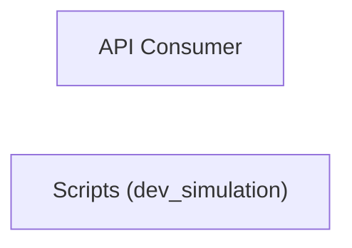

> **Model Completeness: F (27%)**
> Some sections may be empty due to missing model entities.
> - No interfaces defined on components → interface-spec doc empty
> - No requirements defined
> - Actors defined but missing goals/descriptions
> - 10/10 components missing description/responsibilities
> Run the extraction pipeline or manually add behaviors/interfaces/constraints.

# Concept of Operations: Scripts (dev_simulation)

## System Overview

Scripts (dev_simulation) provides 24 capabilities implemented across 10 components.

**Core Capabilities:**

- **Root Management**
- **Bookmarklet Management**
- **Tag Management**
- **Filter Management**
- **View Management**
- **Model Management**
- **^Model Management**
- **Template Management**
- **Login Management**
- **Logout Management**
- **Password Change Management**
- **Password Reset Management**
- **Reset Management**
- **<Path:Url> Management**
- **Checkout**
- **Cohesion**
- **Drift Tracker**
- **Extractor**
- **Llm Predictor**
- **Regen Scorer**
- **Report**
- **Runner**
- **Slice Evaluator**
- **CLI Runner**

## Stakeholders

| Actor | Type | Goals |
|-------|------|-------|
| API Consumer | human | — |

## Operational Scenarios

### System Workflows

- **GET **: 
- **GET bookmarklets/**: 
- **GET tags/**: 
- **GET filters/**: 
- **GET views/**: 
- **GET views/<view>/**: 
- **GET models/**: 
- **GET ^models/(?P<app_label>[^.]+)\.(?P<model_name>[^/]+)/$**: 
- **GET templates/<path:template>/**: 
- **GET password_change/**: 
- **GET password_change/done/**: 
- **GET password_reset/**: 
- **GET password_reset/done/**: 
- **CLI: Runner**: ArgumentParser -> add_argument -> parse_args -> run_benchmark
- **GET login/**: 
- **GET logout/**: 
- **GET reset/<uidb64>/<token>/**: 
- **GET reset/done/**: 
- **GET <path:url>**: flatpage

## System Context

### External Interfaces

| Interface | Type | Provider | Consumer |
|-----------|------|----------|----------|
| runner CLI | internal | — | — |

## Operational Constraints

*No constraints defined in the model.*
