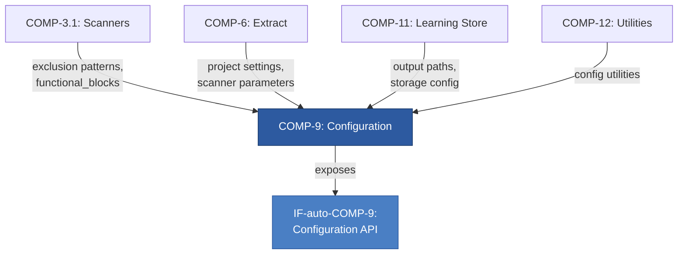
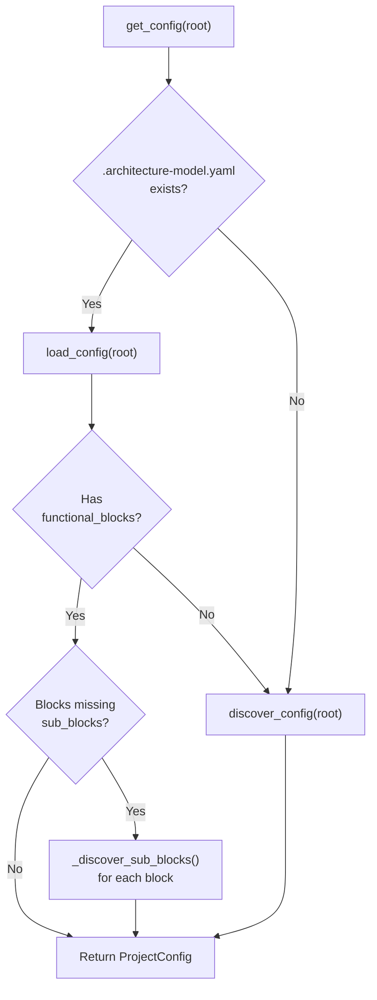
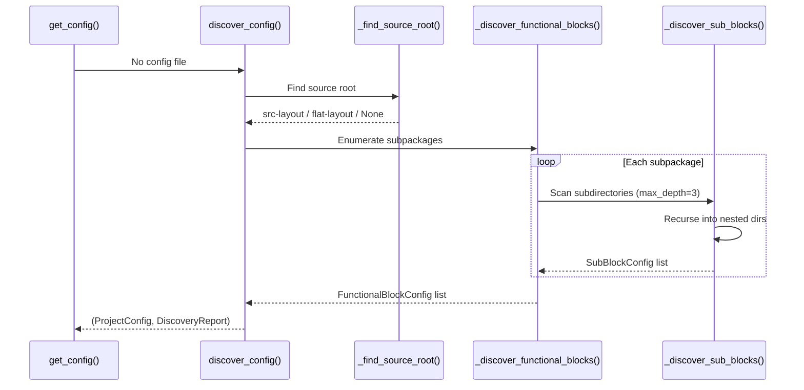

# COMP-9: Configuration — Component Specification

## 1. Purpose & Intent

COMP-9 exists to solve a fundamental adoption problem: architecture analysis tools historically demanded upfront, manual, project-specific configuration before producing any value. This created a chicken-and-egg barrier — users had to understand their architecture well enough to describe it in config before the tool could help them understand their architecture.

**The core philosophy is "point at any repo and get a valid config."** COMP-9 implements a self-bootstrapping configuration system where `get_config()` always succeeds. If a `.architecture-model.yaml` file exists, it's loaded. If not, the component scans the filesystem, infers project layout, discovers functional blocks from directory structure, and synthesizes a complete `ProjectConfig` — all transparently.

This makes COMP-9 the **spine of the entire system**. Every other component reads configuration through it. It translates the physical reality of a repository (directories, files, naming conventions) into the logical abstractions (layers, functional blocks, metrics) that the rest of the pipeline operates on.

## 2. Goals & Measures of Effectiveness

| Goal | Optimization Target | Measure of Effectiveness | Acceptable Threshold |
|------|---------------------|--------------------------|----------------------|
| **Universal applicability** | Any Python repo works without config | % of repos where `get_config()` returns a usable `ProjectConfig` without manual intervention | >95% for standard layouts (src-layout, flat-layout) |
| **Discovery accuracy** | Heuristic scanning claims real source files | `DiscoveryReport.claim_rate` — ratio of `files_claimed` to `files_total` | >90% file claim rate |
| **Layer detection correctness** | Inferred layers match actual architecture | Layers discovered vs. layers a human would identify | >80% precision for Python web projects |
| **Zero friction entry** | Single function call, no setup ceremony | `get_config()` never raises on a valid directory | 100% — must always return a `ProjectConfig` |
| **Round-trip fidelity** | `to_dict()` → YAML → `from_dict()` preserves all fields | Field-level equality after round-trip | Lossless for all serializable fields |
| **Sub-block granularity** | Auto-discovered blocks reflect real package structure | Sub-blocks match Python subpackages with `.py` files | 1:1 correspondence with code-containing subdirectories |

**Key trade-off**: Convention over configuration. The heuristic tables (`_LAYER_HEURISTICS`, `_METRIC_HEURISTICS`) encode assumptions about Python web project structure. These will produce false positives on non-standard layouts (e.g., a directory named `models/` that contains ML models, not ORM models). This is explicitly acceptable because the alternative — requiring manual config — has a worse failure mode: users produce no architectural model at all. False positives can be corrected by writing a `.architecture-model.yaml`; missing config cannot be corrected without the tool.

## 3. Architecture Role & Position

COMP-9 sits in the **infrastructure layer** — it has no domain logic of its own but provides the foundational data structures every domain component depends on. It is the most depended-upon component in the system.



COMP-9 has **zero outbound component dependencies** (except `utils.discovery.EXCLUDED_DIRS`), making it a leaf in the dependency graph — exactly where infrastructure belongs.

## 4. API Surface

### `get_config(root: Path) -> ProjectConfig`

**The recommended entry point.** Always returns a valid config.

```python
def get_config(root: Path) -> ProjectConfig
```

| Parameter | Type | Description |
|-----------|------|-------------|
| `root` | `Path` | Project root directory |

**Behavior**: Checks for `.architecture-model.yaml`. If present, loads it via `load_config()`. If the loaded YAML lacks `functional_blocks` (e.g., it's a model file, not a project config), falls back to `discover_config()`. For blocks loaded from YAML that lack `sub_blocks`, auto-discovers them from the filesystem. If no config file exists, runs full discovery.

---

### `load_config(root: Path) -> ProjectConfig`

Loads config strictly from file. Raises `FileNotFoundError` if missing.

```python
def load_config(root: Path) -> ProjectConfig
```

**Raises**: `FileNotFoundError` with a message suggesting `architecture-model init` or `get_config()`.

---

### `discover_config(root: Path) -> tuple[ProjectConfig, DiscoveryReport]`

Full auto-discovery. Returns both the synthesized config and an observability report.

```python
def discover_config(root: Path) -> tuple[ProjectConfig, DiscoveryReport]
```

The `DiscoveryReport` contains layout type detected, counts of discovered entities, candidate evaluations, and the file claim rate.

---

### `write_config(config: ProjectConfig, root: Path | None = None) -> Path`

Serializes a `ProjectConfig` to `.architecture-model.yaml` with an auto-generation header comment.

---

### `load_profile(name_or_path: str) -> DomainProfile`

Loads a domain profile by builtin name (`"software"`, `"controls"`, `"mechanical"`, `"electrical"`) or filesystem path.

```python
from architecture_model.profiles.schema import load_profile
profile = load_profile("controls")
```

---

### Resolution Flow



## 5. Data Model

### `ProjectConfig`

The root configuration object. All other components consume this.

| Field | Type | Default | Purpose |
|-------|------|---------|---------|
| `name` | `str` | `""` | Project name, used in output path templates |
| `system` | `str` | `""` | System identifier |
| `output` | `OutputConfig` | `OutputConfig()` | Output path templates |
| `layers` | `list[LayerConfig]` | `[]` | Architecture tiers |
| `functional_blocks` | `list[FunctionalBlockConfig]` | `[]` | Capability decomposition |
| `metrics` | `list[MetricConfig]` | `[]` | Countable project metrics |
| `root` | `Path` | `Path(".")` | Filesystem root (not serialized) |

**Computed properties:**

| Property | Return Type | Purpose |
|----------|-------------|---------|
| `layer_dir_map` | `dict[str, list[str]]` | Layer ID → directories (for merger) |
| `source_block_dir_map` | `dict[str, str]` | Directory/file prefix → block ID (for merger heuristics) |
| `source_block_dict` | `dict[str, dict]` | Legacy dict format for backward compatibility |
| `metrics_paths` | `dict[str, Path]` | Metric label → resolved absolute path |

### `OutputConfig` / `ResolvedOutputConfig`

| Field | Default | Example resolved |
|-------|---------|-----------------|
| `model` | `"output/{project}/architecture-model.yaml"` | `root/output/myapp/architecture-model.yaml` |
| `manifest` | `"output/{project}/reality-manifest.json"` | `root/output/myapp/reality-manifest.json` |
| `artifacts` | `"output/{project}/artifacts/stage2"` | `root/output/myapp/artifacts/stage2` |

### `LayerConfig`

| Field | Type | Purpose |
|-------|------|---------|
| `id` | `str` | e.g. `"web-layer"`, `"data-layer"` |
| `dirs` | `list[str]` | Directories belonging to this layer |
| `description` | `str` | Optional human description |

### `FunctionalBlockConfig` / `SubBlockConfig`

Recursive capability decomposition mirroring package nesting.

| Field | Type | Purpose |
|-------|------|---------|
| `id` | `str` | e.g. `"S1"`, `"S1.A"`, `"S1.A.1"` |
| `name` | `str` | Human-readable, from dir name or docstring |
| `dirs` | `list[str]` | Relative directories |
| `files` | `list[str]` | Relative `.py` file paths (excluding `__init__.py`) |
| `description` / `description_source` | `str` | From `__init__.py` docstring or auto-generated |
| `sub_blocks` | `list[SubBlockConfig]` | Nested children (recursive) |

ID scheme: top-level blocks use `S{n}`, first-level subs use `S{n}.{A-Z}`, deeper levels use `S{n}.{letter}.{digit}`.

### `MetricConfig`

| Field | Type | Default | Purpose |
|-------|------|---------|---------|
| `label` | `str` | — | e.g. `"router"`, `"model"` |
| `path` | `str` | — | Directory to count in |
| `pattern` | `str` | `"*.py"` | Glob pattern |
| `exclude` | `list[str]` | `[]` | Filenames to skip |
| `recursive` | `bool` | `False` | Use `rglob` vs `glob` |

### `DiscoveryReport`

| Field | Type | Purpose |
|-------|------|---------|
| `layout_detected` | `str` | `"src-layout"`, `"flat-layout"`, `"lib-layout"`, `"fallback"`, `"unknown"` |
| `blocks_discovered` | `int` | Count of F-blocks found |
| `sub_blocks_discovered` | `int` | Count of sub-blocks found |
| `claim_rate` | `float` (property) | `files_claimed / files_total` |
| `candidates` | `list[DiscoveryCandidate]` | Audit trail of evaluated paths |

## 6. Auto-Discovery Engine

### Layer Discovery

`_discover_layers()` checks the `_LAYER_HEURISTICS` table:

| Layer ID | Candidate Directories |
|----------|----------------------|
| `web-layer` | `app/routers`, `app/views`, `app/api`, `src/api`, `api/` |
| `services-layer` | `app/services`, `src/services`, `services/` |
| `data-layer` | `app/models`, `src/models`, `models/`, `alembic` |
| `pipeline-layer` | `scripts`, `pipeline`, `src/pipeline`, `jobs/` |
| `scheduling-layer` | `app/tasks`, `tasks/`, `celery/` |

### Metric Discovery

`_discover_metrics()` uses `_METRIC_HEURISTICS` — first matching path per label wins.

### Functional Block Discovery



**Source root detection** (`_find_source_root`): Tries `src/<pkg>/` → flat `<pkg>/` → `lib/<pkg>/` in order. Requires `__init__.py` and at least one code-containing subdirectory.

**Sub-block discovery** (`_discover_sub_blocks`): Recurses up to `max_depth=3`. Only creates sub-blocks for directories containing `.py` files. Extracts names from `__init__.py` docstrings via `ast.parse`.

**Fallback**: `_source_blocks_from_top_level_dirs()` when no package structure is detected.

## 7. Domain Profiles

The profile system enables COMP-9 to serve projects beyond software — controls engineering, mechanical, electrical domains.

### Built-in Profiles

| Name | File | Domain |
|------|------|--------|
| `software` | `software.yaml` | Default software architecture |
| `controls` | `controls.yaml` | Control systems (sensors, actuators) |
| `mechanical` | `mechanical.yaml` | Mechanical assemblies |
| `electrical` | `electrical.yaml` | Electrical systems |

### `DomainProfile` Structure

| Dataclass | Purpose |
|-----------|---------|
| `EnumExtension` | Adds values to schema enums (e.g., new `ComponentKind` values) |
| `EntityExtension` | Adds properties to entity types |
| `ConditionalRule` | `when` condition → `require` fields with `message` |

```python
profile = load_profile("controls")
extra_kinds = profile.get_extended_values("ComponentKind")
```

## 8. Design Decisions & Rationale

| Decision | Rationale |
|----------|-----------|
| Typed dataclasses over raw dicts | Type safety, IDE autocomplete, construction-time validation. `ProjectConfig.from_dict()` catches schema mismatches early. |
| Auto-discovery over mandatory init | Reduces adoption cost from "write 50-line YAML" to "run the tool." Discovery can always be overridden by writing config. |
| Convention-based layer detection | 80/20 rule — the 5 heuristic patterns cover most Python web projects. Non-matching projects get `_derive_layers_from_blocks()` fallback. |
| Recursive sub-blocks with `max_depth=3` | Mirrors real package nesting. Depth cap prevents runaway scanning on deep vendor trees. |
| YAML config format | Already the format for `.architecture-model.yaml` model output; no new dependency. Human-readable and editable. |
| `get_config()` as single entry point | Eliminates decision fatigue for consumers. They never need to know if config was file-based or discovered. |
| `DiscoveryReport` observability | Debugging heuristic-based systems requires audit trails. `candidates` list shows what was evaluated and why it was accepted/rejected. |
| `{project}` template in output paths | Supports multi-project analysis from a single root without path collisions. |

## 9. Consumers & Integration Patterns

| Consumer | What They Use | How |
|----------|---------------|-----|
| **COMP-3.1 (Scanners)** | `functional_blocks[].dirs`, `EXCLUDED_DIRS` | Scope file discovery to known source directories; skip excluded paths |
| **COMP-6 (Extract)** | `get_config()` → full `ProjectConfig` | Reads project settings, passes config to scanners |
| **COMP-11 (Learning Store)** | `resolved_output()`, `root` | Determines where to read/write pipeline state |
| **COMP-12 (Utilities)** | Various config fields | General-purpose config access |
| **CLI / Pipeline** | `get_config(root)` as first call | Every command starts by resolving config; downstream stages receive `ProjectConfig` |

**Integration pattern**: All consumers call `get_config()` (never `discover_config()` directly). This ensures consistent behavior regardless of whether a config file exists.

## 10. Constraints & Limitations

- **YAML-only** — no TOML, JSON, or programmatic configuration support
- **Python-web-centric heuristics** — `_LAYER_HEURISTICS` targets FastAPI/Django/Flask layouts; TypeScript and Kotlin projects get minimal layer detection (fallback only)
- **No hot-reload** — config is loaded once per invocation; file changes require re-running
- **No config schema validation** — relies on dataclass construction and `from_dict()` defaults rather than JSON Schema or Pydantic validation
- **Directory-based discovery only** — sub-blocks are inferred from filesystem structure, not import graphs
- **Monorepo limitations** — `_find_source_root()` returns the first matching package; multi-package monorepos may only discover one
- **Heuristic false positives** — a `models/` directory containing ML models will be tagged as `data-layer`
- **`max_depth=3` for sub-blocks** — deeply nested packages beyond 3 levels are not represented

## 11. Requirements Traceability with Rationale

| ID | Requirement | Rationale | MoE |
|----|-------------|-----------|-----|
| CFG-R1 | `get_config()` **shall** return a valid `ProjectConfig` for any directory without raising exceptions (except OS-level errors). | The zero-friction goal requires that consumers never need to handle "no config" cases. Every directory has *some* valid configuration, even if it's minimal. | 100% success rate on valid directories |
| CFG-R2 | `load_config()` **shall** raise `FileNotFoundError` with actionable guidance when `.architecture-model.yaml` is absent. | Distinguishes "explicit load" from "best-effort load." The error message suggests `init` or `get_config()` so users aren't stuck. | Error message contains both alternatives |
| CFG-R3 | Auto-discovery **shall** detect src-layout, flat-layout, and lib-layout Python projects. | These three layouts cover >95% of Python packages per PyPA packaging guide. | `DiscoveryReport.layout_detected` is not `"unknown"` for standard projects |
| CFG-R4 | `ProjectConfig.from_dict()` and `to_dict()` **shall** round-trip losslessly for all serializable fields. | Config files must survive read-modify-write cycles (e.g., `init` then manual edit then re-read). | Field equality after `from_dict(config.to_dict())` |
| CFG-R5 | Sub-block discovery **shall** not recurse beyond `max_depth=3` levels. | Prevents unbounded filesystem traversal on large vendor directories or deeply nested generated code. 3 levels captures package → subpackage → module grouping. | Verified by `_discover_sub_blocks` depth parameter |
| CFG-R6 | `write_config()` **shall** include auto-generation header comments. | Users must know a file was generated (not hand-written) so they understand they can edit it. Prevents confusion about file provenance. | Output file starts with `# Architecture Model Standard` comment block |
| CFG-R7 | Discovery **shall** produce a `DiscoveryReport` with candidate evaluation audit trail. | Heuristic systems are opaque by default. The report enables debugging why a directory was or wasn't claimed as a block. | `report.candidates` list is non-empty after discovery |
| CFG-R8 | Domain profiles **shall** be loadable by builtin name or filesystem path. | Builtin profiles serve common domains; filesystem paths enable custom/proprietary profiles without modifying the package. | `load_profile("controls")` and `load_profile("/path/to/custom.yaml")` both succeed |
| CFG-R9 | `ProjectConfig` **shall** expose `source_block_dir_map` and `layer_dir_map` as computed properties. | Consumers (merger, scanners) need fast lookups from directory paths to logical entities. Computing on access avoids stale caches while keeping the data model clean. | Properties return correct mappings for all configured blocks/layers |
| CFG-R10 | The configuration file name **shall** be `.architecture-model.yaml` (dot-prefixed). | Dot-prefixed files are hidden by default on Unix, keeping project roots clean. The name is self-documenting and unlikely to collide with other tools. | `CONFIG_FILENAME` constant equals `".architecture-model.yaml"` |