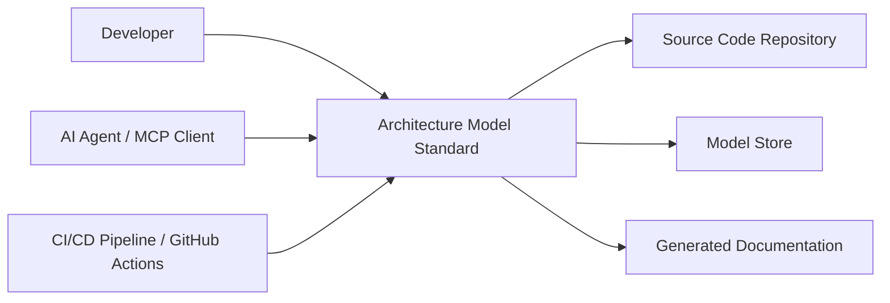

# Concept of Operations: Architecture Model Standard

## 1. System Overview

The **Architecture Model Standard** system provides tooling to create, validate, enrich, and maintain structured architecture models that stay synchronized with source code. It solves the persistent problem of architecture documentation drifting from implementation by establishing a bidirectional link between models and code, enabling continuous verification of architectural intent against reality.

The system operates as an MCP-compatible toolset consumable by AI agents, developers, and CI/CD pipelines.

## 2. Stakeholders & Actors

| Actor | Type | Goals |
|-------|------|-------|
| **AI Agent (MCP Client)** | Automated | Consume models for context, generate documentation, execute extraction pipelines |
| **Developer** | Human | Author models from requirements, query/slice models, assess readiness, fix drift |
| **CI/CD Pipeline** | Automated | Gate deployments on architecture compliance, detect drift, validate models |

## 3. Operational Scenarios

### Scenario A: Greenfield Model Authoring
A Developer receives a requirements document for a new subsystem. They invoke **Author Model from Requirements** (CAP-6) to parse the document into a concept-phase architecture model. They then use **Decompose Models Hierarchically** (CAP-9) to break it into per-system sub-models. The model is validated via **Validate Architecture Models** (CAP-1) before commit.

### Scenario B: Code-First Extraction
An AI Agent is pointed at an existing codebase. It runs **Generate Reality Manifest** (CAP-4) to produce structural facts, then executes the **Run Modular Extraction Pipeline** (CAP-3) through all 10 stages (observe→infer→allocate→relate→specify→contract→validate→decompose→synthesize→emit) to produce a complete architecture model from code.

### Scenario C: Continuous Compliance Gate
On every pull request, the CI/CD Pipeline runs **Check Development Gate** (CAP-12) to verify code changes track toward authored architecture intent. If drift is detected, **Detect and Fix Model Drift** (CAP-13) reports coverage gaps. The pipeline fails if thresholds are not met.

### Scenario D: AI-Assisted Documentation Generation
An AI Agent queries the model using **Slice and Query Models** (CAP-7) for a specific subsystem, then invokes **Generate SE Documentation** (CAP-5) to produce functional analysis, logical architecture, use cases, requirements, V&V, and operations documents. Output is formatted via **Export for AI Consumption** (CAP-15) for token-limited environments.

### Scenario E: Model Evolution Tracking
A Developer uses **Diff Model Versions** (CAP-8) to review what changed between releases. They invoke **Enrich Models with Code Intelligence** (CAP-10) to auto-populate updated signatures and test contracts, then **Assess Regen Readiness** (CAP-11) to confirm the model captures sufficient detail for code regeneration.

## 4. System Capabilities

| Group | Capabilities |
|-------|-------------|
| **Model Creation** | Author Model from Requirements (CAP-6), Extract Architecture from Code (CAP-2), Run Modular Extraction Pipeline (CAP-3) |
| **Model Maintenance** | Enrich Models with Code Intelligence (CAP-10), Decompose Models Hierarchically (CAP-9), Diff Model Versions (CAP-8) |
| **Validation & Compliance** | Validate Architecture Models (CAP-1), Check Development Gate (CAP-12), Detect and Fix Model Drift (CAP-13), Assess Regen Readiness (CAP-11) |
| **Query & Export** | Slice and Query Models (CAP-7), Export for AI Consumption (CAP-15), Generate SE Documentation (CAP-5) |
| **Intelligence** | Generate Reality Manifest (CAP-4), Manage Global Learnings (CAP-14) |

## 5. Operational Constraints

| ID | Constraint | Type |
|----|-----------|------|
| CON-1 | Python >=3.11 required | Technology |
| CON-2 | CI/CD runs on GitHub Actions | Technology |

**Assumptions:**
- Source code is accessible to the tooling at execution time
- Models are stored in version-controlled repositories alongside code
- AI Agents communicate via MCP protocol

## 6. System Context

The system sits between source code repositories and consumers of architectural knowledge. It reads code to produce models, reads models to produce documentation, and integrates into GitHub Actions workflows to enforce compliance. The **Manage Global Learnings** (CAP-14) capability persists heuristics across runs, enabling the system to improve extraction quality over time.