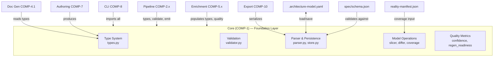
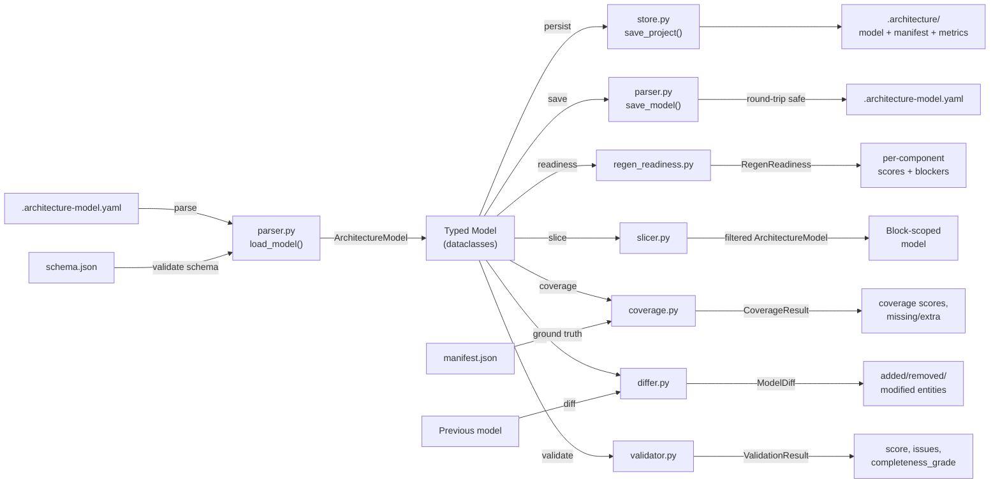

# Core Subsystem — Concept of Operations

## 1. System Overview

### Intent

The Core subsystem is the **single source of truth for what an architecture model IS and how to manipulate it**. Every other subsystem in the architecture-model-standard—CLI, pipelines, enrichment, documentation generation, export—depends on Core to define data structures, parse YAML, validate correctness, and perform analytical operations like slicing, diffing, and coverage analysis.

Without Core, there is no shared type system, no validation, no way to load or save models, and no analytical operations. Every subsystem would reinvent these independently, leading to divergent interpretations of what constitutes a valid model.

### Philosophy

Core follows a **foundation library** pattern: it is stateless, has no external orchestration logic, and exposes pure functions and dataclasses. Design choices prioritize:

- **Round-trip fidelity over convenience** — loading and saving a model must not lose data or reorder fields (REQ-27), because models are version-controlled and spurious diffs destroy trust.
- **Validation as a first-class operation** — not an afterthought. The validator enforces structural invariants (referential integrity, hierarchy consistency) AND semantic rules (status consistency, completeness). A model that passes validation is safe to consume downstream.
- **Token efficiency for AI consumption** — the slicer exists because full models exceed LLM context windows. The 4000-token budget (REQ-20) is sized for focused single-component reasoning within typical 8K–32K context windows.

### Subcomponents

| ID | Name | Role |
|---|---|---|
| COMP-1.1 | Type System | Dataclasses, enums, `ArchitectureModel` root type |
| COMP-1.2 | Validation | Schema checks, referential integrity, hierarchy, domain rules |
| COMP-1.3 | Parser & Persistence | YAML load/save, round-trip preservation, multi-file merging, snapshot storage |
| COMP-1.4 | Model Operations | Slice, diff, coverage, clustering, source-block assignment |
| COMP-1.5 | Quality Metrics | Confidence scoring, regen readiness, corrections tracking, visualization |

## 2. Stakeholders & Actors

| Actor | Type | Goal | Core Interface Used |
|---|---|---|---|
| **CLI** (COMP-8) | Internal component | Execute user commands (validate, slice, diff, visualize) | All Core APIs |
| **Pipeline stages** (COMP-2.x) | Internal components | Coordinate extraction: allocate entities to types, validate, emit YAML | Type System, Validation, Parser |
| **Enrichment** (COMP-5.x) | Internal component | Populate model entities with code-grounded data, decompose into subsystems | Type System, Quality Metrics |
| **Doc generators** (COMP-4.1) | Internal component | Read typed model to produce architecture documents | Type System |
| **Export** (COMP-10) | Internal component | Serialize model data to external formats | Parser & Persistence |
| **Authoring** (COMP-7) | Internal component | Create/modify model entities programmatically | Type System |
| **Human architect** | External | Understand model health, identify gaps, track drift | Validation results, coverage reports, regen scores |

## 3. Operational Scenarios

### Scenario 1: Validate a Model After Editing

**Intent:** An architect has manually edited `.architecture-model.yaml` and needs to know if the model is still structurally and semantically correct before committing.

1. CLI invokes `validate()` from `validator.py` with a parsed `ArchitectureModel`.
2. Validator checks ID uniqueness, referential integrity (all `from_id`/`to_id` in relationships resolve to entities), hierarchy consistency (REQ-3: `parent_id`↔`children` bidirectional), status consistency, and completeness.
3. Returns `ValidationResult` with `score` (0–100), `is_valid`, `completeness_grade`, and actionable `issues`.
4. If `score < 80` (REQ-1), the model fails the quality gate. Each `ValidationIssue` carries a `severity`, `code`, and `entity_id` so the architect knows exactly what to fix.

**Why the 80-point threshold:** Score deducts 10 per error and 2 per warning. This means ≤2 errors pass (marginal), but 3+ errors fail. The threshold balances strictness (catching real problems) against practicality (not blocking on warnings).

### Scenario 2: Slice a Model for AI Context

**Intent:** An LLM needs to reason about a single source block (e.g., "S1") without exceeding its context window. The full model may be 20K+ tokens.

1. Consumer calls `slice_by_source_block(model, "S1")` from `slicer.py`.
2. Slicer first attempts to load a pre-split sub-model file via `load_block_model()`. If found, returns it directly (fast path).
3. Otherwise, filters capabilities, behaviors, components, and interfaces by `source_block` tag, then collects only relationships where both endpoints are in the slice.
4. Returns a new `ArchitectureModel` containing only S1's entities, fitting within the 4000-token budget (REQ-20).

**Trade-off:** Slicing discards cross-block context. This is intentional—focused accuracy within a block is more valuable than diluted full-model context for code generation tasks.

### Scenario 3: Detect Architectural Drift

**Intent:** After code changes, determine whether the model still accurately represents the codebase, and surface specific gaps.

1. Pipeline loads the current model and a fresh manifest (code-grounded facts).
2. `compute_coverage(model, manifest)` in `coverage.py` checks component coverage (model components vs. manifest modules), relationship accuracy, and file mapping.
3. `compute_representativeness(model, modules, edges)` in `representativeness.py` produces `file_coverage`, `relationship_accuracy`, `boundary_coherence`, and `behavioral_coverage` scores.
4. Returns `CoverageResult` and `RepresentativenessResult` with specific `missing`, `extra`, and `uncovered_files` lists.

**Failure mode:** If coverage drops below ~70%, downstream document generation produces misleading architecture descriptions. The system degrades gracefully—it reports gaps rather than silently producing incorrect output.

### Scenario 4: Assess Regeneration Readiness

**Intent:** Before attempting blind code regeneration from the model, determine which components have sufficient detail (body hints, test contracts, signatures) and which would produce broken output.

1. `compute_regen_readiness(model)` in `regen_readiness.py` iterates components, scoring each on `body_hint_coverage`, `test_contract_count`, `constant_coverage`, `signature_coverage`.
2. Each `ComponentReadiness` includes specific `blockers` (e.g., "3 functions missing body_hint") and a 0–100 score.
3. Returns `RegenReadiness` with `overall` score, letter `grade`, and `recommendation`.
4. Per-component scores (REQ-16) let teams prioritize enrichment effort on the lowest-scoring components.

**Value function:** A component at 90% readiness is dramatically more valuable than one at 60%—the last 10% of coverage eliminates the most subtle regeneration bugs. The relationship is nonlinear.

## 4. System Context

**Why these dependencies exist:**
- Every consumer needs `ArchitectureModel` and its entity types (COMP-1.1) — this is the shared language.
- Pipeline's validate stage (COMP-2.4) delegates to Core's validator rather than reimplementing checks — single source of validation logic.
- Pipeline's emit stage (COMP-2.5) uses Core's parser for YAML output to guarantee round-trip fidelity.
- Enrichment's decomposer (COMP-5.2) uses quality metrics to decide when a component is complex enough to become a subsystem.

## 5. Operational Constraints

| Constraint | Threshold | Rationale | Violation Impact |
|---|---|---|---|
| Round-trip fidelity | Zero data loss or reordering (REQ-27) | Models are git-tracked; spurious diffs destroy review workflows and trust | Hard failure — users lose data silently |
| Schema backward compatibility (REQ-28) | New versions must load old schemas | Models persist across tool upgrades; breaking this orphans existing projects | Hard failure — users cannot upgrade |
| Validation score ≥ 80 (REQ-1) | ≤2 errors allowed | Quality gate for downstream consumption; 3+ errors means structural problems | Graceful — reports score, doesn't crash |
| Slice token budget (REQ-20) | ≤ 4000 tokens | Sized for single-block AI reasoning in 8K–32K context windows | Graceful — oversized slices reduce AI output quality |
| Zero errors on valid models (REQ-2) | Exactly 0 false positives | False validation errors erode trust and cause users to ignore real issues | Graceful but corrosive — trust degradation |
| Hierarchy bidirectional consistency (REQ-3) | `parent_id` ↔ `children` must agree | One-directional references cause navigation bugs in slicing and visualization | Hard failure for operations that traverse hierarchy |

**Failure modes:**
- **Parser failure** (malformed YAML, missing schema): Hard stop. No model = no operations. Error message with line number.
- **Validation failure**: Graceful. Returns `ValidationResult` with issues; consumers decide whether to proceed.
- **Slicer on unknown block ID**: Returns empty model. No crash, but consumer gets no useful context.
- **Coverage with no manifest**: Returns zero scores with empty gap lists. Operations continue but metrics are meaningless.

## 6. Data Flow

## 7. Measures of Effectiveness

| MoE | What "good" looks like | What "bad" looks like | How to measure |
|---|---|---|---|
| **Validation precision** | Zero false positives on valid models; every reported error is a real problem | Users ignore validation output because of noise | `error_count == 0` on known-good test models (REQ-2) |
| **Validation recall** | Catches hierarchy inconsistencies, dangling references, orphans before they cause downstream failures | Broken models pass validation and cause silent errors in doc gen or code regen | Fault injection: introduce known defects, verify detection |
| **Round-trip fidelity** | `load(save(model)) == model` byte-for-byte on YAML output | Git diffs show reordered keys, lost comments, changed quoting | Automated round-trip tests comparing input/output YAML |
| **Slice relevance** | Sliced model contains all entities needed for the target block's reasoning, nothing extraneous | Slice includes unrelated components (noise) or misses critical dependencies (gaps) | Measure entity count vs. known-good slices; token count ≤ 4000 |
| **Coverage accuracy** | `overall_score` correlates with actual model-vs-code alignment | High coverage score but model is clearly wrong; or low score on a well-modeled repo | Compare `CoverageResult.overall_score` against manual assessment |
| **Regen readiness correlation** (REQ-15) | Components scoring 90+ regenerate successfully; components scoring <50 fail predictably | Score says "ready" but generated code is broken | Track regen success rate per component against readiness score |
| **Diff completeness** | Diff catches all meaningful changes between model versions; no silent omissions | Structural changes (new component, removed relationship) go unreported | Compare `ModelDiff` output against known edit sets |
| **Schema evolution safety** | Models from schema v1.0 load correctly under v1.3 parser | Upgrade breaks existing projects | Load archived models from each prior schema version |

**Value beyond thresholds:** Validation score above 80 merely passes the gate. A score of 95+ means the model is rich enough for high-confidence downstream operations. Each point above 80 reduces the probability of subtle errors in generated documentation and code. The relationship between validation score and downstream output quality is the ultimate measure of Core's effectiveness.