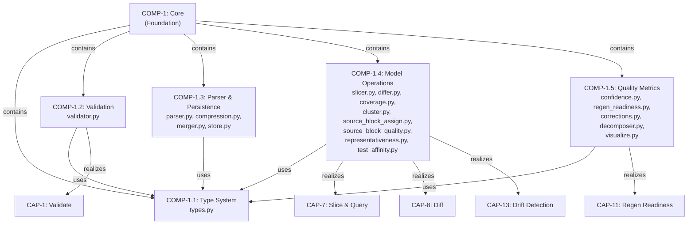
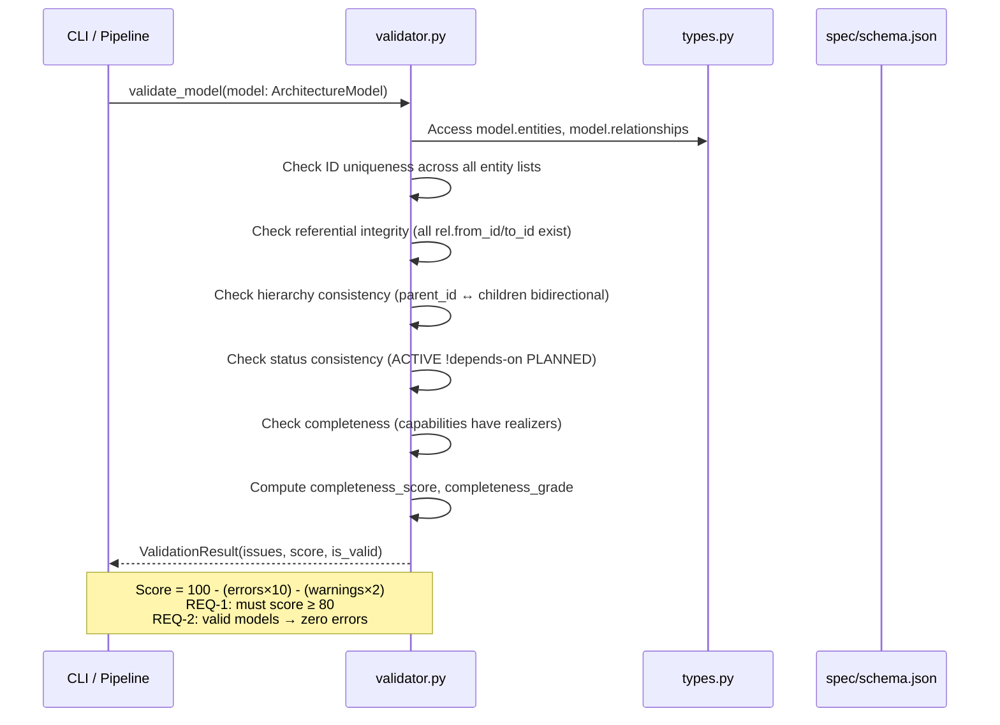
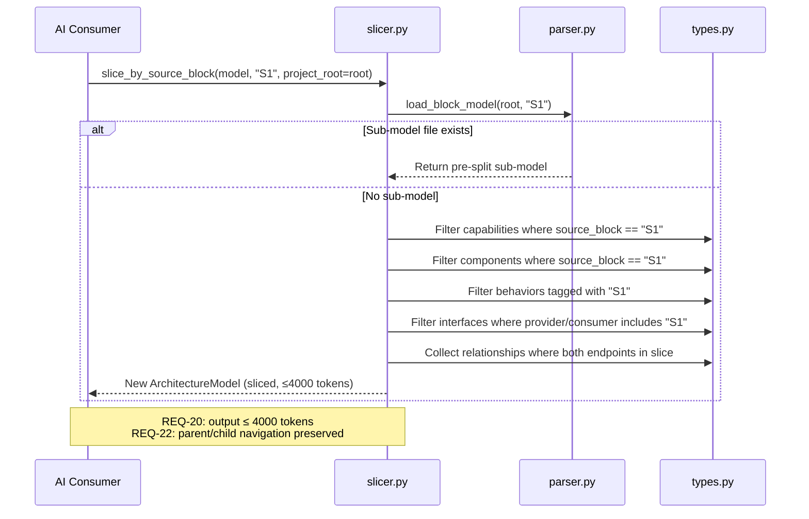
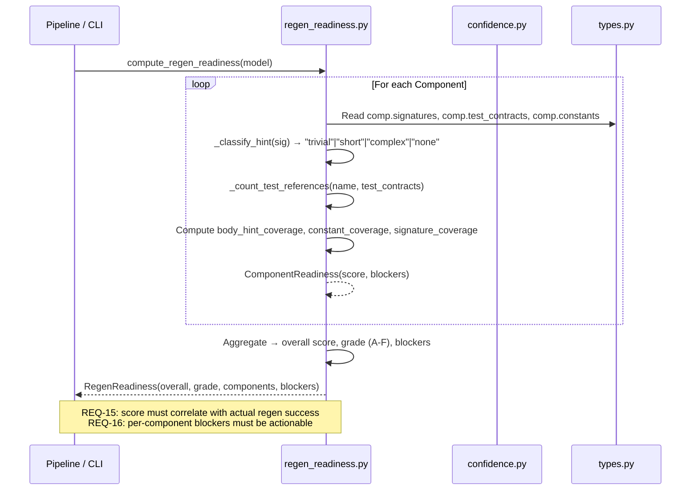

# Core Subsystem — Functional Analysis

## 1. Intent & Purpose

The Core subsystem is the **foundation layer** of the architecture-model system. Every other subsystem—pipeline orchestration, CLI, documentation generation, enrichment, export—depends on Core for its type definitions, validation logic, parsing, and model operations.

**Why it exists:** Without a single, authoritative source of truth for what an architecture model *is* (its types), how to verify it (validation), how to read/write it (parser), and how to query it (slicer, differ, coverage), every consumer would reinvent these primitives inconsistently. Core eliminates that divergence.

**What would break without it:** Everything. Core is the gravitational center—COMP-2.1, COMP-2.3, COMP-2.4, COMP-2.5, COMP-4.1, COMP-5.1, COMP-5.2, COMP-7, COMP-8, and COMP-10 all depend on it.

---

## 2. Capability Inventory

| ID | Capability | Intent | Optimal Delivery (MoE) |
|---|---|---|---|
| CAP-1 | **Validate Architecture Models** | Catch structural errors *before* they propagate to downstream consumers (generators, pipelines). A model with broken references silently produces wrong artifacts. | Zero false negatives on referential integrity; score correlates with actual downstream failure rate; validation completes in <1s for models with 500+ entities |
| CAP-7 | **Slice and Query Models** | LLM context windows are finite. Delivering a full model wastes tokens and degrades AI reasoning quality. Slicing gives focused, relevant context. | Sliced output fits ≤4000 tokens (REQ-20); slice retains all entities needed to reason about a single block with zero dangling references |
| CAP-8 | **Diff Model Versions** | Detect architectural drift between regeneration cycles. Without diff, staleness is invisible. | Diff detects 100% of added/removed entities; modified-field detection covers all typed fields; diff runs in O(n) entity count |
| CAP-11 | **Assess Regen Readiness** | Predict whether a model has enough detail to regenerate code *before* attempting expensive LLM regeneration. Saves tokens and developer time. | Score correlates with actual regeneration success rate (REQ-15); per-component blockers are actionable (REQ-16) |
| CAP-13 | **Detect and Fix Model Drift** | Models rot as code evolves. Coverage analysis compares model against manifest reality to surface gaps before they become architectural debt. | File coverage ≥90% for well-modeled repos; relationship accuracy identifies spurious edges; overall score is a single number a CI gate can use |

---

## 3. Functional Decomposition

---

## 4. Capability-Component Mapping

| Capability | Realizing Component | Rationale |
|---|---|---|
| CAP-1 → COMP-1.2 | **Validation** (`validator.py`) | Validation is complex enough to warrant isolation: referential integrity, hierarchy checks, status consistency, completeness grading, and regen readiness checks are distinct rule families. Separating from types keeps the type system pure (data only, no policy). |
| CAP-7 → COMP-1.4 | **Model Operations** (`slicer.py`) | Slicing is a query operation over the model graph. Collocated with `differ.py` and `coverage.py` because all three traverse the same entity/relationship graph with similar access patterns. |
| CAP-8 → COMP-1.4 | **Model Operations** (`differ.py`) | Diff compares two `ArchitectureModel` instances structurally. Shares the entity-indexing pattern with slicer and coverage. |
| CAP-11 → COMP-1.5 | **Quality Metrics** (`regen_readiness.py`, `confidence.py`) | Regen readiness is a *quality judgment*, not a structural operation. It scores `body_hint` coverage, test contracts, constants—all qualitative assessments. Grouped with `confidence.py` which uses the same field-completeness scoring philosophy. |
| CAP-13 → COMP-1.4 | **Model Operations** (`coverage.py`, `representativeness.py`) | Drift detection compares model against manifest (code reality). This is a cross-referencing operation similar to diff but between heterogeneous data sources. |

**Trade-off: Why not separate slicer/differ/coverage into their own components?** They share the same dependency (COMP-1.1 types) and the same traversal patterns. Splitting would increase import complexity without improving cohesion. The current grouping in COMP-1.4 keeps related graph-query operations together.

---

## 5. Key Behavioral Flows

### 5.1 Model Validation Flow

**Intent:** Give the user a single, authoritative answer to "Is my model correct and complete enough to use?" before any downstream processing occurs. Early detection prevents cascading failures in pipeline stages.

The `ValidationResult` dataclass exposes `score`, `is_valid`, `error_count`, `warning_count`, and `completeness_grade`. The scoring formula (`100 - 10*errors - 2*warnings`) makes the trade-off explicit: errors are 5× more costly than warnings, reflecting that errors indicate broken invariants while warnings indicate missing-but-not-broken information.

### 5.2 Model Slicing Flow

**Intent:** Deliver the minimal, self-consistent subset of a model that an LLM needs to reason about a single source block. Every unnecessary entity wastes tokens and dilutes attention.

**Trade-off:** The slicer first checks for a pre-decomposed sub-model file (`load_block_model`). This is an optimization—pre-split files are faster and guarantee token budget compliance. The fallback dynamic slicing is more flexible but requires token-budget enforcement at output time.

### 5.3 Regen Readiness Assessment Flow

**Intent:** Before spending LLM tokens on code regeneration, predict the likelihood of success. A model with 40% `body_hint` coverage will produce code that needs heavy manual editing—better to enrich first.

---

## 6. Requirements Satisfaction

| REQ | Text | Satisfied By | Rationale & Consequences of Violation |
|---|---|---|---|
| **REQ-1** | Model must score ≥ 80 on validation | COMP-1.2: `ValidationResult.score` | **Why 80?** At score < 80, the model has ≥2 errors or ≥10 warnings. Two structural errors (e.g., dangling references) reliably cause downstream artifact generation to produce incorrect output. The threshold is set at the empirical point where pipeline consumers can still function. **Violation:** Pipeline stages consume a broken model → generated docs reference nonexistent entities → user trust erodes. |
| **REQ-2** | Valid models produce zero validation errors | COMP-1.2: `ValidationResult.is_valid` | **Why zero?** Errors represent invariant violations (broken references, duplicate IDs). Unlike warnings, there is no "acceptable" number of broken invariants—one dangling reference can cascade. **Violation:** A "valid" model with errors becomes a landmine for any consumer that indexes by ID. |
| **REQ-3** | parent_id/children bidirectionally consistent | COMP-1.2: hierarchy validator | **Why bidirectional?** If component A lists B as a child but B's `parent_id` is null, tree traversal breaks depending on direction. Navigation becomes inconsistent—upward traversal and downward traversal disagree. **Violation:** `slice_by_source_block` misses child components; decomposer creates orphaned sub-models. |
| **REQ-15** | Regen score correlates with actual success rate | COMP-1.5: `regen_readiness.py` | **Why correlation, not just threshold?** A score that doesn't predict outcomes is worse than no score—it creates false confidence. The scoring weights (`body_hint_coverage`, `test_contract_count`, `constant_coverage`) were chosen to match the information an LLM actually needs to regenerate code. **Violation:** Teams attempt regeneration on low-readiness models, waste tokens, and lose trust in the tool. |
| **REQ-16** | Per-component readiness with actionable blockers | COMP-1.5: `ComponentReadiness.blockers` | **Why per-component?** An overall score of 60% is useless without knowing *which* components drag it down. Blockers like "missing body_hint on 12 functions" tell the user exactly what to enrich. **Violation:** Users see a low score but don't know what to fix → they give up or fix the wrong things. |
| **REQ-20** | Slice output ≤ 4000 tokens | COMP-1.4: `slicer.py` | **Why 4000?** This leaves room within typical 8K–16K context windows for the system prompt, user query, and response. A slice consuming the entire window leaves no room for reasoning. **Value function:** Smaller is better down to ~1000 tokens; below that, the slice likely dropped essential context. Sweet spot is 2000–3500 tokens. **Violation:** Oversized slices cause LLM truncation or degraded reasoning quality. |
| **REQ-22** | Parent/child component navigation | COMP-1.1: `Component.parent_id`, `Component.children` | **Why?** Architecture is hierarchical—a `Core` component contains `Type System`, `Validation`, etc. Without navigation, consumers must reconstruct hierarchy from relationships, which is error-prone and expensive. **Violation:** Slicer cannot determine component containment; decomposer cannot identify sub-model boundaries. |
| **REQ-27** | YAML round-trip fidelity | COMP-1.3: `parser.py` | **Why?** Models are version-controlled. If load→save changes ordering or drops fields, every save creates a noisy diff that obscures real changes. **Violation:** Git diffs become unreadable; merge conflicts multiply; users stop trusting the tool to preserve their work. |
| **REQ-28** | Schema backward compatibility | COMP-1.3: `parser.py` | **Why?** Models are long-lived artifacts. A schema upgrade that can't read old models forces migration effort and breaks CI pipelines. **Violation:** Users on older model versions are locked out after tool upgrade; adoption stalls. |

---

## 7. Trade-offs & Design Decisions

### 7.1 Validation Scoring: Deductive vs. Additive

**Chosen:** Deductive scoring (`100 - 10*errors - 2*warnings`).
**Alternative:** Additive scoring (sum points for things present).
**Why:** Deductive scoring means a model starts "perfect" and loses points for defects. This matches the mental model of validation—you're looking for what's *wrong*. Additive scoring would reward complexity (more entities = higher score), which is perverse.
**If constraints changed:** If models were generated (not human-authored), additive scoring for completeness might make more sense since the baseline wouldn't be "presumably correct."

### 7.2 Slicer: Pre-split Files vs. Dynamic Slicing

**Chosen:** Try pre-split sub-model files first, fall back to dynamic slicing.
**Why:** Pre-split files are O(1) disk reads; dynamic slicing is O(n) entity traversal. For large models (500+ entities), the difference matters. Pre-split also guarantees token budget compliance at write time rather than requiring runtime enforcement.
**Trade-off cost:** Pre-split files can become stale if the master model is edited without re-decomposing. The `differ.py` capability partially mitigates this.

### 7.3 Quality Metrics Separation from Validation

**Chosen:** Confidence scoring and regen readiness are in COMP-1.5, not COMP-1.2.
**Why:** Validation answers "is the model structurally correct?" (binary per-rule). Quality metrics answer "how good is this model for a specific purpose?" (continuous score). Mixing them would conflate structural validity with fitness-for-purpose. A model can be perfectly valid (zero errors) but have terrible regen readiness (no `body_hint` fields).

### 7.4 Clustering in Core vs. Orchestration

**Chosen:** `cluster.py`, `source_block_assign.py`, `test_affinity.py` live in Core (COMP-1.4).
**Why:** These are pure graph algorithms over model/manifest data. They have no LLM dependencies, no pipeline state, no side effects. Placing them in Core makes them testable in isolation and reusable by both the pipeline and CLI.

---

## 8. Measures of Effectiveness

| Capability | Minimum (pass/fail) | Good | Optimal | How to Measure |
|---|---|---|---|---|
| **CAP-1: Validate** | Zero false negatives on referential integrity | Catches status inconsistencies, orphans | Completeness grading accurately predicts downstream artifact quality | Run validator on known-good and known-bad models; measure precision/recall |
| **CAP-7: Slice** | Output contains all entities for the requested block | Output ≤ 4000 tokens with zero dangling references | Slice contains *exactly* the minimal set needed—nothing extra | Token count of serialized slice; count dangling refs in sliced model |
| **CAP-8: Diff** | Detects all added/removed entities | Detects field-level modifications | Diff output is directly actionable (maps to specific artifact staleness) | Diff two known models with controlled changes; verify completeness |
| **CAP-11: Regen Readiness** | Score exists per component | Score correlates with regen success (r > 0.6) | Blockers directly map to enrichment actions that improve score | Correlate scores with actual LLM regeneration outcomes across repos |
| **CAP-13: Drift Detection** | File coverage percentage computed | Relationship accuracy identifies false edges | Overall score usable as CI gate (threshold predicts model staleness) | Compare coverage scores pre/post code changes; validate against manual review |

---

## 9. Failure Modes

| Component | Failure Mode | Impact | Degradation |
|---|---|---|---|
| **COMP-1.1 Type System** | Dataclass field added without schema update | Silent data loss on round-trip | **Hard fail** — all consumers see inconsistent data |
| **COMP-1.2 Validation** | Validator misses a broken reference | Downstream generators produce artifacts referencing nonexistent entities | **Silent corruption** — no immediate error, delayed failure |
| **COMP-1.3 Parser** | YAML ordering changes on save | Noisy git diffs, merge conflicts | **Graceful degradation** — functionally correct but operationally painful |
| **COMP-1.3 Parser** | Old schema version not handled | `KeyError` or `TypeError` on load | **Hard fail** — user cannot load their model after tool upgrade |
| **COMP-1.4 Slicer** | Slice exceeds token budget | LLM context overflow, truncated reasoning | **Graceful degradation** — output is correct but too large |
| **COMP-1.4 Coverage** | Manifest format changes | `KeyError` in `_check_component_coverage` | **Hard fail** — coverage analysis crashes |
| **COMP-1.5 Regen Readiness** | Score doesn't correlate with outcomes | Teams waste tokens on doomed regenerations | **Silent failure** — tool provides false confidence |
| **COMP-1.5 Corrections** | Correction applied twice | Entity renamed twice or relationship duplicated | **Guarded** — `applied` flag prevents re-application |