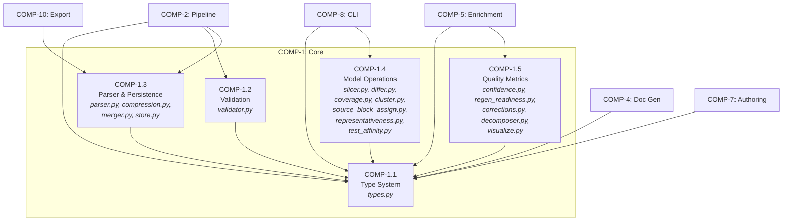
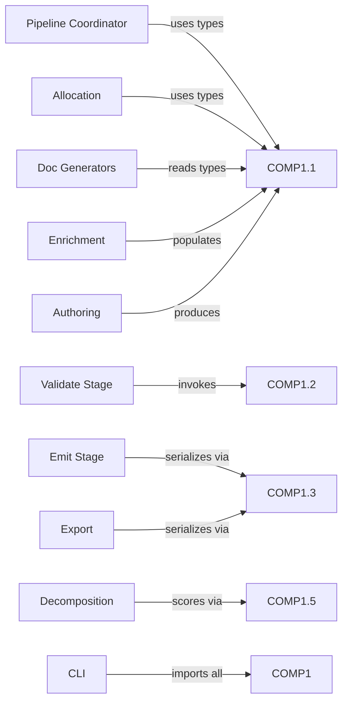
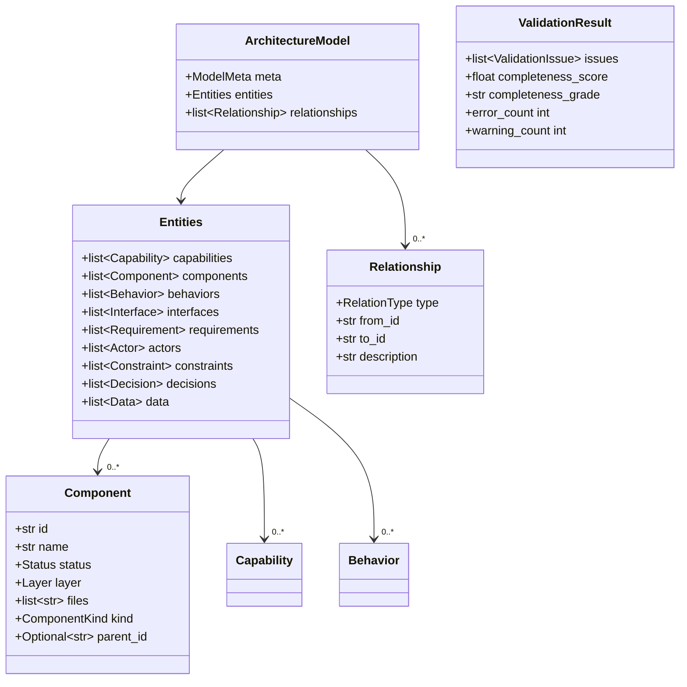

# Logical Architecture — Core Subsystem

## 1. Intent

The Core subsystem exists to provide a **single, authoritative in-memory representation** of an architecture model and all operations that can be performed on it without external side effects. It is the gravity center of the system: every other subsystem (Pipeline, CLI, Orchestration, Export) depends on Core but Core depends on nothing outside itself.

The design philosophy is **model-as-value**: the architecture model is a typed, immutable data structure that functions transform and return. This makes operations composable, testable, and safe for concurrent use by AI agents.

## 2. Component Structure

### COMP-1.1 — Type System

**Intent:** Establish a single source of truth for every entity shape in the model. By centralizing `ArchitectureModel`, `Component`, `Capability`, `Behavior`, `Interface`, `Requirement`, `Actor`, `Constraint`, `Relationship`, and all enums (`Status`, `RelationType`, `Layer`, `ComponentKind`) in `types.py`, we guarantee that every subsystem speaks the same structural language. No subsystem invents its own component representation.

**Files:** `src/architecture_model/core/types.py`

### COMP-1.2 — Validation

**Intent:** Enforce model invariants that cannot be expressed by the type system alone—referential integrity, hierarchy consistency, semantic completeness, and domain rules. Validation is separated from parsing because a model can be syntactically valid YAML and structurally valid per the type system yet still be architecturally broken (dangling references, orphaned entities, unreachable states).

**Files:** `src/architecture_model/core/validator.py`, `src/architecture_model/spec/__init__.py`

### COMP-1.3 — Parser & Persistence

**Intent:** Own the serialization boundary. Models live as YAML on disk and as `ArchitectureModel` in memory; this component guarantees lossless translation between the two. Round-trip fidelity (REQ-27) and backward compatibility (REQ-28) live here because they are serialization concerns, not validation concerns.

**Files:** `parser.py`, `compression.py`, `merger.py`, `persistence/store.py`

### COMP-1.4 — Model Operations

**Intent:** Provide pure-function transformations over `ArchitectureModel` that answer questions without mutating state. Slicing, diffing, coverage analysis, and clustering are all read-only projections. Grouping them together reflects their shared contract: `ArchitectureModel → derived value`.

**Files:** `slicer.py`, `differ.py`, `coverage.py`, `cluster.py`, `source_block_assign.py`, `source_block_quality.py`, `representativeness.py`, `test_affinity.py`

### COMP-1.5 — Quality Metrics

**Intent:** Quantify model quality along dimensions that matter for code regeneration. Confidence scoring (`compute_component_confidence`, `compute_behavior_confidence`) and regen readiness answer "can we regenerate from this model?" — a question orthogonal to "is this model valid?"

**Files:** `confidence.py`, `regen_readiness.py`, `corrections.py`, `decomposer.py`, `visualize.py`

## 3. Layer Allocation

All Core components are allocated to the **foundation (domain) layer**.

**Why domain, not infrastructure:** Core defines the problem-space concepts (capabilities, components, behaviors). It has zero I/O dependencies beyond reading YAML via the standard library. Infrastructure concerns (file watchers, HTTP, databases) belong elsewhere.

**Why domain, not application:** Application-layer components orchestrate user-facing workflows (CLI commands, pipeline stages). Core provides the building blocks those workflows compose. Placing Core in domain ensures it has no upward dependencies on orchestration or presentation.

## 4. Dependency Graph

### Internal Dependencies

All sub-components depend on **COMP-1.1 (Type System)** and nothing else within Core:

| From | To | Rationale |
|---|---|---|
| COMP-1.2 Validation | COMP-1.1 | Validates `ArchitectureModel` instances, reads `RelationType`, `Status` |
| COMP-1.3 Parser | COMP-1.1 | Deserializes YAML into typed dataclasses (`ArchitectureModel`, `Component`, etc.) |
| COMP-1.4 Operations | COMP-1.1 | Operates on `ArchitectureModel`, `Entities`, `Relationship` |
| COMP-1.5 Quality | COMP-1.1 | Scores `Component`, `Behavior`, `Capability` instances |

COMP-1.2 through COMP-1.5 are **peers** — no dependency between them. This is deliberate: validation should not require quality metrics, and slicing should not require validation.

### External Dependencies (inbound)

Core has **zero outbound dependencies** on any other subsystem.

## 5. Interface Specification

| Interface | Exposed By | Contract |
|---|---|---|
| **IF-auto-COMP-1** Core API | COMP-1 | Top-level re-exports from `core/__init__.py`. Entry point for external subsystems. |
| **IF-auto-COMP-1.1** Type System API | COMP-1.1 | Exports all dataclasses and enums. Contract: constructing any dataclass with valid field types produces a valid entity. Enums are `str` subclasses for YAML round-trip. |
| **IF-auto-COMP-1.2** Validation API | COMP-1.2 | `validate(model: ArchitectureModel) → ValidationResult`. Contract: returns `ValidationResult` with `error_count == 0` for valid models (REQ-2), `completeness_score >= 80` threshold (REQ-1). |
| **IF-auto-COMP-1.3** Parser & Persistence API | COMP-1.3 | `load(path) → ArchitectureModel`, `dump(model, path)`. Contract: `load(dump(m)) == m` (REQ-27). Accepts any `schema_version` ≤ current (REQ-28). |
| **IF-auto-COMP-1.4** Model Operations API | COMP-1.4 | `slice_by_source_block(model, block) → ArchitectureModel`, `diff_models(old, new) → ModelDiff`, plus `coverage`, `cluster`, `representativeness` functions. Contract: slice output fits within 4000 tokens (REQ-20). |
| **IF-auto-COMP-1.5** Quality Metrics API | COMP-1.5 | `compute_component_confidence(comp) → float`, `compute_behavior_confidence(beh) → float`, regen readiness scoring. Contract: scores are 0.0–1.0, per-component with actionable blockers (REQ-16). |

## 6. Key Data Types

## 7. Design Decisions & Rationale

| Decision | Choice | Rationale |
|---|---|---|
| **Immutable dataclasses** | `@dataclass` with no mutation methods | Enables safe sharing across pipeline stages and AI agent contexts. Transformations return new instances. |
| **Single `ArchitectureModel` root** | All entities + relationships in one object | Simplifies serialization, validation, and slicing — every operation takes and returns one type. |
| **Relationships as flat list** | `list[Relationship]` rather than edges on entities | Allows cross-cutting queries (all `depends-on`, all `realizes`) without traversing entity trees. Mirrors YAML structure for round-trip fidelity. |
| **`Entities` container** | Entities grouped by type in a container dataclass | Provides O(1) access by entity type while keeping the model serialization-friendly. Avoids a single heterogeneous list that would require type-switching everywhere. |
| **Score-based validation** | `completeness_score: float` + letter grade rather than pass/fail | Models exist on a quality continuum. A score lets pipeline stages make nuanced decisions (e.g., warn at 70, block at 50) rather than binary gate (REQ-1). |
| **`str` enum subclassing** | `class Status(str, Enum)` | Enum values serialize directly to YAML strings without custom representers, preserving round-trip fidelity. |

## 8. Requirements Traceability

| Requirement | Satisfied By | Rationale |
|---|---|---|
| **REQ-1** Score ≥ 80 | COMP-1.2 | Validator computes `completeness_score` and flags models below threshold |
| **REQ-2** Zero errors on valid models | COMP-1.2 | `ValidationResult.error_count == 0` is the invariant for valid models |
| **REQ-3** Hierarchy consistency | COMP-1.2 | Validator checks `parent_id`/`children` bidirectionality |
| **REQ-15** Regen score accuracy | COMP-1.5 | `confidence.py` weights fields by regeneration impact |
| **REQ-16** Per-component readiness | COMP-1.5 | `compute_component_confidence` returns per-entity score with field-level gaps as blockers |
| **REQ-20** Token-efficient output | COMP-1.4 | `slice_by_source_block` constrains output to 4000-token budget |
| **REQ-22** Hierarchical navigation | COMP-1.1 | `Component.parent_id` and `Relationship(type=contains)` enable tree traversal |
| **REQ-27** YAML round-trip fidelity | COMP-1.3 | Parser preserves key ordering and comments; `load(dump(m)) == m` |
| **REQ-28** Schema backward compat | COMP-1.3 | Parser migrates older `schema_version` values on load |

## 9. Failure Modes

| Failure | Component | Behavior | Recovery |
|---|---|---|---|
| **Validation fails (score < 80)** | COMP-1.2 | Returns `ValidationResult` with `issues` populated; does not raise. Caller decides whether to abort. | Fix model per `ValidationIssue.message` guidance. |
| **Invalid YAML syntax** | COMP-1.3 | `yaml.YAMLError` propagates. Parser does not silently return partial models. | User fixes YAML syntax. Parser provides line/column from PyYAML. |
| **Schema validation failure** | COMP-1.3 | `jsonschema.ValidationError` raised when `HAS_JSONSCHEMA` is true; skipped gracefully when jsonschema is not installed. | Fix model to match `spec/schema.json`. |
| **Unknown F-block in slicer** | COMP-1.4 | `slice_by_source_block` returns an empty `ArchitectureModel` (zero entities, zero relationships). No exception. | Caller checks `len(result.entities.components) == 0` and reports to user. |
| **Diff with incompatible schema versions** | COMP-1.4 | `diff_models` compares entity IDs; missing entity types in older model appear as additions. | Normalize both models to current schema via parser before diffing. |
| **Confidence score on empty entity** | COMP-1.5 | Returns `0.0`. All field checks are `if` guards; no exceptions on missing fields. | Score of 0.0 surfaces as a blocker in regen readiness report. |