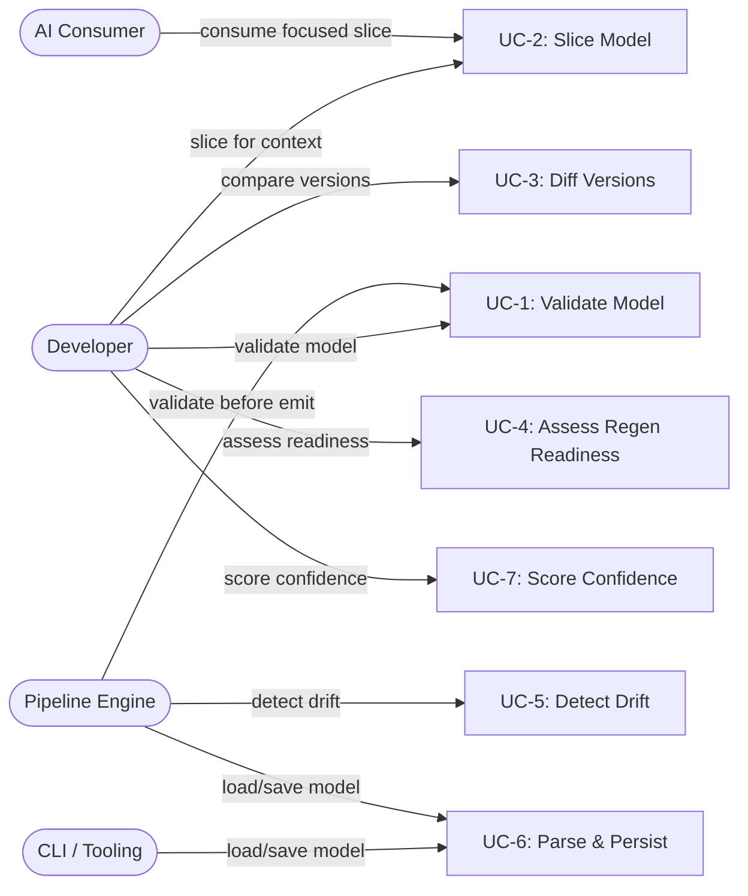

# Core Subsystem — Use Cases

## Why This Document Exists

The Core subsystem is the foundation that every other subsystem depends on. These use cases define *how* external actors (humans, pipelines, CLI) interact with Core's capabilities, what "good" looks like beyond pass/fail, and what breaks when things go wrong.

---

## UC-1: Validate Architecture Model

**Capability:** CAP-1 — Validate Architecture Models

**Actor:** Developer or Pipeline Engine

**Intent:** Confirm a model is structurally sound and semantically complete *before* using it for code generation, documentation, or AI context — catching errors early prevents costly downstream failures.

**Preconditions:**
- An `ArchitectureModel` instance exists (parsed from YAML or constructed in memory)
- Model has `meta`, `entities`, and `relationships` populated

**Main Flow:**
1. Actor invokes the validator (COMP-1.2, `validator.py`)
2. Validator checks ID uniqueness across all entity types
3. Validator checks referential integrity — every `Relationship.from_id` and `Relationship.to_id` resolves to an existing entity
4. Validator checks hierarchy consistency (REQ-3) — `parent_id`/`children` are bidirectionally consistent
5. Validator checks status consistency — no `ACTIVE` entity depending on a `PLANNED` entity
6. Validator checks completeness — capabilities have realizing behaviors
7. Validator checks meta completeness — `project` and `schema_version` set
8. A `ValidationResult` is returned with `issues`, `completeness_score`, `completeness_grade`
9. `ValidationResult.score` computed: 100 minus 10 per `Severity.ERROR`, 2 per `Severity.WARNING`

**Postconditions:**
- `ValidationResult.is_valid` is `True` when `error_count == 0` (REQ-2)
- `ValidationResult.score >= 80` for models considered acceptable (REQ-1)
- `completeness_gaps` lists specific missing elements

**Error Handling:**
- Invalid models degrade gracefully: validator always returns a result, never throws. Issues are collected as `ValidationIssue` objects with `severity`, `code`, `entity_id`, and `context`.
- A model with score < 80 is flagged but not rejected — downstream consumers decide whether to proceed.

**Quality Attributes:**
- Validation must be fast enough to run on every pipeline iteration (sub-second for models < 500 entities)
- Deterministic: same model always produces identical `ValidationResult`

**Measures of Effectiveness:**
- **Zero false negatives**: every structural inconsistency produces an ERROR-severity issue
- **Low false positive rate**: warnings should be actionable, not noise. Metric: % of warnings that lead to actual model fixes
- **Score granularity**: the 10-per-error / 2-per-warning penalty curve should meaningfully differentiate "almost valid" from "deeply broken" models

---

## UC-2: Slice Model for Focused Context

**Capability:** CAP-7 — Slice and Query Models

**Actor:** AI Consumer or Developer

**Intent:** Extract a minimal, token-efficient subset of the model so an AI agent can reason about one subsystem without exceeding context limits (REQ-20: ≤4000 tokens).

**Preconditions:**
- Full `ArchitectureModel` loaded
- Actor knows the filter criteria (source block ID, layer, status, or artifact path)

**Main Flow:**
1. Actor calls `slice_by_source_block(model, source_block, project_root=...)` from `slicer.py`
2. Slicer first attempts to load a pre-split sub-model via `load_block_model()` (fast path)
3. If no sub-model exists, slicer filters in-memory:
   - Collects capabilities, behaviors, components, interfaces tagged with the source block
   - Collects data entities owned by matching components
   - Filters relationships to only those between retained entity IDs
4. Returns a new `ArchitectureModel` containing only the slice
5. Alternative: `slice_by_layer`, `slice_by_status` for other filter dimensions

**Postconditions:**
- Returned model contains only entities relevant to the filter
- Serialized output fits within 4000 tokens (REQ-20)
- Hierarchical navigation preserved — `parent_id`/`children` intact within slice (REQ-22)

**Error Handling:**
- Unknown source block: returns empty model (no entities, no relationships) — does not throw
- If pre-split sub-model file is corrupted, falls back to in-memory slicing

**Quality Attributes:**
- Output token count is the primary optimization target, not just correctness

**Measures of Effectiveness:**
- **Token utilization**: ratio of useful architectural content to total tokens. A slice that uses 3800/4000 tokens with high-value content is better than one using 1000 tokens that omits key relationships
- **Completeness within scope**: % of relationships between retained entities that are included (should be 100%)
- **Zero dangling references**: no `from_id`/`to_id` in relationships that point to entities outside the slice

---

## UC-3: Diff Model Versions

**Capability:** CAP-8 — Diff Model Versions

**Actor:** Developer

**Intent:** Understand *what changed* between two model versions to assess architectural evolution, detect unintended drift, and determine which artifacts need regeneration.

**Preconditions:**
- Two `ArchitectureModel` instances (old and new) loaded

**Main Flow:**
1. Actor calls `diff_models(old_model, new_model)` from `differ.py`
2. Differ builds entity ID maps for both models across all entity types
3. For each entity type, computes added (in new, not in old), removed (in old, not in new), and modified (same ID, different fields)
4. Computes `RelationshipChange` entries for added/removed relationship tuples
5. Returns `ModelDiff` with `entity_changes` and `relationship_changes`
6. Actor calls `ModelDiff.format_report()` for human-readable output or inspects `summary()`

**Postconditions:**
- `ModelDiff.has_changes` accurately reflects whether any differences exist
- `added_count`, `removed_count`, `modified_count` are correct

**Error Handling:**
- Models with different `schema_version`: diff proceeds but may flag schema-level changes
- Empty models: returns `ModelDiff` with no changes (not an error)

**Quality Attributes:**
- Must detect field-level modifications, not just presence/absence of entities

**Measures of Effectiveness:**
- **Precision of "modified"**: changes flagged as modified should reflect semantically meaningful differences, not serialization noise (e.g., field ordering)
- **Actionability**: every `EntityChange` should tell the user *what* to do — `details` field should name the changed fields

---

## UC-4: Assess Regen Readiness

**Capability:** CAP-11 — Assess Regen Readiness

**Actor:** Developer or Pipeline Engine

**Intent:** Before attempting code regeneration, determine whether the model captures enough implementation detail (body hints, test contracts, constants, signatures) to produce correct code — avoiding wasted LLM calls on under-specified components.

**Preconditions:**
- Enriched `ArchitectureModel` with `Component.signatures`, `Component.test_contracts`, `Component.constants` populated

**Main Flow:**
1. Actor invokes regen readiness scoring (COMP-1.5, `regen_readiness.py`)
2. For each `Component`, computes `ComponentReadiness`:
   - `body_hint_coverage`: fraction of `FunctionSignature` entries with non-empty `body_hint`
   - `body_hint_trivial_ratio`: fraction classified as "trivial" via `_classify_hint()`
   - `test_contract_count`: number of `TestContract` entries
   - `signature_coverage`, `constant_coverage`
   - Per-function `FunctionReadiness` with `_count_test_references()` (REQ-16)
3. Computes `RegenReadiness.overall` score (0-100) and `grade` (A-F) (REQ-15)
4. Populates `blockers` list with actionable items (e.g., "Component X has 0% body_hint coverage")

**Postconditions:**
- Every component has a per-component score with specific blockers (REQ-16)
- Overall score correlates with actual regeneration success (REQ-15)
- `recommendation` field provides next-step guidance

**Error Handling:**
- Components with no signatures: score = 0, blocker = "no signatures extracted"
- Graceful on empty models: returns `RegenReadiness(overall=0, grade="F")`

**Quality Attributes:**
- Score must be a *leading indicator* of regeneration quality, not just a completeness checklist

**Measures of Effectiveness:**
- **Correlation with regen success**: the primary MoE. Grade "A" models should produce >90% correct code; grade "D" should produce <50%
- **Blocker actionability**: every blocker should map to a specific enrichment action the user can take
- **Discrimination**: the score should meaningfully separate "ready" from "not ready" — a bimodal distribution around 50 is useless

---

## UC-5: Detect Model Drift from Code

**Capability:** CAP-13 — Detect and Fix Model Drift

**Actor:** Pipeline Engine or Developer

**Intent:** Verify that the architecture model still accurately represents the actual codebase — models that drift from reality become actively harmful as AI context.

**Preconditions:**
- `ArchitectureModel` loaded
- Manifest (reality-manifest.json) available with current code facts
- For representativeness: `list[ModuleInfo]` and `list[InterfaceEdge]` from manifest

**Main Flow:**
1. Actor calls `compute_representativeness(model, modules, edges)` from `representativeness.py`
2. Computes `file_coverage`: fraction of non-trivial manifest modules covered by model component file lists (using `_files_match()` for path normalization)
3. Computes `relationship_accuracy`: fraction of model `depends-on`/`uses` relationships verified by manifest import edges
4. Computes `boundary_coherence`: whether component file groupings align with manifest module boundaries
5. Computes `behavioral_coverage`: fraction of manifest-observed behaviors captured in model
6. Returns `RepresentativenessResult` with `overall` score and lists: `uncovered_files`, `unverified_relationships`, `low_coherence_components`
7. Alternatively, `coverage.py` provides `CoverageResult` with per-check scoring via `_check_component_coverage()`

**Postconditions:**
- `uncovered_files` lists source files the model doesn't account for
- `unverified_relationships` lists model relationships not backed by code evidence

**Error Handling:**
- Missing manifest: cannot compute — should return a result with 0% scores and a clear message, not crash
- Trivial modules (`__init__.py` re-exports, `__version__.py`) filtered via `_is_trivial()` to avoid false positives

**Quality Attributes:**
- Must handle path normalization edge cases (leading `./`, `src/` prefix differences) via `_files_match()`

**Measures of Effectiveness:**
- **Drift detection rate**: % of actual code changes since last model update that are surfaced as coverage gaps
- **False positive rate**: % of flagged gaps that are actually intentional omissions (e.g., test utilities). Lower is better
- **Overall score utility**: a 90%+ representativeness score should mean the model is safe to use as AI context without verification

---

## UC-6: Parse, Persist, and Round-Trip Models

**Capability:** Implicit in COMP-1.3

**Actor:** CLI, Pipeline Engine, or Developer

**Intent:** Load a model from YAML, work with it as typed Python objects, and save it back *without losing data or changing ordering* — round-trip fidelity is essential because models are version-controlled and spurious diffs erode trust.

**Preconditions:**
- `.architecture-model.yaml` file exists (for load) or `ArchitectureModel` instance exists (for save)

**Main Flow:**
1. Actor calls `load_model(path)` from `parser.py` — parses YAML, optionally validates against JSON schema (`SCHEMA_PATH`), constructs typed dataclasses (`ArchitectureModel`, `Component`, `Capability`, etc.)
2. Actor manipulates model via typed API (all types from `types.py`)
3. Actor calls `save_model(model, path)` — serializes back to YAML
4. For multi-block projects: `load_block_model(project_root, block_id)` loads per-block sub-models
5. For project snapshots: `save_project(root, model, manifest)` via `persistence/store.py` persists model + manifest + metrics to `.architecture/`
6. Schema backward compatibility: parser handles older `schema_version` values (REQ-28)

**Postconditions:**
- Load→save cycle produces byte-identical YAML (REQ-27: no data loss, no ordering change)
- All enum values round-trip correctly via `_enum_value()` helper
- Old schema versions load without error (REQ-28)

**Error Handling:**
- Malformed YAML: parser raises with clear error message including line number
- Missing optional fields: default to `None` or empty lists (dataclass defaults)
- Schema validation failure (if `jsonschema` installed): collected as issues, not hard failures

**Quality Attributes:**
- Round-trip fidelity is non-negotiable — any data loss is a critical bug

**Measures of Effectiveness:**
- **Byte-identical round-trip rate**: % of load→save cycles that produce identical output. Target: 100%
- **Schema migration success**: % of models from schema version N-1 that load correctly on version N
- **Parse performance**: sub-200ms for models with <1000 entities

---

## UC-7: Score Entity Confidence

**Capability:** Part of CAP-11 (quality assessment)

**Actor:** Developer or Pipeline Engine

**Intent:** Prioritize enrichment effort by identifying which entities have the *least* information — confidence scoring tells you where to invest time, not just whether the model is "done."

**Preconditions:**
- `ArchitectureModel` with entities populated (even partially)

**Main Flow:**
1. Actor calls `compute_component_confidence(comp)` from `confidence.py` for each `Component`
2. Scoring weights: `contract` (0.25), `signatures` with returns (0.20), `pattern` (0.15), `test_contracts` (0.15), `symbols` with members (0.10), `constants` (0.05), `responsibilities` (0.05), `files` (0.05), `interfaces` with both provides/requires (0.10)
3. Similarly: `compute_behavior_confidence()`, `compute_capability_confidence()`, `compute_interface_confidence()`
4. All return 0.0–1.0, capped via `min(score, 1.0)`
5. Actor sorts entities by confidence ascending to find enrichment priorities

**Postconditions:**
- Every entity has a confidence score
- Scores are deterministic and reproducible

**Error Handling:**
- Empty entities (no fields populated): score = 0.0 — this is correct, not an error
- Graceful on `None` fields: each check is guarded with `if comp.field`

**Quality Attributes:**
- Weights should reflect actual regeneration value — `contract` at 0.25 reflects that behavioral contracts are the highest-value enrichment

**Measures of Effectiveness:**
- **Weight calibration**: do the weights match empirical regeneration outcomes? A component with confidence 0.8 should regenerate better than one at 0.3
- **Discrimination**: scores should spread across 0.0–1.0, not cluster at 0.5. A tight distribution means the weights aren't differentiating well
- **Value function**: confidence improvement from 0.2→0.5 should yield more regeneration improvement than 0.7→1.0 (diminishing returns)