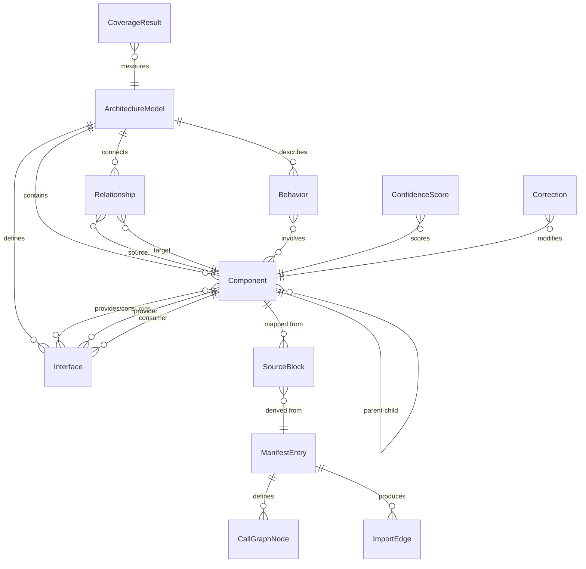
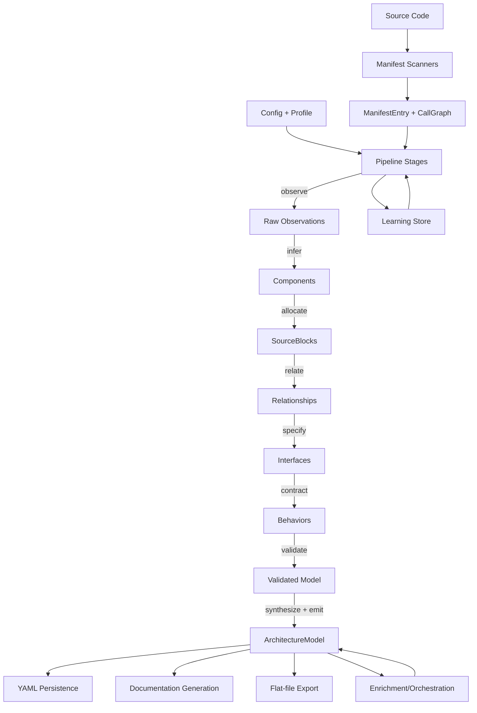

# Data Model Document

## 1. Entity Inventory

Based on the architecture model's type system (`core/types.py`) and supporting modules, the following core data entities are inferred:

### Primary Entities

| Entity | Description | Key Fields |
|--------|-------------|------------|
| **ArchitectureModel** | Root container for the entire model | `components`, `interfaces`, `behaviors`, `relationships`, `metadata` |
| **Component** | A logical architectural unit | `id`, `name`, `layer`, `description`, `files`, `children`, `interfaces` |
| **Interface** | Contract between components | `id`, `name`, `protocol`, `provider`, `consumer`, `operations` |
| **Relationship** | Dependency/connection between components | `source`, `target`, `type`, `description` |
| **Behavior** | Runtime behavior or data flow | `id`, `name`, `trigger`, `steps`, `components_involved` |
| **SourceBlock** | Mapped unit of source code | `file_path`, `start_line`, `end_line`, `component_id`, `type` |

### Pipeline Entities

| Entity | Description | Key Fields |
|--------|-------------|------------|
| **PipelineContext** | State passed through pipeline stages | `model`, `manifest`, `stage`, `cache`, `config` |
| **StageResult** | Output of a single pipeline stage | `stage_name`, `artifacts`, `errors`, `duration` |
| **LearningEntry** | Accumulated heuristic knowledge | `pattern`, `confidence`, `source_stage`, `timestamp` |

### Manifest Entities

| Entity | Description | Key Fields |
|--------|-------------|------------|
| **ManifestEntry** | Scanned source file metadata | `path`, `language`, `symbols`, `imports`, `exports`, `metrics` |
| **CallGraphNode** | Function/method in call graph | `qualified_name`, `file`, `callees`, `callers` |
| **ImportEdge** | Module-level dependency | `source_module`, `target_module`, `symbols` |

### Quality & Metrics Entities

| Entity | Description | Key Fields |
|--------|-------------|------------|
| **ConfidenceScore** | Per-component confidence | `component_id`, `score`, `factors`, `timestamp` |
| **CoverageResult** | Source-to-model coverage | `total_files`, `assigned_files`, `coverage_pct`, `gaps` |
| **Correction** | Manual override/fix record | `entity_id`, `field`, `old_value`, `new_value`, `reason` |

### Configuration Entities

| Entity | Description | Key Fields |
|--------|-------------|------------|
| **Config** | Runtime configuration | `profile`, `target_path`, `options`, `schema_version` |
| **DomainProfile** | Domain-specific extraction rules | `name`, `patterns`, `layer_definitions`, `naming_rules` |

---

## 2. Relationships

---

## 3. Data Flow

---

## 4. Data Lifecycle

| Phase | Trigger | Entities Affected | Pattern |
|-------|---------|-------------------|---------|
| **Creation** | Pipeline `observe`/`infer` stages | Components, Relationships, Interfaces | Extracted from source scan; assigned IDs |
| **Enrichment** | Orchestration workflows | Components, Behaviors, Interfaces | Additive — appends signatures, contracts, capabilities |
| **Validation** | Pipeline `validate` stage | All entities | Read-only check; produces error reports |
| **Correction** | Manual or auto-correction | Any entity field | Creates `Correction` record; overwrites field |
| **Persistence** | `emit` stage or CLI save | ArchitectureModel (full tree) | Serialized to YAML with round-trip preservation |
| **Diffing** | Model comparison | ArchitectureModel pairs | Read-only; produces diff artifacts |
| **Deletion** | Re-extraction or decomposition | Stale components/blocks | Replaced on next full pipeline run; no soft-delete |

---

## 5. Key Design Observations

- **Hierarchical Components**: Components form a tree via parent-child (`COMP-1` → `COMP-1.1`, etc.), enabling slicing at any depth.
- **Bidirectional Interface Binding**: Each Interface explicitly references both a provider and consumer component.
- **Append-Only Learning**: Pipeline learning entries accumulate across runs; never deleted.
- **YAML as Source of Truth**: The persisted YAML file is the canonical model representation, with compression and merger utilities for multi-file scenarios.
- **Cache Invalidation**: Pipeline cache keys are derived from source file hashes and stage parameters, ensuring stale results are discarded on code change.