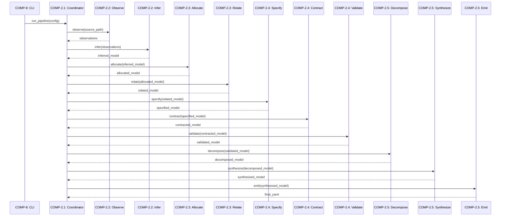
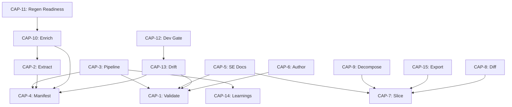

# Functional Analysis Document

## 1. Capability Inventory

| ID | Capability | Description | Rationale |
|----|-----------|-------------|-----------|
| CAP-1 | Validate Architecture Models | Checks model correctness via JSON schema validation, referential integrity between elements, hierarchy consistency (parent/child), cycle detection, and domain-specific rules from profiles | Ensures models remain internally consistent and conformant before downstream consumption |
| CAP-2 | Extract Architecture from Code | Scans source code ASTs (Python, TypeScript, Kotlin) to automatically derive components, relationships, behaviors, routes, and constraints | Enables bottom-up architecture discovery from existing codebases |
| CAP-3 | Run Modular Extraction Pipeline | Executes a 10-stage pipeline: observe → infer → allocate → relate → specify → contract → validate → decompose → synthesize → emit | Provides a repeatable, cacheable, stage-gated process for producing complete architecture models |
| CAP-4 | Generate Reality Manifest | Scans source files to produce structural facts including functions, imports, classes, routes, and test coverage | Creates ground-truth inventory of what actually exists in code |
| CAP-5 | Generate SE Documentation | Produces a full systems engineering document suite: functional analysis, logical architecture, use cases, requirements, V&V, ConOps, and operations docs | Delivers formal engineering artifacts from model data without manual authoring |
| CAP-6 | Author Model from Requirements | Parses a requirements document and synthesizes a concept-phase architecture model with components, capabilities, and relationships | Supports top-down, requirements-driven architecture development |
| CAP-7 | Slice and Query Models | Filters models by block, layer, status, or artifact type for focused context delivery | Reduces cognitive load and token usage when working with large models |
| CAP-8 | Diff Model Versions | Compares two model versions, reporting additions, removals, and changes at element level | Supports change tracking and review workflows |
| CAP-9 | Decompose Models Hierarchically | Breaks coarse system-level models into per-subsystem sub-models maintaining parent/child traceability | Enables scalable modeling of complex systems |
| CAP-10 | Enrich Models with Code Intelligence | Auto-populates function signatures, constants, test contracts, and behaviors from source analysis | Bridges the gap between abstract models and concrete implementation detail |
| CAP-11 | Assess Regen Readiness | Scores how completely a model captures enough detail (signatures, contracts, behaviors) to regenerate code | Quantifies model completeness for code-generation workflows |
| CAP-12 | Check Development Gate | Verifies that code reality is tracking toward the authored architecture intent, flagging divergence | Acts as a governance checkpoint in development workflows |
| CAP-13 | Detect and Fix Model Drift | Compares model against current code, reports coverage gaps and suggests corrections | Maintains model-code synchronization over time |
| CAP-14 | Manage Global Learnings | Stores, retrieves, and applies heuristics, archetypes, and workflow lessons across pipeline runs | Enables continuous improvement of extraction quality |
| CAP-15 | Export for AI Consumption | Produces flat-file exports optimized for token-limited AI environments | Makes architecture knowledge accessible to LLM-based tools |

## 2. Functional Decomposition

### CAP-1: Validate Architecture Models
- Schema validation against JSON schema definitions
- Referential integrity checks (all references resolve)
- Hierarchy consistency (parent/child relationships valid)
- Cycle detection in dependency graphs
- Domain rule enforcement via profiles

### CAP-2: Extract Architecture from Code
- AST parsing per language (Python, TS, Kotlin)
- Route detection (HTTP endpoints, CLI commands)
- Constraint detection (decorators, annotations)
- Relationship inference from imports/calls
- Artifact parsing (configs, tables)

### CAP-3: Run Modular Extraction Pipeline
- **Observe**: Scan codebase, produce raw observations
- **Infer**: Derive components and behaviors from observations
- **Allocate**: Assign modules to architectural blocks
- **Relate**: Discover inter-component relationships
- **Specify**: Add interface specifications
- **Contract**: Attach test contracts
- **Validate**: Check intermediate model quality
- **Decompose**: Break into sub-models
- **Synthesize**: Merge and reconcile
- **Emit**: Output final model YAML

### CAP-4: Generate Reality Manifest
- Multi-language file scanning
- Function/class/import extraction
- Call graph construction
- Test file analysis
- Component grouping

### CAP-5: Generate SE Documentation
- Document type detection and selection
- Frontmatter generation
- Per-document-type rendering (ConOps, functional analysis, logical architecture, use cases, requirements, V&V, etc.)

### CAP-6: Author Model from Requirements
- Requirements document parsing
- Concept-phase model synthesis
- Component/capability/relationship generation

### CAP-7: Slice and Query Models
- Filter by block, layer, status, artifact
- Context-appropriate subset extraction

### CAP-8: Diff Model Versions
- Element-level comparison
- Addition/removal/change classification

### CAP-9: Decompose Models Hierarchically
- Parent/child relationship establishment
- Per-system sub-model generation
- Deep decomposition with behavior flows

### CAP-10: Enrich Models with Code Intelligence
- Signature extraction and attachment
- Constant discovery
- Test contract inference
- Capability inference from code patterns
- Trigger/use-case detection

### CAP-11: Assess Regen Readiness
- Completeness scoring across dimensions
- Gap identification

### CAP-12: Check Development Gate
- Intent-vs-reality comparison
- Pass/fail gate determination

### CAP-13: Detect and Fix Model Drift
- Coverage gap reporting
- Correction suggestion
- Drift documentation

### CAP-14: Manage Global Learnings
- Heuristic storage and retrieval
- Lesson extraction from pipeline runs
- Archetype management

### CAP-15: Export for AI Consumption
- Flat-file formatting
- Reference document generation
- Token-budget optimization

## 3. Capability-Component Mapping

| Capability | Primary Component(s) | Explanation |
|-----------|---------------------|-------------|
| CAP-1 | COMP-1.2 (Validation) | `validator.py` implements schema, integrity, hierarchy, and domain rule checks |
| CAP-2 | COMP-6 (Extract) | `from_code.py`, `route_detector.py`, `constraint_detector.py` perform AST-based extraction |
| CAP-3 | COMP-2 (Pipeline), COMP-2.1–2.5 | Coordinator orchestrates all 10 stages implemented across pipeline sub-components |
| CAP-4 | COMP-3 (Manifest), COMP-3.1–3.3 | Scanners produce facts; graph/analysis derives relationships; grouping organizes output |
| CAP-5 | COMP-4 (Documentation), COMP-4.2 (SE Suite) | `se/generator.py` and per-document modules render the full SE document set |
| CAP-6 | COMP-7 (Authoring) | `authoring/parser.py` handles requirements-to-model transformation |
| CAP-7 | COMP-1.4 (Model Operations) | `slicer.py` implements filtering logic |
| CAP-8 | COMP-1.4 (Model Operations) | `differ.py` implements version comparison |
| CAP-9 | COMP-5.2 (Decomposition), COMP-1.5 | `decompose.py`, `deep_decompose.py` break models hierarchically |
| CAP-10 | COMP-5.1 (Enrichment) | `enrich.py`, `auto_enrich.py` populate models from code intelligence |
| CAP-11 | COMP-1.5 (Quality Metrics) | `regen_readiness.py` computes readiness scores |
| CAP-12 | COMP-7 (Authoring) | `gate.py` implements development gate checks |
| CAP-13 | COMP-4.1 (Core Doc Generators), COMP-1.4 | `drift.py` and `coverage.py` detect and report drift |
| CAP-14 | COMP-11 (Pipeline Learning) | `global_learning.py`, `learning.py`, `lessons.py` manage heuristic state |
| CAP-15 | COMP-10 (Export) | `flatfiles.py`, `reference.py` produce AI-optimized outputs |

## 4. Behavioral Flows

### CAP-3: Run Modular Extraction Pipeline

### CAP-4: Generate Reality Manifest

1. **Entry**: CLI or orchestration invokes `generator.py`
2. **Scan**: `multi_scanner.py` dispatches to language-specific scanners (`scanner.py` for Python, `ts_scanner.py`, `kt_scanner.py`)
3. **Analyze**: `call_graph.py` resolves imports; `interfaces.py` extracts public APIs; `behavior.py` detects behavioral patterns; `test_analyzer.py` maps test coverage
4. **Group**: `grouping.py` clusters functions/classes into logical components
5. **Emit**: `generator.py` produces the manifest structure with all facts

### CAP-5: Generate SE Documentation

1. **Entry**: CLI invokes `se/generator.py` with model path and document type selection
2. **Detect**: `se/detect.py` determines which document types are applicable
3. **Frontmatter**: `se/frontmatter.py` generates metadata headers
4. **Render**: Per-type modules (`functional_analysis.py`, `logical_architecture.py`, `use_cases.py`, etc.) render markdown from model data
5. **Output**: Documents written to target directory

### CAP-10: Enrich Models with Code Intelligence

1. **Entry**: `orchestration/enrich.py` or `auto_enrich.py` invoked with model + source path
2. **Context**: `enrichment_context.py` gathers available code intelligence
3. **Signatures**: Function signatures extracted and attached to components
4. **Capabilities**: `capability_inference.py` infers capabilities from code patterns
5. **Triggers**: `trigger_detection.py` identifies entry points and events
6. **Use Cases**: `use_case_inference.py` derives use cases from routes/CLI commands
7. **Output**: Enriched model returned

## 5. Functional Dependencies

| Capability | Depends On |
|-----------|-----------|
| CAP-1 | COMP-9 (Configuration) for schema/profile definitions |
| CAP-2 | CAP-4 (Manifest scanning for AST data) |
| CAP-3 | CAP-1 (validation stage), CAP-4 (observation stage), CAP-14 (heuristics) |
| CAP-5 | CAP-1 (valid model required), CAP-7 (slicing for focused sections) |
| CAP-9 | CAP-7 (slicing to extract sub-models) |
| CAP-10 | CAP-4 (source facts), CAP-2 (code extraction) |
| CAP-11 | CAP-10 (enriched model needed for scoring) |
| CAP-12 | CAP-13 (drift detection underlies gate checks) |
| CAP-13 | CAP-4 (current code facts), CAP-1 (model integrity) |
| CAP-15 | CAP-7 (slicing for context reduction) |

## 6. Gaps & Unrealized Capabilities

| Issue | Description |
|-------|-------------|
| **Capability Realization links empty** | The architecture model's `realizes` relationships are unpopulated (all entries show empty source/target), meaning formal traceability from behaviors to capabilities is not yet encoded |
| **Behaviors misaligned with capabilities** | BEH-1 through BEH-18 describe Django HTTP endpoints (login, password reset, bookmarklets, templates) that do not clearly map to any of the 15 declared capabilities — these appear to be application behaviors from a different system or a web admin interface not reflected in the capability model |
| **BEH-19 through BEH-25 (CLI behaviors)** | These CLI test/benchmark behaviors lack explicit capability realization links, though they functionally exercise CAP-3 (pipeline) and CAP-10 (enrichment) |
| **CAP-14 component isolation** | COMP-11 (Pipeline Learning) is nested under the pipeline namespace but serves cross-cutting concerns; no explicit interface contract defines how other capabilities consume learnings |
| **No explicit behavior definitions for CAP-6, CAP-8, CAP-11, CAP-12** | These capabilities lack corresponding behavior entries in the model, indicating incomplete behavioral specification |

---

*Document generated from architecture model. All element identifiers (CAP-*, BEH-*, COMP-*) reference the canonical model.*