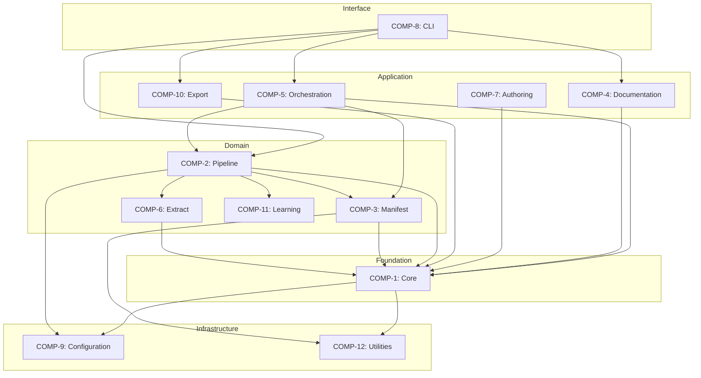

# Logical Architecture

## 1. Architecture Overview

The system is an **architecture model extraction and documentation platform** — it scans source code, infers structural components and behaviors, validates the resulting model, and generates systems engineering documentation. The architecture follows a layered approach from foundation types through domain logic to application-level workflows and a CLI interface.

## 2. Layer Structure

| Layer | Responsibility | Components |
|-------|---------------|------------|
| **Infrastructure** | Configuration, utilities, shared services | COMP-9, COMP-12 |
| **Foundation** | Core types, validation, parsing, model operations | COMP-1.x |
| **Domain** | Business logic — pipeline extraction, manifest scanning, learning | COMP-2.x, COMP-3.x, COMP-6, COMP-11 |
| **Application** | High-level workflows — docs, orchestration, authoring, export | COMP-4.x, COMP-5.x, COMP-7, COMP-10 |
| **Interface** | User-facing CLI | COMP-8 |

Data flows **upward**: infrastructure supports foundation, foundation supports domain, domain supports application, and the CLI exposes application capabilities to users.

## 3. Component Inventory

| ID | Component | Purpose | Key Responsibilities | Key Files |
|----|-----------|---------|---------------------|-----------|
| COMP-1.1 | Type System | Canonical data model | Defines all dataclasses, enums (Component, Relationship, Behavior, etc.) used throughout | `core/types.py` |
| COMP-1.2 | Validation | Model correctness | JSON schema validation, referential integrity checks, cycle detection, domain rule enforcement | `core/validator.py` |
| COMP-1.3 | Parser & Persistence | I/O layer | YAML parse/serialize with round-trip preservation, model compression, multi-file merging, persistent storage | `core/parser.py`, `persistence/store.py` |
| COMP-1.4 | Model Operations | Analytical transforms | Slice models by scope, diff two models, compute coverage metrics, impact analysis, clustering, source-block assignment | `core/slicer.py`, `core/differ.py`, `core/coverage.py` |
| COMP-1.5 | Quality Metrics | Model health scoring | Confidence scoring per element, regen-readiness assessment, corrections tracking, decomposition quality, visualization | `core/confidence.py`, `core/regen_readiness.py` |
| COMP-2.1 | Pipeline Coordination | Stage orchestration | Manages 10-stage pipeline execution order, inter-stage context, caching, progress reporting, artifact collection | `pipeline/coordinator.py`, `pipeline/cache.py` |
| COMP-2.2 | Observation Stages | Code discovery | Scans codebase (observe) and infers components/behaviors from observations (infer) | `pipeline/observe.py`, `pipeline/infer.py` |
| COMP-2.3 | Allocation & Relation | Structure mapping | Assigns source modules to architectural blocks (allocate), discovers inter-component relationships (relate) | `pipeline/allocate.py`, `pipeline/relate.py` |
| COMP-2.4 | Specification & Contract | Interface definition | Adds interface specifications, binds test contracts to components, runs validation passes | `pipeline/specify.py`, `pipeline/contract.py`, `pipeline/validate.py` |
| COMP-2.5 | Synthesis & Emit | Final output | Decomposes large blocks, synthesizes partial results into coherent model, emits final YAML | `pipeline/synthesize.py`, `pipeline/emit.py` |
| COMP-3.1 | Scanners | Source parsing | Language-specific AST scanning for Python, TypeScript, Kotlin; extracts symbols, metrics, body hints | `manifest/scanner.py`, `manifest/ts_scanner.py`, `manifest/kt_scanner.py` |
| COMP-3.2 | Graph & Analysis | Dependency analysis | Builds call graphs, resolves imports, extracts interfaces, detects behavioral patterns, analyzes tests | `manifest/call_graph.py`, `manifest/interfaces.py`, `manifest/behavior.py` |
| COMP-3.3 | Grouping & Generation | Component inference | Groups source files into logical components, generates manifest, recursive deep scanning | `manifest/grouping.py`, `manifest/generator.py` |
| COMP-4.1 | Core Doc Generators | Technical docs | Generates component specs, ICDs, dependency matrices, health reports, drift analysis, diagrams | `docs/generator.py`, `docs/icd.py`, `docs/diagrams.py` |
| COMP-4.2 | SE Document Suite | Formal SE docs | Produces 15 document types: ConOps, functional analysis, logical architecture, requirements, use cases, V&V, etc. | `docs/se/generator.py`, `docs/se/conops.py`, `docs/se/logical_architecture.py` |
| COMP-5.1 | Enrichment | Model augmentation | Auto-enriches models with function signatures, constants, test contracts, capability inference, use-case inference | `orchestration/enrich.py`, `orchestration/capability_inference.py` |
| COMP-5.2 | Decomposition | Model refinement | Deep-decomposes large components, extracts behavior flows, compacts redundant structures | `orchestration/deep_decompose.py`, `orchestration/behavior_flows.py` |
| COMP-6 | Extract | Code-to-model | Detects routes, constraints, parses artifacts (tables, configs) into model elements | `extract/from_code.py`, `extract/route_detector.py` |
| COMP-7 | Authoring | Forward modeling | Authors models from requirements text, enforces development gate checks | `authoring/parser.py`, `authoring/gate.py` |
| COMP-8 | CLI | User interface | Exposes all commands (scan, validate, generate docs, export) via command-line | `cli/main.py` |
| COMP-9 | Configuration | Settings | Loads config files, manages domain profiles, defines config schemas | `config/loader.py`, `profiles/schema.py` |
| COMP-10 | Export | Output formats | Produces flat-file exports for AI consumption, reference documentation | `export/flatfiles.py`, `export/reference.py` |
| COMP-11 | Pipeline Learning | Adaptive improvement | Persists lessons across runs, extracts heuristics, applies learned patterns to future extractions | `pipeline/global_learning.py`, `pipeline/lessons.py` |
| COMP-12 | Utilities | Shared services | File discovery, monitoring/health checks, pattern matching, data loading | `utils/discovery.py`, `monitoring.py` |

## 4. Component Interactions

Key data flows:

1. **CLI → Orchestration/Pipeline**: User commands trigger orchestration workflows or pipeline runs
2. **Pipeline Coordination → Pipeline Stages**: Coordinator sequences observe → infer → allocate → relate → specify → contract → validate → decompose → synthesize → emit
3. **Pipeline Stages → Manifest**: Observation/allocation stages invoke scanners and graph analysis to understand source code
4. **Pipeline Stages → Core**: All stages read/write the canonical type system, use validation, model operations
5. **Orchestration → Core + Manifest**: Enrichment and decomposition workflows combine model operations with source analysis
6. **Documentation → Core**: Doc generators read the validated model to produce output
7. **Extract → Core**: Code extractors produce model elements conforming to the type system
8. **Configuration → All**: Config/profiles are consumed across layers
9. **Pipeline Learning → Pipeline**: Lessons feed back into pipeline stage decisions

## 5. Dependency Analysis

**Key dependency chains:**
- `CLI → Orchestration → Pipeline → Manifest → Core Types`
- `CLI → Documentation → Core Types + Validation`
- `Pipeline Stages → Core Operations (slicer, differ, coverage)`

**Coupling concerns:**
- **Core Types is a universal dependency** — any change to `types.py` propagates everywhere. This is acceptable for a canonical model but requires stability.
- **Pipeline stages share context** via the coordinator, creating implicit coupling through the context object.
- **Manifest scanners** are language-specific but share a common protocol, keeping them decoupled from each other.

## 6. Design Rationale

- **Layered separation** ensures foundation stability — types and validation change rarely while application workflows evolve.
- **10-stage pipeline** provides modularity: stages can be cached, skipped, or replaced independently.
- **Manifest as separate domain component** isolates language-specific parsing complexity from architectural reasoning.
- **SE Document Suite** as a dedicated sub-component acknowledges the breadth of formal documentation needs without polluting core logic.
- **Learning component** enables the system to improve extraction quality over repeated runs without modifying stage logic directly.

## 7. Mermaid Dependency Graph

