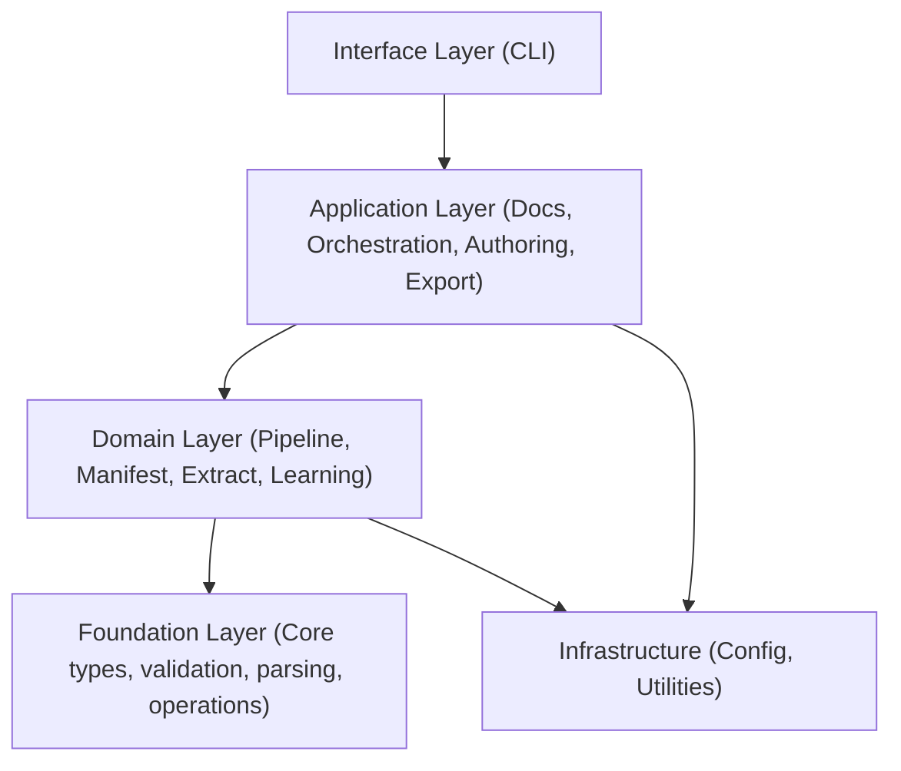

# Maintenance Manual

## 1. Development Setup

```bash
# Clone and create virtual environment
git clone <repository-url>
cd architecture-model
python -m venv .venv
source .venv/bin/activate  # Linux/macOS
# .venv\Scripts\activate   # Windows

# Install in development mode
pip install -e ".[dev]"

# Run tests
pytest

# Run the CLI
python -m architecture_model
```

## 2. Code Organization

The codebase follows a **layered architecture** with four tiers:



| Layer | Purpose | Components |
|-------|---------|------------|
| **Interface** | User-facing entry points | CLI (COMP-8) |
| **Application** | Workflows and output generation | Docs, Orchestration, Authoring, Export (COMP-4,5,7,10) |
| **Domain** | Core business logic | Pipeline, Manifest, Extract, Learning (COMP-2,3,6,11) |
| **Foundation** | Shared types and operations | Core (COMP-1) |
| **Infrastructure** | Cross-cutting concerns | Config, Utilities (COMP-9,12) |

### Key directories:

- `src/architecture_model/core/` — Dataclasses, validation, parsing, analysis operations
- `src/architecture_model/pipeline/` — 10-stage extraction pipeline
- `src/architecture_model/manifest/` — Source code scanning and AST analysis
- `src/architecture_model/docs/` — Documentation generation including SE suite
- `src/architecture_model/orchestration/` — High-level enrichment/decomposition workflows

## 3. Extension Points

### Adding a New Pipeline Stage

1. Create `src/architecture_model/pipeline/<stage_name>.py` and `<stage_name>_types.py`
2. Implement the stage protocol defined in `pipeline/protocol.py`
3. Register in `pipeline/coordinator.py`

### Adding a New Language Scanner

1. Create `src/architecture_model/manifest/<lang>_scanner.py`
2. Implement the scanner protocol from `manifest/protocol.py`
3. Register in `manifest/multi_scanner.py`

### Adding a New Document Type

1. For SE docs: add module in `src/architecture_model/docs/se/`
2. For core docs: add module in `src/architecture_model/docs/`
3. Register in the respective generator (`docs/generator.py` or `docs/se/generator.py`)

### Adding a New CLI Command

1. Add command function in `src/architecture_model/cli/main.py`
2. Wire up arguments and subparsers

### Adding a New Domain Profile

1. Add profile definition under `src/architecture_model/profiles/builtins/`
2. Conform to schema in `profiles/schema.py`

## 4. Key Patterns

| Pattern | Usage |
|---------|-------|
| **Dataclasses as types** | All model entities in `core/types.py` are Python dataclasses |
| **Protocol classes** | Scanner and pipeline stage interfaces use `typing.Protocol` |
| **Stage pipeline** | Pipeline stages are modular, ordered, and independently testable |
| **Type companion modules** | Each stage has a `*_types.py` for its input/output types |
| **Layered imports** | Upper layers import from lower; never the reverse |
| **YAML round-trip** | Parser preserves comments/ordering via round-trip serialization |
| **Caching** | Pipeline and manifest scanning use caching (`cache.py`, `scan_cache.py`) |

## 5. Dependency Management

- **Package metadata**: Defined in `pyproject.toml` (or `setup.cfg`)
- **Runtime deps**: Likely `pyyaml`, `jsonschema`, standard library AST modules
- **Dev deps**: `pytest`, linters, type checkers — install via `pip install -e ".[dev]"`
- **No external heavy frameworks** — the system relies on standard library where possible (AST parsing, dataclasses)

## 6. Common Maintenance Tasks

### Adding a New Model Component/Field

1. Add the field to the relevant dataclass in `core/types.py`
2. Update JSON schema in `config/schema.py` or `spec/`
3. Update `core/validator.py` for any new integrity rules
4. Update `core/parser.py` for serialization/deserialization
5. Run full test suite

### Modifying an Interface (ICD change)

1. Update type definitions in the relevant `*_types.py`
2. Update all consuming stages/modules
3. Update documentation generators if the change is user-visible

### Updating Validation Rules

1. Modify `core/validator.py`
2. Add test cases covering the new rule
3. Update schema definitions if structural

### Adding a New Analysis Operation

1. Add module in `src/architecture_model/core/`
2. Export from `core/__init__.py`
3. Wire into CLI if user-facing

### Modifying the Pipeline Order

1. Edit stage registration order in `pipeline/coordinator.py`
2. Verify inter-stage data contracts still hold (check `*_types.py` compatibility)