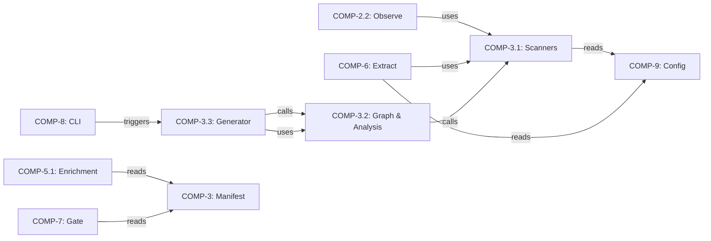
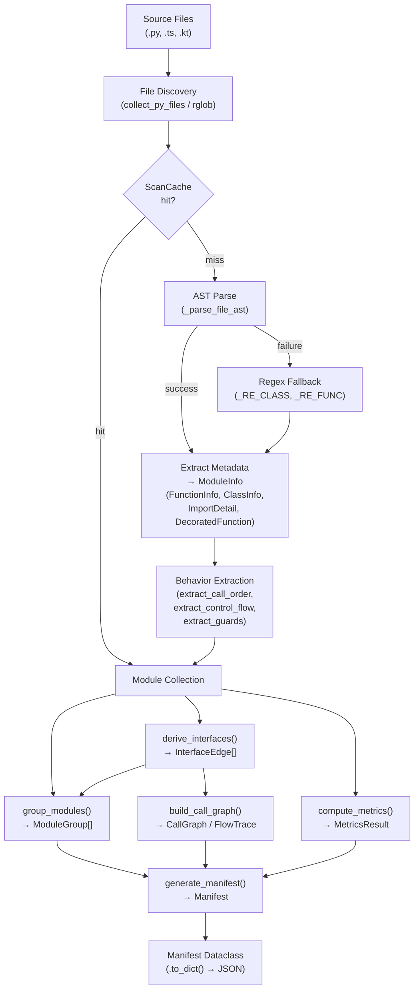

# Concept of Operations: Manifest Subsystem

## 1. System Overview

The **Manifest** subsystem (COMP-3) performs source code scanning and structural fact extraction — the "reality" layer of the Architecture Model Standard. It parses source files via AST analysis, resolves import relationships, extracts behavioral signals, and groups modules into logical components. The output is a typed `Manifest` dataclass containing `ModuleInfo` records, `InterfaceEdge` relationships, and `MetricsResult` data.

The subsystem realizes **CAP-4: Generate Reality Manifest** and is composed of three sub-components:

| Sub-component | ID | Responsibility |
|---|---|---|
| **Scanners** | COMP-3.1 | Language-specific AST parsing (Python, TypeScript, Kotlin) |
| **Graph & Analysis** | COMP-3.2 | Import resolution, call graphs, behavior extraction |
| **Grouping & Generation** | COMP-3.3 | Component grouping, manifest assembly, recursive scanning |

## 2. Stakeholders & Actors

| Actor | Interaction |
|---|---|
| **CLI** (COMP-8) | Triggers manifest generation via `runner CLI` (IF-2) |
| **Observe stage** (COMP-2.2) | Consumes scanner output for code facts |
| **Extract** (COMP-6) | Uses scanners for deeper code analysis |
| **Enrichment** (COMP-5.1) | Reads manifest data to augment the architecture model |
| **Gate Check** (COMP-7) | Reads manifest to validate boundary coherence (REQ-19) |
| **Config** (COMP-9) | Provides exclusion patterns, functional block definitions |
| **Developers** | Consume manifest output for architecture understanding |

## 3. Operational Scenarios

### 3.1 Full Project Scan

A developer runs the CLI to generate an initial architecture model. `generate_manifest(project_root)` is invoked, which:

1. Loads `ProjectConfig` from `.architecture-model.yaml` via COMP-9
2. Calls `compute_metrics(root, config)` for project-level stats
3. Iterates `config.source_block_dict`, calling `process_block()` for each functional block
4. Each block triggers `scan_file()` per Python file, producing `ModuleInfo` records with `FunctionInfo`, `ClassInfo`, and `ImportDetail` entries
5. `derive_interfaces()` resolves imports into `InterfaceEdge` objects
6. Returns a complete `Manifest` with all modules, interfaces, and metrics

**Satisfies:** REQ-8 (complete file scanning), REQ-9 (import edge resolution).

### 3.2 Incremental Scan with Caching

`ScanCache` (in `scan_cache.py`) tracks previously scanned files. On re-invocation, `generate_manifest` instantiates a `ScanCache` and skips files whose modification time hasn't changed. Only modified or new files are re-parsed, and the cached `ModuleInfo` records are merged with fresh results. This reduces wall-clock time on large repositories.

### 3.3 Multi-Language Scanning

`scan_all_languages(root)` in `multi_scanner.py` detects languages by file extension and dispatches to the appropriate scanner:

- `.py` → `generate_manifest()` → `SourceGraph.from_manifest()`
- `.kt` / `.java` → `scan_kotlin()` / `scan_java()` via tree-sitter
- `.ts` / `.tsx` → `scan_typescript_fallback()` via regex

Results are merged into a unified `SourceGraph` via `_merge_graphs()`. Cross-language edges are **not** resolved. JVM build directories (`build`, `.gradle`, `generated`) and `node_modules` are excluded.

**Satisfies:** REQ-10 (multi-language scanning).

### 3.4 Recursive Manifest for Subsystem Decomposition

`generate_block_manifest(root, block_id, block_def)` produces a scoped `Manifest` for a single functional block. The recursive scanner in `recursive.py`:

1. Resolves files from `block_def["dirs"]` and `block_def["files"]`
2. Deduplicates and scans each file with `scan_file()`
3. Derives interfaces scoped to the block
4. Wraps the result in a `RecursiveManifest` linked to a `component_id` via `_block_id_to_component_id()`

This enables drill-down architecture views per component.

## 4. System Context

**External dependencies:**

- **Config** (COMP-9): exclusion patterns, functional block definitions, source block dict
- **Utils** (`architecture_model.utils.discovery`): `collect_py_files()` for file discovery
- **Monitoring** (`architecture_model.monitoring`): `@monitored` decorator on `generate_manifest`
- **tree-sitter** (optional): required for Kotlin/Java scanning

## 5. Operational Constraints

| Constraint | Detail |
|---|---|
| **AST parse failures** | Files with `SyntaxError` or `UnicodeDecodeError` fall back to regex extraction (`_RE_CLASS`, `_RE_FUNC`, `_RE_IMPORT`) and are marked `ModuleStatus.MISSING` |
| **Trivial file exclusion** | `__version__.py`, `__main__.py`, empty `__init__.py` (≤5 lines, no symbols), and vendor directories are filtered by `_is_trivial()` |
| **Boundary coherence** | REQ-19 requires >70% intra-component imports; validated by grouping in COMP-3.3 |
| **No cross-language edges** | `multi_scanner.py` merges graphs but cannot resolve imports across language boundaries |
| **Behavioral extraction scope** | `behavior.py` performs single-function, single-file analysis only — no inter-procedural or type-inferred resolution |
| **Builtins excluded** | `extract_call_order` filters a `_BUILTINS` frozenset of 50+ names from call graphs |

## 6. Data Flow

The pipeline flows left-to-right through the three sub-components: **Scanners** (COMP-3.1) produce `ModuleInfo` records, **Graph & Analysis** (COMP-3.2) resolves `InterfaceEdge` and `CallGraph` structures, and **Grouping & Generation** (COMP-3.3) assembles the final `Manifest` with grouped components and metrics.