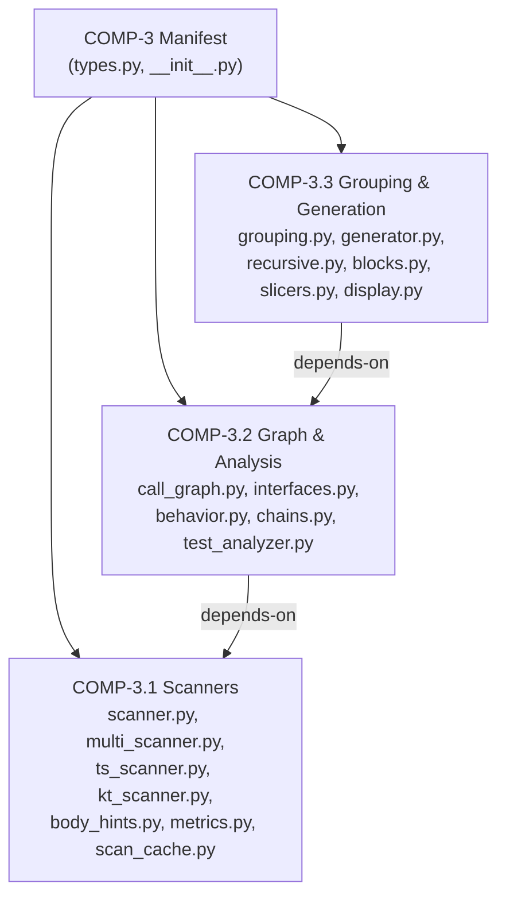
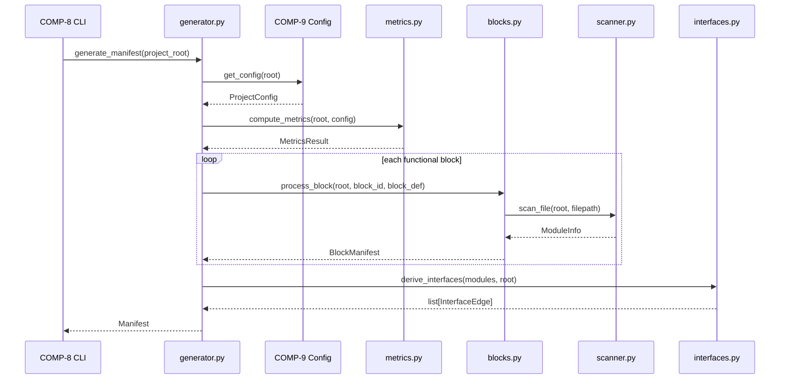
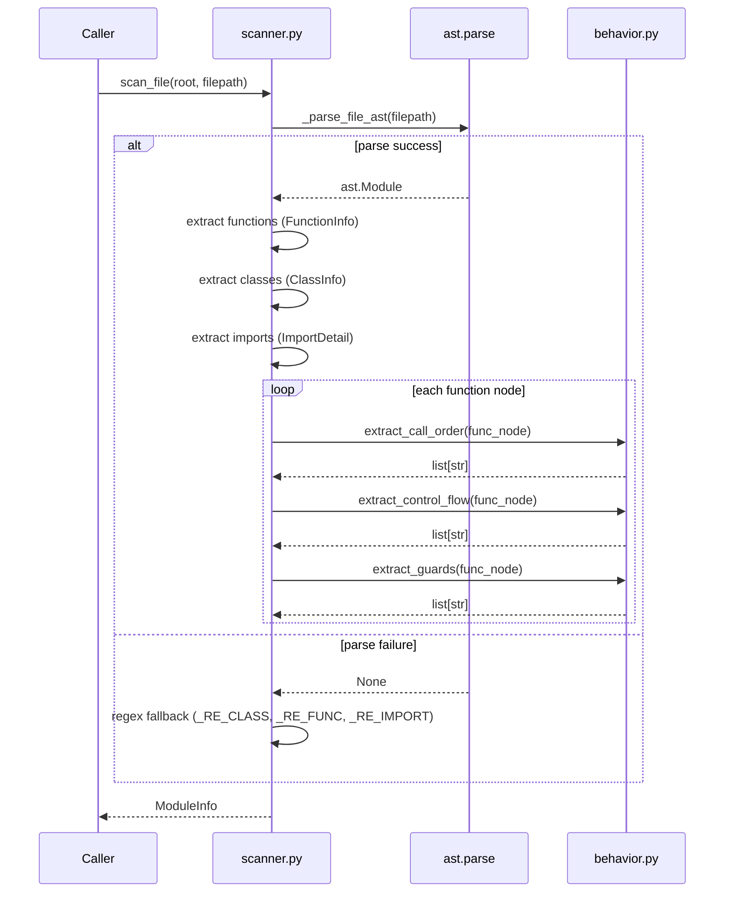

# Functional Analysis — Manifest Subsystem

## 1. Capability Inventory

**CAP-4: Generate Reality Manifest** decomposes into four sub-capabilities:

| Sub-Capability | Description |
|---|---|
| **CAP-4.1** Source Scanning | Parse source files via AST (Python) or regex/tree-sitter (TS, Kotlin) to extract `FunctionInfo`, `ClassInfo`, `ImportDetail` |
| **CAP-4.2** Graph Construction | Resolve imports into edges, build call graphs, extract behavioral signals |
| **CAP-4.3** Module Grouping | Cluster modules into logical components via directory, name-prefix, and import affinity |
| **CAP-4.4** Manifest Assembly | Orchestrate scanning, interface derivation, metrics, and block processing into a typed `Manifest` |

## 2. Functional Decomposition

### COMP-3 — Manifest Core

Defines the type system: `ModuleInfo`, `FunctionInfo`, `ClassInfo`, `ImportDetail`, `DecoratedFunction`, `ModuleStatus`, `Manifest`, `ScanReport`, `MetricsResult`, `BlockManifest`, `RecursiveManifest`, `InterfaceEdge`. All pipeline stages accept and return these typed dataclasses.

### COMP-3.1 — Scanners

- **`scanner.py`** — `scan_file(root, filepath) → ModuleInfo`. Parses Python via `ast.parse()` with regex fallback (`_RE_CLASS`, `_RE_FUNC`, `_RE_IMPORT`). Extracts functions, classes, imports, docstrings, line counts. Delegates behavioral enrichment to `behavior.py`.
- **`multi_scanner.py`** — `scan_all_languages(root) → SourceGraph`. Detects `.py`, `.kt`, `.java`, `.ts/.tsx` files, dispatches to language-specific scanners, merges via `_merge_graphs()`.
- **`ts_scanner.py`** — Regex-based TypeScript/JSX scanning.
- **`kt_scanner.py`** — Tree-sitter-based Kotlin/Java scanning.
- **`scan_cache.py`** — `ScanCache` for memoizing scan results.
- **`metrics.py`** — `compute_metrics(root, config) → MetricsResult`.
- **`body_hints.py`** — Additional heuristics for function body classification.
- **`protocol.py`** — Language-agnostic protocols: `SourceUnit`, `DependencyEdge`, `SourceGraph`.

### COMP-3.2 — Graph & Analysis

- **`call_graph.py`** — `build_call_graph(manifest) → CallGraph`. Indexes all functions by qualified name (`file:func_name`), resolves import-based edges, supports multi-hop tracing via `FlowTrace`.
- **`interfaces.py`** — `derive_interfaces(modules, root) → list[InterfaceEdge]`. Resolves dotted import paths to file paths, deduplicates edges.
- **`behavior.py`** — `extract_call_order()`, `extract_control_flow()`, `extract_guards()`. Walks AST bodies in execution order, filters builtins via `_BUILTINS` frozenset.
- **`chains.py`** — Dependency chain analysis.
- **`test_analyzer.py`** — Test file detection and coverage mapping.

### COMP-3.3 — Grouping & Generation

- **`generator.py`** — `generate_manifest(project_root, config?) → Manifest`. Top-level orchestrator decorated with `@monitored`.
- **`grouping.py`** — `group_modules(modules, interfaces, ...) → list[ModuleGroup]`. Three-signal affinity: subdirectory, name-prefix, import density. Filters trivials via `_is_trivial()`.
- **`recursive.py`** — `generate_block_manifest(root, block_id, block_def) → Manifest`. Per-F-block deep scans scoped to configured dirs/files.
- **`blocks.py`** — `process_block()`, `_get_functional_blocks()`. Block-level processing.
- **`slicers.py`** — Manifest slicing utilities.
- **`display.py`** — Human-readable manifest formatting.

## 3. Capability-Component Mapping

| Sub-Capability | Realizing Component | Key Functions |
|---|---|---|
| CAP-4.1 Source Scanning | COMP-3.1 | `scan_file()`, `scan_all_languages()`, `scan_kotlin()`, `scan_typescript_fallback()` |
| CAP-4.2 Graph Construction | COMP-3.2 | `build_call_graph()`, `derive_interfaces()`, `extract_call_order()` |
| CAP-4.3 Module Grouping | COMP-3.3 | `group_modules()` |
| CAP-4.4 Manifest Assembly | COMP-3.3 | `generate_manifest()`, `generate_block_manifest()`, `process_block()` |

## 4. Behavioral Flows

### 4.1 `generate_manifest()` Flow

### 4.2 `scan_file()` Flow

### 4.3 `group_modules()` Flow

1. Filter trivial modules via `_is_trivial()` (excludes `__version__.py`, empty `__init__.py`, vendor dirs)
2. Compute **subdirectory affinity** — files sharing a parent directory
3. Compute **name-prefix affinity** — underscore-prefixed files in same directory
4. Compute **import affinity** — mutual import count from `InterfaceEdge` list
5. Merge signals, form `ModuleGroup` instances with `primary_file` set to largest by `line_count`

### 4.4 `build_call_graph()` Flow

1. Index all `ModuleInfo.functions` by qualified name (`file:func_name`) into `CallGraph.functions`
2. Build `mod_path_to_file` mapping (file path → dotted Python path)
3. For each module, parse its `imports` list to identify imported modules
4. Resolve imported modules to files, then link caller functions to callee functions via `CallGraph.edges`
5. `FlowTrace` enables multi-hop tracing from an entry point, tracking `components_crossed` and `depth`

## 5. Requirements Satisfaction

| Requirement | Satisfying Component | Mechanism |
|---|---|---|
| **REQ-8** Complete file scanning | COMP-3.1 | `scan_file()` processes every `.py` file discovered by `collect_py_files()`. Regex fallback handles unparseable files. `ScanReport` tracks `files_attempted` vs successful. |
| **REQ-9** Import edge resolution | COMP-3.2 | `derive_interfaces()` resolves dotted imports against the scanned module set via `_resolve_dotted()`, producing `InterfaceEdge` for every resolvable cross-module import. |
| **REQ-10** Multi-language scanning | COMP-3.1 | `multi_scanner.scan_all_languages()` dispatches by extension: `.py` → AST scanner, `.kt`/`.java` → tree-sitter via `kt_scanner`, `.ts/.tsx` → regex via `ts_scanner`. All produce `SourceGraph`. |
| **REQ-19** Boundary coherence | COMP-3.3 | `group_modules()` uses import affinity to maximize intra-group edges. The >70% threshold is validated by comparing intra-component imports against total edges per `ModuleGroup`. |