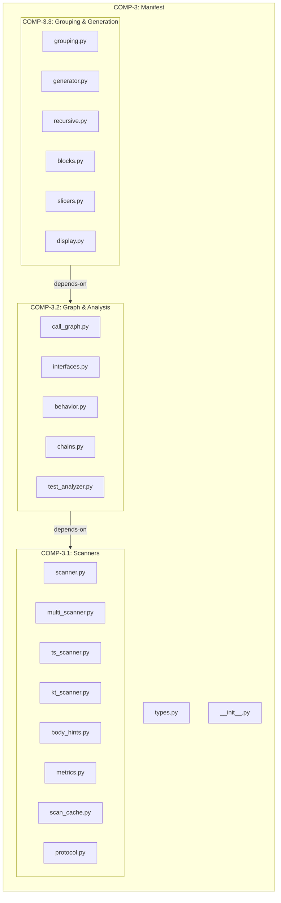
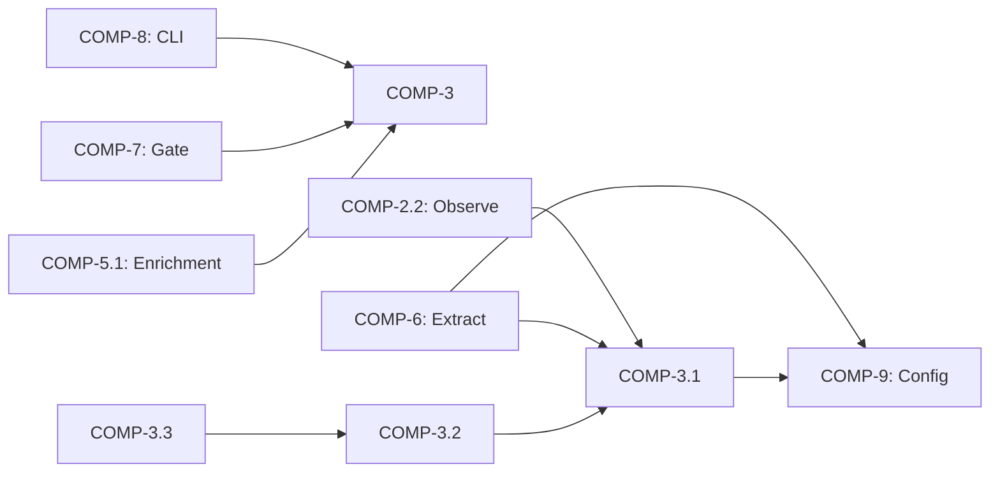

# Logical Architecture — Manifest Subsystem (COMP-3)

## Overview

The Manifest subsystem performs source code scanning via AST analysis, import resolution, and module grouping to produce a typed structural representation of a codebase. It supports Python, TypeScript, Kotlin, and Java, and serves as the primary fact-extraction layer for the Architecture Model Standard.

## Component Structure

All components reside in the **domain** layer and are contained within COMP-3.

| Component | Responsibility | Key Files |
|-----------|---------------|-----------|
| **COMP-3.1 Scanners** | Language-specific AST parsing, file discovery, metrics computation, scan caching | `scanner.py`, `multi_scanner.py`, `ts_scanner.py`, `kt_scanner.py`, `scan_cache.py`, `protocol.py` |
| **COMP-3.2 Graph & Analysis** | Import resolution into edges, call graph construction, behavioral extraction, interface derivation | `call_graph.py`, `interfaces.py`, `behavior.py`, `chains.py`, `test_analyzer.py` |
| **COMP-3.3 Grouping & Generation** | Multi-signal module grouping, manifest generation/caching, recursive per-block scanning | `grouping.py`, `generator.py`, `recursive.py`, `blocks.py`, `slicers.py` |

## Dependency Graph

**Internal flow:** Scanners produce `ModuleInfo` lists → Graph & Analysis resolves imports into `InterfaceEdge` and builds `CallGraph` → Grouping & Generation assembles the final `Manifest`.

**External consumers:** CLI (COMP-8) triggers generation, Gate (COMP-7) and Enrichment (COMP-5.1) read manifest output, Observe (COMP-2.2) and Extract (COMP-6) use scanners directly. Scanners depend on Config (COMP-9) for exclusion patterns.

## Interface Specification

| Interface | Exposed By | Type | Description |
|-----------|-----------|------|-------------|
| **IF-2** runner CLI | COMP-3 | internal | CLI entry point for manifest generation |
| **IF-4** Library API | COMP-3 | internal | 5 public symbols from `__init__.py` (e.g., `generate_manifest`, `scan_file`) |
| **IF-auto-COMP-3.1** Scanners API | COMP-3.1 | internal | `scan_file()`, `scan_all_languages()`, `ScanCache`, `compute_metrics()`, `SourceGraph`/`SourceUnit` protocol types |
| **IF-auto-COMP-3.2** Graph & Analysis API | COMP-3.2 | internal | `derive_interfaces()`, `build_call_graph()`, `extract_call_order()`, `extract_control_flow()`, `extract_guards()` |
| **IF-auto-COMP-3.3** Grouping & Generation API | COMP-3.3 | internal | `generate_manifest()`, `generate_block_manifest()`, `group_modules()`, `process_block()` |

## Key Data Types

All types are defined as typed dataclasses in `manifest/types.py` and related modules.

| Type | Module | Purpose |
|------|--------|---------|
| `Manifest` | `types.py` | Top-level output: modules, interfaces, metrics, functional blocks |
| `ModuleInfo` | `types.py` | Per-file scan result: functions, imports, classes, line count, `ModuleStatus` |
| `FunctionInfo` | `types.py` | Function name, signature, calls, docstring, raises, plus behavioral fields (`call_order`, `control_flow`, `guards`, `data_in`, `data_out`) |
| `ClassInfo` | `types.py` | Class with bases, methods, decorators, attributes, `method_details: list[FunctionInfo]` |
| `ImportDetail` | `types.py` | Structured import: module, symbols, `is_relative` |
| `InterfaceEdge` | `types.py` | Directed edge: `source` → `target` file with `import_path` |
| `CallGraph` / `FlowTrace` | `call_graph.py` | Resolved call edges and multi-hop flow traces with component crossing detection |
| `ModuleGroup` | `grouping.py` | Logical group: name, member file paths, `primary_file` |
| `BlockManifest` | `types.py` | Per-functional-block manifest with sub-functions |
| `RecursiveManifest` | `types.py` | Deep per-block scan linked to parent model via `component_id` |
| `ScanReport` | `types.py` | Bookkeeping: `files_attempted`, `blocks_processed` |
| `SourceGraph` / `SourceUnit` / `DependencyEdge` | `protocol.py` | Language-neutral protocol types for multi-language scanning |

## Requirements Traceability

| Requirement | Satisfied By | Mechanism |
|-------------|-------------|-----------|
| **REQ-8** Complete file scanning | COMP-3.1 | `scan_file()` + `collect_py_files()` recursively covers all non-trivial Python files |
| **REQ-9** Import edge resolution | COMP-3.2 | `derive_interfaces()` resolves dotted paths and relative imports to `InterfaceEdge` |
| **REQ-10** Multi-language scanning | COMP-3.1 | `scan_all_languages()` dispatches to Python/TypeScript/Kotlin/Java scanners |
| **REQ-19** Boundary coherence | COMP-3.3 | `group_modules()` uses directory, name-prefix, and import affinity signals |

## Design Decisions

1. **Typed dataclasses over raw dicts.** All pipeline functions accept and return typed objects (`ModuleInfo`, `Manifest`, etc.), enforced by the `types.py` contract: *"Every function in the manifest pipeline should accept and return typed objects, not raw dicts."*

2. **Regex fallback scanning.** When `ast.parse()` fails (syntax errors, encoding issues), `scanner.py` falls back to regex patterns (`_RE_CLASS`, `_RE_FUNC`, `_RE_IMPORT`) to extract partial structural facts rather than producing nothing.

3. **Scan caching.** `ScanCache` in COMP-3.1 avoids re-parsing unchanged files across incremental runs, instantiated per `generate_manifest()` invocation.

4. **Multi-signal grouping.** `group_modules()` combines three affinity signals — subdirectory structure, name-prefix patterns, and import density — with a trivial-file filter (`_is_trivial`) that excludes `__version__.py`, empty `__init__.py`, and vendored code.

5. **Language-neutral protocol.** `SourceGraph`/`SourceUnit`/`DependencyEdge` in `protocol.py` provide a common representation that `multi_scanner.py` merges across languages, even though cross-language edges are not resolved.

6. **Recursive per-block manifests.** `generate_block_manifest()` produces scoped `Manifest` instances per functional block, linked to the architecture model via `_block_id_to_component_id()`, enabling component-level drill-down.