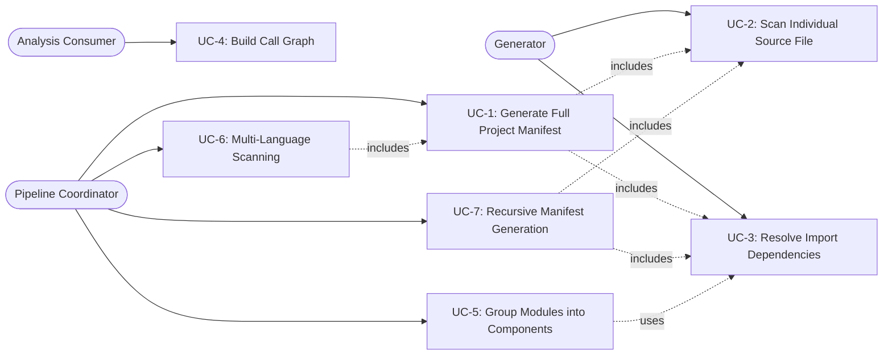

# Use Cases — Manifest Subsystem

## Use Case Diagram

---

## UC-1: Generate Full Project Manifest

| Field | Value |
|---|---|
| **Actor** | Pipeline Coordinator (COMP-2.2 Observe stage, COMP-8 CLI) |
| **Capability** | CAP-4 — Generate Reality Manifest |
| **Satisfies** | REQ-8 (complete file scanning), REQ-9 (import edge resolution) |

**Preconditions**
- `project_root` is a valid directory containing source files.
- `.architecture-model.yaml` config is loadable (or passed explicitly).

**Main Flow**
1. Actor invokes `generate_manifest(project_root, config)` in `generator.py`.
2. If `config` is `None`, `get_config(root)` loads project configuration (COMP-9 dependency).
3. `compute_metrics(root, config)` produces a `MetricsResult` with project-level statistics.
4. `config.source_block_dict` is read to enumerate functional blocks.
5. For each block, `process_block(root, block_id, block_def, sub_block_configs)` is called, which internally triggers **UC-2** for each file.
6. `derive_interfaces(modules, root)` resolves import edges (**UC-3**).
7. A `Manifest` dataclass is assembled with `modules`, `interfaces`, `metrics_result`, and `functional_blocks`.
8. The `@monitored` decorator logs `module_count` and `parse_failures`.

**Postconditions**
- Returns a typed `Manifest` object. Consumers call `.to_dict()` for serialization.
- `ScanReport` tracks `files_attempted` and `blocks_processed`.

**Error Handling**
- Individual file parse failures are counted (`ModuleStatus.MISSING`) but do not abort generation.
- Config load failures propagate as exceptions.

---

## UC-2: Scan Individual Source File

| Field | Value |
|---|---|
| **Actor** | Generator (internal to COMP-3.1 Scanners) |
| **Satisfies** | REQ-8, REQ-10 |

**Preconditions**
- `filepath` exists and is a supported source file (`.py`).
- `root` path is provided for relative path computation.

**Main Flow**
1. `scan_file(root, filepath)` is called from `scanner.py`.
2. `_parse_file_ast(filepath)` reads the file and calls `ast.parse()`.
3. AST visitors extract:
   - `FunctionInfo` objects (name, signature, calls, docstring, raises).
   - `ClassInfo` objects (name, bases, methods, decorators, attributes, `method_details`).
   - `ImportDetail` entries (module, symbols, `is_relative`).
   - `DecoratedFunction` entries for non-trivial decorators.
4. `extract_call_order()`, `extract_control_flow()`, and `extract_guards()` from `behavior.py` populate behavioral fields on each `FunctionInfo`.
5. Line count determines `ModuleStatus` (ACTIVE / DORMANT / MISSING).
6. A `ModuleInfo` is returned with all extracted metadata.

**Postconditions**
- A fully populated `ModuleInfo` dataclass with typed fields.

**Error Handling**
- `SyntaxError`, `UnicodeDecodeError`, `OSError` in `_parse_file_ast()` → logs warning, returns `None`.
- Regex fallback scanners (`_RE_CLASS`, `_RE_FUNC`, `_RE_IMPORT`) extract partial data when AST parsing fails.

---

## UC-3: Resolve Import Dependencies

| Field | Value |
|---|---|
| **Actor** | Generator (COMP-3.2 Graph & Analysis) |
| **Satisfies** | REQ-9 — all resolvable imports produce edges |

**Preconditions**
- A list of `ModuleInfo` objects from scanning is available.
- `root` path for relative import resolution.

**Main Flow**
1. `derive_interfaces(modules, root)` is called from `interfaces.py`.
2. A `file_to_module` map is built: file path → dotted module name (e.g., `src/foo/bar.py` → `src.foo.bar`).
3. The inverse `module_to_file` map is constructed.
4. For each `ModuleInfo`, simple imports are matched against known modules (Pass 1).
5. `_resolve_dotted(dotted)` handles prefix stripping (`src/`), `__init__` package resolution, and direct slash-based matching.
6. Deduplication via `seen: set[tuple[str, str]]` prevents duplicate edges.
7. Each resolved dependency produces an `InterfaceEdge(source, target, import_path)`.

**Postconditions**
- Returns `list[InterfaceEdge]` representing all inter-module dependencies.

**Error Handling**
- Unresolvable imports (external packages) are silently skipped — no edge created.

---

## UC-4: Build Call Graph

| Field | Value |
|---|---|
| **Actor** | Analysis Consumer (COMP-5.1 Enrichment, COMP-6 Extract) |

**Preconditions**
- A `Manifest` object with populated `modules` and `FunctionInfo.calls`.

**Main Flow**
1. `build_call_graph(manifest)` in `call_graph.py` is invoked.
2. All functions are indexed by qualified name (`file:func_name`) into `CallGraph.functions`.
3. A `mod_path_to_file` map is built from `ModuleInfo.file` paths (stripping `.py`, handling `__init__`).
4. For each module, imports are parsed to determine `imported_files`.
5. Edges are resolved: each call in `FunctionInfo.calls` is matched against functions in imported modules.
6. The resulting `CallGraph` contains `edges: dict[str, list[str]]`, `functions`, and `locations`.
7. Consumer calls `trace_flow()` with an entry point to produce a `FlowTrace` (BFS via `deque`), yielding `steps`, `components_crossed`, and `depth`.

**Postconditions**
- `CallGraph` with resolved edges. `FlowTrace` includes `truncated: bool` for depth-limited traces.

**Error Handling**
- Ambiguous function names (multiple modules) are resolved to all candidates in `name_index`.

---

## UC-5: Group Modules into Components

| Field | Value |
|---|---|
| **Actor** | Pipeline Coordinator (allocate stage) |
| **Satisfies** | REQ-19 — boundary coherence > 70% intra-component imports |

**Preconditions**
- `list[ModuleInfo]` and `list[InterfaceEdge]` from UC-2/UC-3.
- Optional `target_groups` and `min_group_size` parameters.

**Main Flow**
1. `group_modules(modules, interfaces, target_groups, min_group_size)` in `grouping.py` is called.
2. Trivial files are filtered via `_is_trivial(mod)`: `__version__.py`, empty `__init__.py`, vendored code, modules with zero functions/classes.
3. **Signal 1 — Subdirectory affinity**: files in the same directory are grouped.
4. **Signal 2 — Name-prefix affinity**: underscore-prefixed files in the same directory cluster together.
5. **Signal 3 — Import affinity**: `InterfaceEdge` data identifies high mutual-import pairs.
6. Groups are assembled as `ModuleGroup(name, modules, primary_file)` where `primary_file` is the largest by `line_count`.

**Postconditions**
- Returns `list[ModuleGroup]`. Each group maps to a potential `Component`.

**Error Handling**
- If all modules are trivial, returns an empty list.
- `min_group_size` prevents degenerate single-file groups when not desired.

---

## UC-6: Multi-Language Scanning

| Field | Value |
|---|---|
| **Actor** | Pipeline Coordinator |
| **Satisfies** | REQ-10 — Python, TypeScript, Kotlin support |

**Preconditions**
- Repository root contains source files in one or more supported languages.

**Main Flow**
1. `scan_all_languages(root)` in `multi_scanner.py` is invoked.
2. Language detection by file extension:
   - `.py` → calls `generate_manifest(root)` then `SourceGraph.from_manifest()` (UC-1).
   - `.kt` → calls `scan_kotlin(kt_root)` from `kt_scanner.py` (tree-sitter based).
   - `.java` → calls `scan_java(java_root)` from `kt_scanner.py`.
   - `.ts`/`.tsx` → calls `scan_typescript_fallback(root)` from `ts_scanner.py` (regex-based).
3. JVM files in `_JVM_EXCLUDE` directories (`build`, `.gradle`, `generated`, etc.) are filtered.
4. `_find_jvm_source_root()` locates the appropriate source root for Kotlin/Java.
5. `_merge_graphs(graphs)` combines all `SourceGraph` instances into a unified graph.

**Postconditions**
- Returns a merged `SourceGraph` with `SourceUnit` and `DependencyEdge` entries across all languages.
- Cross-language edges are **not** resolved.

**Error Handling**
- `ImportError` for tree-sitter → Kotlin/Java scanning silently skipped.
- Any scanner exception → that language is skipped, others proceed.

---

## UC-7: Recursive Manifest Generation

| Field | Value |
|---|---|
| **Actor** | Pipeline Coordinator (decompose stage) |
| **Component** | COMP-3.3 Grouping & Generation |

**Preconditions**
- An `ArchitectureModel` or config with `functional_blocks` defined.
- Each block specifies `dirs` and/or `files`.

**Main Flow**
1. `generate_block_manifest(root, block_id, block_def)` in `recursive.py` is called per F-block.
2. Files are collected from `block_def["dirs"]` via `collect_py_files(dir_path)` and `block_def["files"]`.
3. Deduplication by resolved path ensures no file is scanned twice.
4. Each file is scanned via `scan_file(root, filepath)` (UC-2), populating `modules`.
5. `derive_interfaces(modules, root)` resolves intra-block import edges (UC-3).
6. `_block_id_to_component_id(block_id, config, model)` maps the block to a `Component.id` — preferring model lookup over naming convention.
7. A `RecursiveManifest` is assembled, linked to its parent model via `component_id`.

**Postconditions**
- Returns a `Manifest` (or `RecursiveManifest`) scoped to the block's files with full function-level detail.
- `ScanReport.files_attempted` reflects the block's file count.

**Error Handling**
- Missing directories are silently skipped (`if dir_path.is_dir()`).
- Missing files are skipped (`if fp.is_file()`).
- Individual scan failures are handled per UC-2 error handling.