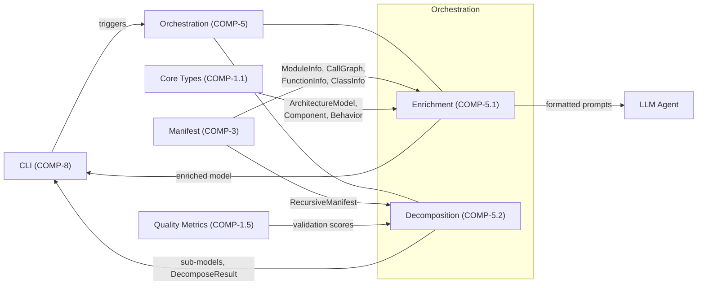
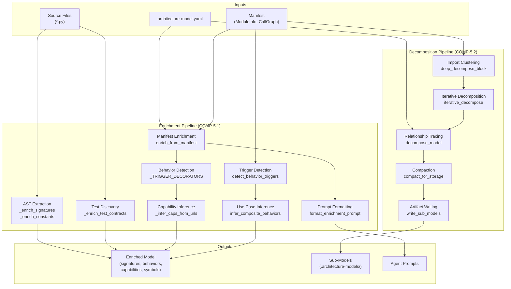

# Concept of Operations: Orchestration Subsystem

## 1. System Overview

### Intent

The Orchestration subsystem exists because raw architecture models are hollow shells — they declare components exist but say nothing about what those components actually contain, how they relate at a code level, or how they decompose into manageable units. Without Orchestration, an architecture model is a manually-maintained lie that drifts from reality with every commit.

Orchestration solves two fundamental problems:

1. **Enrichment**: Automatically populating architecture models with ground-truth data extracted from source code — function signatures, constants, test contracts, behaviors, capabilities, and patterns. This transforms a model from a declaration of intent into a verified reflection of implementation.

2. **Decomposition**: Breaking coarse-grained models into hierarchical sub-models that match actual code structure, using import-graph clustering rather than human intuition. This makes large systems navigable without requiring architects to manually trace every dependency.

The subsystem is the bridge between static analysis (manifests, AST scanning) and the semantic architecture model. It consumes raw code intelligence and produces enriched, structured models.

### Philosophy

The design prioritizes **automated accuracy over manual curation**. Every field that can be derived from code should be — human input is reserved for intent and rationale that code cannot express. The subsystem is intentionally pipeline-shaped: each stage transforms the model incrementally, and stages compose without tight coupling.

## 2. Stakeholders & Actors

| Actor | Type | Goal |
|---|---|---|
| **CLI (COMP-8)** | Internal component | Trigger enrichment/decomposition workflows on user command. Needs deterministic, idempotent operations. |
| **Architecture Model (COMP-1.1)** | Internal dependency | Provides core types (`ArchitectureModel`, `Component`, `Behavior`, etc.) that Orchestration populates. |
| **Manifest subsystem (COMP-3)** | Internal dependency | Supplies AST-extracted module data (`Manifest`, `ModuleInfo`, `CallGraph`) that Orchestration consumes as ground truth. |
| **Quality Metrics (COMP-1.5)** | Internal dependency | Provides quality scoring used by Decomposition to validate output coherence. |
| **Human architect** | External user | Wants a model that reflects reality without manually inspecting every source file. Needs decomposition that matches their mental model of system structure. |
| **LLM agents** | External consumer | Consume formatted prompts (`format_enrichment_prompt`, `format_naming_context`) to provide semantic annotations that code analysis alone cannot infer. |

## 3. Operational Scenarios

### Scenario 1: First-Time Model Enrichment from Source

**Intent**: A team has a skeleton `.architecture-model.yaml` with component IDs and file lists but no signatures, constants, or test contracts. They want the model to reflect what the code actually contains.

1. CLI invokes `enrich_model(model, project_root)` via COMP-8.
2. `enrich_model` iterates ACTIVE components, skipping those without files.
3. For each component, `_enrich_signatures` calls `extract_file_hints` (from manifest) to parse AST and extract public function signatures, deduplicating against existing entries.
4. `_enrich_constants` parses module-level assignments via `ast.parse`.
5. `_enrich_test_contracts` discovers and analyzes matching test files.
6. The enriched `ArchitectureModel` is returned with populated `signatures`, `constants`, and `test_contracts` on each component.

**What would break without it**: Models would contain only hand-written descriptions. Signature drift would be invisible. Test coverage gaps would go undetected.

### Scenario 2: Manifest-Driven Deep Enrichment

**Intent**: After manifest generation, leverage richer data (class hierarchies, decorators, call graphs) to populate symbols, behaviors, patterns, and responsibilities — going beyond what simple AST scanning provides.

1. CLI triggers `enrich_from_manifest(model, manifest)`.
2. For each component, files are matched to `ModuleInfo` entries in the manifest.
3. Functions become `FunctionSignature` objects via `_parse_signature`; classes become `Symbol` objects via `_class_to_symbol` with kind detection (dataclass, protocol, enum, etc.).
4. `enrich_behaviors_from_manifest` detects trigger decorators (routes, event handlers) via `_TRIGGER_DECORATORS` regex and creates `Behavior` entities.
5. `detect_behavior_triggers` traces the call graph to find inter-behavior trigger relationships.
6. `infer_capabilities` groups behaviors by URL prefix into `Capability` entities.
7. `infer_composite_behaviors` finds trigger chains ≥2 long and creates `UC-*` composite behaviors.

### Scenario 3: Hierarchical Model Decomposition

**Intent**: A monolithic model with 50+ components is too large to reason about. The architect wants per-subsystem sub-models that preserve relationship fidelity.

1. CLI invokes `run_pipeline(project_root, deep=True)`.
2. `generate_recursive_manifests` scans each functional block's directories.
3. `decompose_model` traces relationships outward from each block's components — `realizes` → Capabilities, `exposes` → Interfaces, `traces-to` → Behaviors — producing faithful model slices.
4. `deep_decompose_block` clusters modules by import-graph affinity via `cluster_modules`, producing `SubComponent` objects with file/class/function inventories.
5. `iterative_decompose` recurses: clusters above `max_modules` are re-decomposed.
6. `write_sub_models` persists each sub-model to `.architecture-models/<block_id>/`.
7. If `compact=True`, `compact_for_storage` offloads leaf behaviors into summary groups, keeping use cases and structurally-referenced behaviors inline.

### Scenario 4: Agent-Assisted Pattern Classification

**Intent**: Code analysis can identify structure but not architectural intent. An LLM agent needs compact, structured context to classify each component's pattern and write contracts.

1. After decomposition produces `DecomposeResult` objects, `format_enrichment_prompt` is called.
2. It loads the pattern catalog, formats each leaf component's files/classes/functions, and emits structured instructions requesting YAML annotations.
3. `format_naming_context` separately formats cluster data for semantic naming — showing file stems, top classes, and inter-cluster import counts.
4. Agent responses are parsed back into model annotations.

**Trade-off**: Formatting is optimized for token efficiency (stems, truncation at 5 files / 6 classes / 4 functions) because LLM context windows are finite and costly. This trades completeness for practical usability.

## 4. System Context

**Why these dependencies**:
- **Manifest (COMP-3)**: Enrichment cannot infer signatures or behaviors without AST-extracted data. The manifest is the single source of code truth.
- **Core Types (COMP-1.1)**: Orchestration's entire purpose is populating these types. Without them, there's nothing to enrich.
- **Quality Metrics (COMP-1.5)**: Decomposition needs feedback on whether its clustering produces coherent sub-models. Without quality checks, decomposition could produce arbitrary groupings.

## 5. Operational Constraints

| Constraint | Threshold | Rationale | Failure Mode |
|---|---|---|---|
| **Behavior cap per component** (REQ-18) | ≤ 40 behaviors | Without a cap, REST-heavy components generate hundreds of behaviors from route decorators, creating "orphan explosion" — behaviors with no meaningful relationships that bloat the model and overwhelm consumers. 40 was chosen as the point where CRUD grouping and summarization remain tractable. | **Graceful**: excess behaviors are filtered/summarized, not lost. `compact_for_storage` offloads them to per-component groups. |
| **Decomposition minimum cluster size** | `min_cluster_size=3` | Clusters smaller than 3 modules lack sufficient internal cohesion to justify separate sub-component status. Single-file clusters are noise. | **Graceful**: small clusters merge into nearest neighbor. |
| **Decomposition module threshold** | `max_modules=15` | Blocks with fewer than 15 modules are already comprehensible; decomposing them produces trivial 1-2 file clusters. | **Graceful**: returns empty `sub_components`, block stays monolithic. |
| **Call graph trace depth** | `max_depth=4` | Deeper traces produce false trigger relationships through utility functions. 4 hops captures direct behavioral chains without transitivity pollution. | **Hard boundary**: relationships beyond depth 4 are invisible. |
| **Idempotency** | Enrichment deduplicates by name | Re-running enrichment must not create duplicate signatures/constants. `existing_names` sets in `_enrich_signatures` and `_enrich_constants` enforce this. | **Silent**: duplicates are dropped. |

## 6. Data Flow

## 7. Measures of Effectiveness

| MoE | What "good" looks like | What "bad" looks like | How to measure |
|---|---|---|---|
| **Enrichment coverage** | >90% of ACTIVE components have ≥1 signature and ≥1 constant populated | Components remain empty despite having source files | `component_count` metric from `@monitored` on `enrich_model`; ratio of components with non-empty `signatures` |
| **Signature accuracy** | Every enriched signature matches the actual function in source | Stale signatures from deleted functions persist | Delta between enriched signatures and fresh AST parse |
| **Decomposition coherence** | Sub-components correspond to recognizable code domains; internal import edges >> cross-cluster edges | Random-seeming groupings that split tightly-coupled modules | `avg_cluster_size` from `deep_decompose_block` monitoring; ratio of internal to external import edges per cluster |
| **Behavior signal-to-noise** | Cross-component behaviors surface meaningful flows; CRUD groups are summarized, not enumerated | 200 behaviors per component, most trivial single-step CRUD | Behavior count per component (target: ≤40 per REQ-18); ratio of `cross_component` to `trivial` in `BehaviorClassification` |
| **Prompt token efficiency** | Agent prompts fit within context window with room for response; token estimate tracked via `@monitored` | Prompts exceed context limits, truncating critical information | `token_estimate` and `char_count` from `format_enrichment_prompt` monitoring |
| **Pipeline idempotency** | Running the pipeline twice produces identical output | Second run creates duplicates or changes ordering | Diff of output artifacts across consecutive runs |
| **Compaction ratio** | Compacted models retain all use cases and structurally-referenced behaviors while reducing total behavior count by >50% | Compaction drops behaviors that other entities reference via `triggers` or `traces-to` | `len(kept_behaviors) / len(original_behaviors)`; zero dangling relationship references post-compaction |

### Value Functions

- **Enrichment coverage** has diminishing returns above 95% — the last 5% are typically `__init__.py` files and configuration modules with no meaningful signatures. Effort to reach 100% is not justified.
- **Decomposition coherence** has increasing value as cluster count approaches `target_k` (default 5). Too few clusters (1-2) means no decomposition occurred; too many (>10) means over-fragmentation where every file is its own component.
- **Behavior cap (40)** is a knee in the value curve: below 40, each additional behavior adds information; above 40, each additional behavior adds noise faster than signal, degrading model readability and agent prompt quality.