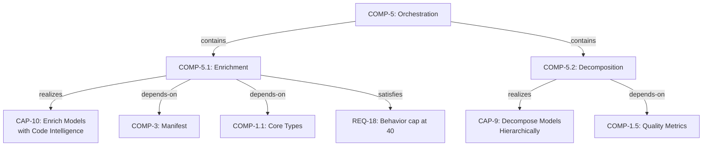
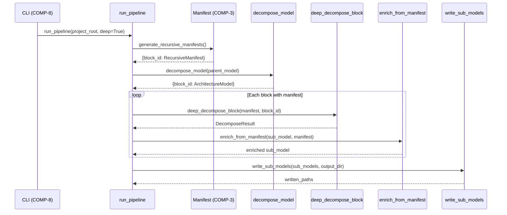
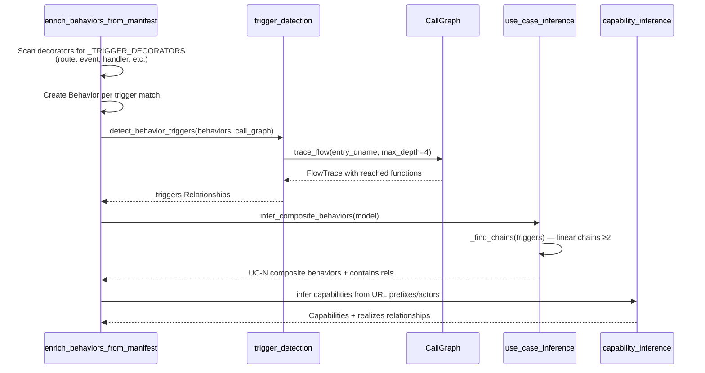
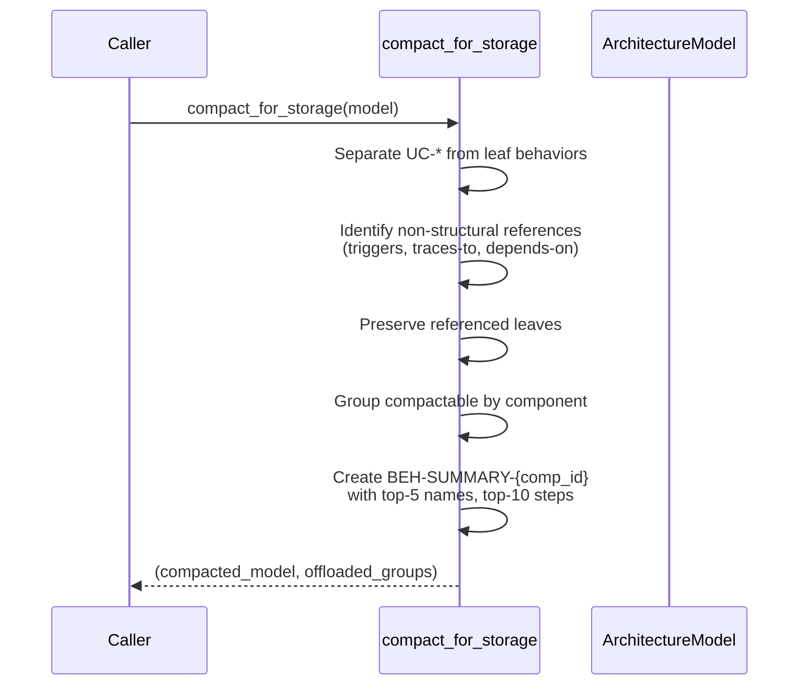

# Functional Analysis: Orchestration Subsystem

## 1. Intent & Purpose

The Orchestration subsystem exists because **an architecture model without grounding in actual source code is fiction**. Raw YAML models capture intent but drift from reality. Orchestration bridges this gap by automatically enriching models with code-derived facts (signatures, constants, test contracts, behaviors) and decomposing coarse models into navigable hierarchies.

Without this subsystem, architecture models would require manual maintenance — a process that fails at scale and guarantees staleness.

## 2. Capability Inventory

### CAP-10: Enrich Models with Code Intelligence

**Intent:** Eliminate the gap between what the model *claims* and what the code *does*. A component listing files but lacking signatures or test contracts is an unverifiable assertion.

**Goal (optimal):** Every active component has complete signatures, constants, test contracts, detected patterns, inferred capabilities, and behavior trigger chains — all derived automatically from source, not manually authored.

**Sub-capabilities:**

| Sub-capability | Realized By | Intent |
|---|---|---|
| AST-based signature extraction | `enrich.py::_enrich_signatures` | Populate function signatures from actual source AST so the model reflects real APIs |
| Constant extraction | `enrich.py::_enrich_constants` | Capture module-level constants that define system configuration boundaries |
| Test contract discovery | `enrich.py::_enrich_test_contracts` | Link components to their test files, making testability visible in the model |
| Manifest-driven enrichment | `auto_enrich.py::enrich_from_manifest` | Use pre-scanned manifest data (richer than raw AST) for bulk enrichment of signatures, symbols, patterns |
| Behavior enrichment | `auto_enrich.py::enrich_behaviors_from_manifest` | Detect behaviors (HTTP routes, event handlers) from decorator/trigger patterns |
| Capability inference | `capability_inference.py` | Group behaviors by URL prefix/actor into user-facing capabilities automatically |
| Trigger detection | `trigger_detection.py` | Discover behavior-to-behavior trigger chains via call graph traversal |
| Use case inference | `use_case_inference.py` | Compose trigger chains into end-to-end use cases (composite behaviors) |
| Pattern classification context | `enrichment_context.py::format_enrichment_prompt` | Generate compact prompts for agent-assisted pattern/contract annotation |

### CAP-9: Decompose Models Hierarchically

**Intent:** A flat list of 50+ components is unusable. Hierarchical decomposition makes architecture navigable — each level reveals appropriate detail for its audience.

**Goal (optimal):** Every coarse block decomposes into cohesive sub-components clustered by import affinity, with internal relationships preserved, producing self-contained sub-models that can be reasoned about independently.

**Sub-capabilities:**

| Sub-capability | Realized By | Intent |
|---|---|---|
| Relationship-traced sub-models | `decompose.py::decompose_model` | Slice parent model into per-block sub-models by tracing relationship graphs outward from block components |
| Import-graph clustering | `deep_decompose.py::deep_decompose_block` | Cluster modules into sub-components using import affinity, producing meaningful groupings |
| Iterative deep decomposition | `deep_decompose.py::iterative_decompose` | Recursively decompose blocks that are still too large |
| Behavior flow classification | `behavior_flows.py::classify_behaviors` | Separate cross-component flows (architecturally significant) from single-component CRUD (noise) |
| Behavior step structuring | `behavior_decompose.py::decompose_behavior` | Promote raw step names into structured `Step` objects with component references |
| Model compaction | `compaction.py::compact_for_storage` | Offload leaf behaviors to per-component summaries, keeping models readable |
| Unified pipeline | `pipeline.py::run_pipeline` | Single entry point chaining manifest generation → decomposition → artifact writing |

## 3. Functional Decomposition

### Capability-Component Mapping Rationale

**COMP-5.1 → CAP-10:** Enrichment is separated from decomposition because enrichment is *additive* (populates fields on existing components) while decomposition is *structural* (creates new components/relationships). They have different failure modes: enrichment failure leaves gaps; decomposition failure produces wrong architecture. Separating them allows enrichment to run independently and incrementally.

**COMP-5.2 → CAP-9:** Decomposition requires graph algorithms (clustering, chain detection, flow tracing) that are fundamentally different from AST parsing. The dependency on quality metrics (`COMP-1.5`) is unique to decomposition — enrichment doesn't need to evaluate decomposition quality.

## 4. Behavioral Flows

### Flow 1: Full Pipeline Execution (Primary Use Case)

**Intent:** Transform a bare YAML model + source code into a fully enriched, hierarchically decomposed architecture with per-block sub-models written to disk. This is the "make it all work" entry point invoked by CLI.

### Flow 2: Behavior Discovery and Composition

**Intent:** Automatically discover what the system *does* (behaviors) from code patterns, then compose individual behaviors into end-to-end use cases. This transforms raw code into architecturally meaningful sequences without human annotation.

### Flow 3: Model Compaction

**Intent:** Prevent model bloat. A component with 30 CRUD behaviors adds noise without insight. Compaction preserves architecturally significant behaviors (cross-component, trigger-linked) while summarizing the rest, keeping models human-readable.

## 5. Requirements Satisfaction

### REQ-18: Behavior Filtering Cap (Maximum 40 per component)

**Requirement:** "Maximum 40 behaviors per component to prevent orphan explosion"

**Rationale:** Without a cap, a single REST controller with 80 endpoints generates 80 behaviors, each spawning capability-inference entries, trigger-detection traces, and relationship edges. This causes:
- **Combinatorial explosion** in trigger detection (`O(n²)` pairwise checks via call graph)
- **Model illegibility** — 80 behaviors drowns the signal of cross-component flows
- **Orphan proliferation** — behaviors that connect to nothing useful but inflate entity counts

**Why 40?** Empirically, components with >40 behaviors are almost always CRUD-heavy REST controllers where individual endpoint behaviors add no architectural insight. The value function is roughly: insight peaks around 15-20 behaviors, plateaus to 30, and actively degrades past 40 due to noise.

**Satisfaction:** `COMP-5.1` (Enrichment) applies this cap during `enrich_behaviors_from_manifest`. Behaviors beyond the cap are either summarized via compaction or filtered during classification in `behavior_flows.py::classify_behaviors`.

**Consequence of violation:** Trigger detection becomes slow, capability inference produces dozens of near-identical capabilities ("User Management", "User Operations", "User Queries"), and the model becomes unusable without manual curation — defeating the purpose of automation.

## 6. Trade-offs & Design Decisions

### Decision: Separate Enrichment from Decomposition

**Considered:** Unified pass that decomposes and enriches simultaneously.
**Chosen:** Separate components with independent entry points.
**Why:** Enrichment is idempotent and incremental (re-running adds missing data). Decomposition is structural and destructive (re-running may change component boundaries). Users need to enrich without decomposing (e.g., updating signatures after code changes) and decompose without re-enriching.
**If constraints changed:** If enrichment depended on decomposition results (e.g., enrichment needed sub-component boundaries), merging would be justified.

### Decision: Import-Graph Clustering for Decomposition

**Considered:** Directory-based grouping, class-hierarchy grouping, semantic similarity.
**Chosen:** Import-graph affinity via `cluster_modules` (spectral/community detection on import edges).
**Why:** Imports are the strongest signal of coupling in Python. Directory structure reflects organizational choices, not runtime dependencies. Import clustering produces sub-components that minimize cross-cluster dependencies, which is the definition of good modular decomposition.
**Trade-off:** Misses runtime coupling (e.g., shared database tables, message queues). Accepted because static analysis is fast and deterministic.

### Decision: Call-Graph Trigger Detection with max_depth=4

**Considered:** Unlimited depth, AST-only (no call graph), manual annotation.
**Why 4?** Balances discovery (most meaningful trigger chains are 2-3 hops) against false positives (at depth 8+, nearly everything connects to everything via utility functions). Value function: discovery rate increases sharply from depth 1→3, plateaus at 4, false positive rate accelerates past 5.

### Decision: Compaction via Summary Behaviors

**Considered:** Simply deleting low-value behaviors, collapsing into component metadata.
**Chosen:** `BEH-SUMMARY-{comp_id}` entities that preserve top-N names as steps.
**Why:** Deletion loses information permanently. Summary behaviors maintain traceability (the offloaded groups are returned separately) while keeping the primary model navigable.

## 7. Measures of Effectiveness

| Capability | MoE | Minimum | Optimal | Measurement |
|---|---|---|---|---|
| Signature Extraction | % of public functions captured | 80% | >95% | Compare `comp.signatures` count to actual public functions in `comp.files` |
| Test Contract Discovery | % of components with tests linked | 70% | >90% | Components with non-empty `test_contracts` / active components with test files |
| Behavior Detection | Precision of trigger-decorated functions identified | >85% precision | >95% precision, <5% false positives | Manual audit sample |
| Capability Inference | Capabilities map to user-recognizable features | No nonsense capabilities | 1:1 with actual product features | Review against product documentation |
| Decomposition Cohesion | Intra-cluster import density vs inter-cluster | Ratio > 2:1 | Ratio > 5:1 | `InternalRelationship.edge_count` analysis |
| Behavior Cap Compliance | No component exceeds 40 behaviors | 100% compliance | N/A (hard constraint) | Post-enrichment audit |
| Compaction Ratio | Behavior count reduction in root model | >50% reduction for CRUD-heavy models | >70% with zero loss of cross-component flows | `len(compacted.behaviors) / len(original.behaviors)` |
| Pipeline Completion | End-to-end success rate | >90% of blocks produce artifacts | 100% with graceful degradation for unparseable files | `PipelineResult.errors` count |

### Failure Modes

| Component | Failure Mode | Impact | Graceful? |
|---|---|---|---|
| `enrich.py` | Source file not found / parse error | Component lacks signatures — model incomplete but valid | Yes — logs warning, skips file |
| `auto_enrich.py` | Manifest missing modules | No behaviors/symbols detected — model is a skeleton | Yes — returns model unchanged |
| `deep_decompose.py` | Too few modules (< `max_modules`) | Block not decomposed — remains monolithic | Yes — returns empty `DecomposeResult` |
| `trigger_detection.py` | Call graph incomplete | Missing trigger edges — use cases not inferred | Yes — partial chains still detected |
| `capability_inference.py` | No URL prefixes or actors | Falls back to "Internal Operations" catch-all | Yes — degraded but functional |
| `compaction.py` | All behaviors have non-structural references | Nothing compacted — model stays large | Yes — returns original model unchanged |
| `pipeline.py` | Parent model file missing | **Hard failure** — cannot proceed without root model (unless `from_scratch=True`) | Partial — `from_scratch` bootstraps a minimal model |