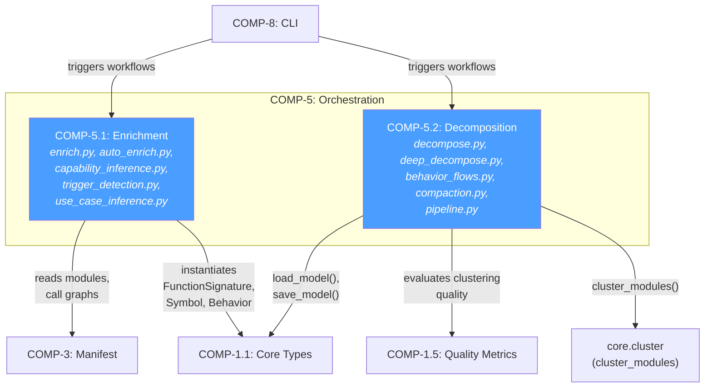

# Logical Architecture: Orchestration Subsystem

## 1. Intent & Purpose

The Orchestration subsystem exists because architecture models cannot be manually kept in sync with evolving codebases. It automates two fundamental transformations: **enrichment** (populating models with intelligence extracted from source code) and **decomposition** (breaking coarse models into hierarchical sub-models). Without this subsystem, architecture models would drift from reality within days of code changes, becoming fiction rather than documentation.

The philosophical design choice is **AST-first, not LLM-first**: enrichment derives facts (signatures, constants, test contracts) from deterministic code analysis, reserving agent/LLM involvement only for semantic classification (pattern matching, naming). This makes the system reproducible and auditable.

## 2. Component Structure

### COMP-5: Orchestration (Container)

**Intent**: Provide a single import surface for all orchestration workflows. This boundary exists to decouple CLI and external consumers from the internal split between enrichment and decomposition concerns.

**Layer**: Application — it coordinates domain operations (core types, clustering, manifests) into user-facing workflows. It sits above domain logic but below CLI/presentation.

**Files**: `src/architecture_model/orchestration/__init__.py`

**Responsibilities**: Re-export public API (`enrich_model`, `decompose_model`, `iterative_decompose`, `enrich_from_manifest`, etc.). No logic lives here.

---

### COMP-5.1: Enrichment

**Intent**: Bridge the gap between raw architecture models (which only declare component boundaries) and rich models (which carry function signatures, constants, test contracts, symbols, behaviors, and patterns). This component exists because a model without code intelligence is just a box-and-arrow diagram — it can't answer "what does this component actually do?"

**Layer**: Application — orchestrates calls to manifest scanning (COMP-3) and populates core types (COMP-1.1).

**Files & Responsibilities**:

| File | Responsibility | Why It's Separate |
|---|---|---|
| `enrich.py` | AST-based enrichment: signatures, constants, test contracts directly from source files | Pure deterministic extraction, no manifest dependency |
| `auto_enrich.py` | Manifest-based enrichment: signatures, symbols, constants, behaviors, patterns from pre-scanned manifest data | Richer data source (manifest includes call graphs, class hierarchies) |
| `enrichment_context.py` | Format decomposition results as prompts for agent-based pattern/contract annotation | Separates prompt engineering from data extraction |
| `capability_inference.py` | Infer `Capability` entities from behavior trigger patterns (URL prefixes, actors) | Automates capability discovery instead of manual authoring |
| `trigger_detection.py` | Detect behavior-to-behavior trigger relationships via call graph traversal | Discovers runtime coupling invisible in static imports |
| `use_case_inference.py` | Compose linear trigger chains into composite behaviors (use cases) | Elevates implementation-level behaviors to user-facing workflows |
| `naming_context.py` | Format decomposition clusters for agent-based semantic naming | Separates naming concerns from clustering logic |

---

### COMP-5.2: Decomposition

**Intent**: A monolithic architecture model becomes unwieldy beyond ~10 components. Decomposition enables hierarchical drill-down by producing per-block sub-models that preserve relationship fidelity to the parent. Without this, teams working on different subsystems must navigate one massive model.

**Layer**: Application — coordinates manifest scanning, clustering algorithms (COMP-1.5/core.cluster), and model I/O.

**Files & Responsibilities**:

| File | Responsibility | Why It's Separate |
|---|---|---|
| `decompose.py` | Relationship-tracing decomposition: slice parent model per functional block | Produces faithful sub-models by following `realizes`, `exposes`, `traces-to` edges |
| `deep_decompose.py` | Import-graph clustering: split a block's modules into sub-components | Uses `cluster_modules` for affinity-based grouping — distinct algorithm from relationship tracing |
| `behavior_decompose.py` | Promote raw step names to structured `Step` objects with component refs | Bridges unstructured behavior data to typed architecture entities |
| `behavior_flows.py` | Classify behaviors (cross-component vs CRUD vs trivial), trace through call graph | Enables intelligent filtering — only cross-component behaviors merit detailed modeling |
| `compaction.py` | Offload leaf behaviors to per-component summaries for storage efficiency | Prevents behavior explosion (addresses REQ-18 indirectly) |
| `pipeline.py` | End-to-end pipeline: manifest → decompose → enrich → write | Single entry point eliminates manual step orchestration |

## 3. Dependency Graph

### Why Each Dependency Exists

| Dependency | Why | What Breaks Without It |
|---|---|---|
| COMP-5.1 → COMP-3 (Manifest) | Enrichment reads scanned module data (functions, classes, imports, call graphs) | No signatures, symbols, or behaviors can be auto-populated; models stay empty shells |
| COMP-5.1 → COMP-1.1 (Core Types) | Enrichment instantiates `FunctionSignature`, `Constant`, `Symbol`, `Behavior`, `Capability` | Cannot produce typed model entities; would need raw dicts, losing validation |
| COMP-5.2 → COMP-1.5 (Quality Metrics) | Decomposition uses clustering quality metrics to evaluate sub-component groupings | Clustering runs blind — no way to assess if decomposition is meaningful |
| COMP-8 → COMP-5 (CLI → Orchestration) | CLI commands trigger enrichment and decomposition workflows | No user-facing entry point; orchestration becomes library-only |

## 4. Interface Specification

### IF-auto-COMP-5: Orchestration API

**Contract**: Stable import surface for all orchestration workflows. Consumers import from `architecture_model.orchestration` and get `enrich_model`, `decompose_model`, `iterative_decompose`, `enrich_from_manifest`, `enrich_behaviors_from_manifest`, `enrich_with_block_context`, `format_enrichment_prompt`.

**Why internal**: Only consumed by CLI (COMP-8) and tests within the same process.

### IF-auto-COMP-5.1: Enrichment API

**Key functions**:

| Function | Signature | Contract |
|---|---|---|
| `enrich_model` | `(model: ArchitectureModel, project_root: Path) -> ArchitectureModel` | Idempotent: skips existing signatures/constants by name. Only processes ACTIVE components with files. |
| `enrich_from_manifest` | `(model, manifest, ...) -> ArchitectureModel` | Richer enrichment using pre-scanned manifest. Populates symbols, behaviors, patterns in addition to signatures/constants. |
| `enrich_behaviors_from_manifest` | Behaviors-only enrichment | Focused variant for incremental enrichment. |
| `format_enrichment_prompt` | `(decompositions: list[DecomposeResult]) -> str` | Produces agent prompt. Output monitored for token estimate (`len(r) // 4`). |

### IF-auto-COMP-5.2: Decomposition API

| Function | Signature | Contract |
|---|---|---|
| `decompose_model` | `(model, block_dirs, ...) -> ArchitectureModel` | Returns a sub-model that is a faithful slice — no invented entities. |
| `deep_decompose_block` | `(manifest, block_id, block_name, ...) -> DecomposeResult` | Returns empty `sub_components` if block has fewer modules than `max_modules` (default 15). |
| `run_pipeline` | `(project_root, ...) -> PipelineResult` | End-to-end: manifest → decompose → write. Errors collected in `result.errors`, not raised. |
| `compact_for_storage` | `(model) -> tuple[ArchitectureModel, dict[str, list[Behavior]]]` | Returns compacted model + offloaded behaviors grouped by component. |

## 5. Key Data Types

| Type | Location | Intent |
|---|---|---|
| `DecomposeResult` | `deep_decompose.py` | Captures clustering output: sub-components, internal relationships, depth. Exists because decomposition results need to flow through naming, enrichment context, and pipeline stages. |
| `SubComponent` | `deep_decompose.py` | Intermediate representation before promotion to full `Component`. Carries `files`, `classes`, `functions`, `line_count` — the minimal data needed for agent naming and pattern inference. |
| `InternalRelationship` | `deep_decompose.py` | Weighted edge between sub-components (`edge_count`). Distinct from `Relationship` because it's pre-model — used for clustering evaluation, not persisted directly. |
| `PipelineResult` | `pipeline.py` | Aggregates all pipeline outputs. `errors: list[str]` enables partial-success semantics. |
| `BehaviorClassification` | `behavior_flows.py` | Tri-partition of behaviors into `cross_component`, `crud_groups`, `trivial`. Exists to enable selective modeling — only cross-component behaviors warrant full flow diagrams. |
| `CrudSummary` | `behavior_flows.py` | Verb-counted summary of single-component behaviors. Enables compaction without total information loss. |

## 6. Design Decisions & Rationale

| Decision | Alternatives Considered | Chosen | Rationale | What Would Change If... |
|---|---|---|---|---|
| **AST-based enrichment as primary path** | LLM-only enrichment; hybrid with LLM fallback | Deterministic AST extraction (`ast.parse`) with LLM only for semantic tasks | Reproducibility: same code → same signatures every time. LLM calls are expensive and non-deterministic. | If AST parsing couldn't handle the language → would need language-server protocol integration |
| **Two enrichment paths** (enrich.py vs auto_enrich.py) | Single unified enricher | Separate: `enrich_model` for direct AST, `enrich_from_manifest` for pre-scanned data | `enrich_model` works without manifest generation (faster for small projects). `enrich_from_manifest` is richer but requires COMP-3 scan first. | If manifest were always available → could merge into one path |
| **Behavior cap at 40 (REQ-18)** | No cap; dynamic cap based on component size | Fixed cap of 40 | Prevents orphan explosion in models with many endpoints. 40 chosen as ~2× typical REST resource controller size. Above 40, behaviors add noise without insight. | If modeling microservices with 100+ endpoints → would need per-component caps or hierarchical behavior grouping |
| **Compaction via summary behaviors** | Delete leaf behaviors entirely; keep all behaviors | Offload to per-component groups, replace with summaries | Preserves discoverability (summaries reference top-10 behavior names) while keeping root model navigable. Offloaded behaviors remain accessible. | If storage were unlimited → skip compaction entirely |
| **Pipeline collects errors instead of raising** | Fail-fast on first error | `result.errors: list[str]` | Decomposition of 20 blocks shouldn't abort because block 3 has a parse error. Partial results are valuable. | If correctness were paramount over completeness → fail-fast with transaction semantics |
| **Import-graph clustering for decomposition** | Directory-based grouping; manual component assignment | `cluster_modules` using import affinity | Files that import each other heavily belong together. Directory structure often reflects historical accidents, not architectural intent. | If codebase used a strict directory-per-component convention → directory grouping would be simpler and sufficient |

## 7. Failure Modes

| Component | Failure Mode | Impact | Graceful? |
|---|---|---|---|
| **enrich.py** — file not found | Source file referenced in `comp.files` doesn't exist | Skipped with `logger.debug`; other files still processed | ✅ Graceful — partial enrichment |
| **enrich.py** — AST parse error | Malformed Python source | Caught by `except Exception`; logged as warning; component gets no signatures from that file | ✅ Graceful |
| **auto_enrich.py** — manifest missing modules | Manifest scan incomplete | Components with no matching modules get no enrichment | ✅ Graceful — model remains valid, just sparse |
| **deep_decompose.py** — too few modules | Block has < `max_modules` files | Returns empty `sub_components` — block stays monolithic | ✅ By design — small blocks don't need decomposition |
| **deep_decompose.py** — clustering produces degenerate result | All modules in one cluster | Single sub-component returned; no internal relationships | ⚠️ Degraded — decomposition adds no value but doesn't break |
| **trigger_detection.py** — call graph missing entries | Entry function not in `call_graph.edges` | Behavior skipped; no trigger relationships detected for it | ✅ Graceful — fewer relationships, not incorrect ones |
| **capability_inference.py** — no URL prefixes found | Behaviors lack HTTP triggers | Falls back to actor-based grouping, then "Internal Operations" catch-all | ✅ Graceful with degraded specificity |
| **pipeline.py** — model file not found | No `.architecture-model.yaml` exists | Error appended to `result.errors`; returns partial result | ✅ Graceful |
| **compaction.py** — behavior has no `realizes` relationship | Orphan behavior with no component link | Not grouped into any `comp_groups`; effectively dropped from compacted model | ⚠️ Silent data loss — orphan behaviors disappear |

### Critical Failure Path

The hardest failure is **COMP-3 (Manifest) unavailability**: both enrichment and decomposition depend on manifest data. If manifest generation fails, `enrich_from_manifest` has nothing to work with and `deep_decompose_block` has no modules to cluster. The fallback is `enrich_model` (direct AST), which provides basic signatures but no symbols, behaviors, or call graphs.

## 8. Measures of Effectiveness

| MoE | Minimum | Good | Excellent |
|---|---|---|---|
| **Signature coverage** | >50% of public functions captured | >80% | >95% with accurate params/returns |
| **Decomposition utility** | Sub-components exist | Sub-components map to recognizable concerns | Sub-components match what a human architect would draw |
| **Behavior relevance** | Behaviors detected | Cross-component behaviors distinguished from CRUD | Use cases inferred that match user-facing features |
| **Pipeline resilience** | Completes without crash | Partial results on errors | Zero silent data loss; all skips logged |
| **Enrichment idempotency** | Running twice doesn't duplicate | Perfect dedup by name | Incremental: only processes changed files |