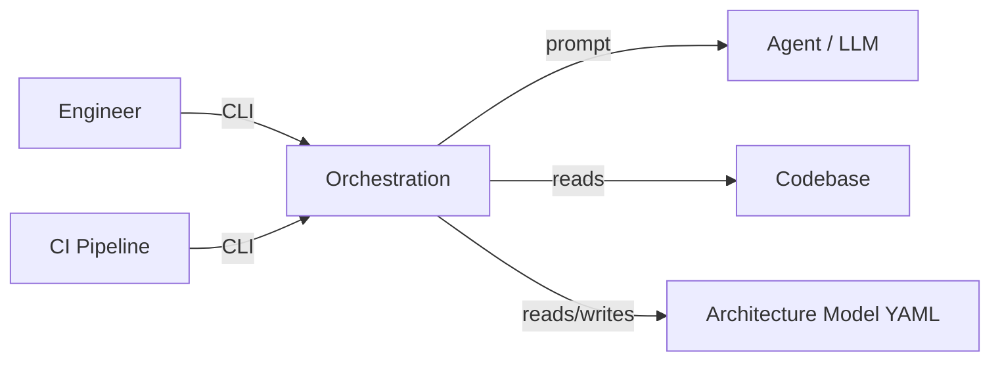
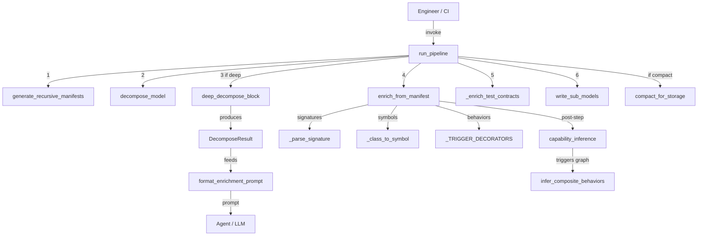

# Orchestration Subsystem — Use Cases

## Why This Document Exists

The Orchestration subsystem is the bridge between raw source code and structured architecture knowledge. Without it, architecture models are static documents that drift from reality. These use cases capture the workflows through which models are automatically enriched, decomposed, and kept faithful to the codebase.

---

## Actors

| Actor | Description |
|-------|-------------|
| **Engineer** | Invokes orchestration via CLI (COMP-8) to update architecture models |
| **CI Pipeline** | Automated trigger for model refresh on code changes |
| **Agent (LLM)** | Consumes formatted prompts to assign patterns/contracts to components |

---

## UC-1: Enrich Model from AST

**Actor:** Engineer / CI Pipeline

**Intent:** Eliminate manual bookkeeping of function signatures, constants, and test contracts in architecture YAML. The model should reflect what the code actually exports, not what someone remembered to document.

**Preconditions:**
- A valid `ArchitectureModel` is loaded with components that have `files` populated
- `project_root` points to a repo where those files exist on disk
- Components have `status == ACTIVE`

**Main Flow:**
1. Engineer invokes enrichment (via `enrich_model(model, project_root)` in `enrich.py`)
2. For each ACTIVE component with files, `_enrich_signatures()` calls `extract_file_hints()` to parse AST and extract public function signatures as `FunctionSignature` objects
3. `_enrich_constants()` parses module-level assignments via `ast.parse()` into `Constant` objects, deduplicating by name against `comp.constants`
4. `_enrich_test_contracts()` discovers test files via convention and calls `analyze_test_file()` to produce `TestContract` entries
5. The enriched `ArchitectureModel` is returned

**Postconditions:**
- Every ACTIVE component's `signatures`, `constants`, and `test_contracts` lists reflect current source
- No duplicate entries (deduplication by name via `existing_names` sets)
- Inactive components and components without files are untouched

**Error Handling:**
- Missing files: logged at DEBUG via `logger.debug("File not found: %s", fpath)` — degraded but not fatal
- Unparseable source: caught by broad `except Exception`, logged at WARNING — that file is skipped, other files still enriched
- This is a **graceful degradation** design: partial enrichment is always better than none

**Quality Attributes:**
- Idempotent: running twice produces the same result (dedup guards)
- Non-destructive: existing manually-added entries are preserved

**Measures of Effectiveness:**
- **Coverage ratio**: % of component files successfully parsed / total component files — target >95%
- **Signature freshness**: delta between signatures in model vs. actual public API — should be zero after enrichment
- **Zero false additions**: no private functions (guarded by `include_private=False`) leak into signatures

---

## UC-2: Enrich from Manifest Data

**Actor:** Engineer / CI Pipeline

**Intent:** When a full `Manifest` (from AST scanning) is already available, use its richer data (class hierarchies, decorator info, docstrings) to populate symbols, patterns, responsibilities, and behaviors — going beyond what simple AST extraction provides.

**Preconditions:**
- A `Manifest` object with populated `modules: list[ModuleInfo]` exists
- Components have `files` that match `ModuleInfo.file` paths

**Main Flow:**
1. `enrich_from_manifest(model, manifest)` is called (in `auto_enrich.py`)
2. For each component, matched modules are found by file path
3. Functions are converted via `_parse_signature(name, func)` into `FunctionSignature` with params, returns, and `body_hint` from docstrings
4. Classes are converted via `_class_to_symbol(cls)` into `Symbol` objects, with `_detect_symbol_kind()` inferring kind from decorators/bases (dataclass, protocol, enum, exception, etc.)
5. Trigger detection via `_TRIGGER_DECORATORS` regex identifies behaviors from decorated functions (route, event, handler, etc.)
6. Pattern matching via `load_patterns()` assigns architectural patterns based on indicator matching

**Postconditions:**
- Components have `symbols` with correct `SymbolKind` classification
- Behaviors are detected from trigger decorators, not just manually authored
- Patterns are inferred from code indicators

**Error Handling:**
- Unrecognized decorators/bases: default to `SymbolKind.CLASS` — safe fallback
- No manifest modules matching a component: component is skipped silently

**Quality Attributes:**
- Symbol kind accuracy depends on decorator naming conventions — works well for standard Python patterns

**Measures of Effectiveness:**
- **Symbol classification accuracy**: % of symbols with correct `SymbolKind` vs. manual review
- **Behavior detection recall**: % of actual entry points detected as behaviors via trigger decorators
- **Pattern inference precision**: % of auto-assigned patterns that an architect would agree with

---

## UC-3: Deep Decompose a Block

**Actor:** Engineer

**Intent:** Large monolithic components (many files) are architecturally opaque. Decomposition clusters files by import affinity to reveal internal structure — sub-components that cohesively group related code.

**Preconditions:**
- A `Manifest` for the block with modules and their import edges
- Block has more modules than `max_modules` threshold (default 15) — blocks below this are too small to meaningfully decompose

**Main Flow:**
1. `deep_decompose_block(manifest, block_id, block_name)` is called (in `deep_decompose.py`)
2. `__init__.py` files are filtered out (not meaningful standalone modules)
3. `cluster_modules()` groups modules by import-graph affinity into `target_k` clusters (default 5)
4. Clusters smaller than `min_cluster_size` (default 3) are merged
5. Each cluster becomes a `SubComponent` with aggregated files, classes, functions, and `line_count`
6. Import edges between clusters become `InternalRelationship` entries with `edge_count`
7. `DecomposeResult` is returned

**Postconditions:**
- Each source file appears in exactly one `SubComponent`
- `InternalRelationship` edges capture the coupling strength between sub-components
- Result includes `depth` for tracking recursive decomposition levels

**Error Handling:**
- Too few modules: returns empty `sub_components` — the block is simply not decomposed
- Clustering algorithm produces degenerate results (one giant cluster): acceptable — it reflects genuine tight coupling

**Quality Attributes:**
- Deterministic given same input manifest
- REQ-18 satisfaction: enrichment applies a **maximum 40 behaviors per component** cap to prevent orphan explosion during decomposition

**Measures of Effectiveness:**
- **Cohesion**: avg intra-cluster import density vs. inter-cluster import density — higher ratio = better decomposition
- **Cluster balance**: std deviation of `line_count` across sub-components — lower = more balanced
- **Actionability**: an architect can name each sub-component from its files/classes without ambiguity

**Trade-off Rationale:** `target_k=5` balances granularity (too many clusters = noise) against lumping (too few = no insight). `min_cluster_size=3` prevents single-file clusters that add overhead without value.

---

## UC-4: Run Full Decomposition Pipeline

**Actor:** Engineer / CI Pipeline

**Intent:** Execute the entire decomposition workflow in one command — from scanning source to writing per-block sub-models — so that architecture artifacts stay current with minimal manual effort.

**Preconditions:**
- `project_root` contains `.architecture-model.yaml` with `functional_blocks` configuration
- Source code is available at paths referenced by the model

**Main Flow:**
1. `run_pipeline(project_root, deep=True)` is called (in `pipeline.py`)
2. `generate_recursive_manifests()` performs per-block AST scanning
3. `decompose_model()` traces relationships from block components to extract sub-models (capabilities, interfaces, behaviors, constraints)
4. If `deep=True`, `iterative_decompose()` recursively decomposes large blocks
5. `enrich_from_manifest()` populates signatures, symbols, and interfaces on sub-model components
6. `_enrich_test_contracts()` adds test coverage data
7. `write_sub_models()` writes artifacts to `.architecture-models/<block_id>/`
8. If `compact=True`, root model is compacted
9. `PipelineResult` is returned with manifests, sub_models, deep_decompositions, written_paths, and errors

**Postconditions:**
- `.architecture-models/` directory contains per-block YAML sub-models
- `PipelineResult.errors` lists any blocks that failed (partial success is valid)

**Error Handling:**
- Per-block failures are caught and appended to `result.errors` — other blocks still process
- Missing model file with `from_scratch=True`: bootstraps a model from manifest using module grouping
- This is **fail-soft by design**: the pipeline always produces as much output as possible

**Quality Attributes:**
- Monitored via `@monitored` decorator tracking `blocks_scanned`, `blocks_decomposed`, `errors`
- Idempotent: safe to re-run

**Measures of Effectiveness:**
- **Completion ratio**: `blocks_decomposed / blocks_scanned` — target 100%
- **Error rate**: `len(errors) / len(manifests)` — target 0%
- **Freshness latency**: time from code change to updated sub-model — should be single CI cycle

---

## UC-5: Infer Capabilities from Behaviors

**Actor:** CI Pipeline (automated post-enrichment step)

**Intent:** Manually curating capabilities is tedious and drifts. By grouping behaviors by URL prefix or actor, capabilities emerge naturally from the code's actual entry points.

**Preconditions:**
- Model has behaviors with populated `trigger` fields (e.g., `"POST /users/{id}"`) or `actor` fields

**Main Flow:**
1. `_infer_caps_from_urls(behaviors, existing_caps, existing_rels)` is called (in `capability_inference.py`)
2. `_extract_url_prefix(trigger)` extracts the first path segment (e.g., `"users"`)
3. Behaviors are grouped by prefix; those without URL triggers fall back to actor grouping
4. `_name_from_prefix()` applies `_singularize()` and title-casing to produce capability names (e.g., `"User Management"`)
5. New `Capability` entities and `REALIZES` relationships are created
6. Ungrouped behaviors get an `"Internal Operations"` capability

**Postconditions:**
- Every behavior is linked to at least one capability via `REALIZES`
- Capability IDs are sequential starting after existing capabilities

**Error Handling:**
- Behaviors without trigger or actor: grouped under "Internal Operations" — nothing is lost
- Singularization heuristic fails: produces slightly awkward names but no functional impact

**Measures of Effectiveness:**
- **Grouping coherence**: behaviors within a capability should share a logical domain — measurable by manual review
- **Coverage**: 100% of behaviors linked to a capability
- **Name quality**: generated names should be immediately understandable without looking at constituent behaviors

---

## UC-6: Infer Composite Behaviors (Use Cases) from Trigger Chains

**Actor:** CI Pipeline

**Intent:** Individual behaviors (single API endpoints, event handlers) don't tell the story of end-to-end user journeys. By following `triggers` relationship chains, the system synthesizes composite behaviors that represent complete workflows.

**Preconditions:**
- Model has `triggers` relationships between behaviors (produced by `detect_behavior_triggers()`)
- At least one chain of ≥2 behaviors exists

**Main Flow:**
1. `infer_composite_behaviors(model)` is called (in `use_case_inference.py`)
2. `_find_chains(triggers)` builds a directed graph and identifies chain heads (behaviors not targeted by any trigger)
3. Each chain is followed forward via BFS until no successors remain
4. For chains of length ≥2, a composite `Behavior` with `id=f"UC-{i}"` is created
5. Composite inherits `trigger` and `actor` from the chain head
6. `steps` are populated with names of constituent behaviors
7. `pattern` is set to `BehaviorPattern.SEQUENTIAL`
8. `CONTAINS` relationships link composite to chain members

**Postconditions:**
- New `UC-*` behaviors represent end-to-end flows
- Original leaf behaviors remain unchanged
- Relationship graph gains `CONTAINS` edges from composites to leaves

**Error Handling:**
- No triggers in model: returns model unchanged (no-op)
- Cycles in trigger graph: `visited` set prevents infinite loops — cycle members are included up to the first revisit
- Chain head behavior not found in index: that chain is skipped

**Measures of Effectiveness:**
- **Chain detection recall**: % of actual multi-step workflows captured as composites
- **Composite naming clarity**: `"{head.name} (end-to-end)"` should be descriptive
- **Step completeness**: all chain members appear in `steps`

---

## UC-7: Format Enrichment Context for Agent Annotation

**Actor:** Agent (LLM), triggered by Engineer

**Intent:** After decomposition produces sub-components with files/classes/functions, an LLM needs compact, structured context to assign architectural patterns and contracts. This use case produces that prompt — optimized for token efficiency and annotation accuracy.

**Preconditions:**
- One or more `DecomposeResult` objects with populated `sub_components`
- Pattern catalog is loadable via `load_patterns()`

**Main Flow:**
1. `format_enrichment_prompt(decompositions)` is called (in `enrichment_context.py`)
2. Section 1: Pattern catalog is loaded and rendered with top-3 indicators per pattern
3. Section 2: Each `DecomposeResult`'s sub-components are listed with files (capped at 5), classes (capped at 4), functions (capped at 4), and line count
4. Section 3: YAML response format instructions with rules (one-sentence contracts, pattern selection)
5. Joined string is returned

**Postconditions:**
- Output is a self-contained prompt string the agent can process without additional context
- Monitored: `token_estimate` (len/4) and `char_count` are tracked

**Error Handling:**
- Empty decompositions list: produces a prompt with pattern catalog and instructions but no components — agent returns empty annotations
- Files exceeding display cap: shown as `"+N more"` to prevent token bloat

**Quality Attributes:**
- Token efficiency: caps on files/classes/functions prevent prompt explosion for large blocks
- Deterministic output given same input

**Measures of Effectiveness:**
- **Token economy**: prompt size relative to number of components — lower tokens-per-component = better
- **Agent annotation accuracy**: % of patterns/contracts the agent assigns correctly given this prompt — the true end-to-end measure
- **Completeness**: every leaf component appears in the prompt — no silent drops

**Trade-off Rationale:** Capping displayed files at 5 and classes at 4 trades completeness for token budget. The assumption is that top files/classes are sufficient for pattern inference; if not, the agent can use `"custom"`.

---

## Summary Flow

---

## Failure Mode Summary

| Failure | Impact | Degradation |
|---------|--------|-------------|
| Source file missing | Signatures/constants not extracted for that file | Graceful — other files still enriched |
| AST parse error | Single file skipped | Graceful — logged at WARNING |
| Manifest empty | No enrichment occurs | Graceful — model returned unchanged |
| Clustering degenerate | One giant sub-component | Functional but uninformative — reflects real coupling |
| All blocks fail in pipeline | `PipelineResult.errors` populated, no sub-models written | Graceful — errors reported, no data corruption |
| Behavior cap (REQ-18) exceeded | Behaviors truncated at 40 per component | By design — prevents orphan explosion |