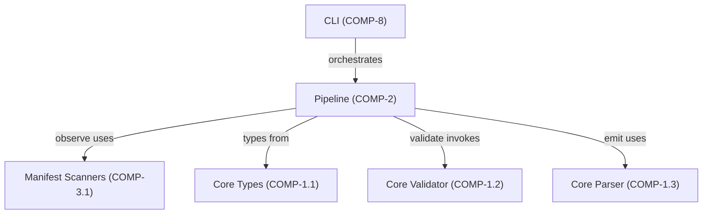

# Concept of Operations: Pipeline Subsystem

## 1. System Overview

### Intent

The Pipeline subsystem exists to solve a fundamental problem: **extracting structured architecture models from arbitrary source code without manual intervention**. Codebases contain implicit architecture—component boundaries, dependency relationships, interface contracts—but this knowledge lives scattered across files, imports, naming conventions, and documentation. The Pipeline transforms this implicit knowledge into an explicit, validated YAML model (`.architecture-model.yaml`) plus supporting SE documentation.

The design philosophy is a **10-stage linear pipeline with DAG-based dependency resolution**, where each stage performs one conceptual transformation with typed inputs and outputs. This decomposition enables caching, independent re-runs, and graceful degradation—any stage can fail without losing upstream results.

### The 10 Stages

| # | Stage | Module | Transformation |
|---|-------|--------|---------------|
| 1 | **observe** | `observe.py` | Source files → raw `Inventory` (AST facts, imports, constants) |
| 2 | **infer** | `infer.py` | Inventory → `InferResult` (components, capabilities, behaviors) |
| 3 | **allocate** | `allocate.py` | InferResult → `AllocationResult` (files assigned to components) |
| 4 | **relate** | `relate.py` | AllocationResult → `RelateResult` (typed relationships: depends-on, realizes, contains) |
| 5 | **specify** | `specify.py` | RelateResult → `SpecifyResult` (interfaces, signatures) |
| 6 | **contract** | `contract.py` | SpecifyResult → `ContractResult` (test contracts, behavioral expectations) |
| 7 | **validate** | `validate.py` | ContractResult → `ValidateResult` (schema/consistency checks) |
| 8 | **decompose** | `decompose.py` | ValidateResult → `DecomposeResult` (system boundaries, sub-components) |
| 9 | **synthesize** | `synthesize.py` | DecomposeResult → `SynthesizeResult` (merged `SoSModel` / `SystemModel`) |
| 10 | **emit** | `emit.py` | SynthesizeResult → files on disk |

## 2. Stakeholders & Actors

| Actor | Mechanism | Goal |
|-------|-----------|------|
| **Developer/Architect** | CLI (`architecture-model pipeline`) or MCP tool (`architect_pipeline`) | Obtain accurate architecture model with minimal effort |
| **`PipelineCoordinator`** | `coordinator.py` — DAG resolution via `resolve_order()`, Kahn's algorithm | Run minimum necessary stages to reach target, enforce determinism |
| **`PipelineCache`** | `cache.py` | Skip completed stages on re-runs, enable stage independence |
| **LLM (optional)** | copilot-relay enrichment via `EnrichmentRecord` | Improve naming, descriptions, and ambiguity resolution when available |
| **CI/CD systems** | Automated pipeline runs | Validate architecture model stays consistent with code changes |

## 3. Operational Scenarios

### Scenario 1: Full Extraction from Scratch

**Trigger:** Developer runs `architecture-model pipeline --repo ./my-project` on a repo with no cached state.

**Flow:** `PipelineCoordinator.resolve_order("emit")` returns all 10 stages in topological order. Each stage's `run(ctx: PipelineContext)` executes sequentially. `ObserveStage` scans all `.py` files (excluding test dirs via `_is_excluded`), produces `Inventory` with `ModuleRecord`, `ImportEdge`, `ClassRecord`, etc. Each `StageResult` is stored in `PipelineContext` and cached. Final `EmitStage` writes `.architecture-model.yaml` and per-component docs via `_write_file()`.

**Success measure:** Complete model with validation score >85/100, all source files accounted for.

### Scenario 2: Incremental Re-run from Cache

**Trigger:** Developer modifies 3 files and re-runs pipeline.

**Flow:** `PipelineCache` detects that stages observe through relate have valid cached `StageResult`s (input hashes unchanged for unmodified files). Coordinator skips to the first invalidated stage, loads cached predecessors via `ctx.get("observe")` etc. Only stages from the invalidation point forward re-execute.

**Rationale (REQ-7):** Stage independence via caching is critical for developer iteration speed. Without it, every change forces a full 10-stage run.

### Scenario 3: LLM-Enriched Extraction

**Trigger:** Pipeline runs with LLM access configured (copilot-relay available).

**Flow:** Stages that support enrichment (primarily infer, specify) issue `LLMCallRecord` requests for improved component naming, description generation, and ambiguity resolution. `SOURCE_WEIGHTS` in `protocol.py` assigns `llm_analysis` confidence of 0.6—lower than AST (1.0) or test (0.95) evidence. LLM suggestions become `Claim` values with `uncertain: True` when confidence is below threshold.

**Key constraint (REQ-24):** LLM inferences are flagged as `Uncertainty` objects, never silently accepted as ground truth.

### Scenario 4: Scoped Sub-pipeline (Recursive Decomposition)

**Trigger:** `ctx.scope_files` is set to a subset of repository files (e.g., a single subsystem).

**Flow:** `ObserveStage.run()` respects `ctx.scope_files`, scanning only specified paths. Downstream stages operate on the reduced `Inventory`. `DecomposeStage` applies `_cluster_by_directory()` and `_decompose_component()` with `HIERARCHY_FILE_THRESHOLD = 8` to create `SubComponent` hierarchies. If a component has files across multiple directories with ≥2 files each, it gets decomposed.

**Use case:** Generating focused architecture docs for a single package without processing the entire monorepo.

## 4. System Context

| Dependency | Why |
|-----------|-----|
| **Manifest Scanners (COMP-3.1)** | `ObserveStage` delegates actual file scanning/AST parsing to shared scanner infrastructure rather than reimplementing it. Avoids duplication of Python AST walking logic. |
| **Core Types (COMP-1.1)** | `PipelineCoordinator` and allocation stages need canonical entity types (`Component`, `Capability`, `Relationship`) to build the model. Using shared types ensures pipeline output is compatible with the rest of the system. |
| **Core Validator (COMP-1.2)** | `ValidateStage` invokes the same validation logic used everywhere else. A pipeline-specific validator would drift from the canonical rules. |
| **Core Parser (COMP-1.3)** | `EmitStage` uses the parser's YAML serialization to produce `.architecture-model.yaml`. Single serialization path prevents format inconsistencies. |

## 5. Operational Constraints

| Constraint | Requirement | Rationale |
|-----------|-------------|-----------|
| **Performance** | <60s for 200+ file repos without LLM (REQ-25) | Developer adoption requires near-interactive speed. LLM latency is excluded because it's optional and externally bounded. |
| **Determinism** | Same input → same output (REQ-6) | Architecture models are version-controlled. Non-deterministic output creates phantom diffs that erode trust. `PipelineCoordinator` enforces deterministic stage ordering via topological sort. |
| **Stage independence** | Each stage independently runnable with cached predecessors (REQ-7) | Enables incremental runs and debugging of individual stages. `PipelineCache` serializes each `StageResult`. |
| **Graceful degradation** | Partial results on failure, not crash (REQ-23) | A failed `contract` stage should not destroy a valid `relate` result. Coordinator catches stage failures and preserves completed upstream results. |
| **Uncertainty surfacing** | Ambiguous inferences flagged, not silently guessed (REQ-24) | `Claim.uncertain` and `Uncertainty` objects in `StageResult` make confidence explicit. Downstream consumers can filter by confidence threshold. |
| **Test preservation** | All existing tests pass after changes (REQ-17) | `ValidateStage` enforces this as a pipeline-internal check. |

## 6. Data Flow

| Stage | Input | Output | Key Types |
|-------|-------|--------|-----------|
| observe | Source `.py` files | `Inventory` | `ModuleRecord`, `ImportEdge`, `ClassRecord`, `FunctionRecord`, `ConstantRecord` |
| infer | `Inventory` | `InferResult` | `Claim[Component]`, `Claim[Capability]`, `Uncertainty` |
| allocate | `InferResult` | `AllocationResult` | File-to-component assignments |
| relate | `AllocationResult` | `RelateResult` | Typed relationships (realizes, depends-on, contains) |
| specify | `RelateResult` | `SpecifyResult` | Interfaces, function signatures |
| contract | `SpecifyResult` | `ContractResult` | Test contracts, behavioral expectations |
| validate | `ContractResult` | `ValidateResult` | Validation score, diagnostics |
| decompose | `ValidateResult` | `DecomposeResult` | `SystemBoundary`, `SubComponent` |
| synthesize | `DecomposeResult` | `SynthesizeResult` | `SystemModel`, `SoSModel` |
| emit | `SynthesizeResult` | `EmitResult` | Written file paths, total bytes |

Every stage returns `StageResult[T]` which wraps the typed output with `diagnostics: list[Diagnostic]`, `uncertainties: list[Uncertainty]`, and `quality: QualityMetrics`. Evidence provenance flows through `Claim` objects with confidence scores weighted by `SOURCE_WEIGHTS`.

## 7. Measures of Effectiveness

| Metric | Target | Measurement Point | Trade-off |
|--------|--------|-------------------|-----------|
| **Validation score** | >85/100 | `ValidateResult` | Higher thresholds reject more models; 85 balances completeness vs. strictness |
| **Entity coverage** | >90% of entity types present | `InferResult` — capabilities, components, signatures, constants, symbols, files (REQ-4) | Aggressive inference increases coverage but may reduce precision |
| **File coverage** | 100% of non-excluded files | `AllocationResult` — every file allocated to a component | Unallocated files indicate gaps in component detection |
| **Relationship accuracy** | >80% | `RelateResult` — realizes, depends-on, contains present (REQ-5) | Recall vs. precision: missing relationships are worse than spurious ones for architecture understanding |
| **Boundary coherence** | >50% | `DecomposeResult` — `SystemBoundary` clusters share more internal than external edges | Low coherence suggests arbitrary decomposition; threshold is modest because some repos have flat structure |
| **Pipeline latency** | <60s (200+ files, no LLM) | End-to-end wall clock | Caching amortizes cost over incremental runs |
| **Uncertainty rate** | Tracked, not minimized | `StageResult.uncertainties` count | Goal is surfacing, not suppressing. A pipeline that reports zero uncertainties on a complex repo is likely hiding information. |