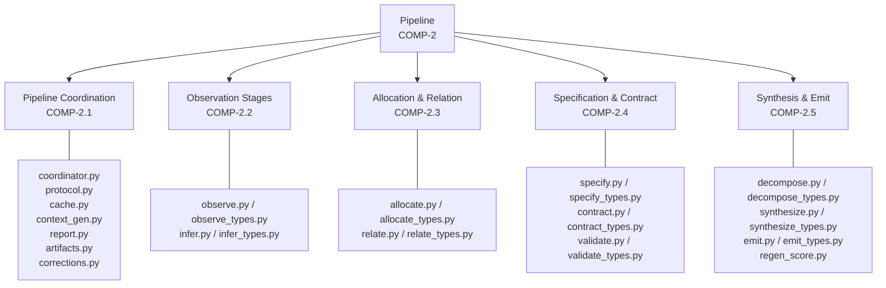
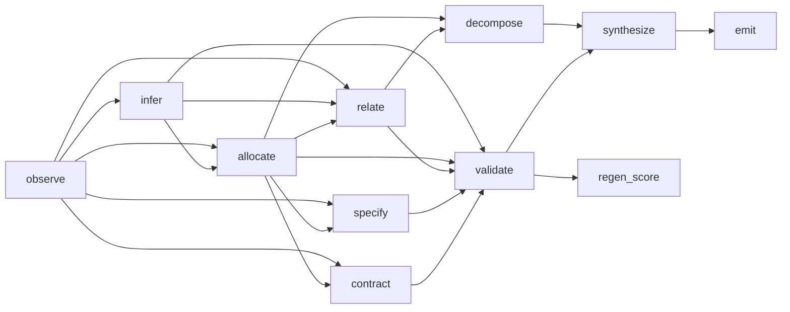
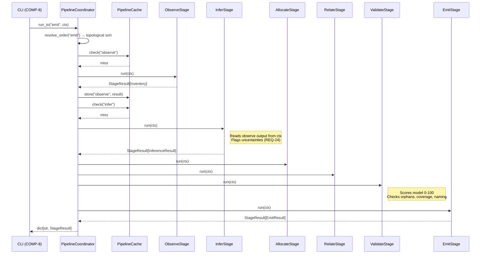
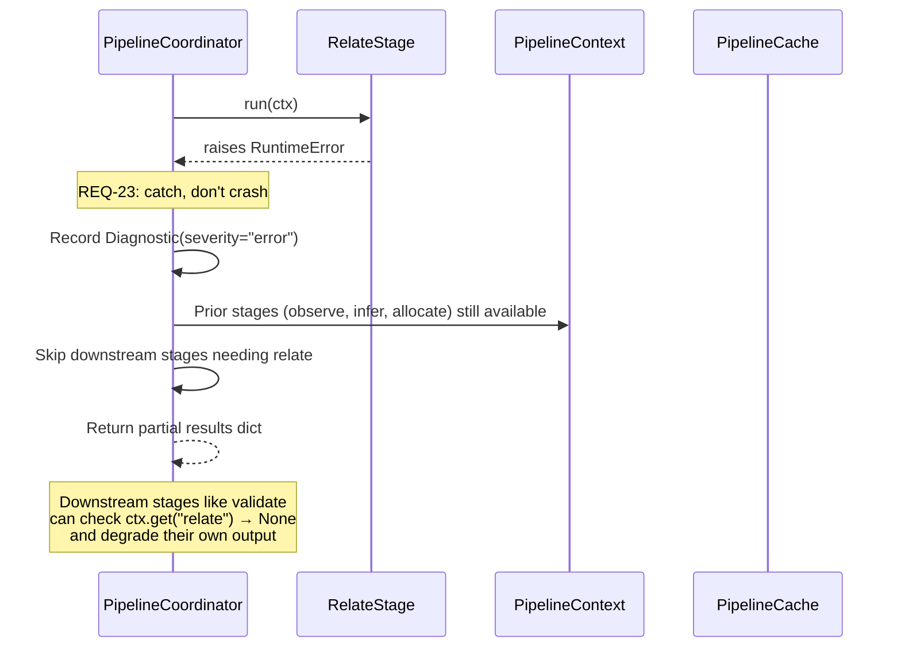
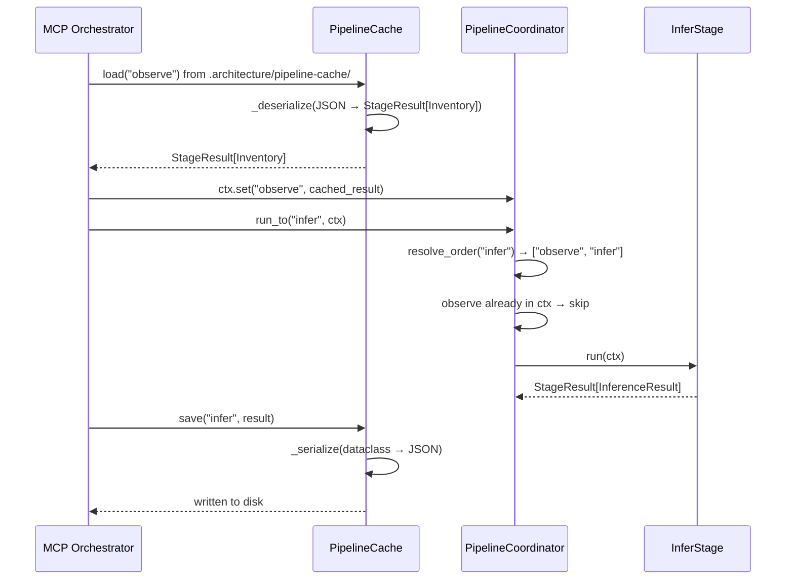

# Functional Analysis: Pipeline Subsystem

## 1. Intent & Purpose

The Pipeline subsystem exists to **transform raw source code into a structured architecture model through a sequence of deterministic, composable stages**. Without it, architecture extraction would be a monolithic, opaque process impossible to debug, cache, resume, or incrementally improve.

The core philosophy: **separate observation from inference from synthesis**. Each stage has a single epistemic responsibility — observe facts, infer meaning, allocate structure, relate entities, specify interfaces, validate correctness, then emit artifacts. This separation means each stage's output can be inspected, cached, corrected, and re-run independently.

## 2. Capability Inventory

### CAP-3: Run Modular Extraction Pipeline

**Intent:** Enable automated architecture model extraction that is transparent, resumable, and correctable — not a black box.

**Goal (optimal):** Every stage produces high-confidence outputs with full provenance chains; the final model scores >90/100 on validation; total wall-clock time scales linearly with codebase size.

| Sub-Capability | Intent | Optimal Delivery |
|---|---|---|
| **Codebase Observation** | Establish ground truth from AST parsing — zero inference, pure facts | 100% parseable file coverage, all imports/classes/functions/routes captured |
| **Semantic Inference** | Derive capabilities, actors, behaviors from observed patterns | Every meaningful capability identified with evidence; ambiguities explicitly flagged |
| **Structural Allocation** | Map files → components with coherent boundaries | >95% file coverage, boundary coherence >80%, no component >12 files |
| **Relationship Derivation** | Discover realizes/depends-on/contains/exposes edges | All import-based dependencies captured; no false positives from transitive deps |
| **Interface Specification** | Extract REST/CLI/library interfaces from routes and exports | Every public API surface captured with methods listed |
| **Contract Mapping** | Link test files to components as behavioral contracts | High test-component coverage ratio |
| **Structural Validation** | Check model completeness and consistency | Score reflects actual model quality; actionable issue descriptions |
| **System Decomposition** | Detect system boundaries for large codebases | Meaningful splits based on coupling, not arbitrary thresholds |
| **Model Synthesis** | Assemble per-system models into unified SoS model | Single coherent YAML with namespaced IDs, no collisions |
| **Artifact Emission** | Write final files to disk in canonical structure | All paths written, reproducible output |
| **Pipeline Coordination** | Orchestrate stage execution order, caching, error handling | Minimum stages executed; failures produce partial results |

## 3. Functional Decomposition

### Stage Dependency DAG

## 4. Capability-Component Mapping

| Component | Realizes | Rationale |
|---|---|---|
| **COMP-2.1** (Coordination) | Stage orchestration, caching, graceful degradation | Separates "how to run stages" from "what stages do" — enables independent stage execution (REQ-7) and partial results on failure (REQ-23) |
| **COMP-2.2** (Observation) | Codebase observation + semantic inference | `ObserveStage` produces `Inventory` (facts only); `InferStage` produces `InferenceResult` (capabilities/actors/behaviors). Split enforces the observation/inference boundary — observe never guesses |
| **COMP-2.3** (Allocation & Relation) | File→component mapping + relationship derivation | `AllocateStage` seeds components from capabilities then assigns by import affinity. `RelateStage` derives typed edges. Both depend on observe+infer outputs |
| **COMP-2.4** (Spec & Contract) | Interface specs + test contracts + validation | `SpecifyStage` extracts interfaces from routes/exports. `ContractStage` maps tests→components. `ValidateStage` scores the complete model. Grouped because all three refine/verify the structural model |
| **COMP-2.5** (Synthesis & Emit) | Decomposition + assembly + disk output | `DecomposeStage` detects system boundaries. `SynthesizeStage` runs scoped sub-pipelines and merges. `EmitStage` writes canonical file structure. `RegenScoreStage` computes regeneration readiness |

## 5. Behavioral Flows

### 5.1 Full Pipeline Execution (Primary Flow)

**Intent:** Transform a repository path into a complete architecture model on disk, executing only the minimum stages needed, with caching to avoid redundant work.

### 5.2 Graceful Degradation on Stage Failure

**Intent:** Ensure that a failure in one stage (e.g., relate crashes) doesn't destroy all work done by prior stages. The system should produce the best partial model it can.

### 5.3 Cached Stage Resume (MCP Orchestration)

**Intent:** Enable the MCP orchestrator to run one stage per invocation across separate process lifetimes, resuming from disk-serialized `StageResult` objects.

## 6. Requirements Satisfaction

| Req | Text | Satisfied By | Rationale & Consequences |
|---|---|---|---|
| **REQ-4** Entity type coverage | Include capabilities, components with signatures, constants, symbols, files | **COMP-2.2** — `ObserveStage` captures `ModuleRecord`, `ClassRecord`, `FunctionRecord`, `ConstantRecord`; `InferStage` produces `InferredCapability` | **Why:** An architecture model missing entity types is incomplete — downstream consumers (documentation generators, code generators) need typed entities to produce useful output. **Violation:** Missing entities → incomplete model → silent gaps in generated docs. |
| **REQ-5** Relationship population | Include realizes, depends-on, contains | **COMP-2.3** — `RelateStage` produces `DerivedRelationship` with `rel_type` in {realizes, depends-on, contains, exposes, uses} | **Why:** Relationships ARE the architecture — entities without connections are just a file listing. The minimum set {realizes, depends-on, contains} captures capability traceability, coupling, and hierarchy. **Violation:** Missing realizes → can't trace capabilities to implementation; missing depends-on → invisible coupling. |
| **REQ-6** Deterministic pipeline | Same input → same output | **COMP-2.1** — `PipelineCoordinator` uses `resolve_order()` with Kahn's algorithm (sorted tie-breaking); no randomness in stage logic | **Why:** Non-determinism makes diffs meaningless, CI flaky, and debugging impossible. The sorted tie-breaking in `_topo_sort` ensures even stages with equal priority execute in consistent order. **Violation:** Random output → spurious diffs in version-controlled models → developer distrust → abandonment. |
| **REQ-7** Stage independence | Each stage independently runnable with cached predecessors | **COMP-2.1** — `PipelineCache` serializes/deserializes `StageResult` to JSON; `PipelineContext.get()` retrieves cached results | **Why:** Enables MCP-style one-stage-per-call orchestration, debugging individual stages, and human review between stages. **Violation:** Monolithic execution → no resume, no inspection, no iterative correction. |
| **REQ-17** Test preservation | All existing tests must pass after changes | **COMP-2.4** — `ValidateStage` checks structural consistency | **Why:** The pipeline modifies output artifacts; if it breaks existing test contracts, it has violated the system's behavioral guarantees. **Violation:** Silent test breakage → shipped regressions. |
| **REQ-23** Graceful degradation | Produce partial results on failure | **COMP-2.1** — Coordinator catches stage exceptions, records diagnostics, returns completed stages | **Why:** A 7-stage partial model is infinitely more valuable than a crash with no output. Architecture extraction is heuristic — some stages will fail on unusual codebases. **Violation:** All-or-nothing → pipeline unusable on any codebase with edge cases. |
| **REQ-24** Uncertainty surfacing | Flag ambiguous inferences | **COMP-2.2** — `InferStage` emits `Uncertainty` objects with `category`, `description`, `suggested_fallback` | **Why:** Silent guessing produces models that LOOK correct but ARE wrong — the worst possible outcome. Explicit uncertainty lets humans or LLMs make informed decisions. **Violation:** False confidence → wrong architecture decisions based on wrong models. |
| **REQ-25** Large repo handling | >200 files in <60s without LLM | **COMP-2** — AST-only observe stage, import-affinity allocation (no LLM calls in deterministic path) | **Why the threshold:** 200 files ≈ medium production codebase; 60s ≈ tolerable CI pipeline addition. LLM calls are excluded because they add 5-30s each and are non-deterministic. **Violation:** Slow pipeline → not used in CI → architecture model drifts from code. |

## 7. Trade-offs & Design Decisions

### 10-Stage Pipeline vs. Fewer Stages

**Chosen:** 10 stages with explicit types per stage (`Inventory`, `InferenceResult`, `AllocationResult`, etc.)

**Traded:** Simplicity of a 3-stage pipeline (scan → analyze → emit) for debuggability and cacheability. Each stage boundary is an inspection point. The cost is more dataclass definitions and serialization logic in `cache.py`.

**Would change if:** The pipeline only ran in batch mode (no MCP), fewer stages would reduce overhead.

### Capability-Seeded Allocation vs. Import Clustering

**Chosen:** `AllocateStage` seeds components from inferred capabilities, then assigns remaining files by import affinity (`_assign_by_import_affinity`). Oversized components split at `MAX_COMPONENT_FILES = 12`.

**Traded:** Pure import clustering (which discovers natural code modules) for capability-driven grouping (which produces architecturally meaningful components). Import clustering can produce components like "all files that import `utils`" — meaningless architecturally.

**Threshold rationale:** 12 files max is a heuristic for cognitive load — a component with 30 files is not a component, it's a subsystem. The `MIN_COMPONENT_FILES = 2` prevents single-file "components" that add noise.

### Evidence-Based Claims vs. Boolean Facts

**Chosen:** `Claim[T]` wraps values with `Evidence` list and weighted confidence via `SOURCE_WEIGHTS`. AST evidence gets weight 1.0; LLM analysis gets 0.6.

**Traded:** Simplicity for traceability. Every model assertion can be traced to its source and confidence assessed. The weight hierarchy (ast=1.0 > test=0.95 > documentation=0.8 > llm=0.6) reflects epistemic reliability.

### File-Based Cache vs. In-Memory Only

**Chosen:** `PipelineCache` writes JSON to `.architecture/pipeline-cache/` with full dataclass serialization/deserialization.

**Traded:** Speed (in-memory is faster) for cross-process resumability. The MCP orchestrator runs stages in separate invocations, so disk persistence is essential. The `_serialize`/`_deserialize` functions handle nested dataclasses, `Path` objects, and dynamic type resolution via `_get_output_class`.

### Deterministic Sort Tie-Breaking

**Chosen:** `_topo_sort` uses `sorted()` for both initial queue and successor iteration.

**Traded:** Nothing meaningful — sorted tie-breaking has negligible cost but guarantees REQ-6. Without it, Python's set iteration order (implementation-dependent) would produce non-deterministic stage ordering.

## 8. Measures of Effectiveness

| Capability | MoE | Minimum | Optimal | Value Function |
|---|---|---|---|---|
| **Observation** | File parse success rate | >95% | 100% | Each unparsed file is a blind spot; value increases linearly with coverage |
| **Observation** | Import edge completeness | Captures direct imports | Captures re-exports and dynamic imports | More edges → better allocation and relationship derivation |
| **Inference** | Capability count vs. manual extraction | >50% of human-identified capabilities | >90% match | Under-extraction is worse than over-extraction (false negatives harder to catch) |
| **Inference** | Uncertainty flagging rate | Flags obvious ambiguities | Flags all below-threshold inferences with `Uncertainty.priority` | Unflagged wrong inferences are the costliest failure mode |
| **Allocation** | `AllocationResult.file_coverage` | >95% | 100% | Unallocated files are invisible to the architecture model |
| **Allocation** | `AllocationResult.boundary_coherence` | >70% | >90% | Low coherence = components with many cross-boundary imports = wrong decomposition |
| **Validation** | `ValidateResult.score` | >60 (usable) | >90 (publication-ready) | Score is a composite; value is non-linear — below 50 the model misleads rather than helps |
| **Performance** | Wall-clock for 200-file repo | <60s | <10s | Sub-10s enables interactive use; >60s breaks CI integration |
| **Coordination** | Stages skipped via cache | ≥0 | All unchanged stages skipped | Each cache hit saves seconds; compound savings across iterative development |
| **Emit** | `EmitResult.total_bytes` > 0 | Files written | Canonical structure with per-component docs | More structured output → more downstream tool compatibility |

## 9. Failure Modes

| Component | Failure Mode | Impact | Degradation Behavior |
|---|---|---|---|
| **ObserveStage** | `SyntaxError` on a file | Single file missing from `Inventory` | Graceful — logs `Diagnostic(severity="warning", code="parse-failed")`, continues with remaining files |
| **InferStage** | No capabilities detected | Empty `InferenceResult.capabilities` | `_infer_fallback_capabilities` activates — creates capabilities from packages with >3 public functions |
| **AllocateStage** | All files unallocated | Components list empty | Creates catch-all "Infrastructure" component for remaining files |
| **RelateStage** | Missing predecessor results | `RuntimeError` | Coordinator catches; downstream stages (validate, decompose) receive `None` from `ctx.get("relate")` |
| **ValidateStage** | Low score | `ValidateResult.score` < 60 | Non-fatal — score reported, issues listed with actionable messages |
| **PipelineCache** | Corrupted JSON on disk | Deserialization fails | Stage re-executes from scratch (cache miss behavior) |
| **PipelineCoordinator** | Circular dependency in stages | `RuntimeError("Circular dependency detected")` | Hard failure — this is a programming error, not a runtime condition |
| **EmitStage** | Disk write failure | `OSError` | Hard failure — no partial file writes; atomic per-file via `Path.write_text` |