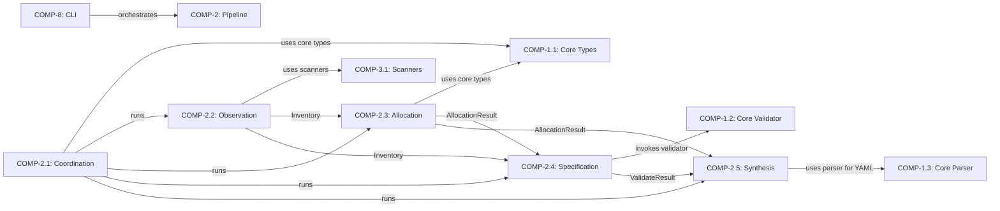

# Pipeline Subsystem — Logical Architecture

## 1. Intent & Purpose

The Pipeline subsystem exists to transform a raw codebase into a structured architecture model through a deterministic, 10-stage extraction process. Without it, architecture extraction would be a monolithic, opaque operation impossible to debug, cache, resume, or extend.

The core philosophy: **decompose architecture extraction into independently testable, cacheable stages with explicit data contracts between them.** Each stage produces a typed result that subsequent stages consume, creating an auditable chain of evidence from source code to architecture model.

## 2. Component Structure

### COMP-2.1 — Pipeline Coordination

**Intent:** This boundary exists because stage orchestration, caching, and reporting are cross-cutting concerns that must not leak into individual stages. Without coordination, every stage would need to know about execution order, caching, and error handling.

| File | Responsibility |
|---|---|
| `coordinator.py` | DAG resolution via Kahn's algorithm (`_topo_sort`), dependency collection (`_collect_deps`), and minimum-path execution (`run_to`) |
| `protocol.py` | Defines the `Stage` protocol, `StageResult[T]`, `PipelineContext`, `Claim`, `Evidence`, `Uncertainty`, `Diagnostic`, `SOURCE_WEIGHTS` — the entire type vocabulary |
| `cache.py` | `PipelineCache` — JSON serialization/deserialization of `StageResult` objects to `.architecture/pipeline-cache/` for MCP resume |
| `context_gen.py` | Produces token-efficient markdown summary from pipeline results for LLM context windows |
| `report.py` | `StageReport` and `generate_pipeline_report` — markdown rendering of pipeline run metrics |
| `artifacts.py` | `write_artifacts` — writes structured output (inventory.json, functional.yaml, structure.yaml, etc.) |
| `corrections.py` | `get_corrections_for_stage` — loads user corrections from `LearningStore` filtered by stage name |

### COMP-2.2 — Observation Stages

**Intent:** Separates fact-gathering (observe) from interpretation (infer). Observe produces zero-inference facts; infer derives meaning. This separation exists because facts are deterministic and cacheable, while inference may involve heuristics that evolve independently.

| File | Responsibility |
|---|---|
| `observe.py` | `ObserveStage` — AST scanning, import edge extraction, route detection, constraint detection. Produces `Inventory` |
| `observe_types.py` | `Inventory`, `ModuleRecord`, `ImportEdge`, `RouteRecord`, `ClassRecord`, `FunctionRecord`, `ConstantRecord`, `TestFileRecord`, `DocRecord`, `ConstraintRecord` |
| `infer.py` | `InferStage` — derives `InferredCapability`, `InferredActor`, `InferredBehavior` from `Inventory` via pattern matching (route clustering, domain module detection, fallback heuristics via `_infer_fallback_capabilities`) |
| `infer_types.py` | `InferenceResult`, `InferredCapability`, `InferredActor`, `InferredBehavior` |

### COMP-2.3 — Allocation & Relation Stages

**Intent:** Translates abstract capabilities into concrete component boundaries (allocate) and then discovers structural relationships between them (relate). These are separated because allocation is a clustering problem while relation discovery is a graph analysis problem — different algorithms, different failure modes.

| File | Responsibility |
|---|---|
| `allocate.py` | `AllocateStage` — 4-step strategy: seed from capabilities → assign by import affinity → split oversized (>`MAX_COMPONENT_FILES=12`) → merge undersized (<`MIN_COMPONENT_FILES=2`). Scoped mode uses per-file allocation for ≤15 files |
| `allocate_types.py` | `AllocationResult`, `ComponentAllocation` (with `file_coverage`, `boundary_coherence` metrics) |
| `relate.py` | `RelateStage` — derives `realizes`, `depends-on`, `contains`, `exposes` relationships. Uses `_pick_relationship_type` to distinguish `uses` (utility) from `depends-on` (domain) |
| `relate_types.py` | `RelateResult`, `DerivedRelationship` |

### COMP-2.4 — Specification & Contract Stages

**Intent:** Adds behavioral and interface contracts on top of the structural model. This boundary exists because interface specs and test contracts are verification artifacts — they validate the model rather than construct it.

| File | Responsibility |
|---|---|
| `specify.py` | `SpecifyStage` — derives `InterfaceSpec` from routes (REST), CLI frameworks (click/typer/argparse), module exports |
| `specify_types.py` | `SpecifyResult`, `InterfaceSpec` |
| `contract.py` | `ContractStage` — maps test files to components via stem matching, name matching, and directory matching |
| `contract_types.py` | `ContractResult`, `TestContract` |
| `validate.py` | `ValidateStage` — checks: unrealized capabilities, orphan components, file coverage <95%, naming. Produces 0–100 score |
| `validate_types.py` | `ValidateResult`, `ValidationIssue` |

### COMP-2.5 — Synthesis & Emit Stages

**Intent:** Handles the transition from internal pipeline data structures to external artifacts. Decompose detects system boundaries for multi-system repos; synthesize runs scoped sub-pipelines; emit writes everything to disk. This boundary exists because output formatting and system-of-systems concerns are distinct from extraction logic.

| File | Responsibility |
|---|---|
| `decompose.py` | `DecomposeStage` — detects `SystemBoundary` via directory clustering (`_cluster_by_directory`), splits large components into `SubComponent`s. Thresholds: `FULL_SYSTEM_FILE_THRESHOLD=5`, `HIERARCHY_FILE_THRESHOLD=8`, `MAX_SYSTEMS=8` |
| `decompose_types.py` | `DecomposeResult`, `SystemBoundary`, `SubComponent` |
| `synthesize.py` | `SynthesizeStage` — runs scoped sub-pipelines per system boundary, builds `SoSModel`, generates reports/lessons. Decides full vs abbreviated stages via `_decide_stages` (≥8 files → full) |
| `synthesize_types.py` | `SynthesizeResult`, `SystemModel`, `SoSModel` |
| `emit.py` | `EmitStage` — writes final artifacts to disk, builds source→test reverse maps, tracks `EmitResult` (paths, bytes) |
| `emit_types.py` | `EmitResult` |
| `regen_score.py` | `RegenScoreStage` — computes regeneration readiness score from enriched model |

## 3. Layer Allocation

All components are in the **domain layer** because they implement the core business logic of architecture extraction. They contain no HTTP handlers, no database access, no UI — they operate purely on in-memory data structures and file I/O. The pipeline is invoked by the CLI layer (COMP-8) and consumes services from the core layer (COMP-1.x) and scanners (COMP-3.1).

## 4. Dependency Graph

**Why each external dependency exists:**

| Dependency | Rationale | What breaks without it |
|---|---|---|
| COMP-2.1 → COMP-1.1 | Coordinator needs `Model`, entity types to build final output | Cannot produce valid architecture models |
| COMP-2.2 → COMP-3.1 | Observe stage delegates AST scanning to reusable scanners | No code facts — entire pipeline produces empty results |
| COMP-2.3 → COMP-1.1 | Allocation needs component/capability type definitions | Cannot create typed components |
| COMP-2.4 → COMP-1.2 | Validate stage reuses core validation rules | Validation becomes incomplete, misses structural errors |
| COMP-2.5 → COMP-1.3 | Emit stage needs YAML serialization via core parser | Cannot write `.architecture-model.yaml` |

## 5. Interface Specification

### IF-auto-COMP-2.1 — Pipeline Coordination API

**Contract:** `PipelineCoordinator.run_to(target, ctx)` guarantees: (1) all transitive dependencies of `target` execute first, (2) cached stages are skipped, (3) circular dependencies raise `RuntimeError`, (4) unknown stages raise `KeyError`.

### IF-auto-COMP-2.2 — Observation Stages API

**Contract:** `ObserveStage.run(ctx) → StageResult[Inventory]` guarantees a complete `Inventory` with all parseable Python files scanned. Parse failures produce `Diagnostic` warnings, not exceptions. `InferStage` guarantees `InferenceResult` with uncertainties flagged via `Uncertainty` objects (REQ-24).

### IF-auto-COMP-2.3 — Allocation & Relation Stages API

**Contract:** `AllocateStage` guarantees every source file appears in exactly one `ComponentAllocation`. Reports `file_coverage` and `boundary_coherence` as quality metrics. `RelateStage` guarantees at minimum `realizes`, `depends-on`, and `contains` relationship types (REQ-5).

### IF-auto-COMP-2.4 — Specification & Contract Stages API

**Contract:** `ValidateStage` produces a 0–100 `score` and `is_valid` boolean. Issues are categorized by `severity` (error/warning/info) and `rule` name.

### IF-auto-COMP-2.5 — Synthesis & Emit Stages API

**Contract:** `EmitStage` writes to `ctx.output_dir`, tracks all written paths in `EmitResult.written_paths`, and reports `total_bytes`. Idempotent — safe to re-run.

## 6. Key Data Types

### The Evidence Chain: `Evidence → Claim → Uncertainty`

**Why these exist:** Architecture extraction is inherently uncertain. Rather than silently guessing, every assertion carries provenance.

- **`Evidence`** — source attribution with confidence (0.0–1.0) and `location`. Weighted by `SOURCE_WEIGHTS` (e.g., `ast: 1.0`, `llm_analysis: 0.6`, `search_result: 0.5`).
- **`Claim[T]`** — generic wrapper making any value auditable. `confidence` property computes weighted average across evidence.
- **`Uncertainty`** — explicit "I don't know" with `category`, `suggested_fallback`, and `priority`.

### `StageResult[T]`

**Why generic:** Every stage produces different output types but shares quality metrics, diagnostics, uncertainties, duration, and version. The generic parameter `T` ensures type safety while the wrapper provides uniform observability.

### `PipelineContext`

**Why a context object:** Stages need shared state (repo path, output dir, cached results, scope files, learning store) without direct coupling. The context is the dependency injection mechanism — stages call `ctx.get("observe")` rather than importing each other.

### Stage Output Types

Each `*Result` dataclass is deliberately separate from its stage implementation to allow serialization (cache), testing, and evolution independently.

## 7. Design Decisions & Rationale

| Decision | Alternatives Considered | Chosen | Rationale | What Would Change If... |
|---|---|---|---|---|
| 10 fixed stages with DAG ordering | Free-form plugin stages; monolithic extractor | Fixed stages, topological sort via Kahn's | Predictable, debuggable, cacheable. Each stage boundary is a checkpoint. | More stages needed → add to DAG, existing stages unaffected |
| Typed `StageResult[T]` per stage | Untyped dict passing; single result type | Generic dataclass per stage | Compile-time safety, serialization clarity, independent evolution | Common fields change → update one base type |
| File-based `PipelineCache` (JSON) | In-memory only; database; pickle | JSON files in `.architecture/pipeline-cache/` | Human-readable, MCP-resumable, no external deps. Trade-off: serialization complexity in `_serialize`/`_deserialize` | Large repos with huge inventories → JSON becomes slow, would need binary format |
| `SOURCE_WEIGHTS` as static dict | Per-project configurable weights; ML-learned weights | Hardcoded weights in `protocol.py` | Simplicity, determinism (REQ-6). Trade-off: can't adapt to domains where e.g. documentation is more reliable than AST | Domain-specific accuracy needed → make weights configurable per project |
| Capability-seeded allocation | Import-graph clustering; directory-based; LLM-based | Seed from capabilities, then import affinity | Produces architecturally meaningful boundaries, not just code structure. Trade-off: depends on infer quality | Infer produces poor capabilities → allocation degrades to fallback "Infrastructure" bucket |
| Separate observe/infer | Single "analyze" stage | Two stages | Facts (cacheable, deterministic) vs interpretation (heuristic, evolvable). Trade-off: extra stage boundary overhead | Heuristics stabilize → could merge, but cache granularity loss |
| `Uncertainty` as first-class type | Log warnings; drop uncertain items; guess silently | Explicit `Uncertainty` objects surfaced in results | REQ-24 compliance. Enables downstream LLM enrichment to target unknowns. Trade-off: more complex result types | Uncertainties ignored → silent model errors, harder debugging |

## 8. Failure Modes

| Component | Failure Mode | Behavior | Graceful? |
|---|---|---|---|
| **ObserveStage** | Python file has `SyntaxError` | Skipped with `Diagnostic(severity="warning", code="parse-failed")`. Other files still scanned | ✅ Graceful — partial inventory |
| **ObserveStage** | Repo path doesn't exist | `StageResult` with empty `Inventory` | ✅ Graceful — empty but valid |
| **InferStage** | No capabilities detected | `_infer_fallback_capabilities` activates — creates capabilities from packages with >3 public functions | ✅ Graceful — degraded but functional |
| **AllocateStage** | No capabilities to seed from | All files land in "Infrastructure" catch-all component | ⚠️ Degraded — model is valid but architecturally meaningless |
| **AllocateStage** | Missing predecessor results | `RuntimeError("allocate requires observe and infer")` | ❌ Hard fail — coordinator should prevent this |
| **RelateStage** | No import edges | Only `realizes` and `contains` relationships produced; no `depends-on` | ✅ Graceful — sparse but valid |
| **ValidateStage** | Low file coverage | `ValidationIssue(severity="warning")` with coverage percentage; `score` reduced but pipeline continues | ✅ Graceful |
| **PipelineCache** | Corrupt JSON on disk | `_deserialize` fails → stage re-runs from scratch | ✅ Graceful — cache miss, not crash |
| **PipelineCoordinator** | Circular dependency in stage graph | `RuntimeError("Circular dependency detected")` in `_collect_deps` or `_topo_sort` | ❌ Hard fail — configuration error |
| **PipelineCoordinator** | Unknown target stage | `KeyError(f"Unknown stage: {name}")` | ❌ Hard fail — caller error |
| **SynthesizeStage** | Sub-pipeline for a system boundary fails | Per REQ-23, partial results from successful sub-pipelines are preserved | ✅ Graceful |
| **EmitStage** | Disk write fails (permissions) | Standard `OSError` propagates | ❌ Hard fail — no output |
| **RegenScoreStage** | Model file missing | `can_run` returns False; stage skipped | ✅ Graceful |

## 9. Measures of Effectiveness

| MoE | Threshold (minimum) | Target (optimal) | How measured |
|---|---|---|---|
| File coverage | 80% | >95% | `AllocationResult.file_coverage` |
| Boundary coherence | 50% | >80% | `AllocationResult.boundary_coherence` (low cross-boundary imports) |
| Validation score | 60/100 | >85/100 | `ValidateResult.score` |
| Large repo latency | <60s for 200+ files (REQ-25) | <30s | `StageResult.duration_ms` summed |
| Capability realization | All capabilities have ≥1 component | 1:1 mapping | Validate stage check |
| Uncertainty ratio | <30% of claims uncertain | <10% | `len(uncertainties) / total_claims` |
| Stage cache hit rate | N/A | >50% on re-runs | Cache hits / total stage invocations |