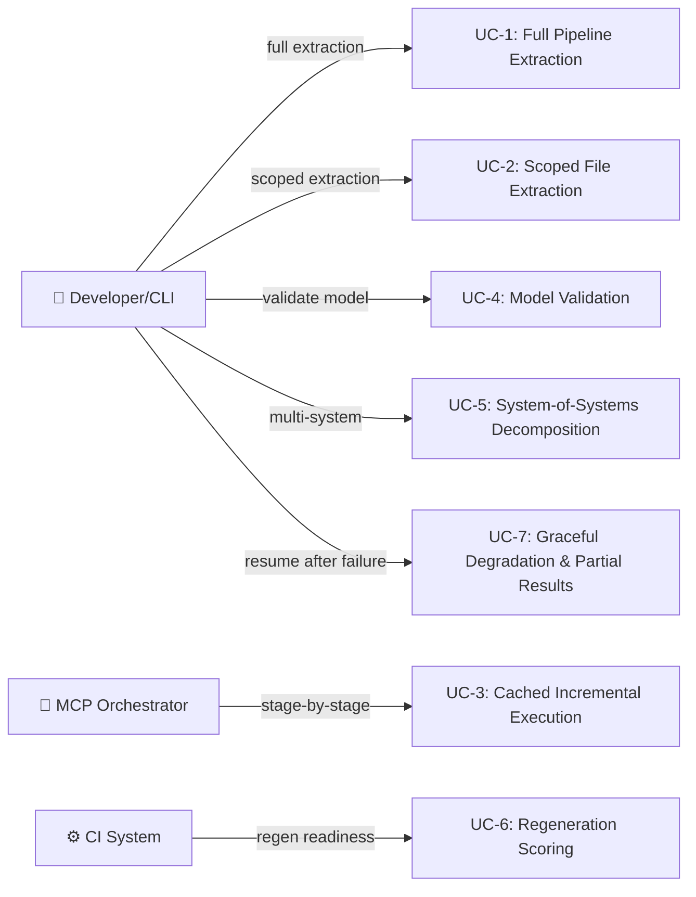

# Pipeline Subsystem — Use Cases

## Use Case Diagram

---

## UC-1: Full Pipeline Extraction

**Actor:** Developer via CLI (COMP-8)

**Intent:** Extract a complete architecture model from a codebase in one shot, producing a YAML model file and supporting artifacts. The developer needs a machine-readable architecture description without manually documenting every component and relationship.

**Preconditions:**
- Repository path exists with Python source files
- No prior pipeline state required

**Main Flow:**
1. CLI constructs `PipelineContext` with `repo_path` and `output_dir`
2. CLI instantiates `PipelineCoordinator` with all stages (`ObserveStage`, `InferStage`, `AllocateStage`, `RelateStage`, `SpecifyStage`, `ContractStage`, `ValidateStage`, `DecomposeStage`, `SynthesizeStage`, `EmitStage`)
3. `PipelineCoordinator.run_to("emit", ctx)` is called
4. `resolve_order("emit")` performs topological sort via `_topo_sort()` producing the 10-stage sequence
5. `ObserveStage.run(ctx)` scans all `.py` files, produces `Inventory` with `ModuleRecord`, `ImportEdge`, `RouteRecord`, `ConstantRecord`
6. `InferStage` derives `InferredCapability`, `InferredActor`, `InferredBehavior` from inventory patterns
7. `AllocateStage` seeds components from capabilities, assigns files by import affinity, enforces `MAX_COMPONENT_FILES=12` / `MIN_COMPONENT_FILES=2`
8. `RelateStage` produces `DerivedRelationship` entries (realizes, depends-on, contains, exposes)
9. `SpecifyStage` / `ContractStage` derive `InterfaceSpec` and `TestContract`
10. `ValidateStage` scores model 0–100, emits `ValidationIssue` list
11. `DecomposeStage` detects `SystemBoundary` entities, splits large components via `_decompose_component()`
12. `SynthesizeStage` builds `SoSModel` and `SystemModel` YAML strings
13. `EmitStage` writes all artifacts to disk, returns `EmitResult` with `written_paths`

**Postconditions:**
- `.architecture-model.yaml` exists with capabilities, components, relationships (REQ-4, REQ-5)
- Same input produces identical output (REQ-6)
- All source files allocated to components (`file_coverage` ≥ 95%)

**Error Handling:**
- `SyntaxError` in individual files → `Diagnostic(severity="warning", code="parse-failed")`, file skipped, pipeline continues (REQ-23)
- Missing stage dependency → `RuntimeError` raised by `_collect_deps()` with circular dependency detection
- If infer finds no capabilities → `_infer_fallback_capabilities()` generates package-based capabilities rather than producing an empty model

**Quality Attributes:**
- Repos with >200 files must complete in <60s without LLM (REQ-25)
- Deterministic: no randomness in any stage (REQ-6)

**Measures of Effectiveness:**
- `ValidateResult.score` — higher is better; 80+ indicates a structurally sound model
- `AllocationResult.file_coverage` — 100% means every source file has a component home
- `AllocationResult.boundary_coherence` — low cross-boundary imports indicate clean component boundaries
- Zero `Uncertainty` objects with `priority="blocking"` — ambiguities were resolved or flagged, not silently guessed (REQ-24)
- Relationship type diversity: model contains at minimum realizes, depends-on, and contains (REQ-5)

---

## UC-2: Scoped File Extraction

**Actor:** Developer or MCP tool

**Intent:** Extract architecture for a subset of files (e.g., a single package or PR changeset) without scanning the entire repository. This enables fast feedback loops during development.

**Preconditions:**
- `PipelineContext.scope_files` populated with specific `Path` objects

**Main Flow:**
1. `ObserveStage.run()` checks `ctx.scope_files` — only scans listed files instead of `rglob("*.py")`
2. `AllocateStage` detects `is_scoped=True` and `len(source_modules) <= _SCOPED_FILE_LIMIT (15)` → uses `_allocate_per_file()` strategy (one component per substantive file) instead of capability-seeded clustering
3. Remaining stages operate on the reduced dataset

**Postconditions:**
- Model produced covering only scoped files
- No scanning of unrelated files

**Error Handling:**
- If scoped files don't exist → filtered out silently in `ObserveStage` (`abs_f.exists()` check)
- If too few files for meaningful architecture → single-component model produced (graceful, not an error)

**Quality Attributes:**
- Sub-second for ≤15 files

**Measures of Effectiveness:**
- All scoped files appear in output components (zero unallocated)
- Proportional reduction in execution time vs. full scan

---

## UC-3: Cached Incremental Stage Execution

**Actor:** MCP Orchestrator

**Intent:** Execute pipeline stages one at a time across separate process invocations, resuming from cached results. This is essential for MCP-based workflows where each tool call is a separate request.

**Preconditions:**
- `.architecture/pipeline-cache/` directory accessible
- Prior stages cached as JSON via `PipelineCache`

**Main Flow:**
1. MCP tool calls `PipelineCoordinator.run_to(target_stage, ctx)`
2. Coordinator calls `resolve_order()` to determine required predecessors
3. For each predecessor, checks `PipelineCache` — `_deserialize()` reconstructs `StageResult` with correct output type via `_get_output_class(stage_name)`
4. Only uncached stages execute; results serialized via `_serialize()` (handles dataclasses, `Path` objects, nested structures)
5. Target stage runs with predecessor outputs available via `ctx.get(stage_name)`

**Postconditions:**
- Target stage result cached for future use (REQ-7)
- Cached results byte-identical to fresh execution (REQ-6)

**Error Handling:**
- Corrupted cache JSON → stage re-executes from scratch
- Missing predecessor cache → predecessor re-executes

**Quality Attributes:**
- Cache hit avoids all computation for that stage
- Serialization handles all pipeline types including `Path`, `Evidence`, `Claim`, `Uncertainty`

**Measures of Effectiveness:**
- Cache hit rate across repeated runs — ideally 100% for unchanged inputs
- Round-trip fidelity: `_deserialize(_serialize(result))` produces identical `StageResult`
- Wall-clock time saved vs. full re-execution

---

## UC-4: Architecture Model Validation

**Actor:** Developer or CI system

**Intent:** Assess whether an extracted model is structurally sound and complete — not just "does it parse" but "is it a good architecture description."

**Preconditions:**
- Stages observe through relate (minimum) have completed

**Main Flow:**
1. `ValidateStage.run(ctx)` retrieves `InferenceResult`, `AllocationResult`, `RelateResult`
2. Check 1: Every `InferredCapability.id` appears as `to_id` in a `realizes` relationship — unrealized capabilities produce `ValidationIssue(rule="capability_realization")`
3. Check 2: Every `ComponentAllocation.id` appears in at least one relationship — orphans flagged with `rule="orphan_detection"`
4. Check 3: `AllocationResult.file_coverage` checked against 95% threshold
5. Score computed 0–100, `ValidateResult.is_valid` set

**Postconditions:**
- `ValidateResult` with actionable `ValidationIssue` list
- Score reflects structural quality

**Error Handling:**
- Missing predecessor stages → `RuntimeError("validate requires infer, allocate, relate")`
- Individual check failures don't abort — all checks run, all issues collected

**Quality Attributes:**
- Validation itself must be fast (no I/O beyond reading predecessor results)

**Measures of Effectiveness:**
- Score correlates with model usefulness: 90+ should mean the model can drive code generation
- Issue count trending down across iterations indicates model improvement
- Zero false-positive issues — every flagged issue represents a real structural deficiency

---

## UC-5: System-of-Systems Decomposition

**Actor:** Developer working with a large multi-system repository

**Intent:** Automatically detect autonomous system boundaries within a monorepo, run scoped pipelines per system, and assemble a hierarchical System-of-Systems model. Without this, large repos produce a flat, incomprehensible component list.

**Preconditions:**
- Stages through relate completed
- Repository contains multiple distinct subsystems (detected by `FULL_SYSTEM_FILE_THRESHOLD=5`)

**Main Flow:**
1. `DecomposeStage.run()` analyzes `AllocationResult` and `RelateResult`
2. Components grouped into `SystemBoundary` objects; large components (≥`HIERARCHY_FILE_THRESHOLD=8` files) decomposed via `_decompose_component()` into `SubComponent` by directory affinity (`_cluster_by_directory()`)
3. Over-fragmented results merged if system count exceeds `MAX_SYSTEMS=8` using `MERGE_COUPLING_THRESHOLD=0.3`
4. `SynthesizeStage` iterates `DecomposeResult.systems`:
   - For each `SystemBoundary`, `_decide_stages()` selects full or abbreviated pipeline based on file count
   - Scoped `PipelineContext` created with `scope_files` set to boundary files
   - Nested pipeline produces `SystemModel` with `model_yaml`
5. `SoSModel` assembled with actors, emergent capabilities, cross-system behaviors, inter-system interfaces

**Postconditions:**
- Hierarchical model: SoS → Systems → Components → SubComponents
- Inter-system relationships captured in `DecomposeResult.inter_system_edges`

**Error Handling:**
- Single system failure → that system gets partial model, others unaffected (REQ-23)
- If decomposition finds only one system → no SoS layer, direct model output

**Quality Attributes:**
- System boundaries should align with developer mental models (package/directory structure)

**Measures of Effectiveness:**
- `boundary_coherence` per system — high coherence means the boundary cuts few import edges
- Number of inter-system edges relative to intra-system edges — lower ratio = better decomposition
- Each `SystemBoundary.complexity` score reflects actual coupling, not just file count

---

## UC-6: Regeneration Readiness Scoring

**Actor:** CI system or developer assessing model maturity

**Intent:** Determine whether the architecture model is rich enough to drive code regeneration — not just "is it valid" but "could an LLM reconstruct this codebase from this model."

**Preconditions:**
- `.architecture-model.yaml` exists
- Validate stage completed

**Main Flow:**
1. `RegenScoreStage.run(ctx)` loads model via `load_model(model_path)`
2. Calls `compute_regen_readiness(model)` from core
3. Produces `RegenScoreResult` with `overall` score, letter `grade`, per-component `component_scores`
4. Checks for enrichment (signatures on components) — missing enrichment yields `Diagnostic(code="REGEN_NOT_ENRICHED")`
5. `blockers` list identifies specific gaps; `recommendation` provides actionable next step

**Postconditions:**
- Quantified readiness score with actionable blockers

**Error Handling:**
- Model file missing → `can_run()` returns `False`, stage skipped
- Unenriched model → warning diagnostic, score reflects lower readiness (not an error)

**Measures of Effectiveness:**
- Score should predict actual regeneration success rate
- `blockers` list length → zero blockers means model is regeneration-ready
- Grade progression (D→C→B→A) across enrichment iterations

---

## UC-7: Graceful Degradation on Stage Failure

**Actor:** Any (automatic behavior)

**Intent:** Ensure that a failure in any single pipeline stage produces partial results rather than total failure. An incomplete architecture model is infinitely more useful than a stack trace. This is the difference between "we know 8 of 10 things" and "we know nothing."

**Preconditions:**
- Pipeline execution in progress

**Main Flow:**
1. `PipelineCoordinator.run_to()` iterates resolved stage order
2. If stage N raises an exception, coordinator catches it (REQ-23)
3. Prior stage results (1 through N-1) remain available in context and cache
4. `Diagnostic(severity="error")` recorded for the failed stage
5. Downstream stages that don't strictly depend on N may still execute
6. `Uncertainty` objects surface what couldn't be determined (REQ-24) — `suggested_fallback` indicates how to resolve (e.g., `"llm_analysis"`)

**Postconditions:**
- Partial `StageResult` objects available for all completed stages
- No data loss from stages that succeeded before the failure
- Uncertainties explicitly enumerated, not silently dropped

**Error Handling (meta):**
- This IS the error handling use case. The key design choice: catch at stage boundary, not at individual operation level. Each `Stage.run()` is the unit of failure isolation.

**Quality Attributes:**
- Partial output must still be valid (parseable YAML, valid JSON) — just incomplete
- Uncertainty objects must have actionable `suggested_fallback` values

**Measures of Effectiveness:**
- Ratio of stages completed vs. total stages attempted — higher is better degradation
- All `Uncertainty.category` values are specific (not generic "unknown error")
- Partial model still passes `ValidateStage` with reduced but nonzero score
- Time-to-partial-result ≤ time of first failed stage (no wasted computation after failure)