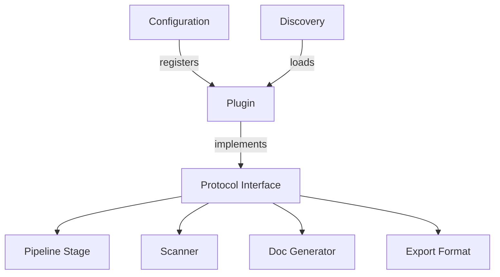

# Plugin Development Guide

## 1. Plugin Architecture

The Architecture Model system supports extension through several plugin patterns:



### Extension Points

| Extension Point | Protocol File | Description |
|---|---|---|
| Pipeline Stage | `pipeline/protocol.py` | Custom extraction stages |
| Language Scanner | `manifest/protocol.py` | New language support |
| Doc Generator | `docs/generator.py` | Custom documentation formats |
| Export Format | `export/` | New output formats |
| Domain Profile | `profiles/` | Domain-specific configurations |
| Validation Rules | `core/validator.py` | Custom validation logic |

## 2. Plugin API

### Pipeline Stage Protocol

Implement the stage protocol defined in `src/architecture_model/pipeline/protocol.py`:

```python
from dataclasses import dataclass
from typing import Any

class StageProtocol:
    """Base protocol all pipeline stages must implement."""
    
    name: str
    
    def execute(self, context: dict[str, Any]) -> dict[str, Any]:
        """Run stage logic, return updated context."""
        ...
    
    def validate_input(self, context: dict[str, Any]) -> bool:
        """Check preconditions."""
        ...
```

### Scanner Protocol

Add language support via `src/architecture_model/manifest/protocol.py`:

```python
class ScannerProtocol:
    """Protocol for language-specific scanners."""
    
    extensions: list[str]  # e.g., [".rs", ".go"]
    
    def scan_file(self, path: str) -> "FileManifest":
        """Parse a source file and return structural facts."""
        ...
    
    def resolve_imports(self, manifest: "FileManifest") -> list[str]:
        """Resolve import statements to file paths."""
        ...
```

### Configuration Hook

Plugins register via `src/architecture_model/config/loader.py`:

```python
# In your plugin's entry point
PLUGIN_CONFIG = {
    "name": "my-plugin",
    "version": "1.0.0",
    "extension_point": "scanner",  # or "stage", "generator", "export"
    "entry": "my_plugin:MyScanner",
}
```

## 3. Development Workflow

### Step 1: Scaffold the plugin

```bash
mkdir archmodel-plugin-rust-scanner
cd archmodel-plugin-rust-scanner
```

```
archmodel-plugin-rust-scanner/
├── pyproject.toml
├── src/
│   └── rust_scanner/
│       ├── __init__.py
│       └── scanner.py
└── tests/
    └── test_scanner.py
```

### Step 2: Implement the protocol

```python
# src/rust_scanner/scanner.py
from architecture_model.manifest.protocol import ScannerProtocol
from architecture_model.manifest.types import FileManifest, FunctionInfo

class RustScanner(ScannerProtocol):
    extensions = [".rs"]
    
    def scan_file(self, path: str) -> FileManifest:
        with open(path) as f:
            content = f.read()
        
        functions = self._extract_functions(content)
        imports = self._extract_imports(content)
        
        return FileManifest(
            path=path,
            language="rust",
            functions=functions,
            imports=imports,
        )
    
    def _extract_functions(self, content: str) -> list[FunctionInfo]:
        # Parse `fn` declarations
        ...
    
    def _extract_imports(self, content: str) -> list[str]:
        # Parse `use` statements
        ...
```

### Step 3: Register via entry point

```toml
# pyproject.toml
[project]
name = "archmodel-plugin-rust-scanner"
version = "0.1.0"
dependencies = ["architecture-model>=1.0"]

[project.entry-points."architecture_model.scanners"]
rust = "rust_scanner:RustScanner"
```

### Step 4: Configure

```yaml
# .archmodel/config.yaml
plugins:
  scanners:
    - rust_scanner:RustScanner
```

## 4. Examples

### Example: Custom Pipeline Stage

```python
from architecture_model.pipeline.protocol import StageProtocol
from architecture_model.core.types import ArchitectureModel

class SecurityAuditStage(StageProtocol):
    """Runs between 'relate' and 'specify' to flag security concerns."""
    
    name = "security_audit"
    after = "relate"
    before = "specify"
    
    def execute(self, context: dict) -> dict:
        model: ArchitectureModel = context["model"]
        
        findings = []
        for rel in model.relationships:
            if rel.protocol == "http" and "auth" not in (rel.tags or []):
                findings.append({
                    "component": rel.source,
                    "issue": "Unauthenticated HTTP relationship",
                    "severity": "high",
                })
        
        context["security_findings"] = findings
        return context
    
    def validate_input(self, context: dict) -> bool:
        return "model" in context and hasattr(context["model"], "relationships")
```

Register it:

```toml
[project.entry-points."architecture_model.stages"]
security_audit = "my_plugin:SecurityAuditStage"
```

### Example: Custom Doc Generator

```python
from architecture_model.docs.generator import DocGenerator
from architecture_model.core.types import ArchitectureModel

class ThreatModelDoc(DocGenerator):
    name = "threat_model"
    output_filename = "threat-model.md"
    
    def generate(self, model: ArchitectureModel, output_dir: str) -> str:
        lines = ["# Threat Model\n"]
        
        for comp in model.components:
            lines.append(f"## {comp.name}")
            lines.append(f"- Layer: {comp.layer}")
            lines.append(f"- External interfaces: {len(comp.interfaces)}")
            lines.append("")
        
        content = "\n".join(lines)
        path = f"{output_dir}/{self.output_filename}"
        with open(path, "w") as f:
            f.write(content)
        return path
```

## 5. Testing Plugins

```python
# tests/test_scanner.py
import pytest
from rust_scanner import RustScanner

@pytest.fixture
def scanner():
    return RustScanner()

def test_scan_simple_file(scanner, tmp_path):
    src = tmp_path / "main.rs"
    src.write_text("""
use std::io;

fn main() {
    println!("hello");
}

pub fn add(a: i32, b: i32) -> i32 {
    a + b
}
""")
    
    manifest = scanner.scan_file(str(src))
    
    assert manifest.language == "rust"
    assert len(manifest.functions) == 2
    assert manifest.functions[0].name == "main"
    assert "std::io" in manifest.imports

def test_extensions(scanner):
    assert scanner.extensions == [".rs"]
```

### Integration testing with the pipeline:

```python
from architecture_model.pipeline.coordinator import PipelineCoordinator

def test_plugin_in_pipeline(tmp_path):
    coordinator = PipelineCoordinator(
        source_dir=str(tmp_path),
        extra_stages=["my_plugin:SecurityAuditStage"],
    )
    result = coordinator.run()
    assert "security_findings" in result.context
```

## 6. Distribution

### Package with standard Python tooling:

```bash
pip install build
python -m build
```

### Publish:

```bash
twine upload dist/*
```

### Users install with:

```bash
pip install archmodel-plugin-rust-scanner
```

The entry point registration ensures automatic discovery — no manual configuration needed beyond installation. For explicit control, users can pin plugins in `.archmodel/config.yaml`.

### Naming Convention

Use the prefix `archmodel-plugin-` for discoverability:

- `archmodel-plugin-rust-scanner`
- `archmodel-plugin-security-audit`
- `archmodel-plugin-openapi-export`