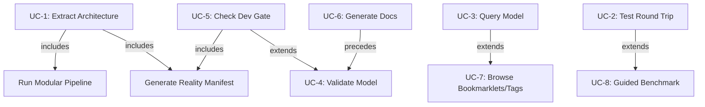

# Use Cases Document

## 1. Actor-Goal Matrix

| Actor | Primary Goals |
|-------|--------------|
| ACT-1: AI Agent (MCP Client) | Query models, retrieve documentation, consume exported artifacts, validate architecture |
| ACT-2: Developer | Extract architecture from code, run pipelines, manage models, generate documentation |
| ACT-3: CI/CD Pipeline | Validate models, check development gates, detect drift, run benchmarks |

## 2. Use Case Catalog

### UC-1: Extract Architecture from Source Code

| Field | Description |
|-------|-------------|
| **Actor** | Developer (ACT-2) |
| **Preconditions** | Source code repository exists; extraction pipeline is configured |
| **Main Flow** | 1. Developer invokes CLI (`BEH-24: Main`) via `ArgumentParser → add_subparsers → add_parser → add_argument → parse_args`  2. System executes 10-stage pipeline (CAP-3): observe → infer → allocate → relate → specify → contract → validate → decompose → synthesize → emit  3. AST scanning (CAP-2) derives components, relationships, behaviors  4. Reality manifest (CAP-4) is generated with structural facts  5. Model is emitted as flat-file output (CAP-15) |
| **Alternate Flows** | A1: Source contains unparseable files → skip and log warning  A2: No routes/classes found → emit empty model with warning |
| **Postconditions** | Architecture model exists with components, relationships, and behaviors populated |

---

### UC-2: Run Benchmark Test Round Trip

| Field | Description |
|-------|-------------|
| **Actor** | Developer (ACT-2) or CI/CD Pipeline (ACT-3) |
| **Preconditions** | Training examples available; CLI installed |
| **Main Flow** | 1. Actor invokes `BEH-22`: `ArgumentParser → add_argument → parse_args → print → load_training_examples`  2. System parses CLI arguments  3. Training examples are loaded  4. Round-trip extraction and regeneration is performed  5. Results are printed to output |
| **Alternate Flows** | A1: Training examples missing → exit with error  A2: Round-trip produces diff → report discrepancies |
| **Postconditions** | Benchmark results reported; pass/fail status determined |

---

### UC-3: Query Model via API

| Field | Description |
|-------|-------------|
| **Actor** | AI Agent (ACT-1) |
| **Preconditions** | System is running; model data is loaded; agent is authenticated |
| **Main Flow** | 1. Agent sends `GET models/` (BEH-7) to list available models  2. Agent sends `GET ^models/(?P<app_label>[^.]+)\.(?P<model_name>[^/]+)/$` (BEH-8) for specific model  3. System returns model details (components, relationships)  4. Agent optionally queries `GET views/` (BEH-5) or `GET views/<view>/` (BEH-6) for filtered views  5. Agent consumes response within token budget (CAP-15) |
| **Alternate Flows** | A1: Model not found → return 404  A2: Invalid app_label.model_name format → return 400 |
| **Postconditions** | Agent has received model data for downstream reasoning |

---

### UC-4: Validate Architecture Model

| Field | Description |
|-------|-------------|
| **Actor** | CI/CD Pipeline (ACT-3) |
| **Preconditions** | Architecture model exists in repository |
| **Main Flow** | 1. Pipeline triggers validation (CAP-1)  2. System checks model correctness (required fields, valid references)  3. System checks completeness (all components have behaviors)  4. System checks hierarchy consistency (parent/child links valid)  5. System checks domain rules  6. System returns pass/fail with detailed report |
| **Alternate Flows** | A1: Model file corrupt → fail with parse error  A2: Partial failures → report warnings, pass with caveats |
| **Postconditions** | Validation report generated; pipeline gate passes or blocks |

---

### UC-5: Check Development Gate

| Field | Description |
|-------|-------------|
| **Actor** | CI/CD Pipeline (ACT-3) |
| **Preconditions** | Authored architecture model exists; current code is available |
| **Main Flow** | 1. Pipeline invokes gate check (CAP-12)  2. System scans current code reality (CAP-4)  3. System compares code against architecture intent (CAP-13)  4. System scores coverage and drift  5. System returns gate status (pass/warn/fail) |
| **Alternate Flows** | A1: New code has no corresponding model element → flag as undocumented  A2: Model specifies component not yet implemented → report as pending |
| **Postconditions** | Gate result recorded; drift report available |

---

### UC-6: Generate SE Documentation

| Field | Description |
|-------|-------------|
| **Actor** | Developer (ACT-2) |
| **Preconditions** | Architecture model is validated and complete |
| **Main Flow** | 1. Developer requests documentation generation (CAP-5)  2. System produces functional analysis from behaviors  3. System produces logical architecture from components/relationships  4. System produces use cases from actors and behaviors  5. System produces requirements traceability  6. System emits markdown documents |
| **Alternate Flows** | A1: Model incomplete → generate partial docs with gaps noted |
| **Postconditions** | Full SE documentation suite generated |

---

### UC-7: Browse Bookmarklets and Tags

| Field | Description |
|-------|-------------|
| **Actor** | AI Agent (ACT-1) |
| **Preconditions** | System running; data populated |
| **Main Flow** | 1. Agent sends `GET bookmarklets/` (BEH-2)  2. System returns available bookmarklets  3. Agent sends `GET tags/` (BEH-3)  4. System returns tag taxonomy  5. Agent sends `GET filters/` (BEH-4) for available filter options |
| **Alternate Flows** | A1: No bookmarklets configured → return empty list |
| **Postconditions** | Agent has metadata for navigation and filtering |

---

### UC-8: Run Guided Benchmark

| Field | Description |
|-------|-------------|
| **Actor** | Developer (ACT-2) |
| **Preconditions** | Benchmark suite configured; test fixtures available |
| **Main Flow** | 1. Developer invokes `BEH-19`: `ArgumentParser → add_argument → parse_args → run → run_test_guided`  2. System parses arguments  3. System calls `run()` orchestrator  4. System executes `run_test_guided` with guided extraction  5. System reports results |
| **Alternate Flows** | A1: Missing arguments → display usage and exit  A2: Test failure → report failure details |
| **Postconditions** | Guided round-trip benchmark completed with results logged |

## 3. Use Case Relationships

| Relationship | From | To | Type |
|---|---|---|---|
| UC-1 includes CAP-3 | Extract Architecture | Run Modular Pipeline | Include |
| UC-1 includes CAP-4 | Extract Architecture | Generate Reality Manifest | Include |
| UC-5 includes UC-4 | Check Dev Gate | Validate Model | Include |
| UC-5 includes CAP-13 | Check Dev Gate | Detect Drift | Include |
| UC-6 requires UC-4 | Generate Docs | Validate Model | Precondition |
| UC-8 extends UC-2 | Guided Benchmark | Test Round Trip | Extend |