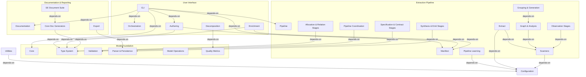

# System Boundary Diagram

```mermaid
graph TD
    subgraph SYS-1[Model Foundation]
        COMP-1[Core]
        COMP-1.1[Type System]
        COMP-1.2[Validation]
        COMP-1.3[Parser & Persistence]
        COMP-1.4[Model Operations]
        COMP-1.5[Quality Metrics]
    end
    subgraph SYS-2[Extraction Pipeline]
        COMP-2[Pipeline]
        COMP-2.1[Pipeline Coordination]
        COMP-2.2[Observation Stages]
        COMP-2.3[Allocation & Relation Stages]
        COMP-2.4[Specification & Contract Stages]
        COMP-2.5[Synthesis & Emit Stages]
        COMP-3[Manifest]
        COMP-3.1[Scanners]
        COMP-3.2[Graph & Analysis]
        COMP-3.3[Grouping & Generation]
        COMP-6[Extract]
        COMP-11[Pipeline Learning]
    end
    subgraph SYS-3[Documentation & Reporting]
        COMP-4[Documentation]
        COMP-4.1[Core Doc Generators]
        COMP-4.2[SE Document Suite]
        COMP-10[Export]
    end
    subgraph SYS-4[User Interface]
        COMP-5[Orchestration]
        COMP-5.1[Enrichment]
        COMP-5.2[Decomposition]
        COMP-7[Authoring]
        COMP-8[CLI]
    end
    COMP-9[Configuration]
    COMP-12[Utilities]
    COMP-2.1 -->|depends-on| COMP-1.1
    COMP-2.2 -->|depends-on| COMP-3.1
    COMP-2.3 -->|depends-on| COMP-1.1
    COMP-2.4 -->|depends-on| COMP-1.2
    COMP-2.5 -->|depends-on| COMP-1.3
    COMP-3.1 -->|depends-on| COMP-9
    COMP-3.2 -->|depends-on| COMP-3.1
    COMP-3.3 -->|depends-on| COMP-3.2
    COMP-4.1 -->|depends-on| COMP-1.1
    COMP-4.2 -->|depends-on| COMP-4.1
    COMP-5.1 -->|depends-on| COMP-3
    COMP-5.1 -->|depends-on| COMP-1.1
    COMP-5.2 -->|depends-on| COMP-1.5
    COMP-6 -->|depends-on| COMP-3.1
    COMP-6 -->|depends-on| COMP-9
    COMP-7 -->|depends-on| COMP-1.1
    COMP-7 -->|depends-on| COMP-3
    COMP-8 -->|depends-on| COMP-1
    COMP-8 -->|depends-on| COMP-2
    COMP-8 -->|depends-on| COMP-3
    COMP-8 -->|depends-on| COMP-4
    COMP-8 -->|depends-on| COMP-5
    COMP-8 -->|depends-on| COMP-7
    COMP-10 -->|depends-on| COMP-1.3
    COMP-11 -->|depends-on| COMP-9
    COMP-12 -->|depends-on| COMP-9
```
