# Integration Flows: architecture-model-standard

```mermaid
flowchart TD
  COMP-2.1[Pipeline Coordination] -->|depends-on| COMP-1.1[Type System]
  COMP-2.2[Observation Stages] -->|depends-on| COMP-3.1[Scanners]
  COMP-2.3[Allocation & Relation Stages] -->|depends-on| COMP-1.1[Type System]
  COMP-2.4[Specification & Contract Stages] -->|depends-on| COMP-1.2[Validation]
  COMP-2.5[Synthesis & Emit Stages] -->|depends-on| COMP-1.3[Parser & Persistence]
  COMP-3.1[Scanners] -->|depends-on| COMP-9[Configuration]
  COMP-3.2[Graph & Analysis] -->|depends-on| COMP-3.1[Scanners]
  COMP-3.3[Grouping & Generation] -->|depends-on| COMP-3.2[Graph & Analysis]
  COMP-4.1[Core Doc Generators] -->|depends-on| COMP-1.1[Type System]
  COMP-4.2[SE Document Suite] -->|depends-on| COMP-4.1[Core Doc Generators]
  COMP-5.1[Enrichment] -->|depends-on| COMP-3[Manifest]
  COMP-5.1[Enrichment] -->|depends-on| COMP-1.1[Type System]
  COMP-5.2[Decomposition] -->|depends-on| COMP-1.5[Quality Metrics]
  COMP-6[Extract] -->|depends-on| COMP-3.1[Scanners]
  COMP-6[Extract] -->|depends-on| COMP-9[Configuration]
  COMP-7[Authoring] -->|depends-on| COMP-1.1[Type System]
  COMP-7[Authoring] -->|depends-on| COMP-3[Manifest]
  COMP-8[CLI] -->|depends-on| COMP-1[Core]
  COMP-8[CLI] -->|depends-on| COMP-2[Pipeline]
  COMP-8[CLI] -->|depends-on| COMP-3[Manifest]
  COMP-8[CLI] -->|depends-on| COMP-4[Documentation]
  COMP-8[CLI] -->|depends-on| COMP-5[Orchestration]
  COMP-8[CLI] -->|depends-on| COMP-7[Authoring]
  COMP-10[Export] -->|depends-on| COMP-1.3[Parser & Persistence]
  COMP-11[Pipeline Learning] -->|depends-on| COMP-9[Configuration]
  COMP-12[Utilities] -->|depends-on| COMP-9[Configuration]
  COMP-1[Core] -->|contains| COMP-1.1[Type System]
  COMP-1[Core] -->|contains| COMP-1.2[Validation]
  COMP-1[Core] -->|contains| COMP-1.3[Parser & Persistence]
  COMP-1[Core] -->|contains| COMP-1.4[Model Operations]
  COMP-1[Core] -->|contains| COMP-1.5[Quality Metrics]
  COMP-2[Pipeline] -->|contains| COMP-2.1[Pipeline Coordination]
  COMP-2[Pipeline] -->|contains| COMP-2.2[Observation Stages]
  COMP-2[Pipeline] -->|contains| COMP-2.3[Allocation & Relation Stages]
  COMP-2[Pipeline] -->|contains| COMP-2.4[Specification & Contract Stages]
  COMP-2[Pipeline] -->|contains| COMP-2.5[Synthesis & Emit Stages]
  COMP-2[Pipeline] -->|contains| COMP-11[Pipeline Learning]
  COMP-3[Manifest] -->|contains| COMP-3.1[Scanners]
  COMP-3[Manifest] -->|contains| COMP-3.2[Graph & Analysis]
  COMP-3[Manifest] -->|contains| COMP-3.3[Grouping & Generation]
  COMP-4[Documentation] -->|contains| COMP-4.1[Core Doc Generators]
  COMP-4[Documentation] -->|contains| COMP-4.2[SE Document Suite]
  COMP-5[Orchestration] -->|contains| COMP-5.1[Enrichment]
  COMP-5[Orchestration] -->|contains| COMP-5.2[Decomposition]
```

## Pipeline Coordination → Type System (depends-on)
Pipeline coordination uses core types

**Source:** COMP-2.1 (Pipeline Coordination)
**Target:** COMP-1.1 (Type System)

## Observation Stages → Scanners (depends-on)
Observe stage uses scanners for code facts

**Source:** COMP-2.2 (Observation Stages)
**Target:** COMP-3.1 (Scanners)

## Allocation & Relation Stages → Type System (depends-on)
Allocation uses core types and model structure

**Source:** COMP-2.3 (Allocation & Relation Stages)
**Target:** COMP-1.1 (Type System)

## Specification & Contract Stages → Validation (depends-on)
Validate stage invokes core validator

**Source:** COMP-2.4 (Specification & Contract Stages)
**Target:** COMP-1.2 (Validation)

## Synthesis & Emit Stages → Parser & Persistence (depends-on)
Emit stage uses parser for YAML output

**Source:** COMP-2.5 (Synthesis & Emit Stages)
**Target:** COMP-1.3 (Parser & Persistence)

## Scanners → Configuration (depends-on)
Scanners use config for exclusion patterns

**Source:** COMP-3.1 (Scanners)
**Target:** COMP-9 (Configuration)

## Graph & Analysis → Scanners (depends-on)
Graph analysis builds on scanner output

**Source:** COMP-3.2 (Graph & Analysis)
**Target:** COMP-3.1 (Scanners)

## Grouping & Generation → Graph & Analysis (depends-on)
Grouping uses graph edges for affinity

**Source:** COMP-3.3 (Grouping & Generation)
**Target:** COMP-3.2 (Graph & Analysis)

## Core Doc Generators → Type System (depends-on)
Doc generators read model types

**Source:** COMP-4.1 (Core Doc Generators)
**Target:** COMP-1.1 (Type System)

## SE Document Suite → Core Doc Generators (depends-on)
SE docs build on core doc generators

**Source:** COMP-4.2 (SE Document Suite)
**Target:** COMP-4.1 (Core Doc Generators)

## Enrichment → Manifest (depends-on)
Enrichment reads manifest data

**Source:** COMP-5.1 (Enrichment)
**Target:** COMP-3 (Manifest)

## Enrichment → Type System (depends-on)
Enrichment populates core types

**Source:** COMP-5.1 (Enrichment)
**Target:** COMP-1.1 (Type System)

## Decomposition → Quality Metrics (depends-on)
Decomposition uses quality metrics

**Source:** COMP-5.2 (Decomposition)
**Target:** COMP-1.5 (Quality Metrics)

## Extract → Scanners (depends-on)
Extract uses scanners for code analysis

**Source:** COMP-6 (Extract)
**Target:** COMP-3.1 (Scanners)

## Extract → Configuration (depends-on)
Extract uses config for settings

**Source:** COMP-6 (Extract)
**Target:** COMP-9 (Configuration)

## Authoring → Type System (depends-on)
Authoring produces core model types

**Source:** COMP-7 (Authoring)
**Target:** COMP-1.1 (Type System)

## Authoring → Manifest (depends-on)
Gate check reads manifest

**Source:** COMP-7 (Authoring)
**Target:** COMP-3 (Manifest)

## CLI → Core (depends-on)
CLI imports all core operations

**Source:** COMP-8 (CLI)
**Target:** COMP-1 (Core)

## CLI → Pipeline (depends-on)
CLI orchestrates pipeline runs

**Source:** COMP-8 (CLI)
**Target:** COMP-2 (Pipeline)

## CLI → Manifest (depends-on)
CLI triggers manifest generation

**Source:** COMP-8 (CLI)
**Target:** COMP-3 (Manifest)

## CLI → Documentation (depends-on)
CLI triggers doc generation

**Source:** COMP-8 (CLI)
**Target:** COMP-4 (Documentation)

## CLI → Orchestration (depends-on)
CLI triggers enrichment/decomposition

**Source:** COMP-8 (CLI)
**Target:** COMP-5 (Orchestration)

## CLI → Authoring (depends-on)
CLI triggers authoring commands

**Source:** COMP-8 (CLI)
**Target:** COMP-7 (Authoring)

## Export → Parser & Persistence (depends-on)
Export serializes model data

**Source:** COMP-10 (Export)
**Target:** COMP-1.3 (Parser & Persistence)

## Pipeline Learning → Configuration (depends-on)
Learning store uses config for paths

**Source:** COMP-11 (Pipeline Learning)
**Target:** COMP-9 (Configuration)

## Utilities → Configuration (depends-on)
Utilities use config

**Source:** COMP-12 (Utilities)
**Target:** COMP-9 (Configuration)

## Core → Type System (contains)
—

**Source:** COMP-1 (Core)
**Target:** COMP-1.1 (Type System)

## Core → Validation (contains)
—

**Source:** COMP-1 (Core)
**Target:** COMP-1.2 (Validation)

## Core → Parser & Persistence (contains)
—

**Source:** COMP-1 (Core)
**Target:** COMP-1.3 (Parser & Persistence)

## Core → Model Operations (contains)
—

**Source:** COMP-1 (Core)
**Target:** COMP-1.4 (Model Operations)

## Core → Quality Metrics (contains)
—

**Source:** COMP-1 (Core)
**Target:** COMP-1.5 (Quality Metrics)

## Pipeline → Pipeline Coordination (contains)
—

**Source:** COMP-2 (Pipeline)
**Target:** COMP-2.1 (Pipeline Coordination)

## Pipeline → Observation Stages (contains)
—

**Source:** COMP-2 (Pipeline)
**Target:** COMP-2.2 (Observation Stages)

## Pipeline → Allocation & Relation Stages (contains)
—

**Source:** COMP-2 (Pipeline)
**Target:** COMP-2.3 (Allocation & Relation Stages)

## Pipeline → Specification & Contract Stages (contains)
—

**Source:** COMP-2 (Pipeline)
**Target:** COMP-2.4 (Specification & Contract Stages)

## Pipeline → Synthesis & Emit Stages (contains)
—

**Source:** COMP-2 (Pipeline)
**Target:** COMP-2.5 (Synthesis & Emit Stages)

## Pipeline → Pipeline Learning (contains)
—

**Source:** COMP-2 (Pipeline)
**Target:** COMP-11 (Pipeline Learning)

## Manifest → Scanners (contains)
—

**Source:** COMP-3 (Manifest)
**Target:** COMP-3.1 (Scanners)

## Manifest → Graph & Analysis (contains)
—

**Source:** COMP-3 (Manifest)
**Target:** COMP-3.2 (Graph & Analysis)

## Manifest → Grouping & Generation (contains)
—

**Source:** COMP-3 (Manifest)
**Target:** COMP-3.3 (Grouping & Generation)

## Documentation → Core Doc Generators (contains)
—

**Source:** COMP-4 (Documentation)
**Target:** COMP-4.1 (Core Doc Generators)

## Documentation → SE Document Suite (contains)
—

**Source:** COMP-4 (Documentation)
**Target:** COMP-4.2 (SE Document Suite)

## Orchestration → Enrichment (contains)
—

**Source:** COMP-5 (Orchestration)
**Target:** COMP-5.1 (Enrichment)

## Orchestration → Decomposition (contains)
—

**Source:** COMP-5 (Orchestration)
**Target:** COMP-5.2 (Decomposition)
