# Logical Architecture: architecture-model-standard

## Layer Structure

*No layers defined.*

## Component Allocation

### application

| Component | Kind | Files | Responsibilities |
|-----------|------|-------|------------------|
| Documentation (COMP-4) | library | 1 files | — |
| Core Doc Generators (COMP-4.1) | library | 11 files | — |
| SE Document Suite (COMP-4.2) | library | 21 files | — |
| Orchestration (COMP-5) | service | 1 files | — |
| Enrichment (COMP-5.1) | service | 7 files | — |
| Decomposition (COMP-5.2) | service | 6 files | — |
| Authoring (COMP-7) | library | 3 files | — |
| Export (COMP-10) | library | 3 files | — |

### domain

| Component | Kind | Files | Responsibilities |
|-----------|------|-------|------------------|
| Pipeline (COMP-2) | service | 1 files | — |
| Pipeline Coordination (COMP-2.1) | service | 7 files | — |
| Observation Stages (COMP-2.2) | service | 4 files | — |
| Allocation & Relation Stages (COMP-2.3) | service | 4 files | — |
| Specification & Contract Stages (COMP-2.4) | service | 6 files | — |
| Synthesis & Emit Stages (COMP-2.5) | service | 7 files | — |
| Manifest (COMP-3) | library | 2 files | — |
| Scanners (COMP-3.1) | library | 8 files | — |
| Graph & Analysis (COMP-3.2) | library | 5 files | — |
| Grouping & Generation (COMP-3.3) | library | 6 files | — |
| Extract (COMP-6) | library | 5 files | — |
| Pipeline Learning (COMP-11) | library | 3 files | — |

### foundation

| Component | Kind | Files | Responsibilities |
|-----------|------|-------|------------------|
| Core (COMP-1) | library | 1 files | — |
| Type System (COMP-1.1) | library | 1 files | — |
| Validation (COMP-1.2) | library | 2 files | — |
| Parser & Persistence (COMP-1.3) | library | 5 files | — |
| Model Operations (COMP-1.4) | library | 8 files | — |
| Quality Metrics (COMP-1.5) | library | 5 files | — |

### infrastructure

| Component | Kind | Files | Responsibilities |
|-----------|------|-------|------------------|
| Configuration (COMP-9) | library | 6 files | — |
| Utilities (COMP-12) | library | 6 files | — |

### interface

| Component | Kind | Files | Responsibilities |
|-----------|------|-------|------------------|
| CLI (COMP-8) | service | 5 files | — |

## Inter-Component Interfaces

*No interfaces defined.*

## Dependency Graph

```mermaid
graph TD
    COMP-2.1["Pipeline Coordination"]
    COMP-1.1["Type System"]
    COMP-2.1 --> COMP-1.1
    COMP-2.2["Observation Stages"]
    COMP-3.1["Scanners"]
    COMP-2.2 --> COMP-3.1
    COMP-2.3["Allocation & Relation Stages"]
    COMP-2.3 --> COMP-1.1
    COMP-2.4["Specification & Contract Stages"]
    COMP-1.2["Validation"]
    COMP-2.4 --> COMP-1.2
    COMP-2.5["Synthesis & Emit Stages"]
    COMP-1.3["Parser & Persistence"]
    COMP-2.5 --> COMP-1.3
    COMP-9["Configuration"]
    COMP-3.1 --> COMP-9
    COMP-3.2["Graph & Analysis"]
    COMP-3.2 --> COMP-3.1
    COMP-3.3["Grouping & Generation"]
    COMP-3.3 --> COMP-3.2
    COMP-4.1["Core Doc Generators"]
    COMP-4.1 --> COMP-1.1
    COMP-4.2["SE Document Suite"]
    COMP-4.2 --> COMP-4.1
    COMP-5.1["Enrichment"]
    COMP-3["Manifest"]
    COMP-5.1 --> COMP-3
    COMP-5.1 --> COMP-1.1
    COMP-5.2["Decomposition"]
    COMP-1.5["Quality Metrics"]
    COMP-5.2 --> COMP-1.5
    COMP-6["Extract"]
    COMP-6 --> COMP-3.1
    COMP-6 --> COMP-9
    COMP-7["Authoring"]
    COMP-7 --> COMP-1.1
    COMP-7 --> COMP-3
    COMP-8["CLI"]
    COMP-1["Core"]
    COMP-8 --> COMP-1
    COMP-2["Pipeline"]
    COMP-8 --> COMP-2
    COMP-8 --> COMP-3
    COMP-4["Documentation"]
    COMP-8 --> COMP-4
    COMP-5["Orchestration"]
    COMP-8 --> COMP-5
    COMP-8 --> COMP-7
    COMP-10["Export"]
    COMP-10 --> COMP-1.3
    COMP-11["Pipeline Learning"]
    COMP-11 --> COMP-9
    COMP-12["Utilities"]
    COMP-12 --> COMP-9
```

