# System Design: architecture-model-standard

## Architecture Overview

—
Schema version: 1.3

## Component Inventory

| ID | Name | Status | Files | Behaviors |
|----|------|--------|-------|-----------|
| COMP-1 | Core | Status.ACTIVE | 1 | 0 |
| COMP-1.1 | Type System | Status.ACTIVE | 1 | 0 |
| COMP-1.2 | Validation | Status.ACTIVE | 2 | 1 |
| COMP-1.3 | Parser & Persistence | Status.ACTIVE | 5 | 0 |
| COMP-1.4 | Model Operations | Status.ACTIVE | 8 | 3 |
| COMP-1.5 | Quality Metrics | Status.ACTIVE | 5 | 1 |
| COMP-2 | Pipeline | Status.ACTIVE | 1 | 1 |
| COMP-2.1 | Pipeline Coordination | Status.ACTIVE | 7 | 0 |
| COMP-2.2 | Observation Stages | Status.ACTIVE | 4 | 0 |
| COMP-2.3 | Allocation & Relation Stages | Status.ACTIVE | 4 | 0 |
| COMP-2.4 | Specification & Contract Stages | Status.ACTIVE | 6 | 0 |
| COMP-2.5 | Synthesis & Emit Stages | Status.ACTIVE | 7 | 0 |
| COMP-3 | Manifest | Status.ACTIVE | 2 | 1 |
| COMP-3.1 | Scanners | Status.ACTIVE | 8 | 0 |
| COMP-3.2 | Graph & Analysis | Status.ACTIVE | 5 | 0 |
| COMP-3.3 | Grouping & Generation | Status.ACTIVE | 6 | 0 |
| COMP-4 | Documentation | Status.ACTIVE | 1 | 0 |
| COMP-4.1 | Core Doc Generators | Status.ACTIVE | 11 | 0 |
| COMP-4.2 | SE Document Suite | Status.ACTIVE | 21 | 1 |
| COMP-5 | Orchestration | Status.ACTIVE | 1 | 0 |
| COMP-5.1 | Enrichment | Status.ACTIVE | 7 | 1 |
| COMP-5.2 | Decomposition | Status.ACTIVE | 6 | 1 |
| COMP-6 | Extract | Status.ACTIVE | 5 | 1 |
| COMP-7 | Authoring | Status.ACTIVE | 3 | 2 |
| COMP-8 | CLI | Status.ACTIVE | 5 | 0 |
| COMP-9 | Configuration | Status.ACTIVE | 6 | 0 |
| COMP-10 | Export | Status.ACTIVE | 3 | 1 |
| COMP-11 | Pipeline Learning | Status.ACTIVE | 3 | 1 |
| COMP-12 | Utilities | Status.ACTIVE | 6 | 0 |

## Key Behaviors

- **GET ** (BEH-1)
- **GET bookmarklets/** (BEH-2)
- **GET tags/** (BEH-3)
- **GET filters/** (BEH-4)
- **GET views/** (BEH-5)
- **GET views/<view>/** (BEH-6)
- **GET models/** (BEH-7)
- **GET ^models/(?P<app_label>[^.]+)\.(?P<model_name>[^/]+)/$** (BEH-8)
- **GET templates/<path:template>/** (BEH-9)
- **GET login/** (BEH-10)
- **GET logout/** (BEH-11)
- **GET password_change/** (BEH-12)
- **GET password_change/done/** (BEH-13)
- **GET password_reset/** (BEH-14)
- **GET password_reset/done/** (BEH-15)
- **GET reset/<uidb64>/<token>/** (BEH-16)
- **GET reset/done/** (BEH-17)
- **GET <path:url>** (BEH-18)
- **CLI: Test Guided Round Trip** (BEH-19)
- **CLI: Test Enriched Round Trip** (BEH-20)
- **CLI: Test Multi Repo** (BEH-21)
- **CLI: Test Round Trip** (BEH-22)
- **CLI: Test Decomposed Round Trip** (BEH-23)
- **CLI: Main** (BEH-24)
- **CLI: Runner** (BEH-25)

## Relationship Summary

| Type | Count |
|------|-------|
| contains | 18 |
| depends-on | 26 |
| exposes | 2 |
| realizes | 15 |
| satisfies | 49 |

## Architecture Diagram

```mermaid
graph TD
  COMP-2.1[Pipeline Coordination] --> COMP-1.1[Type System]
  COMP-2.2[Observation Stages] --> COMP-3.1[Scanners]
  COMP-2.3[Allocation & Relation Stages] --> COMP-1.1[Type System]
  COMP-2.4[Specification & Contract Stages] --> COMP-1.2[Validation]
  COMP-2.5[Synthesis & Emit Stages] --> COMP-1.3[Parser & Persistence]
  COMP-3.1[Scanners] --> COMP-9[Configuration]
  COMP-3.2[Graph & Analysis] --> COMP-3.1[Scanners]
  COMP-3.3[Grouping & Generation] --> COMP-3.2[Graph & Analysis]
  COMP-4.1[Core Doc Generators] --> COMP-1.1[Type System]
  COMP-4.2[SE Document Suite] --> COMP-4.1[Core Doc Generators]
  COMP-5.1[Enrichment] --> COMP-3[Manifest]
  COMP-5.1[Enrichment] --> COMP-1.1[Type System]
  COMP-5.2[Decomposition] --> COMP-1.5[Quality Metrics]
  COMP-6[Extract] --> COMP-3.1[Scanners]
  COMP-6[Extract] --> COMP-9[Configuration]
  COMP-7[Authoring] --> COMP-1.1[Type System]
  COMP-7[Authoring] --> COMP-3[Manifest]
  COMP-8[CLI] --> COMP-1[Core]
  COMP-8[CLI] --> COMP-2[Pipeline]
  COMP-8[CLI] --> COMP-3[Manifest]
  COMP-8[CLI] --> COMP-4[Documentation]
  COMP-8[CLI] --> COMP-5[Orchestration]
  COMP-8[CLI] --> COMP-7[Authoring]
  COMP-10[Export] --> COMP-1.3[Parser & Persistence]
  COMP-11[Pipeline Learning] --> COMP-9[Configuration]
  COMP-12[Utilities] --> COMP-9[Configuration]
```

