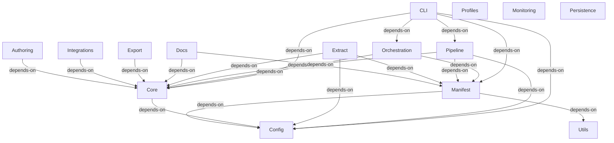

# Component Diagram

```mermaid
graph TD
    COMP-CORE[Core]
    COMP-MANIFEST[Manifest]
    COMP-PIPELINE[Pipeline]
    COMP-ORCHESTRATION[Orchestration]
    COMP-CLI[CLI]
    COMP-EXTRACT[Extract]
    COMP-DOCS[Docs]
    COMP-EXPORT[Export]
    COMP-CONFIG[Config]
    COMP-AUTHORING[Authoring]
    COMP-UTILS[Utils]
    COMP-PROFILES[Profiles]
    COMP-MONITORING[Monitoring]
    COMP-PERSISTENCE[Persistence]
    COMP-INTEGRATIONS[Integrations]
    COMP-CLI -->|depends-on| COMP-CORE
    COMP-CLI -->|depends-on| COMP-ORCHESTRATION
    COMP-CLI -->|depends-on| COMP-PIPELINE
    COMP-CLI -->|depends-on| COMP-MANIFEST
    COMP-CLI -->|depends-on| COMP-CONFIG
    COMP-ORCHESTRATION -->|depends-on| COMP-CORE
    COMP-ORCHESTRATION -->|depends-on| COMP-MANIFEST
    COMP-PIPELINE -->|depends-on| COMP-CORE
    COMP-PIPELINE -->|depends-on| COMP-MANIFEST
    COMP-PIPELINE -->|depends-on| COMP-CONFIG
    COMP-EXTRACT -->|depends-on| COMP-CORE
    COMP-EXTRACT -->|depends-on| COMP-MANIFEST
    COMP-EXTRACT -->|depends-on| COMP-CONFIG
    COMP-DOCS -->|depends-on| COMP-CORE
    COMP-DOCS -->|depends-on| COMP-MANIFEST
    COMP-EXPORT -->|depends-on| COMP-CORE
    COMP-INTEGRATIONS -->|depends-on| COMP-CORE
    COMP-AUTHORING -->|depends-on| COMP-CORE
    COMP-CORE -->|depends-on| COMP-CONFIG
    COMP-MANIFEST -->|depends-on| COMP-CONFIG
    COMP-MANIFEST -->|depends-on| COMP-UTILS
```
