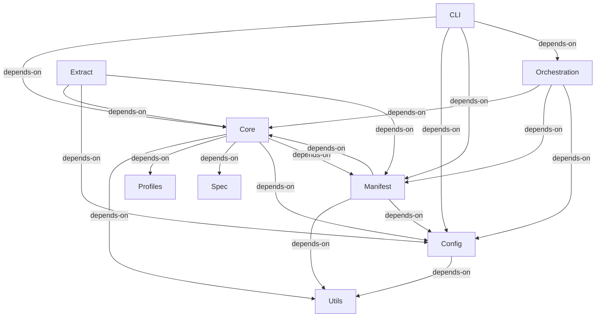

# Integration Flows: architecture-model-standard

## CLI → Core (depends-on)
—

**Source:** COMP-CLI (CLI)
**Target:** COMP-CORE (Core)

## CLI → Config (depends-on)
—

**Source:** COMP-CLI (CLI)
**Target:** COMP-CONFIG (Config)

## CLI → Manifest (depends-on)
—

**Source:** COMP-CLI (CLI)
**Target:** COMP-MANIFEST (Manifest)

## CLI → Orchestration (depends-on)
—

**Source:** COMP-CLI (CLI)
**Target:** COMP-ORCHESTRATION (Orchestration)

## Orchestration → Core (depends-on)
—

**Source:** COMP-ORCHESTRATION (Orchestration)
**Target:** COMP-CORE (Core)

## Orchestration → Manifest (depends-on)
—

**Source:** COMP-ORCHESTRATION (Orchestration)
**Target:** COMP-MANIFEST (Manifest)

## Orchestration → Config (depends-on)
—

**Source:** COMP-ORCHESTRATION (Orchestration)
**Target:** COMP-CONFIG (Config)

## Extract → Core (depends-on)
—

**Source:** COMP-EXTRACT (Extract)
**Target:** COMP-CORE (Core)

## Extract → Config (depends-on)
—

**Source:** COMP-EXTRACT (Extract)
**Target:** COMP-CONFIG (Config)

## Extract → Manifest (depends-on)
—

**Source:** COMP-EXTRACT (Extract)
**Target:** COMP-MANIFEST (Manifest)

## Core → Utils (depends-on)
—

**Source:** COMP-CORE (Core)
**Target:** COMP-UTILS (Utils)

## Manifest → Utils (depends-on)
—

**Source:** COMP-MANIFEST (Manifest)
**Target:** COMP-UTILS (Utils)

## Config → Utils (depends-on)
—

**Source:** COMP-CONFIG (Config)
**Target:** COMP-UTILS (Utils)

## Core → Profiles (depends-on)
—

**Source:** COMP-CORE (Core)
**Target:** COMP-PROFILES (Profiles)

## Core → Spec (depends-on)
—

**Source:** COMP-CORE (Core)
**Target:** COMP-SPEC (Spec)

## Core → Config (depends-on)
—

**Source:** COMP-CORE (Core)
**Target:** COMP-CONFIG (Config)

## Core → Manifest (depends-on)
—

**Source:** COMP-CORE (Core)
**Target:** COMP-MANIFEST (Manifest)

## Manifest → Config (depends-on)
—

**Source:** COMP-MANIFEST (Manifest)
**Target:** COMP-CONFIG (Config)

## Manifest → Core (depends-on)
—

**Source:** COMP-MANIFEST (Manifest)
**Target:** COMP-CORE (Core)
