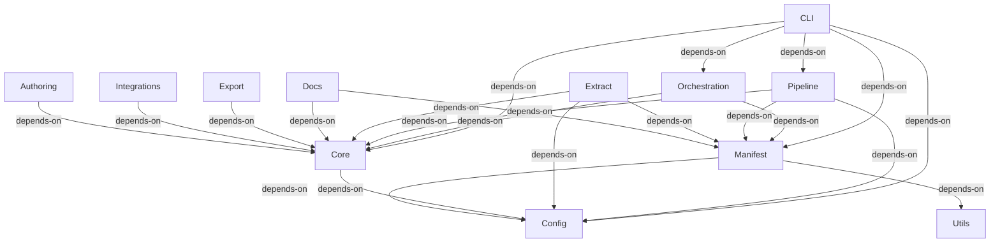

# Integration Flows: architecture-model-standard

## CLI → Core (depends-on)
—

**Source:** COMP-CLI (CLI)
**Target:** COMP-CORE (Core)

## CLI → Orchestration (depends-on)
—

**Source:** COMP-CLI (CLI)
**Target:** COMP-ORCHESTRATION (Orchestration)

## CLI → Pipeline (depends-on)
—

**Source:** COMP-CLI (CLI)
**Target:** COMP-PIPELINE (Pipeline)

## CLI → Manifest (depends-on)
—

**Source:** COMP-CLI (CLI)
**Target:** COMP-MANIFEST (Manifest)

## CLI → Config (depends-on)
—

**Source:** COMP-CLI (CLI)
**Target:** COMP-CONFIG (Config)

## Orchestration → Core (depends-on)
—

**Source:** COMP-ORCHESTRATION (Orchestration)
**Target:** COMP-CORE (Core)

## Orchestration → Manifest (depends-on)
—

**Source:** COMP-ORCHESTRATION (Orchestration)
**Target:** COMP-MANIFEST (Manifest)

## Pipeline → Core (depends-on)
—

**Source:** COMP-PIPELINE (Pipeline)
**Target:** COMP-CORE (Core)

## Pipeline → Manifest (depends-on)
—

**Source:** COMP-PIPELINE (Pipeline)
**Target:** COMP-MANIFEST (Manifest)

## Pipeline → Config (depends-on)
—

**Source:** COMP-PIPELINE (Pipeline)
**Target:** COMP-CONFIG (Config)

## Extract → Core (depends-on)
—

**Source:** COMP-EXTRACT (Extract)
**Target:** COMP-CORE (Core)

## Extract → Manifest (depends-on)
—

**Source:** COMP-EXTRACT (Extract)
**Target:** COMP-MANIFEST (Manifest)

## Extract → Config (depends-on)
—

**Source:** COMP-EXTRACT (Extract)
**Target:** COMP-CONFIG (Config)

## Docs → Core (depends-on)
—

**Source:** COMP-DOCS (Docs)
**Target:** COMP-CORE (Core)

## Docs → Manifest (depends-on)
—

**Source:** COMP-DOCS (Docs)
**Target:** COMP-MANIFEST (Manifest)

## Export → Core (depends-on)
—

**Source:** COMP-EXPORT (Export)
**Target:** COMP-CORE (Core)

## Integrations → Core (depends-on)
—

**Source:** COMP-INTEGRATIONS (Integrations)
**Target:** COMP-CORE (Core)

## Authoring → Core (depends-on)
—

**Source:** COMP-AUTHORING (Authoring)
**Target:** COMP-CORE (Core)

## Core → Config (depends-on)
—

**Source:** COMP-CORE (Core)
**Target:** COMP-CONFIG (Config)

## Manifest → Config (depends-on)
—

**Source:** COMP-MANIFEST (Manifest)
**Target:** COMP-CONFIG (Config)

## Manifest → Utils (depends-on)
—

**Source:** COMP-MANIFEST (Manifest)
**Target:** COMP-UTILS (Utils)
