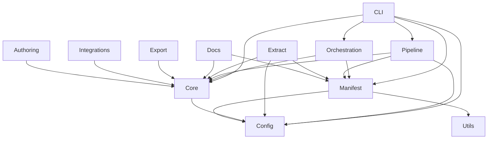

# System Design: architecture-model-standard

## Architecture Overview

—
Schema version: 2.0

## Component Inventory

| ID | Name | Status | Files | Behaviors |
|----|------|--------|-------|-----------|
| COMP-CORE | Core | Status.ACTIVE | 18 | 5 |
| COMP-MANIFEST | Manifest | Status.ACTIVE | 21 | 1 |
| COMP-PIPELINE | Pipeline | Status.ACTIVE | 22 | 2 |
| COMP-ORCHESTRATION | Orchestration | Status.ACTIVE | 15 | 2 |
| COMP-CLI | CLI | Status.ACTIVE | 3 | 0 |
| COMP-EXTRACT | Extract | Status.ACTIVE | 6 | 1 |
| COMP-DOCS | Docs | Status.ACTIVE | 12 | 1 |
| COMP-EXPORT | Export | Status.ACTIVE | 3 | 1 |
| COMP-CONFIG | Config | Status.ACTIVE | 3 | 1 |
| COMP-AUTHORING | Authoring | Status.ACTIVE | 3 | 1 |
| COMP-UTILS | Utils | Status.ACTIVE | 2 | 0 |
| COMP-PROFILES | Profiles | Status.ACTIVE | 2 | 1 |
| COMP-MONITORING | Monitoring | Status.ACTIVE | 2 | 0 |
| COMP-PERSISTENCE | Persistence | Status.ACTIVE | 2 | 0 |
| COMP-INTEGRATIONS | Integrations | Status.ACTIVE | 2 | 0 |

## Layer Structure

- **CLI Layer** (LYR-CLI)
- **Orchestration Layer** (LYR-ORCHESTRATION)
- **Core Layer** (LYR-CORE)
- **Manifest Layer** (LYR-MANIFEST)
- **Pipeline Layer** (LYR-PIPELINE)
- **Infrastructure Layer** (LYR-INFRA)

## Key Behaviors

- **Project Initialization** (BEH-INIT)
- **Pipeline Execution** (BEH-PIPELINE)
- **Model Enrichment** (BEH-ENRICH)
- **Regen Score Computation** (BEH-REGEN-SCORE)
- **LLM Model Loading** (BEH-LLM-LOAD)

## Relationship Summary

| Type | Count |
|------|-------|
| constrained-by | 4 |
| consumes | 3 |
| contains | 15 |
| depends-on | 21 |
| exposes | 5 |
| realizes | 16 |
| traces-to | 5 |

## Architecture Diagram

