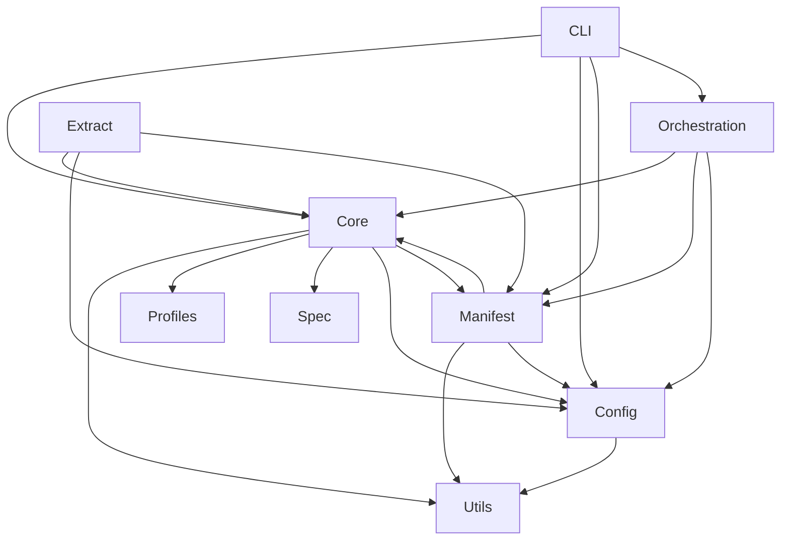

# System Design: architecture-model-standard

## Architecture Overview

—
Schema version: 2.0

## Component Inventory

| ID | Name | Status | Files | Behaviors |
|----|------|--------|-------|-----------|
| COMP-CORE | Core | Status.ACTIVE | 9 | 3 |
| COMP-MANIFEST | Manifest | Status.ACTIVE | 11 | 1 |
| COMP-CONFIG | Config | Status.ACTIVE | 2 | 1 |
| COMP-CLI | CLI | Status.ACTIVE | 2 | 1 |
| COMP-ORCHESTRATION | Orchestration | Status.ACTIVE | 2 | 1 |
| COMP-EXTRACT | Extract | Status.ACTIVE | 1 | 1 |
| COMP-UTILS | Utils | Status.ACTIVE | 1 | 1 |
| COMP-PROFILES | Profiles | Status.ACTIVE | 1 | 1 |
| COMP-SPEC | Spec | Status.ACTIVE | 0 | 1 |

## Layer Structure

- **Library** (LAYER-LIB)
- **Orchestration** (LAYER-ORCH)
- **User Interface** (LAYER-UI)

## Key Behaviors

- **CRUD: 6 CRUD endpoints (1 CLI, 4 CLI:, 1 MCP)** (BEH-CRUD-_unknown)

## Relationship Summary

| Type | Count |
|------|-------|
| allocated-to | 9 |
| constrained-by | 2 |
| consumes | 7 |
| depends-on | 19 |
| exposes | 13 |
| realizes | 11 |
| traces-to | 9 |

## Architecture Diagram

