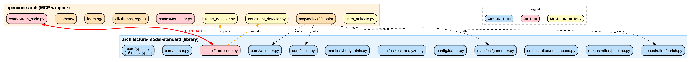
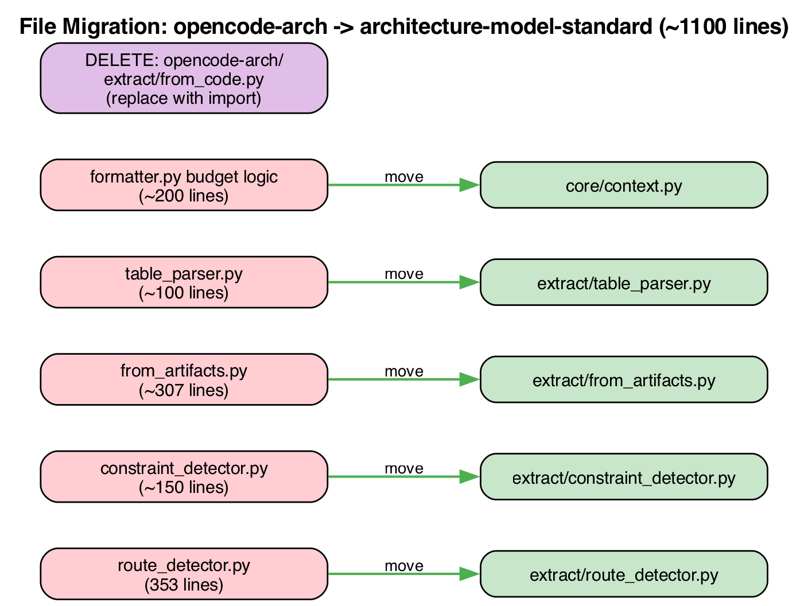

# Extraction Pipeline Comparison

**Repos:** `architecture-model-standard` (this repo) vs `opencode-arch` (`../opencode-arch/`)  
**Date:** 2026-08-06

---

## Repository Relationship Diagram

{width=100%}

---

## Repo Roles

| Aspect | architecture-model-standard | opencode-arch |
|--------|----------------------------|---------------|
| **Role** | Schema + library layer | MCP wrapper + agent tooling |
| **Installs as** | `architecture-model-standard` | `opencode-arch` |
| **Depends on** | Nothing (standalone) | architecture-model-standard |
| **LLM calls** | Zero (pure computation) | Zero in tools; agent drives extraction |
| **Key exports** | Types, parser, validator, slicer, manifest generator, enrichment | MCP tools, CLI, telemetry, learning loop |
| **Intended boundary** | "What the system can do" (algorithms, schemas) | "How the agent uses it" (protocol, context, iteration) |

---

## Pipeline Stage Coverage

| Stage | arch-std | oa | Location |
|-------|:--:|:--:|----------|
| 0. Config Discovery | doc+impl | mentioned | `config/loader.py` |
| 1. Manifest Generation | doc+impl | doc | `manifest/generator.py` |
| 2. Module Grouping | impl | doc | `manifest/grouping.py` |
| 3. Context Compression | impl | doc | Both repos |
| 4. Entity Decomposition | doc+impl | doc | Both repos |
| 5. Validation | doc+impl | doc | `core/validator.py` |
| 6. Store + Post-Store | — | doc+impl | `oa: mcp/tools/extract.py` |
| 7. Representativeness | impl | doc | `oa: mcp/tools/check.py` |
| 8. Iteration/Escalation | — | doc | Agent-driven |
| 9. Enrichment | doc+impl | mentioned | `orchestration/enrich.py` |
| 10. Body Hints | doc+impl | — | `manifest/body_hints.py` |
| 11. Test Contracts | doc+impl | — | `manifest/test_analyzer.py` |
| 12. Pipeline | doc+impl | — | `orchestration/pipeline.py` |
| 13. Relationship Tracing | doc+impl | — | `orchestration/decompose.py` |
| 14. Deep Decomposition | doc+impl | — | `orchestration/deep_decompose.py` |
| 15. Compaction | doc+impl | doc+uses | `orchestration/compaction.py` |
| System Detection | doc+impl | — | `core/decomposer.py` |
| Use Case Inference | doc+impl | doc | `orchestration/use_case_inference.py` |
| Learning Loop | — | impl | `oa: learning/` |
| Telemetry | — | impl | `oa: telemetry/` |

*arch-std = architecture-model-standard, oa = opencode-arch*

**Key observation:** The opencode-arch doc provides richer analysis of quality gaps, scoring criteria, and proposed metrics. The architecture-model-standard doc provides deeper algorithmic detail and dataclass references.

---

## Redundancies

### 1. `extract/from_code.py` — Exact Duplicate

| | arch-std | opencode-arch |
|-|----------|---------------|
| **Path** | `architecture_model/extract/from_code.py` | `opencode_arch/extract/from_code.py` |
| **Lines** | ~652 | ~646 |
| **Function** | `extract_from_code(...)` | Same signature |
| **Difference** | Relative imports | Absolute imports |

Both files derive an `ArchitectureModel` from source code via AST analysis. The logic is identical — capabilities from F-blocks, routes to behaviors, components from modules, relationships from imports.

**Impact:** Bug fixes must be applied in both places. Divergence risk is high.

### 2. Context Formatting — Overlapping Purpose

| | arch-std | opencode-arch |
|-|----------|---------------|
| **Path** | `integrations/llm_context.py` | `context/formatter.py` |
| **API** | `format_model_context(model, max_tokens, detail)` | Same + budget, focus |
| **Features** | Basic progressive summarization | + adaptive budget, compression guards |

The opencode-arch version is a superset — it adds budget mechanics, focus options, and compression warnings. The architecture-model-standard version is simpler but less capable.

### 3. Constraint Detection — Both Repos

| | arch-std | opencode-arch |
|-|----------|---------------|
| **Path** | `extract/from_code.py` (inline) | `extract/constraint_detector.py` |
| **Scope** | requirements.txt, pyproject.toml | Same + timeout/retry/rate-limit |

The opencode-arch version is more thorough (standalone module with more patterns). The architecture-model-standard version is embedded in `from_code.py`.

### 4. Route Detection — Misplaced

| | arch-std | opencode-arch |
|-|----------|---------------|
| **Path** | No standalone module | `extract/route_detector.py` |
| **Scope** | — | FastAPI, Flask, Django (353 lines) |

The `extract_from_code()` function in architecture-model-standard calls `detect_routes()` which is imported from... opencode-arch. This creates a circular conceptual dependency: the library depends on its wrapper for a core function.

---

## Functions/Files That Belong in architecture-model-standard

These are pure computation (no MCP, no agent, no telemetry) but currently live in opencode-arch:

| File | Reason to Move | Lines |
|------|---------------|-------|
| `extract/route_detector.py` | Pure AST analysis; already called by architecture-model-standard's `from_code.py` | 353 |
| `extract/constraint_detector.py` | Pure AST analysis; detects NFRs from config/requirement files | ~150 |
| `extract/from_artifacts.py` | Parses markdown tables into entities; no agent/MCP dependency | ~307 |
| `extract/table_parser.py` | Generic markdown table parser; utility function | ~100 |
| `context/formatter.py` (budget logic) | Token budget computation is a library concern, not a protocol concern | ~200 |

**Total:** ~1100 lines of pure library code living in the wrong repo.

### Boundary coherence scoring

The opencode-arch doc defines `boundary_coherence` as:
```
cohesion(component) = internal_edges / (internal_edges + external_edges)
boundary_coherence = avg(cohesion) × 100
```

This is implemented in `opencode_arch/mcp/tools/check.py` but is a pure graph metric — no MCP/agent dependency. It should be a function in `architecture_model/core/` alongside `validate_model()`.

### Scan quality score (proposed)

The opencode-arch doc proposes a composite scan quality score:
```
scan_quality_score = 0.3*coverage + 0.3*depth + 0.4*relationships
```

Not yet implemented anywhere, but when implemented, belongs in `architecture_model/manifest/` (it's a property of the scan, not the agent).

---

## Functions/Files That Belong in opencode-arch

These are correctly placed or should remain in the wrapper:

| File/Concern | Reason to Keep in opencode-arch |
|-------------|--------------------------------|
| `mcp/tools/*.py` (20 tools) | MCP protocol binding — thin wrappers around library APIs |
| `mcp/quality.py` | `@with_quality` decorator for MCP tool observability |
| `telemetry/` | Agent session tracking, telemetry DB |
| `learning/` | Classifier, assessor, adapter — ML/heuristic layer |
| `cli/regen_loop.py` | Orchestrates blind regeneration benchmarks |
| `cli/bench.py` | E2E benchmark runner |
| `runner/` | Agent runner (headless OpenCode invocation) |
| `requirements/llm_extractor.py` | LLM-based requirement extraction (calls external model) |
| `llm/` | Cache, prompts — agent-specific |
| `artifacts/` | SE document selector/generator (agent workflow) |
| Iterative validation loop | Agent-driven (no implementation needed — it's agent behavior) |
| Escalation strategy | Agent decision logic, not library concern |

---

## Documentation Gaps

### opencode-arch doc covers, architecture-model-standard doc doesn't:

| Topic | Value |
|-------|-------|
| **Quality gaps per stage** | Explicit "what is NOT scored" tables | 
| **Proposed metrics** | Composite scores for scan, slice, decomposition quality |
| **Escalation strategy** | Score thresholds → budget increases → per-layer extraction |
| **Scoring reference table** | All gates in one place (validate score, file coverage, relationship accuracy, boundary coherence) |
| **CLI vs Interactive mode** | Difference between single-shot and agent-driven iteration |
| **Compression ratio thresholds** | Empirical: <50x OK, 50-200x WARNING, >200x CRITICAL |
| **Budget mechanics** | Auto-compute formula, per-block scaling, compression guards |

### architecture-model-standard doc covers, opencode-arch doc doesn't:

| Topic | Value |
|-------|-------|
| **Body hint extraction algorithm** | Trivial/short/complex classification with examples |
| **Test contract extraction** | Assertion pattern matching (7 contract types) |
| **System boundary detection** | 4-signal agglomerative clustering algorithm |
| **Deep decomposition** | Iterative import-graph clustering |
| **Enrichment pipeline** | Full 3-source enrichment (file-based, manifest-based, interface extraction) |
| **Relationship tracing** | How decompose_model traces realizes/exposes/traces-to outward |
| **Compaction algorithm** | UC separation, summary creation, leaf offloading |
| **Token economics** | Compression ratios by repo size, scaling law |
| **Complete dataclass reference** | All 16 entity types, enrichment types, pipeline types |
| **End-to-end example** | This repo's actual numbers through the pipeline |

---

## Observations: What Would Make It Better

### 1. Single Source of Truth for `from_code.py`

Currently: identical file in both repos, divergence risk.

The opencode-arch version should be deleted and replaced with an import:
```python
from architecture_model.extract.from_code import extract_from_code
```

This is already the dependency direction. The duplication serves no purpose.

### 2. Route/Constraint Detection in the Library

`route_detector.py` and `constraint_detector.py` are pure AST analysis — no MCP, no agent, no telemetry. They're called by library functions (`extract_from_code`). Having them in opencode-arch creates a conceptual inversion: the library implicitly depends on its wrapper.

Moving them to `architecture_model/extract/` eliminates this and makes the library self-contained for any consumer (not just opencode-arch).

### 3. Context Formatting Consolidation

Two competing implementations of the same concept:
- `architecture_model/integrations/llm_context.py` — simple, limited
- `opencode_arch/context/formatter.py` — rich, with budget/focus/compression

The budget mechanics (auto-compute, per-block scaling) are library-level concerns. The MCP-specific parts (tool binding, telemetry hooks) should stay in opencode-arch. The split should be:
- Library: formatting algorithm + budget computation + progressive summarization
- Wrapper: focus routing (mapping MCP `focus` param to library slicer calls) + compression warnings

### 4. Quality Scoring in the Library

The opencode-arch doc proposes quality metrics (scan quality, slice quality, decomposition quality) that are all pure computation over the model/manifest. If implemented, they should live in architecture-model-standard so any consumer can use them — not locked behind MCP.

Proposed locations:
- `architecture_model/manifest/quality.py` — scan quality score
- `architecture_model/core/quality.py` — boundary coherence, decomposition quality
- `architecture_model/core/slicer.py` — slice quality (entity coverage, budget utilization)

### 5. Artifact Extraction in the Library

`from_artifacts.py` parses structured markdown (use-cases tables, component specs) into `ArchitectureModel` entities. This is a parser — same category as `core/parser.py` (YAML → model) but for a different input format. It belongs in the library.

### 6. Unified Documentation

The two extraction-flow documents complement each other but require reading both to get the full picture:
- opencode-arch: WHY (quality concerns, scoring gaps, agent workflow)
- architecture-model-standard: HOW (algorithms, data flow, types)

A single authoritative reference in architecture-model-standard covering all 15 stages (with the algorithm detail) plus the scoring/quality layer (currently only in opencode-arch doc) would eliminate the need for readers to cross-reference.

---

## Migration Diagram

{width=100%}

---

## Summary Matrix

| Concern | Current | Should Be |
|---------|---------|-----------|
| `from_code.py` | Both (duplicate) | arch-std only |
| `route_detector.py` | opencode-arch | arch-std |
| `constraint_detector.py` | opencode-arch | arch-std |
| `from_artifacts.py` | opencode-arch | arch-std |
| `table_parser.py` | opencode-arch | arch-std |
| Context format (algorithm) | Both (diverged) | arch-std |
| Context format (MCP) | opencode-arch | opencode-arch |
| Boundary coherence | opencode-arch | arch-std |
| Scan quality score | Neither | arch-std |
| Validation loop | opencode-arch | opencode-arch |
| Telemetry/learning | opencode-arch | opencode-arch |
| MCP tool wrappers | opencode-arch | opencode-arch |
| Body hints, enrichment | arch-std | arch-std |
| Deep decompose, systems | arch-std | arch-std |

*arch-std = architecture-model-standard*

**Net effect of resolving:** opencode-arch becomes a thinner wrapper (loses ~1100 lines of misplaced library code). architecture-model-standard becomes fully self-contained (gains route detection, constraint detection, artifact parsing, quality scoring). The dependency arrow stays one-way: `opencode-arch → architecture-model-standard`.
