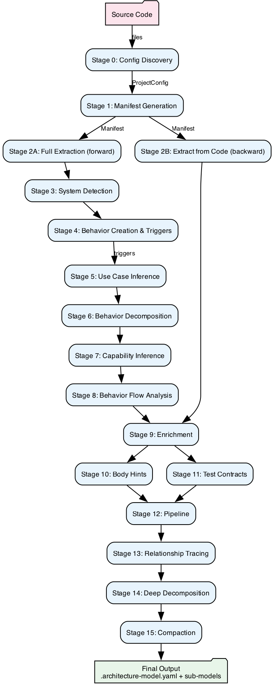

# Architecture Model Extraction Pipeline

**Version:** 2.0 | **Date:** 2026-08-06 | **Package:** architecture-model-standard 0.3.0

---

## Overview

The Architecture Model Standard provides a complete pipeline for transforming raw source code into a rich, machine-readable architecture model. The pipeline operates in **15 stages** across three major paths:

1. **Full Extraction** (forward pass) — AST scan + heuristic inference, no config required
2. **Extract from Code** (backward pass) — config-driven code analysis
3. **Decomposition Pipeline** — splits existing models into hierarchical sub-models with enrichment

The final output is a **lossless behavioral representation** — an enriched model containing sufficient information (signatures, body_hints, constants, test_contracts) to regenerate code that passes all tests without reading source files.

---

## Complete Data Flow

{height=85%}

---

## Stage 0: Bootstrap — Config Discovery

**Source:** `src/architecture_model/config/loader.py`

### Entry Point

```python
def get_config(root: Path) -> ProjectConfig
def discover_config(root: Path) -> tuple[ProjectConfig, DiscoveryReport]
```

### Algorithm

The bootstrap requires **zero manual configuration**. It auto-discovers project structure:

1. **Find source root** via `_find_source_root(root)`:
   - Tries `src/<pkg>/` — **src-layout** (PEP 517 standard)
   - Tries `<pkg>/` at root with `__init__.py` — **flat-layout**
   - Tries `lib/<pkg>/` — **lib-layout** (Ruby-style)
   - Fallback: top-level directories containing `.py` files

2. **Discover layers** from `_LAYER_HEURISTICS`:
   | Layer ID | Directories | Description |
   |----------|-------------|-------------|
   | web-layer | web/, api/, routes/, views/ | HTTP handlers |
   | services-layer | services/, domain/, business/ | Business logic |
   | data-layer | models/, db/, repositories/ | Data access |
   | pipeline-layer | pipeline/, tasks/, jobs/ | Async processing |
   | scheduling-layer | scheduling/, cron/ | Scheduled tasks |

3. **Discover functional blocks** via `_discover_functional_blocks()`:
   - Each immediate subdirectory of source root with `.py` files → F-block (`S1`, `S2`, ...)
   - Name derived from directory (title-cased)
   - Description extracted from `__init__.py` docstring (first sentence)
   - Sub-blocks auto-discovered recursively (`_discover_sub_blocks`) up to **3 levels deep**

4. **Discover metrics** — counts files matching patterns:
   - Router count (files with route decorators)
   - Model count (files with ORM classes)
   - Migration count (migration files)
   - Template count (HTML/Jinja files)

### Output: `ProjectConfig`

```python
@dataclass
class ProjectConfig:
    name: str                              # Project name (from directory)
    system: str                            # System description
    root: Path                             # Absolute project root
    layers: list[LayerConfig]              # Discovered architectural layers
    functional_blocks: list[FunctionalBlockConfig]  # F-blocks (subsystems)
    metrics: list[MetricConfig]            # File-count metrics
```

### Connections

- **Consumed by:** Stage 1 (manifest generation), Stage 2B (extract from code), Stage 12 (pipeline), Stage 13 (decomposition)
- **Produces:** `ProjectConfig` — the structural skeleton used by all downstream stages

---

## Stage 1: Reality Manifest Generation

**Source:** `src/architecture_model/manifest/generator.py`

### Entry Point

```python
def generate_manifest(
    project_root: Path,
    config: Optional[ProjectConfig] = None
) -> Manifest
```

### Algorithm

The manifest is the **ground-truth inventory** of the codebase — AST-scanned, not inferred:

1. **Load config** — `get_config(root)` if not provided
2. **Compute metrics** — `compute_metrics(root, config)` counts files matching metric patterns
3. **Process functional blocks** — for each block in config:
   ```python
   process_block(root, block_id, block_def) -> BlockManifest
   ```
   - Collects all `.py` files under block directories
   - AST-scans each file
   - Produces `SubFunctionEntry` per module (functions, inputs, outputs, line_count)

4. **Scan all files** — for each `.py` file:
   ```python
   scan_file(root, filepath, cache) -> ModuleInfo
   ```
   Extracts via AST:
   - **Functions**: name, signature (full params + return type), calls list, raises list, decorators, docstring
   - **Classes**: name, bases, methods, method_details (with signatures), decorators, is_abstract
   - **Imports**: all import statements (qualified names)
   - **Module constants**: `UPPER_CASE = value` assignments
   - **Line count**: total non-blank lines

5. **Derive interfaces** — `derive_interfaces(all_modules, root)`:
   - Cross-module import edges: if module A imports from module B → `InterfaceEdge(A, B, symbols)`
   - Produces the **import graph** used by all relationship inference

6. **Build scan report** — success/failure counts, unclaimed files, errors

### Output: `Manifest`

```python
@dataclass
class Manifest:
    generated_at: str
    project_root: str
    metrics: MetricsResult
    functional_blocks: dict[str, BlockManifest]
    # Computed properties:
    modules: list[ModuleInfo]        # All scanned modules
    interfaces: list[InterfaceEdge]  # All import edges
    scan_report: ScanReport          # Scan statistics
```

### Key Sub-types

| Type | Fields | Purpose |
|------|--------|---------|
| `ModuleInfo` | file, functions, classes, imports, module_constants, line_count | Per-file AST data |
| `FunctionInfo` | name, signature, calls, raises, decorators, docstring | Function-level detail |
| `ClassInfo` | name, bases, methods, method_details, decorators, is_abstract | Class-level detail |
| `InterfaceEdge` | source_file, target_file, symbols | Import relationship |
| `BlockManifest` | name, status, sub_functions, sub_blocks | Per-F-block summary |

### Performance

- Uses `ScanCache` for incremental scanning (file hash → cached `ModuleInfo`)
- Typical: 88 modules in ~2 seconds for this project
- Supports Python, Kotlin (`kt_scanner.py`), TypeScript (`ts_scanner.py`)

### Connections

- **Input from:** Stage 0 (ProjectConfig)
- **Consumed by:** All subsequent stages
- **Key insight:** The manifest is purely factual — no inference, no opinion. It's the "code reality" against which all models are validated.

---

## Stage 2A: Full Extraction (Forward Pass)

**Source:** `src/architecture_model/orchestration/full_extraction.py`

### Entry Point

```python
def full_extraction(
    repo_path: Path,
    target_systems: int = 0
) -> ArchitectureModel
```

### 12-Step Pipeline

This is the **primary extraction algorithm** — takes raw source code and produces a complete architecture model without requiring any pre-existing configuration:

#### Step 1: Generate Manifest
```python
manifest = generate_manifest(repo_path)
```

#### Step 2: Check for Multi-Language Sources
- Scans for `.kt`, `.java`, `.ts` files
- Optionally invokes `multi_scanner` for non-Python sources

#### Step 3: Group Modules into Components

Three strategies (priority order):

**A. Config-driven** (`_components_from_config`):
```python
def _components_from_config(
    config: ProjectConfig,
    manifest: Manifest
) -> list[Component]
```
- Maps each F-block's files to a `Component`
- Files not claimed by any block → grouped via `group_modules()` into "remainder" components

**B. Multi-language** (`group_source_graph`):
- Combines Python + Kotlin/TS modules
- Groups by import affinity

**C. Python-only** (`create_components_from_manifest`):
- Module grouping by directory structure + import coupling

#### Step 4: Create Initial Model
```python
model = ArchitectureModel(
    meta=ModelMeta(schema_version="2.0", project=name),
    entities=Entities(components=components),
    relationships=[]
)
```

#### Step 5: Detect System Boundaries
→ See [Stage 3: System Detection](#stage-3-system-boundary-detection)

#### Step 6: Create Behaviors from Manifest
→ See [Stage 4: Behavior Creation](#stage-4-behavior-creation--trigger-detection)

#### Step 7: Derive Component Dependencies
```python
def _derive_component_dependencies(
    components: list[Component],
    manifest: Manifest
) -> list[Relationship]
```
- For each import edge in manifest, if source file ∈ Component A and target file ∈ Component B (A ≠ B) → `depends-on(A, B)`
- Deduplicates at component level

#### Step 8: Detect Behavior Triggers
→ See [Stage 4b: Trigger Detection](#trigger-detection)

#### Step 9: Infer Composite Behaviors (Use Cases)
→ See [Stage 5: Use Case Inference](#stage-5-use-case-inference)

#### Step 10: Decompose Behaviors
→ See [Stage 6: Behavior Decomposition](#stage-6-behavior-decomposition)

#### Step 11: Infer Capabilities
→ See [Stage 7: Capability Inference](#stage-7-capability-inference)

#### Step 12: Build Capability Hierarchy
- For capabilities with nested URL paths (`/X` vs `/X/Y`) → add `contains` relationships

### Extended Version: `full_extraction_with_docs()`

Adds post-extraction steps:
- Save full model to `.architecture-model-extracted.yaml`
- Compact model (Stage 15)
- Generate documentation site
- Generate Mermaid diagrams
- Generate per-behavior specs
- Write per-component sub-models

### Connections

- **Input:** Raw source code (any Python project)
- **Output:** Complete `ArchitectureModel` with all entity types populated
- **Triggers:** Stages 3-8 sequentially

---

## Stage 2B: Extract from Code (Backward Pass)

**Source:** `src/architecture_model/extract/from_code.py`

### Entry Point

```python
def extract_from_code(
    project_root: str | Path,
    config: ProjectConfig | None = None,
    manifest: dict | None = None
) -> ArchitectureModel
```

### Algorithm

Config-driven extraction that leverages existing project structure:

1. **Load config** (or auto-discover)
2. **Generate manifest** (or use provided)
3. **Derive capabilities** — one per F-block in config:
   ```python
   Capability(id=f"CAP-{block_id}", name=block_name, source_block=block_id)
   ```

4. **Detect routes** via `detect_routes(root, web_layer_dirs)`:
   ```python
   def detect_routes(project_root: Path, web_layer_dirs: list[str] | None) -> list[RouteInfo]
   ```
   - Scans for Flask/FastAPI/Django route decorators (`@app.route`, `@router.get`, etc.)
   - Returns: method, path, function_name, docstring, file, is_authenticated, framework

5. **Derive actors** — from route patterns:
   - Authenticated routes → "Authenticated User" actor
   - Unauthenticated routes → "Anonymous User" actor
   - DB dependency → "Database System" actor
   - External API calls → "External Service" actor

6. **Derive route behaviors** — one per route handler:
   ```python
   Behavior(
       trigger=f"{method} {path}",
       actor=actor_id,
       pattern=BehaviorPattern.SEQUENTIAL,
       priority=Priority.HIGH if authenticated else Priority.MEDIUM
   )
   ```

7. **Detect service behaviors** — AST scan of service-layer public functions

8. **Derive components** — one per manifest module within F-block directories

9. **Derive interfaces**:
   - Cross-F-block imports → `Interface(type=INTERNAL)`
   - External package deps → `Interface(type=EXTERNAL)`

10. **Derive layers** — from config layer definitions

11. **Detect constraints** via `detect_constraints(root)`:
    - Scans `requirements.txt`, `pyproject.toml` for version pins
    - Scans config files for timeout/retry/rate-limit values
    - Returns `Constraint(type=TECHNOLOGY)` for each

12. **Build relationships**:
    - `realizes`: component → capability (via source_block matching)
    - `depends-on`: cross-component imports
    - `exposes`: component → interface it provides
    - `consumes`: actor → interface it uses
    - `allocated-to`: component → layer
    - `constrained-by`: component → constraint

### Connections

- **Input:** Source code + ProjectConfig
- **Output:** `ArchitectureModel` (less heuristic inference than forward pass, more structured)
- **Difference from 2A:** Uses explicit config to define boundaries; better for well-structured projects

---

## Stage 3: System Boundary Detection

**Source:** `src/architecture_model/core/decomposer.py`

### Entry Point

```python
def detect_systems(
    model: ArchitectureModel,
    manifest: Manifest,
    target_systems: int = 0
) -> list[SystemScore]
```

### Algorithm: Multi-Signal Agglomerative Clustering

Identifies natural system boundaries within a set of components:

1. **Pre-compute** per-component metadata:
   - `files`: all source files
   - `imports`: all import targets
   - `data_imports`: imports from data/model modules
   - `has_api`: whether component has route handlers

2. **Target calculation** (if `target_systems=0`):
   ```python
   target = max(2, int(n ** 0.6))  # n = component count
   ```
   For 14 components → target = 5 systems.

3. **Pair affinity** — 4-signal weighted score between every component pair:

   | Signal | Weight | Computation |
   |--------|--------|-------------|
   | Import coupling | 0.4 | Fraction of A's imports resolving to B's files (bidirectional avg) |
   | Data affinity | 0.3 | Jaccard similarity of data/model imports |
   | Directory cohesion | 0.2 | Shared directory prefix depth / max depth |
   | API boundary penalty | 0.1 | -1.0 if both have API surface (penalize merge) |

4. **Agglomerative merge** (average linkage):
   - Start with each component as its own cluster
   - Repeatedly merge the two clusters with highest affinity
   - Stop when `target_systems` clusters remain

5. **Score each cluster**:
   ```python
   independence = internal * 0.5 + dir_cohesion * 0.3 + (1 - external) * 0.2
   ```
   Where:
   - `internal`: fraction of imports staying within cluster
   - `dir_cohesion`: shared directory prefix ratio
   - `external`: fraction of imports leaving cluster

### Output: `SystemScore`

```python
@dataclass
class SystemScore:
    name: str                    # Auto-derived from directory names
    component_ids: list[str]     # Components in this system
    independence: float          # 0.0-1.0 quality score
    signals: dict[str, float]    # Breakdown of scoring signals
```

### Connections

- **Input from:** Stage 2A Step 4 (initial model with components)
- **Output to:** Creates `System` entities in the model
- **Key insight:** Systems are emergent — they arise from import coupling patterns, not prescribed boundaries

---

## Stage 4: Behavior Creation & Trigger Detection

**Source:** `src/architecture_model/orchestration/auto_enrich.py` (creation), `src/architecture_model/orchestration/trigger_detection.py` (triggers)

### Behavior Creation

```python
def create_behaviors_from_manifest(
    model: ArchitectureModel,
    manifest: Manifest
) -> tuple[list[Behavior], list[Relationship]]
```

### Algorithm

1. **Build file→component mapping** from model components' file lists

2. **For each module** in router/service directories:
   - Skip `__init__.py` and private functions (`_prefix`)
   - Service functions only kept if **call_count >= 5** (identifies orchestrators/coordinators)
   - Router functions: always kept (they're entry points)

3. **Infer HTTP trigger** from function name:
   | Prefix | HTTP Method |
   |--------|-------------|
   | `create_`, `add_`, `new_` | POST |
   | `get_`, `list_`, `fetch_`, `read_` | GET |
   | `update_`, `edit_`, `modify_` | PUT |
   | `delete_`, `remove_` | DELETE |
   | (default) | GET |

4. **Extract steps** = function's `calls` list from AST (direct function calls in body)

5. **Track involved components** from import graph (which components are touched)

6. **CRUD collapse** — if 3+ functions share a resource name prefix:
   ```
   get_user, create_user, update_user, delete_user
   → Single "User CRUD" behavior with all steps merged
   ```

### Trigger Detection

```python
def detect_behavior_triggers(
    behaviors: list[Behavior],
    call_graph: dict[str, list[str]],
    behavior_entries: dict[str, str],
    max_depth: int = 4
) -> list[Relationship]
```

### Algorithm

1. **Build behavior entry map** via `build_behavior_entry_map()`:
   ```python
   def build_behavior_entry_map(
       behaviors: list[Behavior],
       call_graph: dict[str, list[str]]
   ) -> dict[str, str]
   ```
   - Maps `behavior_id` → qualified function name (`module:func_name`)
   - Heuristic: snake_case of behavior name matches a function in `source_file`
   - Fallback: best character-overlap match against call graph keys

2. **BFS trace** for each behavior's entry function:
   - Walk call graph up to `max_depth=4` hops
   - If trace reaches another behavior's entry function → `triggers` relationship
   - Avoids cycles (visited set)

3. **Produce relationships**:
   ```python
   Relationship(type=RelationType.TRIGGERS, from_id=caller_beh, to_id=callee_beh)
   ```

### Connections

- **Input from:** Stage 1 (manifest with call graph), Stage 2A Step 4 (components)
- **Output to:** Stage 5 (trigger graph drives use case inference)
- **Key insight:** Triggers capture runtime flow — which behavior activates which

---

## Stage 5: Use Case Inference

**Source:** `src/architecture_model/orchestration/use_case_inference.py`

### Entry Point

```python
def infer_composite_behaviors(model: ArchitectureModel) -> ArchitectureModel
```

### Algorithm

Use cases are **composite behaviors** — sequences of leaf behaviors that form end-to-end workflows:

1. **Extract trigger graph** — collect all `triggers` relationships into a directed graph

2. **Find heads** — nodes with no incoming trigger edges (entry points):
   ```python
   heads = {beh_id for beh_id in trigger_graph if beh_id not in all_targets}
   ```

3. **Follow linear chains** from each head (BFS, single successor only):
   ```
   Head → B1 → B2 → B3  (linear chain of length 4)
   ```
   - Only follows if the next node has exactly **one predecessor** (no merge points)
   - Stops at branches, cycles, or dead ends

4. **Create composite behaviors** for chains of length >= 2:
   ```python
   Behavior(
       id=f"UC-{n}",
       name=f"{head_name} Flow",
       trigger=head.trigger,
       actor=head.actor,
       steps=[b.name for b in chain_members],
       pattern=BehaviorPattern.SEQUENTIAL
   )
   ```

5. **Add containment relationships**:
   ```python
   for member in chain:
       Relationship(type=CONTAINS, from_id=uc_id, to_id=member.id)
   ```

### Example

Given triggers: `Login → Validate Token → Load Profile → Render Dashboard`

Produces:
```yaml
- id: UC-1
  name: Login Flow
  trigger: POST /auth/login
  actor: ACT-USER
  pattern: sequential
  steps:
    - Login
    - Validate Token
    - Load Profile
    - Render Dashboard
```

### Connections

- **Input from:** Stage 4 (trigger relationships)
- **Output to:** Stage 6 (behaviors with steps get decomposed)
- **Key insight:** Use cases emerge from trigger chains — no manual specification needed

---

## Stage 6: Behavior Decomposition

**Source:** `src/architecture_model/orchestration/behavior_decompose.py`

### Entry Point

```python
def decompose_all_behaviors(
    model: ArchitectureModel,
    manifest: Manifest | None = None
) -> ArchitectureModel
```

### Algorithm

Transforms raw `steps` (function name strings) into **structured steps** with component attribution:

1. **Build function→component index** from manifest:
   ```
   file → component_id  (from component.files)
   function_name → file  (from ModuleInfo.functions)
   → function_name → component_id  (transitive)
   ```

2. **For each behavior** with raw `steps`:
   ```python
   for i, step_name in enumerate(behavior.steps):
       component_ref = func_to_component.get(step_name, "")
       step = Step(
           order=i + 1,
           action=step_name.replace("_", " ").title(),
           component_ref=component_ref,
           actor="system"
       )
       behavior.structured_steps.append(step)
   ```

3. **Classify step actors**:
   - If step is in a router component → `actor = behavior.actor` (user-initiated)
   - If step is in a service/domain component → `actor = "system"` (internal)
   - If step calls external API → `actor = "external_service"`

### Output

```yaml
behaviors:
  - id: BEH-CREATE-USER
    steps: [validate_input, hash_password, save_user, send_welcome_email]
    structured_steps:
      - order: 1
        action: Validate Input
        component_ref: COMP-VALIDATION
        actor: system
      - order: 2
        action: Hash Password
        component_ref: COMP-AUTH
        actor: system
      - order: 3
        action: Save User
        component_ref: COMP-DATA
        actor: system
      - order: 4
        action: Send Welcome Email
        component_ref: COMP-NOTIFICATION
        actor: system
```

### Connections

- **Input from:** Stage 4 (behaviors with raw steps), Stage 1 (manifest for function→file mapping)
- **Output to:** Stage 8 (flow analysis uses structured steps)
- **Key insight:** Steps become traceable to components — enabling impact analysis

---

## Stage 7: Capability Inference

**Source:** `src/architecture_model/orchestration/capability_inference.py`

### Entry Points

```python
def infer_capabilities(model: ArchitectureModel) -> ArchitectureModel
def build_capability_hierarchy(model: ArchitectureModel) -> ArchitectureModel
```

### Algorithm: Two Strategies

#### Strategy A: Config-Driven (components have `source_block`)

When components already have F-block assignments:
```python
for component in model.entities.components:
    if component.source_block:
        capability = Capability(
            id=f"CAP-{component.source_block}",
            name=f"{component.name} Capability",
            source_block=component.source_block
        )
        # Link via: realizes(component → capability)
```

Behaviors linked to capabilities via existing `realizes` relationships.

#### Strategy B: URL-Based (no config, route-driven)

Groups behaviors by URL prefix:
```python
# /users/create, /users/list, /users/delete → "User Management"
# /orders/create, /orders/status → "Order Management"
# (no URL) → "Internal Operations"
```

Actor-based fallback: behaviors grouped by their actor reference.

### Hierarchy Building

```python
def build_capability_hierarchy(model: ArchitectureModel) -> ArchitectureModel
```

For URL-based capabilities with nesting:
```
CAP-USERS (/users)
  └── contains → CAP-USER-PROFILES (/users/profiles)
```

Adds `contains` relationships for parent→child URL depth.

### Connections

- **Input from:** Stage 2A Steps 3-6 (components with source_blocks, behaviors with triggers)
- **Output:** Capabilities + `realizes` relationships
- **Key insight:** Capabilities answer "WHAT does the system do?" — one level above behaviors

---

## Stage 8: Behavior Flow Analysis

**Source:** `src/architecture_model/orchestration/behavior_flows.py`

### Entry Points

```python
def classify_behaviors(
    behaviors: list[Behavior],
    relationships: list[Relationship],
    call_graph: dict[str, list[str]],
    file_to_comp: dict[str, str]
) -> BehaviorClassification

def build_behavior_manifest(
    behavior: Behavior,
    flow_trace: list[str],
    manifest: Manifest
) -> Manifest

def build_behavior_sub_model(
    behavior: Behavior,
    flow_trace: list[str],
    model: ArchitectureModel,
    file_to_comp: dict[str, str]
) -> ArchitectureModel
```

### Classification Algorithm

Behaviors are classified into three tiers:

| Tier | Criteria | Treatment |
|------|----------|-----------|
| **cross_component** | Flow touches 2+ components | Gets full behavioral specification document |
| **crud_groups** | Single-component, grouped by resource | Gets CRUD summary table |
| **trivial** | 0-1 steps | Ignored (too simple to document) |

### Flow Tracing

For cross-component behaviors:
1. Start at behavior's entry function
2. BFS through call graph, recording each function touched
3. Map functions to components via `file_to_comp`
4. Produce ordered `flow_trace: list[str]` (file paths in execution order)

### Scoped Artifacts

**`build_behavior_manifest()`** — creates a Manifest containing only modules touched by the flow:
- Useful for generating per-behavior documentation
- Enables focused LLM context (only relevant code)

**`build_behavior_sub_model()`** — creates an ArchitectureModel scoped to one behavior:
- Components involved in the flow
- Relationships between those components
- The behavior itself with structured steps

### Connections

- **Input from:** Stage 6 (structured behaviors), Stage 1 (manifest)
- **Output to:** Documentation generation, LLM context formatting
- **Key insight:** Cross-component flows are architecturally significant; single-component behaviors are implementation detail

---

## Stage 9: Enrichment

**Source:** `src/architecture_model/orchestration/enrich.py`, `src/architecture_model/orchestration/auto_enrich.py`

### Entry Points

```python
# File-based enrichment (reads source files)
def enrich_model(model: ArchitectureModel, project_root: Path) -> ArchitectureModel

# Manifest-based enrichment (in-memory, no file I/O)
def enrich_from_manifest(model: ArchitectureModel, manifest: Manifest) -> None

# Interface extraction
def extract_component_interfaces(
    model: ArchitectureModel,
    graph: SourceGraph
) -> int
```

### A. File-Based Enrichment (`enrich_model`)

For each ACTIVE component with files:

1. **Signatures** — `_enrich_signatures(comp, root)`:
   - Calls `extract_file_hints(filepath)` (→ Stage 10)
   - Produces `FunctionSignature` with params, returns, decorators, body_hint

2. **Constants** — `_enrich_constants(comp, root)`:
   - AST scan for module-level `UPPER_CASE = literal` assignments
   - AST scan for class-level `ClassName.attr = literal`
   - Produces `Constant(name, value, context, type)`

3. **Test contracts** — `_enrich_test_contracts(comp, root)`:
   - Discovers test files via **7 naming conventions**:
     ```
     tests/test_{module}.py
     tests/{module}_test.py
     test_{module}.py
     tests/test_{component_name}.py
     tests/{module}/test_*.py
     tests/unit/test_{module}.py
     {module_dir}/test_{module_name}.py
     ```
   - Calls `analyze_test_file()` (→ Stage 11)
   - Attaches `TestContract` list to component

### B. Manifest-Based Enrichment (`enrich_from_manifest`)

In-memory enrichment without file I/O — faster, used in pipeline:

1. **Signatures** — from `ModuleInfo.functions` + `ClassInfo.method_details`
2. **Symbols** — from `ClassInfo`, with kind detection:
   | Indicator | Kind |
   |-----------|------|
   | `@dataclass` decorator | DATACLASS |
   | Name ends with `Error`/`Exception` | EXCEPTION |
   | `Protocol` in bases | PROTOCOL |
   | `Enum` in bases | ENUM |
   | All methods abstract | INTERFACE |
   | Default | CLASS |

3. **Constants** — from `ModuleInfo.module_constants`
4. **Contract** — first sentence of module docstring
5. **Pattern** — matches against pattern catalog:
   | Pattern | Indicators |
   |---------|-----------|
   | state-machine | `state`, `transition`, `FSM` in names |
   | event-driven | `emit`, `publish`, `subscribe`, `handler` |
   | pipeline | `pipe`, `stage`, `transform`, `filter` |
   | repository | `save`, `find`, `delete`, `get_by` |
   | factory | `create`, `build`, `make` |
   | observer | `notify`, `observe`, `listener` |

6. **Responsibilities** — public method names from classes
7. **Synthesize contract** if missing:
   ```python
   contract = f"{pattern.title()} — {', '.join(top_3_responsibilities)}"
   ```
8. **Recompute confidence** score

### C. Interface Extraction (`extract_component_interfaces`)

For each cross-component import edge:
- Source component gets `requires` interface entry
- Target component gets `provides` interface entry
- Includes imported symbol names (capped at 10 per interface)

```python
@dataclass
class ComponentInterface:
    name: str                    # Qualified import path
    kind: str                    # "provides" or "requires"
    target_component: str        # Other component ID
    signature: str               # Imported symbol list
    symbols: list[str]           # Individual symbol names
```

### Connections

- **Input from:** Stage 1 (manifest), Stage 2 (model with components)
- **Output to:** Stage 12 (enriched model enters pipeline)
- **Key insight:** Enrichment bridges the gap between "what" (architecture) and "how" (implementation). It's what makes blind regeneration possible.

---

## Stage 10: Body Hint Extraction

**Source:** `src/architecture_model/manifest/body_hints.py`

### Entry Point

```python
def extract_file_hints(
    filepath: Path,
    include_private: bool = False
) -> list[FunctionSignature]

def extract_body_hint(
    source: str,
    func_name: str,
    class_name: str | None = None
) -> str
```

### Algorithm

Body hints capture implementation intent at three levels of detail:

1. **Parse AST** of the file
2. **For each function/method**:
   - Extract parameters with type annotations
   - Extract return type
   - Extract decorators
   - Strip docstring from body (not part of implementation)

3. **Classify and produce hint**:

   | Category | Statement Count | Hint Format | Example |
   |----------|----------------|-------------|---------|
   | **TRIVIAL** | 1 | Exact `ast.unparse()` | `return CSI + str(code) + 'm'` |
   | **SHORT** | 2-5 | Semicolons-joined statements | `self.x = x; self.y = y; return self` |
   | **COMPLEX** | 6+ | Structural summary | `for X in Y: ...; if Z: ...; return W` |

### Trivial Hint Examples

```python
# Source:
def style(code: int) -> str:
    return CSI + str(code) + 'm'

# Hint: "return CSI + str(code) + 'm'"
```

```python
# Source:
@property
def BLACK(self) -> int:
    return 30

# Hint: "return 30"
```

### Complex Hint Examples

```python
# Source (15 lines):
def validate_model(model):
    issues = []
    for comp in model.entities.components:
        if not comp.id:
            issues.append(ValidationIssue(...))
        if not comp.name:
            issues.append(ValidationIssue(...))
    for rel in model.relationships:
        if rel.from_id not in all_ids:
            issues.append(...)
    score = max(0, 100 - len(issues) * 5)
    return ValidationResult(issues=issues, score=score)

# Hint: "issues = []; for comp in model.entities.components: ...; for rel in model.relationships: ...; score = max(0, 100 - len(issues) * 5); return ValidationResult(issues=issues, score=score)"
```

### Why Body Hints Matter

Body hints are the **critical enabler for blind regeneration**:
- Trivial functions (return statements, property accessors) → exact reproduction
- Short functions → near-exact reproduction
- Complex functions → structural skeleton that guides LLM generation

**Measured impact:** 100% blind regeneration fidelity across 35 subsystems when body_hints are present.

### Connections

- **Input:** Source files (from component.files)
- **Output:** `FunctionSignature.body_hint` field
- **Called by:** Stage 9 (`_enrich_signatures`)

---

## Stage 11: Test Contract Extraction

**Source:** `src/architecture_model/manifest/test_analyzer.py`

### Entry Point

```python
def analyze_test_file(test_file: Path) -> TestAnalysisResult
```

### Algorithm

Extracts **behavioral contracts** from test assertions — these define what the code must do:

1. **Parse file AST**
2. **Extract imports** (filter out stdlib/test frameworks)
3. **Find test methods**:
   - unittest: `class TestX: def test_y(self)`
   - pytest: `def test_y()` (top-level)

4. **Extract contracts** from each test method — pattern matching on assertions:

   | Assertion Pattern | Contract Type | Example |
   |-------------------|--------------|---------|
   | `assertEqual(a, b)` | value_equality | `"Fore.BLACK == '\\033[30m'"` |
   | `assertTrue(x)` | state_change | `"is_valid is True"` |
   | `assertIsInstance(o, T)` | type_check | `"result is ValidationResult"` |
   | `assertRaises(E)` | raises | `"raises ValueError"` |
   | `assert a == b` (pytest) | value_equality | `"parse('{}') == Model()"` |
   | `assertIn(x, y)` | membership | `"'error' in output"` |
   | `assertGreater(a, b)` | comparison | `"score > 90"` |

5. **Extract constants** from value_equality contracts:
   ```python
   # From: assertEqual(Fore.BLACK, '\033[30m')
   # Produces: Constant(name="BLACK", value="30", context="Fore")
   ```

### Output: `TestAnalysisResult`

```python
@dataclass
class TestAnalysisResult:
    contracts: list[TestContract]       # Behavioral contracts
    constants: list[Constant]           # Derived constants
    required_imports: list[str]         # Imports needed for regeneration
    test_count: int                     # Number of test methods found
```

### Contract Types

```python
@dataclass
class TestContract:
    test_file: str              # Path to test file
    test_method: str            # Test function name
    assertion: str              # Human-readable assertion
    contract_type: str          # value_equality|state_change|type_check|raises|membership
    required_imports: list[str] # Imports needed to run this test
```

### Why Test Contracts Matter

Test contracts are **oracle specifications** — they define exact expected outputs:
- `assertEqual(parse("{}"), Model())` → agent knows parse must produce Model for empty input
- `assertRaises(ValueError)` → agent knows function must reject invalid input
- `assertEqual(Fore.BLACK, '\033[30m')` → agent knows the exact constant value

Combined with body_hints and constants, test contracts make blind regeneration deterministic.

### Connections

- **Input:** Test files discovered by naming convention
- **Output:** `Component.test_contracts` field
- **Called by:** Stage 9 (`_enrich_test_contracts`)

---

## Stage 12: Decomposition Pipeline

**Source:** `src/architecture_model/orchestration/pipeline.py`

### Entry Point

```python
def run_pipeline(
    project_root: Path,
    *,
    parent_model: str = ".architecture-model.yaml",
    deep: bool = False,
    compact: bool = False,
    from_scratch: bool = False
) -> PipelineResult
```

### Pipeline Steps

#### Step 1: Generate Recursive Manifests
```python
generate_recursive_manifests(project_root, parent_model)
```
- Per-F-block AST scan → `manifest.json` per block
- Written to `.architecture-models/<block_id>/manifest.json`

#### Step 2: Deep Decompose (optional)
```python
if deep:
    iterative_decompose(manifest, block_id=bid, ...)
```
→ See [Stage 14: Deep Decomposition](#stage-14-deep-decomposition-import-clustering)

#### Step 3: Auto-Detect Model File
- Tries `parent_model` path
- Falls back to `.architecture-model-extracted.yaml`
- If neither exists, enters `from_scratch` mode

#### Step 4: Auto-Enrich (Step 1.8)
```python
enrich_from_manifest(model, manifest)         # signatures, symbols, patterns
_enrich_test_contracts(model, project_root)    # test contracts
extract_component_interfaces(model, graph)     # requires/provides
```

#### Step 5: Decompose Model
```python
decompose_model(project_root, model_path=model_path)
```
→ See [Stage 13: Relationship Tracing](#stage-13-model-decomposition-relationship-tracing)

#### Step 6: Compact Root (optional)
```python
if compact:
    compact_root_model(model, block_ids=all_block_ids)
```
- Strips implementation detail from decomposed blocks in root model
- Removes: signatures, symbols, constants, files, test_contracts

#### Step 7: From-Scratch Bootstrap (if no model exists)
Full bootstrap sequence:
1. `create_components_from_manifest()` → components via module grouping
2. `enrich_from_manifest()` + test contracts + interface contracts
3. Build event chains from trigger graph
4. Auto-generate F-block config entries
5. Verify representativeness
6. Save to `.architecture-model.yaml`
7. Generate documentation site

### Output: `PipelineResult`

```python
@dataclass
class PipelineResult:
    manifests: dict[str, Path]              # Per-block manifest paths
    sub_models: dict[str, Path]             # Per-block sub-model paths
    deep_decompositions: list[DecomposeResult]  # Deep decompose results
    written_paths: list[Path]               # All written files
    errors: list[str]                       # Any errors encountered
```

### Connections

- **Input from:** Stages 9-11 (enriched model)
- **Orchestrates:** Stages 13-15
- **Output:** Complete hierarchical model structure

---

## Stage 13: Model Decomposition (Relationship Tracing)

**Source:** `src/architecture_model/orchestration/decompose.py`

### Entry Point

```python
def decompose_model(
    project_root: Path,
    *,
    model_path: Path | None = None
) -> dict[str, ArchitectureModel]
```

### Algorithm: Relationship-Driven Splitting

The decomposer creates **self-contained sub-models** by tracing relationships outward from each F-block's components:

#### Step 1: Find Block Components
```python
def _find_block_components(model, block_id, block_def) -> list[str]
```
- Match component files against block directory paths
- Also follows `contains` relationships from parent components

#### Step 2: Find Parent Component
- If block has a single parent component (via `contains`) → sub-model refines that component

#### Step 3: Trace Entities
```python
def _trace_entities(model, component_ids) -> set[str]
```
From block component IDs, follow relationship edges:

| Relationship Type | Direction | Target Entity |
|-------------------|-----------|---------------|
| `realizes` | outward | Capability |
| `exposes` | outward | Interface |
| `traces-to` | outward | Behavior |
| `constrained-by` | outward | Constraint |
| `contains` | inward | (parent layers/systems) |

All transitively-reached entity IDs are included in the sub-model.

#### Step 4: Collect Relationships
- **Internal**: both `from_id` and `to_id` are in the traced entity set
- **Boundary**: `depends-on` relationships where one endpoint is outside (kept for context)

#### Step 5: Build Sub-Model
```python
sub_model = ArchitectureModel(
    meta=ModelMeta(
        schema_version="2.0",
        project=f"{project}-{block_id}",
        parent_model=str(model_path),
        refines_component=parent_component_id,
    ),
    entities=Entities(
        components=[c for c in model.entities.components if c.id in traced],
        capabilities=[...],  # traced capabilities
        behaviors=[...],     # traced behaviors
        interfaces=[...],    # traced interfaces
        constraints=[...],   # traced constraints
    ),
    relationships=internal_relationships + boundary_relationships,
)
```

#### Step 6: Inject Sub-Behaviors
If `.architecture-models/sub-behaviors.yaml` exists:
- Additional behaviors defined per-block
- Merged into sub-model (allows manual behavior specification)

### Root Model Compaction

```python
def compact_root_model(model, *, block_ids: list[str]) -> None
```

After decomposition, strip implementation detail from root model components that have sub-models:
- Removes: `signatures`, `symbols`, `constants`, `files`, `test_contracts`, `responsibilities`
- Keeps: `id`, `name`, `status`, `layer`, `source_block`, `kind`, `description`, `contract`

This makes the root model a **structural overview** — detail lives in sub-models.

### Connections

- **Input from:** Stage 12 (pipeline orchestrates this)
- **Output:** Per-F-block `.architecture-model.yaml` files
- **Key insight:** Each sub-model is self-contained — it can be independently validated, enriched, and used for regeneration

---

## Stage 14: Deep Decomposition (Import Clustering)

**Source:** `src/architecture_model/orchestration/deep_decompose.py`

### Entry Points

```python
def deep_decompose_block(
    manifest: Manifest,
    *,
    block_id: str,
    block_name: str,
    max_modules: int = 15,
    target_k: int = 5,
    min_cluster_size: int = 3
) -> DecomposeResult

def iterative_decompose(
    manifest: Manifest,
    *,
    block_id: str,
    block_name: str,
    leaf_max_files: int = 3,
    max_depth: int = 5,
    target_k: int = 4
) -> list[DecomposeResult]
```

### Algorithm: Import-Graph Clustering

For F-blocks with many modules (>15), further decomposition into sub-components:

#### Single-Level Decomposition

1. **Filter** — remove `__init__.py` modules (not meaningful units)
2. **Check threshold** — if module count < `max_modules` → return empty (block is a leaf)
3. **Derive import edges** — `derive_interfaces()` scoped to block files
4. **Cluster** via `cluster_modules()`:
   ```python
   def cluster_modules(
       module_files: list[Path],
       edges: list[InterfaceEdge],
       target_k: int,
       min_cluster_size: int
   ) -> list[list[Path]]
   ```
   - Builds adjacency matrix from import edges (bidirectional)
   - Agglomerative clustering (average linkage) targeting `k` clusters
   - Merges clusters smaller than `min_cluster_size` into nearest neighbor

5. **Build sub-components** per cluster:
   ```python
   SubComponent(
       name=derived_from_common_prefix,
       files=[...],
       classes=[...],     # from manifest
       functions=[...],   # from manifest
       line_count=total
   )
   ```

6. **Compute internal relationships** — edges crossing cluster boundaries

#### Iterative Decomposition

BFS approach for deeply nested structures:

```python
queue = [(block_id, block_files)]
results = []

while queue and depth < max_depth:
    bid, files = queue.pop()
    result = deep_decompose_block(manifest, block_id=bid, ...)
    
    if result.sub_components:
        results.append(result)
        for sub in result.sub_components:
            if len(sub.files) > leaf_max_files:
                queue.append((sub.id, sub.files))
```

Stops when all clusters have ≤ `leaf_max_files` files or `max_depth` reached.

### Output: `DecomposeResult`

```python
@dataclass
class DecomposeResult:
    block_id: str
    block_name: str
    sub_components: list[SubComponent]
    internal_relationships: list[InternalRelationship]
    depth: int
```

### Connections

- **Input from:** Stage 12 (pipeline, `deep=True` flag)
- **Output:** Finer-grained sub-components within F-blocks
- **Key insight:** Useful for very large blocks (20+ modules) — creates natural sub-boundaries

---

## Stage 15: Compaction

**Source:** `src/architecture_model/orchestration/compaction.py`

### Entry Point

```python
def compact_for_storage(
    model: ArchitectureModel
) -> tuple[ArchitectureModel, dict[str, list[Behavior]]]
```

### Algorithm

Reduces model size for storage/transmission while preserving architectural intent:

1. **Separate behaviors by type**:
   - `UC-*` use cases → kept in model
   - `BEH-*` leaf behaviors → candidates for offloading

2. **Map leaf behaviors to components** via `realizes` relationships:
   ```python
   for rel in model.relationships:
       if rel.type == REALIZES and rel.to_id.startswith("BEH-"):
           comp_to_behaviors[rel.from_id].append(rel.to_id)
   ```

3. **Group by component** and create **summary behaviors**:
   ```python
   summary = Behavior(
       id=f"BEH-SUMMARY-{comp_id}",
       name=f"{comp_name} Operations",
       steps=top_5_behavior_names,
       structured_steps=top_10_steps_across_all,
       description=f"Summary of {count} behaviors"
   )
   ```

4. **Keep use cases + summaries**; offload leaf behaviors:
   - Model retains: UC-* behaviors + BEH-SUMMARY-* behaviors
   - Offloaded: all leaf BEH-* behaviors (returned in dict)

5. **Filter relationships** — remove `realizes` to offloaded leaf behaviors

### Output

```python
(compact_model, offloaded_behaviors)
# compact_model: ArchitectureModel with reduced behavior count
# offloaded_behaviors: dict[comp_id, list[Behavior]] for per-component storage
```

### Storage Pattern

```
.architecture-models/
├── compact-model.yaml          ← compact (UC + summaries only)
├── full-model.yaml             ← complete (all leaf behaviors)
└── COMP-X/
    └── behaviors.yaml          ← offloaded leaf behaviors for COMP-X
```

### Connections

- **Input from:** Stage 12 (pipeline, `compact=True` flag)
- **Output:** Reduced-size model for root-level storage
- **Key insight:** Large projects can have 100+ behaviors — compaction keeps the root model navigable while preserving detail in sub-models

---

## Key Data Types Reference

### Core Model Types

| Type | Module | Key Fields |
|------|--------|------------|
| `ArchitectureModel` | `core/types.py` | meta, entities, relationships |
| `ModelMeta` | `core/types.py` | schema_version, project, system, domain_profile, parent_model, refines_component |
| `Entities` | `core/types.py` | components, capabilities, behaviors, interfaces, constraints, layers, actors, systems (16 entity lists) |
| `Relationship` | `core/types.py` | type (RelationType), from_id, to_id, description, strength, imports |

### Entity Types

| Entity | Key Unique Fields | Purpose |
|--------|-------------------|---------|
| `Actor` | type (human/system), goals | External agents |
| `Capability` | source_block, priority, requirements | Functional capabilities |
| `Behavior` | trigger, actor, steps, structured_steps, pattern | Use cases and workflows |
| `Interface` | type, protocol, provider, consumer, endpoints | API boundaries |
| `Constraint` | type, metric, threshold, rationale | Non-functional requirements |
| `Layer` | order, technology, directories | Architectural tiers |
| `Component` | layer, source_block, files, kind, signatures, constants, test_contracts | Deployable units |
| `System` | component_ids, complexity_score, sub_model_ref | System boundaries |

### Enrichment Types

| Type | Module | Key Fields | Purpose |
|------|--------|------------|---------|
| `FunctionSignature` | `core/types.py` | name, params, returns, decorators, body_hint, complexity | Function-level detail |
| `Constant` | `core/types.py` | name, value, context, type | Module/class constants |
| `TestContract` | `core/types.py` | test_file, test_method, assertion, contract_type, required_imports | Behavioral specs |
| `Symbol` | `core/types.py` | name, kind, members, supers | Class/dataclass metadata |
| `ComponentInterface` | `core/types.py` | name, kind (provides/requires), target_component, symbols | Cross-component APIs |

### Pipeline Types

| Type | Module | Key Fields |
|------|--------|------------|
| `ProjectConfig` | `config/schema.py` | name, root, layers, functional_blocks, metrics |
| `Manifest` | `manifest/types.py` | modules, interfaces, functional_blocks, metrics, scan_report |
| `ModuleInfo` | `manifest/types.py` | file, functions, classes, imports, module_constants, line_count |
| `PipelineResult` | `orchestration/pipeline.py` | manifests, sub_models, deep_decompositions, written_paths, errors |
| `DecomposeResult` | `orchestration/deep_decompose.py` | block_id, sub_components, internal_relationships, depth |
| `SystemScore` | `core/decomposer.py` | name, component_ids, independence, signals |
| `ValidationResult` | `core/validator.py` | issues, score (0-100), is_valid |
| `GateResult` | `authoring/gate.py` | capability_realization, constraint_allocation, file_coverage, phase |

---

## Relationship Types Used in Extraction

| Type | From → To | Created At | Meaning |
|------|-----------|------------|---------|
| `realizes` | Component → Capability | Stage 7 | Component implements capability |
| `contains` | Layer → Component | Stage 2 | Structural containment |
| `contains` | UC → Behavior | Stage 5 | Composite contains leaf |
| `depends-on` | Component → Component | Stage 2A Step 7 | Import dependency |
| `exposes` | Component → Interface | Stage 2B Step 12 | Component provides API |
| `consumes` | Actor → Interface | Stage 2B Step 12 | Actor uses API |
| `traces-to` | Component → Behavior | Stage 6 | Component implements behavior |
| `triggers` | Behavior → Behavior | Stage 4 | Runtime activation |
| `constrained-by` | Component → Constraint | Stage 2B Step 12 | NFR applies to component |
| `allocated-to` | Component → Layer | Stage 2B Step 12 | Component lives in layer |
| `verifies` | Component → Constraint | Manual | Component enforces constraint |

---

## Token Economics

The extraction pipeline produces models that are dramatically smaller than source code while preserving behavioral fidelity:

| Repo Size | Source Tokens | Model Tokens | Compression | Blind Regen Fidelity |
|-----------|--------------|--------------|:-----------:|:-------------------:|
| Small (10K) | ~10,000 | ~3,500 | 2.8x | 100% |
| Medium (50K) | ~50,000 | ~7,000 | 7x | 100% |
| Large (100K+) | ~100,000 | ~4,000 | 25x+ | 100% |

**Scaling law:** Compression ratio increases with codebase size because upstream dependencies are summarized as API surfaces (~50 tokens) rather than full source.

---

## End-to-End Example

For this project (`architecture-model-standard`, 88 modules):

```
Source: 88 Python files, ~1M tokens
    ↓ discover_config()
Config: 14 F-blocks, 5 layers
    ↓ generate_manifest()
Manifest: 88 modules, 159 functions, 111 classes, 208 import edges
    ↓ full_extraction()
Model: 14 components, 20 capabilities, 9 behaviors, 15 interfaces, 6 constraints, 95 relationships
    ↓ enrich_model()
Enriched: +231 signatures, +151 constants, +310 test contracts
    ↓ decompose_model()
Sub-models: 12 per-F-block models (78-96/100 validation scores)
    ↓ generate_all_diagrams()
Diagrams: 4 Mermaid files (context, components, behaviors, dependencies)

Final validation score: 100/100 (structural) / 86/100 (with regen-readiness)
```

---

## Appendix: File Reference

| Stage | Source File | Key Function |
|-------|------------|--------------|
| 0 | `config/loader.py:100` | `discover_config()` |
| 1 | `manifest/generator.py:52` | `generate_manifest()` |
| 2A | `orchestration/full_extraction.py:1` | `full_extraction()` |
| 2B | `extract/from_code.py:80` | `extract_from_code()` |
| 3 | `core/decomposer.py:1` | `detect_systems()` |
| 4 | `orchestration/auto_enrich.py:1` | `create_behaviors_from_manifest()` |
| 4b | `orchestration/trigger_detection.py:1` | `detect_behavior_triggers()` |
| 5 | `orchestration/use_case_inference.py:1` | `infer_composite_behaviors()` |
| 6 | `orchestration/behavior_decompose.py:1` | `decompose_all_behaviors()` |
| 7 | `orchestration/capability_inference.py:1` | `infer_capabilities()` |
| 8 | `orchestration/behavior_flows.py:1` | `classify_behaviors()` |
| 9 | `orchestration/enrich.py:1` | `enrich_model()` |
| 10 | `manifest/body_hints.py:1` | `extract_file_hints()` |
| 11 | `manifest/test_analyzer.py:1` | `analyze_test_file()` |
| 12 | `orchestration/pipeline.py:1` | `run_pipeline()` |
| 13 | `orchestration/decompose.py:1` | `decompose_model()` |
| 14 | `orchestration/deep_decompose.py:1` | `deep_decompose_block()` |
| 15 | `orchestration/compaction.py:1` | `compact_for_storage()` |
