# Plan A — Comment → View → Issue → MCP Dev Loop

**Date:** 2026-09-05
**Status:** Design (approved, pre-implementation plan)
**Branch:** `feat/comment-view-loop`
**Depends on:** `docs/plans/2026-09-05-comment-view-shared-interfaces-design.md`
**Sibling:** `docs/plans/2026-09-05-sil-and-provider-design.md`

## 1. Goal

Deliver an end-to-end ticket lifecycle in which a user comment on a
lifecycle-rendered view becomes a logs-db Issue, is picked up by MCP on demand,
and results in a validated model + code change committed with full provenance
trailers and the Issue closed.

Success = a fixture comment → committed model diff → closed Issue in <5 min of
wall-clock in an integration test on a fresh repo checkout.

## 2. Scope

**In scope**

- Local comment capture writing the stub schema (§2 of shared-interfaces).
- Push to logs-db via existing `architect_sync` machinery (extended to POST
  new issues, not just findings/lessons).
- New MCP tool `architect_work_issue(issue_id, dry_run=False, force=False)`
  in `opencode-arch`.
- Wiring from Issue → WorkOrder → Job → Proposal → Apply → Publish → Rebuild
  → Commit → Close using existing Phase-1 APIs.
- Two-stage validator gating (schema hard-gate; check + gate soft-gate as
  progress comments on the Issue).
- Commit-trailer serializer.
- `FakeLogsDB` test fixture implementing §7 of shared-interfaces.
- End-to-end integration test against `FakeLogsDB` + a fixture repo.

**Out of scope** (deferred to a follow-up)

- Comment threads / replies (v1 is one-way).
- Any UI beyond the CLI capture (an OpenCode slash command may be added
  later without schema change).
- Real logs-db server changes (owned by the logs-db repo; this plan freezes
  the *consumed contract*).

## 3. High-level flow

```dot
digraph flow {
    rankdir=LR;
    "Rendered view" [shape=doublecircle];
    "architect_comment" [shape=box];
    "comment stub yaml" [shape=cylinder];
    "architect_sync" [shape=box];
    "logs-db Issue" [shape=cylinder];
    "architect_work_issue" [shape=box];
    "WorkOrder + Job" [shape=box];
    "Proposal" [shape=box];
    "Validate (2-stage)" [shape=box];
    "Apply + Publish" [shape=box];
    "Artifact Rebuild" [shape=box];
    "Commit w/ trailers" [shape=box];
    "Close Issue" [shape=doublecircle];

    "Rendered view" -> "architect_comment";
    "architect_comment" -> "comment stub yaml";
    "comment stub yaml" -> "architect_sync";
    "architect_sync" -> "logs-db Issue";
    "logs-db Issue" -> "architect_work_issue";
    "architect_work_issue" -> "WorkOrder + Job";
    "WorkOrder + Job" -> "Proposal";
    "Proposal" -> "Validate (2-stage)";
    "Validate (2-stage)" -> "Apply + Publish";
    "Apply + Publish" -> "Artifact Rebuild";
    "Artifact Rebuild" -> "Commit w/ trailers";
    "Commit w/ trailers" -> "Close Issue";
}
```



## 4. Components to build

### 4.1 Comment capture (AMS)

**Module:** `src/architecture_model/comments/` (new)

- `models.py` — Pydantic model for the stub schema. Validation:
  `artifact_id/view_id/slice_id/package_id/revision` must resolve against
  a published generation (calls `lifecycle.publication.read_current_generation`).
- `store.py` — `write_stub(stub) -> Path`, `load_stub(comment_id) -> Stub`,
  `list_stubs(revision=None) -> Iterator[Stub]`. Atomic write via existing
  `lifecycle.atomic_store.write_atomic`.
- `journal_events.py` — emits `comment.capture` on write.

**CLI:** `architecture-model comment <artifact_id> --body <text> [--target-entity <id>]`
constructs the stub, resolves current revision, writes YAML, appends journal
event. Prints `comment_id` on stdout.

### 4.2 Sync extension (opencode-arch)

**Module:** `src/opencode_arch/mcp/tools/sync.py` (extend existing)

Add a push branch: for every stub with `issue_ref.issue_id == null`, POST to
`/issues` with `external_key=comment_id`, `title` derived from
`{artifact_id}@{revision}`, `body` = stub body, `tags=["mcp-comment"]`,
`meta={artifact_id, view_id, slice_id, package_id, revision, target_entity_id}`.
On 200, back-fill `issue_ref` and emit `comment.sync` journal event.

Idempotency: if logs-db returns 409/existing (same `external_key`), back-fill
with the existing `issue_id` — no error.

### 4.3 `architect_work_issue` MCP tool (opencode-arch)

**Module:** `src/opencode_arch/mcp/tools/work_issue.py` (new)

Signature:

```python
def architect_work_issue(
    repo_path: str,
    issue_id: str,
    dry_run: bool = False,
    force: bool = False,
) -> WorkIssueEnvelope: ...
```

Envelope: `{ok, work_order_id?, job_id?, commit_sha?, package_revision_to?, error?, journal_events: [...]}`.

**11-step flow** (mirrors §3 of shared-interfaces, exhaustive here):

1. **Fetch Issue** — `GET /issues/{issue_id}` via logs-db client. Extract
   `external_key` → `comment_id`. Emit `issue.pull` journal event.
2. **Load stub** — `comments.store.load_stub(comment_id)`. Fail hard with
   `INVALID_ARGUMENT` if missing (foreign issue not sourced from this repo).
3. **Resolve coordinate** — load package at `stub.revision` via
   `lifecycle.publication`; materialize `stub.slice_id` via
   `lifecycle.model_slice_materializer.materialize`; project via
   `lifecycle.view_projection.project(stub.view_id)`.
4. **Idempotency check** — search
   `.architecture/ai/jobs/*.yaml` for a Job with `provenance.comment_id ==
   comment_id` in state `completed`. If found and not `force`, return
   `ok=True` with the existing `work_order_id`, `commit_sha` (from the
   linked journal event) and no new work.
5. **Assemble WorkOrder** — build via `WorkOrder.build(...)`:
   - `intent` = stub.body (first 200 chars) + reference to Issue url
   - `input_slice_refs` = [stub.slice_id]
   - `expected_proposal_kinds` = `["model_patch", "file_spec"]` (v1: proposer
     may narrow)
   - `budget` = policy-derived (see §4.6)
   - `requested_by` = f"logs-db#{issue_id}"
   - `provenance` populated with `comment_id`, `issue_id`,
     `session_id = env.OPENCODE_SESSION_ID or "session:<uuid>-cli"`
6. **Submit** — `architect_workorder_submit`. Emit `workorder.from_issue`
   journal event.
7. **Run Job** — `architect_job_run(job_id)`. Proposer plugin
   selected by policy (see §4.6). Job transitions
   draft → queued → running → validating.
8. **Validate — stage 1 (hard)** —
   `architect_proposal_validate(proposal, work_order_id, slice_ids)`. If
   `passed=False`, fail: post progress comment on Issue with findings,
   leave Issue open, return `ok=False, error="proposal_invalid"`.
   Journal event = the existing `ai.proposal.validate` variant already
   written by `proposal_validate.py`.
9. **Apply** — if `dry_run`, call `architect_proposal_apply(..., dry_run=True)`
   and return its `ApplyReport`. Else `dry_run=False`:
   - Applier publishes a new generation and writes `ai.proposal.apply`
     event automatically.
   - Capture `new_revision`, `digest`.
10. **Rebuild artifacts** — call `architect_package_stale(changed_paths)` to
    get affected artifacts, then `architect_artifact_rebuild(...)` for each.
    Skip in `dry_run`.
11. **Validate — stage 2 (soft)** — `architect_check` +
    `architect_gate` on the new revision. Compose findings into a comment
    body; POST as `/issues/{id}/comments` with `author="mcp"`.
12. **Commit** — `_commit_with_trailers(...)` (see §4.4). Emit no new
    journal event (git object itself is the record; trailers are the link).
13. **Close Issue** — `POST /issues/{id}/close` with
    `{commit_sha, model_diff_digest, note}`. Emit `issue.close` journal
    event.

**Failure handling** at any step ≥ 7: MCP posts a progress comment to the
Issue describing the failure and its step, leaves the Issue open, and returns
`ok=False, error=<code>`. Steps 1–6 failures are surfaced as MCP errors only
(no comment yet — the Issue may not exist / be reachable).

### 4.4 Commit trailer serializer (opencode-arch)

**Module:** `src/opencode_arch/lifecycle_exec/commit.py` (new)

- `build_trailers(...) -> str` produces the trailer block per §6 of
  shared-interfaces.
- `commit_with_trailers(repo_path, subject, body, trailers) -> str` (returns
  SHA). Uses `git commit -m` via subprocess; captures resulting SHA.
- Interoperates with the OpenCode Git Safety Protocol (never `--no-verify`,
  never amend unless pre-commit hook auto-modified files).

### 4.5 logs-db HTTP client (opencode-arch)

**Module:** `src/opencode_arch/logs_db/client.py` (new; existing
`architect_sync` inlines its HTTP logic — refactor extracts a client class)

- `LogsDBClient(base_url, auth)` with `create_issue`, `get_issue`,
  `post_comment`, `close_issue`. Retries with backoff on 5xx. Raises typed
  errors (`LogsDBUnreachable`, `LogsDBConflict`, `LogsDBForbidden`).

### 4.6 Proposer configuration (opencode-arch)

**Module:** `.architecture/ai/proposer_config.yaml` (existing) — extended.

For v1, the proposer stays whatever OCA already ships in
`lifecycle_exec/worker.py` (dispatched via `plugin: module:function`). Plan A
does **not** ship a new proposer; it consumes whatever is configured. If the
`LLMProvider` protocol from Plan B is not yet available at execution time,
the proposer uses a **stub provider** that reads/writes a fixture file — this
lets Plan A's tests be deterministic without frontier calls.

### 4.7 Test fixtures

**Module:** `tests/fixtures/fake_logs_db.py` (new)

A `FakeLogsDB` class exposing the four endpoints in-memory (Werkzeug or plain
`http.server`). Records all calls for assertions.

## 5. File / directory changes

**New (AMS):**

- `src/architecture_model/comments/__init__.py`
- `src/architecture_model/comments/models.py`
- `src/architecture_model/comments/store.py`
- `src/architecture_model/comments/journal_events.py`
- `src/architecture_model/cli/comment.py` (dispatched from `cli/main.py`)
- `tests/comments/test_models.py`
- `tests/comments/test_store.py`

**New (OCA):**

- `src/opencode_arch/mcp/tools/work_issue.py`
- `src/opencode_arch/lifecycle_exec/commit.py`
- `src/opencode_arch/logs_db/__init__.py`
- `src/opencode_arch/logs_db/client.py`
- `tests/mcp/tools/test_work_issue.py`
- `tests/lifecycle_exec/test_commit.py`
- `tests/logs_db/test_client.py`
- `tests/fixtures/fake_logs_db.py`
- `tests/e2e/test_comment_view_loop.py`

**Extended:**

- `src/opencode_arch/mcp/tools/sync.py` — add issue-push branch
- `src/opencode_arch/mcp/server.py` — register `architect_work_issue`,
  `architect_comment` tools
- `src/architecture_model/lifecycle/journal.py` — extend `JournalEntry.kind`
  literal with new event kinds
- `src/architecture_model/cli/main.py` — register `comment` subcommand

## 6. Data flow — detailed

### 6.1 Capture

1. User views `pipeline.mmd` (or any rendered artifact).
2. User runs
   `architecture-model comment art_pipeline_main --body "COMP-2.5 missing constraint"`.
3. AMS writes `.architecture/comments/<uuid>.yaml` and journal entry.

### 6.2 Push

1. User (or cron) runs `architect_sync`.
2. Sync scans `.architecture/comments/*.yaml` for unsynced stubs; for each,
   POSTs `/issues`, back-fills `issue_ref`, appends `comment.sync` event.

### 6.3 Work

1. User (or an OpenCode session) runs
   `architect_work_issue --issue-id 42`.
2. All 13 steps execute; final commit lands on `feat/comment-view-loop`
   worktree (or wherever the user has checked out).
3. Journal replay from `.architecture/lifecycle/journal.jsonl` can
   reconstruct every event from capture to close.

## 7. Test plan

Unit tests:

- `comments/models.py`: schema validation (required fields, revision format,
  target_entity_id optional).
- `comments/store.py`: atomic write, load, list, duplicate-id refusal.
- `lifecycle_exec/commit.py`: trailer serializer round-trips through
  `git interpret-trailers --parse`.
- `logs_db/client.py`: retry, error mapping. Mocked with `respx`.

Contract tests:

- `test_work_issue.py`: happy path with `FakeLogsDB`, `dry_run=True` returns
  ApplyReport without side effects, `dry_run=False` publishes new generation,
  idempotency (second run with same issue returns existing SHA), schema
  hard-gate failure leaves Issue open + posts comment, soft-gate finding
  becomes progress comment but does not block commit, force=True bypasses
  idempotency.

E2E test:

- `test_comment_view_loop.py`: full fixture repo → capture → sync → work →
  assertions on: new package generation, commit SHA with all required
  trailers, Issue state = closed, all six new journal events present in
  order.

## 8. Implementation phases

Roughly 1.5 – 2 weeks of focused work, split into four small PRs (each
mergeable independently, each on this branch):

**Phase A1 (2 days) — Comment stub + capture CLI**

- `comments/` module + tests
- `cli comment` command
- Journal event extension
- No logs-db dependency yet; stubs are local-only

**Phase A2 (2 days) — Sync push + logs-db client**

- `logs_db/client.py` + retries
- `sync.py` extension: unsynced stub → POST /issues → back-fill
- `FakeLogsDB` fixture
- E2E for capture → sync round-trip

**Phase A3 (4 days) — `architect_work_issue`**

- Steps 1–6 (fetch, resolve, WorkOrder factory) + tests
- Steps 7–9 (job run, hard-gate validate, apply) + tests
- Idempotency + force flag + progress-comment on failure
- Wire commit trailer serializer

**Phase A4 (2 days) — Soft-gate + rebuild + close + E2E**

- Soft-gate progress comment
- Artifact rebuild integration
- Issue close call
- Full E2E test on fixture repo
- Docs: CLI help, MCP tool description update in `mcp/server.py`

## 9. Risks

- **logs-db API may not exist yet.** Mitigation: `FakeLogsDB` fixture is
  contractually equivalent; the real logs-db repo owns the server-side
  implementation and lands independently. Plan A can be built and CI-tested
  without it.
- **Session ID inconsistency.** Non-OpenCode invocations get a synthetic
  ID (`session:<uuid>-cli`). Documented; not a blocker.
- **Trailer parseability.** `git interpret-trailers` is strict about
  whitespace and format; serializer is tested against it (§7).
- **Proposer choice.** A weak default proposer produces low-quality patches
  that fail the hard gate → many rejected Issues. Mitigation: the hard gate
  is the correct place to reject; failure comments explain the rejection.
  Real improvement comes from Plan B.1 (routing policy) + a better proposer.

## 10. Definition of done

- All new files land; all listed tests pass.
- `pytest tests/ -v --ignore=tests/test_config_loader.py` on both repos green.
- Manual smoke test: on a fresh clone,
  `architecture-model comment ... && architect_sync && architect_work_issue`
  produces a commit with all required trailers, closes the FakeLogsDB Issue.
- `architect_stats` shows non-zero counts for
  `comment.capture / comment.sync / issue.pull / workorder.from_issue /
  issue.close`.
- CONTEXT.md updated to mention the new capability under a
  "Comment→Issue→Dev Loop" section.
