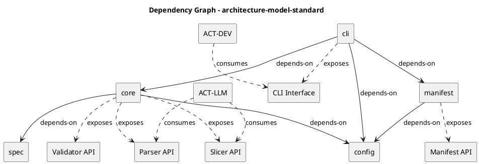

# Capability Map — architecture-model-standard

## Overview

This document maps the system's functional capabilities to the components that realize them, showing how architectural responsibilities are distributed across the codebase.

## Capabilities

| ID | Capability | Priority | Realized By |
|----|-----------|----------|-------------|
| CAP-F1 | Model Parsing & Validation | Medium | COMP-CORE (core) |
| CAP-F2 | Reality Manifest Generation | Medium | COMP-MANIFEST (manifest) |
| CAP-F3 | Model Slicing & Diffing | Medium | COMP-CORE (core) |
| CAP-F4 | CLI Operations | Medium | COMP-CLI (cli) |
| CAP-F5 | Configuration & Schema | Medium | COMP-CONFIG (config), COMP-SPEC (spec) |

## Capability Details

### CAP-F1: Model Parsing & Validation

- **Priority:** Medium
- **Realized by:** core
- **Exposed interfaces:** Parser API, Validator API
- **Constraints:** Schema compliance (CON-SCHEMA), No orphaned entities (CON-NO-ORPHANS)
- **Consumers:** ACT-LLM (via Parser API)

### CAP-F2: Reality Manifest Generation

- **Priority:** Medium
- **Realized by:** manifest
- **Exposed interfaces:** Manifest API
- **Dependencies:** config

### CAP-F3: Model Slicing & Diffing

- **Priority:** Medium
- **Realized by:** core
- **Exposed interfaces:** Slicer API
- **Consumers:** ACT-LLM (via Slicer API)

### CAP-F4: CLI Operations

- **Priority:** Medium
- **Realized by:** cli
- **Exposed interfaces:** CLI Interface
- **Dependencies:** core, config, manifest
- **Consumers:** ACT-DEV (via CLI Interface)

### CAP-F5: Configuration & Schema

- **Priority:** Medium
- **Realized by:** config, spec
- **Constraints:** Schema compliance (CON-SCHEMA)

## Component-to-Capability Matrix

| Component | Realizes | Exposes | Depends On |
|-----------|----------|---------|------------|
| core | CAP-F1, CAP-F3 | Parser API, Validator API, Slicer API | config, spec |
| manifest | CAP-F2 | Manifest API | config |
| cli | CAP-F4 | CLI Interface | core, config, manifest |
| config | CAP-F5 | — | — |
| spec | CAP-F5 | — | — |

## Actor Access

| Actor | Interfaces Consumed | Capabilities Reached |
|-------|-------------------|---------------------|
| ACT-DEV (Developer) | CLI Interface | CAP-F4 → CAP-F1, CAP-F2, CAP-F3 |
| ACT-LLM (LLM Agent) | Parser API, Slicer API | CAP-F1, CAP-F3 |

## Dependency Graph

