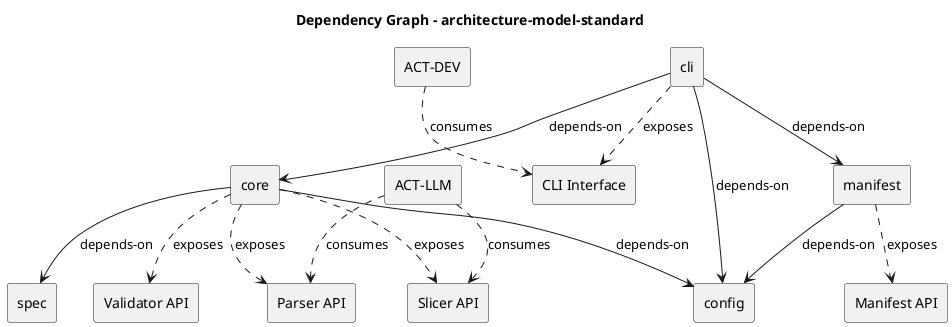

# Dependency Graph — architecture-model-standard

## Direct Dependencies

### Grouped by Source Component

**COMP-CLI (cli)**
- depends-on → COMP-CORE
- depends-on → COMP-CONFIG
- depends-on → COMP-MANIFEST

**COMP-CORE (core)**
- depends-on → COMP-CONFIG
- depends-on → COMP-SPEC

**COMP-MANIFEST (manifest)**
- depends-on → COMP-CONFIG

**COMP-CONFIG (config)**
- No outbound dependencies

**COMP-SPEC (spec)**
- No outbound dependencies

---

## Dependency Analysis

### Coupling Metrics

| Component | Afferent (incoming) | Efferent (outgoing) | Instability |
|-----------|:-------------------:|:-------------------:|:-----------:|
| cli       | 0                   | 3                   | 1.00        |
| core      | 1                   | 2                   | 0.67        |
| manifest  | 1                   | 1                   | 0.50        |
| config    | 3                   | 0                   | 0.00        |
| spec      | 1                   | 0                   | 0.00        |

Instability = efferent / (afferent + efferent). Components with instability 0.00 are maximally stable (depended upon, depend on nothing).

### Highly-Coupled Components

1. **config** — highest afferent coupling (3 dependents: cli, core, manifest). Any change to config's API risks cascading breakage across the entire package.
2. **core** — central hub with 1 incoming dependency (cli) and 2 outgoing (config, spec), plus it exposes 3 interfaces consumed by external actors.

### Circular Dependencies

No circular dependencies exist. The dependency graph is a directed acyclic graph (DAG):

```
cli → core → config
cli → config
cli → manifest → config
core → spec
```

All arrows flow toward stable, leaf-level components (config, spec).

### Suggested Improvements

1. **Stabilize config's public API** — Given three dependents, config should expose a narrow, versioned interface. Breaking changes here have maximum blast radius.
2. **Consider extracting a shared types module** — Both core and spec are constrained by CON-SCHEMA. If schema types are duplicated, a shared types boundary could reduce coupling.
3. **cli's fan-out is acceptable** — As the outermost orchestration layer (instability 1.00), cli is expected to depend on everything. This follows the Stable Dependencies Principle: unstable components depend on stable ones.

---

## PlantUML Diagram


