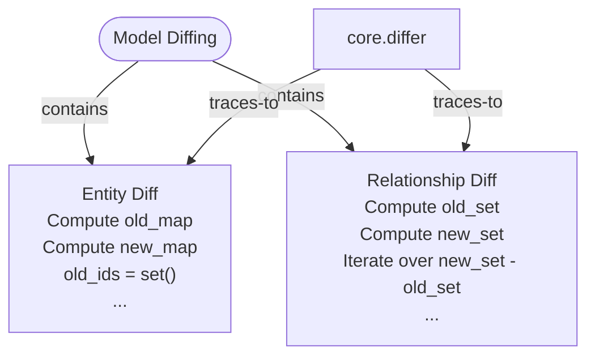
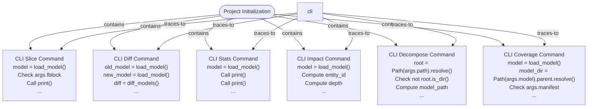
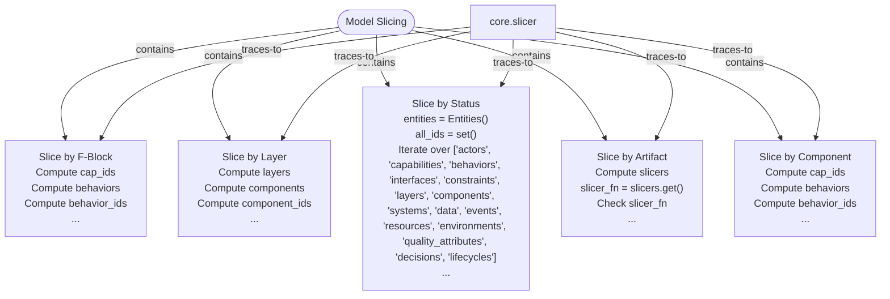

# F1: CLI Operations

```mermaid
flowchart TB
    BEH_DECOMPOSE([Model Decomposition])
    BEH_DECOMPOSE_IDENTIFY["Identify Systems<br/>Iterate over model.entities.components<br/>fblocks_meta = manifest.get()<br/>Iterate over groups.items()<br/>..."]
    BEH_DECOMPOSE_COMPLEXITY["Compute Complexity<br/>Compute symbol_weight<br/>Compute member_weight<br/>Compute function_weight<br/>..."]
    BEH_DECOMPOSE_PARTITION["Partition Subsystems<br/>test_files = _discover_test_files()<br/>source_files = _discover_source_files()<br/>Check not source_files<br/>..."]
    BEH_ORCH_FIND_COMPS["Find Block Components<br/>Compute result<br/>block_files_set = set()<br/>Iterate over model.entities.components<br/>..."]
    BEH_ORCH_FIND_PARENT["Find Parent Component<br/>Compute block_ids<br/>Iterate over model.relationships<br/>Check len(block_components) == 1<br/>..."]
    BEH_ORCH_TRACE["Trace Entities<br/>cap_ids = set()<br/>iface_ids = set()<br/>behavior_ids = set()<br/>..."]
    BEH_ORCH_COLLECT_RELS["Collect Relationships<br/>Compute rels<br/>seen = set()<br/>Iterate over model.relationships<br/>..."]
    BEH_ORCH_BUILD["Build Sub-Model<br/>model = load_model()<br/>config = get_config()<br/>Compute results<br/>..."]
    BEH_DECOMPOSE -->|contains| BEH_DECOMPOSE_IDENTIFY
    BEH_DECOMPOSE -->|contains| BEH_DECOMPOSE_COMPLEXITY
    BEH_DECOMPOSE -->|contains| BEH_DECOMPOSE_PARTITION
    BEH_DECOMPOSE -->|contains| BEH_ORCH_FIND_COMPS
    BEH_DECOMPOSE -->|contains| BEH_ORCH_FIND_PARENT
    BEH_DECOMPOSE -->|contains| BEH_ORCH_TRACE
    BEH_DECOMPOSE -->|contains| BEH_ORCH_COLLECT_RELS
    BEH_DECOMPOSE -->|contains| BEH_ORCH_BUILD
    COMP_CORE_DECOMPOSER[core.decomposer] -->|traces-to| BEH_DECOMPOSE_IDENTIFY
    COMP_CORE_DECOMPOSER -->|traces-to| BEH_DECOMPOSE_COMPLEXITY
    COMP_CORE_DECOMPOSER -->|traces-to| BEH_DECOMPOSE_PARTITION
    COMP_DECOMPOSE[decompose] -->|traces-to| BEH_ORCH_FIND_COMPS
    COMP_DECOMPOSE -->|traces-to| BEH_ORCH_FIND_PARENT
    COMP_DECOMPOSE -->|traces-to| BEH_ORCH_TRACE
    COMP_DECOMPOSE -->|traces-to| BEH_ORCH_COLLECT_RELS
    COMP_DECOMPOSE -->|traces-to| BEH_ORCH_BUILD
```

```mermaid
flowchart TB
    BEH_DIFF([Model Diffing])
    BEH_DIFF_ENTITIES["Entity Diff<br/>Compute old_map<br/>Compute new_map<br/>old_ids = set()<br/>..."]
    BEH_DIFF_RELS["Relationship Diff<br/>Compute old_set<br/>Compute new_set<br/>Iterate over new_set - old_set<br/>..."]
    BEH_DIFF -->|contains| BEH_DIFF_ENTITIES
    BEH_DIFF -->|contains| BEH_DIFF_RELS
    COMP_CORE_DIFFER[core.differ] -->|traces-to| BEH_DIFF_ENTITIES
    COMP_CORE_DIFFER -->|traces-to| BEH_DIFF_RELS
```

```mermaid
flowchart TB
    BEH_INIT([Project Initialization])
    BEH_CLI_SLICE["CLI Slice Command<br/>model = load_model()<br/>Check args.fblock<br/>Call print()<br/>..."]
    BEH_CLI_DIFF["CLI Diff Command<br/>old_model = load_model()<br/>new_model = load_model()<br/>diff = diff_models()<br/>..."]
    BEH_CLI_STATS["CLI Stats Command<br/>model = load_model()<br/>Call print()<br/>Call print()<br/>..."]
    BEH_CLI_IMPACT["CLI Impact Command<br/>model = load_model()<br/>Compute entity_id<br/>Compute depth<br/>..."]
    BEH_CLI_DECOMPOSE["CLI Decompose Command<br/>root = Path(args.path).resolve()<br/>Check not root.is_dir()<br/>Compute model_path<br/>..."]
    BEH_CLI_COVERAGE["CLI Coverage Command<br/>model = load_model()<br/>model_dir = Path(args.model).parent.resolve()<br/>Check args.manifest<br/>..."]
    BEH_INIT -->|contains| BEH_CLI_SLICE
    BEH_INIT -->|contains| BEH_CLI_DIFF
    BEH_INIT -->|contains| BEH_CLI_STATS
    BEH_INIT -->|contains| BEH_CLI_IMPACT
    BEH_INIT -->|contains| BEH_CLI_DECOMPOSE
    BEH_INIT -->|contains| BEH_CLI_COVERAGE
    COMP_CLI[cli] -->|traces-to| BEH_CLI_SLICE
    COMP_CLI -->|traces-to| BEH_CLI_DIFF
    COMP_CLI -->|traces-to| BEH_CLI_STATS
    COMP_CLI -->|traces-to| BEH_CLI_IMPACT
    COMP_CLI -->|traces-to| BEH_CLI_DECOMPOSE
    COMP_CLI -->|traces-to| BEH_CLI_COVERAGE
```

```mermaid
flowchart TB
    BEH_SLICE([Model Slicing])
    BEH_SLICE_FBLOCK["Slice by F-Block<br/>Compute cap_ids<br/>Compute behaviors<br/>Compute behavior_ids<br/>..."]
    BEH_SLICE_LAYER["Slice by Layer<br/>Compute layers<br/>Compute components<br/>Compute component_ids<br/>..."]
    BEH_SLICE_STATUS["Slice by Status<br/>entities = Entities()<br/>all_ids = set()<br/>Iterate over ['actors', 'capabilities', 'behaviors', 'interfaces', 'constraints', 'layers', 'components', 'systems', 'data', 'events', 'resources', 'environments', 'quality_attributes', 'decisions', 'lifecycles']<br/>..."]
    BEH_SLICE_ARTIFACT["Slice by Artifact<br/>Compute slicers<br/>slicer_fn = slicers.get()<br/>Check slicer_fn<br/>..."]
    BEH_SLICE_COMPONENT["Slice by Component<br/>Compute cap_ids<br/>Compute behaviors<br/>Compute behavior_ids<br/>..."]
    BEH_SLICE -->|contains| BEH_SLICE_FBLOCK
    BEH_SLICE -->|contains| BEH_SLICE_LAYER
    BEH_SLICE -->|contains| BEH_SLICE_STATUS
    BEH_SLICE -->|contains| BEH_SLICE_ARTIFACT
    BEH_SLICE -->|contains| BEH_SLICE_COMPONENT
    COMP_CORE_SLICER[core.slicer] -->|traces-to| BEH_SLICE_FBLOCK
    COMP_CORE_SLICER -->|traces-to| BEH_SLICE_LAYER
    COMP_CORE_SLICER -->|traces-to| BEH_SLICE_STATUS
    COMP_CORE_SLICER -->|traces-to| BEH_SLICE_ARTIFACT
    COMP_CORE_SLICER -->|traces-to| BEH_SLICE_COMPONENT
```
