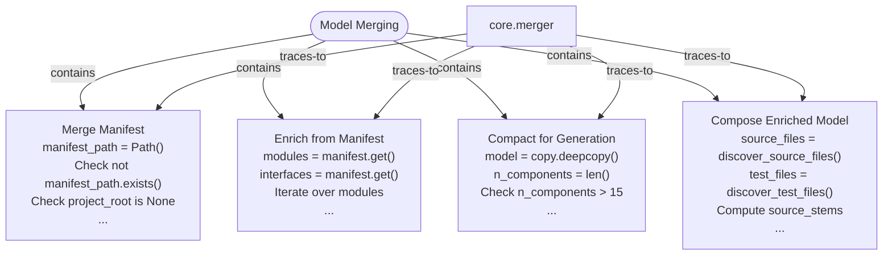

# F3: Model Merging

```mermaid
flowchart TB
    BEH_MERGE([Model Merging])
    BEH_MERGE_MANIFEST["Merge Manifest<br/>manifest_path = Path()<br/>Check not manifest_path.exists()<br/>Check project_root is None<br/>..."]
    BEH_MERGE_ENRICH["Enrich from Manifest<br/>modules = manifest.get()<br/>interfaces = manifest.get()<br/>Iterate over modules<br/>..."]
    BEH_MERGE_COMPACT["Compact for Generation<br/>model = copy.deepcopy()<br/>n_components = len()<br/>Check n_components > 15<br/>..."]
    BEH_MERGE_COMPOSE["Compose Enriched Model<br/>source_files = discover_source_files()<br/>test_files = discover_test_files()<br/>Compute source_stems<br/>..."]
    BEH_MERGE -->|contains| BEH_MERGE_MANIFEST
    BEH_MERGE -->|contains| BEH_MERGE_ENRICH
    BEH_MERGE -->|contains| BEH_MERGE_COMPACT
    BEH_MERGE -->|contains| BEH_MERGE_COMPOSE
    COMP_CORE_MERGER[core.merger] -->|traces-to| BEH_MERGE_MANIFEST
    COMP_CORE_MERGER -->|traces-to| BEH_MERGE_ENRICH
    COMP_CORE_MERGER -->|traces-to| BEH_MERGE_COMPACT
    COMP_CORE_MERGER -->|traces-to| BEH_MERGE_COMPOSE
```

```mermaid
flowchart TB
    BEH_VALIDATE([Model Validation])
    BEH_VALIDATE_IDS["ID Uniqueness Check<br/>Compute type_entities<br/>Iterate over type_entities"]
    BEH_VALIDATE_REFS["Referential Integrity Check<br/>Compute all_ids<br/>Compute layer_ids<br/>Iterate over model.relationships"]
    BEH_VALIDATE_ORPHANS["Orphan Entity Detection<br/>Iterate over model.relationships<br/>Iterate over model.entities.behaviors<br/>Iterate over model.entities.components"]
    BEH_VALIDATE_STATUS["Status Consistency Check<br/>Iterate over model.entities.actors<br/>Iterate over model.entities.capabilities<br/>Iterate over model.entities.behaviors<br/>..."]
    BEH_VALIDATE_CAPS["Capability Realization Check<br/>Iterate over model.relationships<br/>Iterate over model.entities.capabilities"]
    BEH_VALIDATE_META["Meta Completeness Check<br/>Check not model.meta.project<br/>Check not model.meta.schema_version<br/>Check not model.meta.source_artifacts"]
    BEH_VALIDATE_V11["V1.1 Semantics Check<br/>Iterate over model.entities.components<br/>Iterate over model.entities.behaviors"]
    BEH_VALIDATE_REGEN["Regen Readiness Check<br/>Iterate over model.entities.components"]
    BEH_VALIDATE_PROFILE["Domain Profile Validation<br/>Compute profile_name<br/>Check not profile_name or profile_name == 'software'<br/>Compute entity_lists<br/>..."]
    BEH_VALIDATE_IMPROVE["Improvement Opportunities<br/>Iterate over model.entities.components"]
    BEH_PARSE_LOAD["Model Loading<br/>path = Path()<br/>With open(path, 'r', encoding='utf-8')<br/>Check raw is None<br/>..."]
    BEH_PARSE_SAVE["Model Saving<br/>path = Path()<br/>Call path.parent.mkdir()<br/>data = dump_model()<br/>..."]
    BEH_PARSE_DUMP["Model Dumping<br/>Return {'meta': _dump_meta(model.meta), 'entities': _dump_entities("]
    BEH_PROFILE_LOAD["Load Profile<br/>Check name_or_path in BUILTIN_PROFILES<br/>Check not path.exists()<br/>data = yaml.safe_load()<br/>..."]
    BEH_PROFILE_APPLY["Apply Profile Rules"]
    BEH_VALIDATE -->|contains| BEH_VALIDATE_IDS
    BEH_VALIDATE -->|contains| BEH_VALIDATE_REFS
    BEH_VALIDATE -->|contains| BEH_VALIDATE_ORPHANS
    BEH_VALIDATE -->|contains| BEH_VALIDATE_STATUS
    BEH_VALIDATE -->|contains| BEH_VALIDATE_CAPS
    BEH_VALIDATE -->|contains| BEH_VALIDATE_META
    BEH_VALIDATE -->|contains| BEH_VALIDATE_V11
    BEH_VALIDATE -->|contains| BEH_VALIDATE_REGEN
    BEH_VALIDATE -->|contains| BEH_VALIDATE_PROFILE
    BEH_VALIDATE -->|contains| BEH_VALIDATE_IMPROVE
    BEH_VALIDATE -->|contains| BEH_PARSE_LOAD
    BEH_VALIDATE -->|contains| BEH_PARSE_SAVE
    BEH_VALIDATE -->|contains| BEH_PARSE_DUMP
    BEH_VALIDATE -->|contains| BEH_PROFILE_LOAD
    BEH_VALIDATE -->|contains| BEH_PROFILE_APPLY
    COMP_CORE_VALIDATOR[core.validator] -->|traces-to| BEH_VALIDATE_IDS
    COMP_CORE_VALIDATOR -->|traces-to| BEH_VALIDATE_REFS
    COMP_CORE_VALIDATOR -->|traces-to| BEH_VALIDATE_ORPHANS
    COMP_CORE_VALIDATOR -->|traces-to| BEH_VALIDATE_STATUS
    COMP_CORE_VALIDATOR -->|traces-to| BEH_VALIDATE_CAPS
    COMP_CORE_VALIDATOR -->|traces-to| BEH_VALIDATE_META
    COMP_CORE_VALIDATOR -->|traces-to| BEH_VALIDATE_V11
    COMP_CORE_VALIDATOR -->|traces-to| BEH_VALIDATE_REGEN
    COMP_CORE_VALIDATOR -->|traces-to| BEH_VALIDATE_PROFILE
    COMP_CORE_VALIDATOR -->|traces-to| BEH_VALIDATE_IMPROVE
    COMP_CORE_PARSER[core.parser] -->|traces-to| BEH_PARSE_LOAD
    COMP_CORE_PARSER -->|traces-to| BEH_PARSE_SAVE
    COMP_CORE_PARSER -->|traces-to| BEH_PARSE_DUMP
    COMP_PROFILES[profiles] -->|traces-to| BEH_PROFILE_LOAD
    COMP_PROFILES -->|traces-to| BEH_PROFILE_APPLY
```
