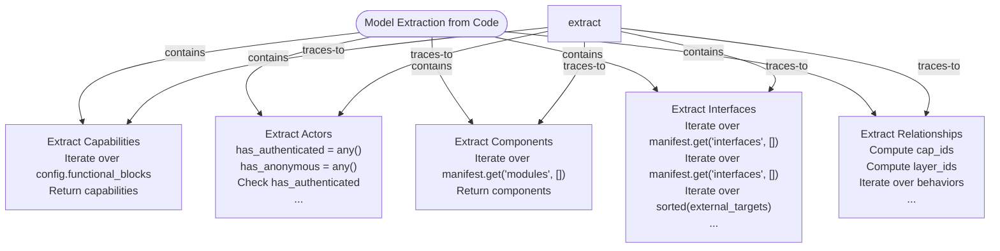

# F4: Model Extraction

```mermaid
flowchart TB
    BEH_EXTRACT([Model Extraction from Code])
    BEH_EXTRACT_CAPS["Extract Capabilities<br/>Iterate over config.functional_blocks<br/>Return capabilities"]
    BEH_EXTRACT_ACTORS["Extract Actors<br/>has_authenticated = any()<br/>has_anonymous = any()<br/>Check has_authenticated<br/>..."]
    BEH_EXTRACT_COMPS["Extract Components<br/>Iterate over manifest.get('modules', [])<br/>Return components"]
    BEH_EXTRACT_IFACES["Extract Interfaces<br/>Iterate over manifest.get('interfaces', [])<br/>Iterate over manifest.get('interfaces', [])<br/>Iterate over sorted(external_targets)<br/>..."]
    BEH_EXTRACT_RELS["Extract Relationships<br/>Compute cap_ids<br/>Compute layer_ids<br/>Iterate over behaviors<br/>..."]
    BEH_EXTRACT -->|contains| BEH_EXTRACT_CAPS
    BEH_EXTRACT -->|contains| BEH_EXTRACT_ACTORS
    BEH_EXTRACT -->|contains| BEH_EXTRACT_COMPS
    BEH_EXTRACT -->|contains| BEH_EXTRACT_IFACES
    BEH_EXTRACT -->|contains| BEH_EXTRACT_RELS
    COMP_EXTRACT[extract] -->|traces-to| BEH_EXTRACT_CAPS
    COMP_EXTRACT -->|traces-to| BEH_EXTRACT_ACTORS
    COMP_EXTRACT -->|traces-to| BEH_EXTRACT_COMPS
    COMP_EXTRACT -->|traces-to| BEH_EXTRACT_IFACES
    COMP_EXTRACT -->|traces-to| BEH_EXTRACT_RELS
```
