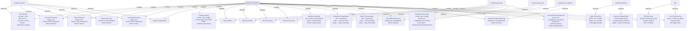

# F5: Reality Manifest Generation

```mermaid
flowchart TB
    BEH_MANIFEST([Manifest Generation])
    BEH_SCAN_PARSE["AST Parsing<br/>rel_path = str()<br/>line_count = _file_line_count()<br/>status = _determine_status()<br/>..."]
    BEH_SCAN_FUNCTIONS["Function Extraction<br/>Iterate over ast.iter_child_nodes(tree)<br/>Return functions"]
    BEH_SCAN_CLASSES["Class Extraction<br/>Iterate over ast.iter_child_nodes(tree)<br/>Return classes"]
    BEH_SCAN_IMPORTS["Import Extraction<br/>Iterate over ast.walk(tree)<br/>Return imports"]
    BEH_SCAN_CONSTANTS["Constant Extraction<br/>Iterate over ast.iter_child_nodes(tree)<br/>Return consts"]
    BEH_SCAN_METRICS["Metrics Computation"]
    BEH_MANIFEST_CONFIG["Config Loading<br/>config = get_config()<br/>Check output_dir is None<br/>Check manifest_path.exists()<br/>..."]
    BEH_MANIFEST_METRICS["Project Metrics"]
    BEH_MANIFEST_BLOCKS["Block Assembly"]
    BEH_MANIFEST_SCAN["Block Scanning"]
    BEH_MANIFEST_IFACE["Interface Discovery"]
    BEH_MANIFEST_ASSEMBLE["Manifest Assembly<br/>root = project_root.resolve()<br/>report = ScanReport()<br/>Check config is None<br/>..."]
    BEH_BODYHINT_CLASSIFY["Complexity Classification<br/>tree = ast.parse()<br/>node = _find_function()<br/>body = _strip_docstring()<br/>..."]
    BEH_BODYHINT_SUMMARIZE["Body Summarization<br/>tree = ast.parse()<br/>node = _find_function()<br/>body = _strip_docstring()<br/>..."]
    BEH_TEST_DISCOVER["Test Method Discovery<br/>Iterate over ast.walk(tree)<br/>Return methods"]
    BEH_TEST_ASSERTIONS["Assertion Pattern Matching<br/>Iterate over ast.walk(node)<br/>Return contracts"]
    BEH_IFACE_RESOLVE["Import Resolution<br/>Iterate over modules<br/>Iterate over modules<br/>Call logger.debug()<br/>..."]
    BEH_IFACE_DEDUP["Interface Deduplication<br/>Call warnings.warn()<br/>Compute typed_modules<br/>edges = derive_interfaces()<br/>..."]
    BEH_RECURSIVE_SCAN["Per-Block Deep Scan<br/>config = get_config()<br/>Iterate over config.fblock_dict.items()<br/>block_deps = compute_block_dependencies()<br/>..."]
    BEH_RECURSIVE_DEPS["Cross-Block Dependencies<br/>Iterate over config.fblock_dict.items()<br/>Iterate over manifests.items()<br/>Return dependencies"]
    BEH_UTILS_DISCOVER["File Discovery<br/>Check not directory.is_dir()<br/>Compute glob_fn<br/>files = sorted()<br/>..."]
    BEH_UTILS_TESTS["Test File Discovery<br/>all_py = collect_py_files()<br/>Compute tests<br/>Call logger.info()<br/>..."]
    BEH_MANIFEST -->|contains| BEH_SCAN_PARSE
    BEH_MANIFEST -->|contains| BEH_SCAN_FUNCTIONS
    BEH_MANIFEST -->|contains| BEH_SCAN_CLASSES
    BEH_MANIFEST -->|contains| BEH_SCAN_IMPORTS
    BEH_MANIFEST -->|contains| BEH_SCAN_CONSTANTS
    BEH_MANIFEST -->|contains| BEH_SCAN_METRICS
    BEH_MANIFEST -->|contains| BEH_MANIFEST_CONFIG
    BEH_MANIFEST -->|contains| BEH_MANIFEST_METRICS
    BEH_MANIFEST -->|contains| BEH_MANIFEST_BLOCKS
    BEH_MANIFEST -->|contains| BEH_MANIFEST_SCAN
    BEH_MANIFEST -->|contains| BEH_MANIFEST_IFACE
    BEH_MANIFEST -->|contains| BEH_MANIFEST_ASSEMBLE
    BEH_MANIFEST -->|contains| BEH_BODYHINT_CLASSIFY
    BEH_MANIFEST -->|contains| BEH_BODYHINT_SUMMARIZE
    BEH_MANIFEST -->|contains| BEH_TEST_DISCOVER
    BEH_MANIFEST -->|contains| BEH_TEST_ASSERTIONS
    BEH_MANIFEST -->|contains| BEH_IFACE_RESOLVE
    BEH_MANIFEST -->|contains| BEH_IFACE_DEDUP
    BEH_MANIFEST -->|contains| BEH_RECURSIVE_SCAN
    BEH_MANIFEST -->|contains| BEH_RECURSIVE_DEPS
    BEH_MANIFEST -->|contains| BEH_UTILS_DISCOVER
    BEH_MANIFEST -->|contains| BEH_UTILS_TESTS
    COMP_MANIFEST_SCANNER[manifest.scanner] -->|traces-to| BEH_SCAN_PARSE
    COMP_MANIFEST_SCANNER -->|traces-to| BEH_SCAN_FUNCTIONS
    COMP_MANIFEST_SCANNER -->|traces-to| BEH_SCAN_CLASSES
    COMP_MANIFEST_SCANNER -->|traces-to| BEH_SCAN_IMPORTS
    COMP_MANIFEST_SCANNER -->|traces-to| BEH_SCAN_CONSTANTS
    COMP_MANIFEST_SCANNER -->|traces-to| BEH_SCAN_METRICS
    COMP_MANIFEST_GENERATOR[manifest.generator] -->|traces-to| BEH_MANIFEST_CONFIG
    COMP_MANIFEST_GENERATOR -->|traces-to| BEH_MANIFEST_METRICS
    COMP_MANIFEST_GENERATOR -->|traces-to| BEH_MANIFEST_BLOCKS
    COMP_MANIFEST_GENERATOR -->|traces-to| BEH_MANIFEST_SCAN
    COMP_MANIFEST_GENERATOR -->|traces-to| BEH_MANIFEST_IFACE
    COMP_MANIFEST_GENERATOR -->|traces-to| BEH_MANIFEST_ASSEMBLE
    COMP_MANIFEST_BODY_HINTS[manifest.body_hints] -->|traces-to| BEH_BODYHINT_CLASSIFY
    COMP_MANIFEST_BODY_HINTS -->|traces-to| BEH_BODYHINT_SUMMARIZE
    COMP_MANIFEST_TEST_ANALYZER[manifest.test_analyzer] -->|traces-to| BEH_TEST_DISCOVER
    COMP_MANIFEST_TEST_ANALYZER -->|traces-to| BEH_TEST_ASSERTIONS
    COMP_MANIFEST_INTERFACES[manifest.interfaces] -->|traces-to| BEH_IFACE_RESOLVE
    COMP_MANIFEST_INTERFACES -->|traces-to| BEH_IFACE_DEDUP
    COMP_MANIFEST_GENERATOR -->|traces-to| BEH_RECURSIVE_SCAN
    COMP_MANIFEST_GENERATOR -->|traces-to| BEH_RECURSIVE_DEPS
    COMP_UTILS[utils] -->|traces-to| BEH_UTILS_DISCOVER
    COMP_UTILS -->|traces-to| BEH_UTILS_TESTS
```
