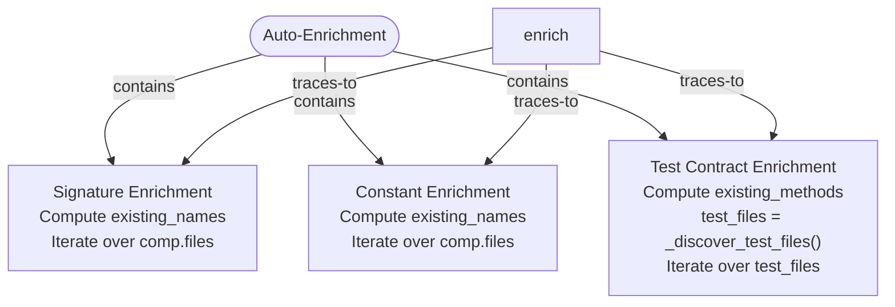

# F6: Test Contract Enrichment

```mermaid
flowchart TB
    BEH_ENRICH([Auto-Enrichment])
    BEH_ENRICH_SIGS["Signature Enrichment<br/>Compute existing_names<br/>Iterate over comp.files"]
    BEH_ENRICH_CONSTS["Constant Enrichment<br/>Compute existing_names<br/>Iterate over comp.files"]
    BEH_ENRICH_TESTS["Test Contract Enrichment<br/>Compute existing_methods<br/>test_files = _discover_test_files()<br/>Iterate over test_files"]
    BEH_ENRICH -->|contains| BEH_ENRICH_SIGS
    BEH_ENRICH -->|contains| BEH_ENRICH_CONSTS
    BEH_ENRICH -->|contains| BEH_ENRICH_TESTS
    COMP_ENRICH[enrich] -->|traces-to| BEH_ENRICH_SIGS
    COMP_ENRICH -->|traces-to| BEH_ENRICH_CONSTS
    COMP_ENRICH -->|traces-to| BEH_ENRICH_TESTS
```
