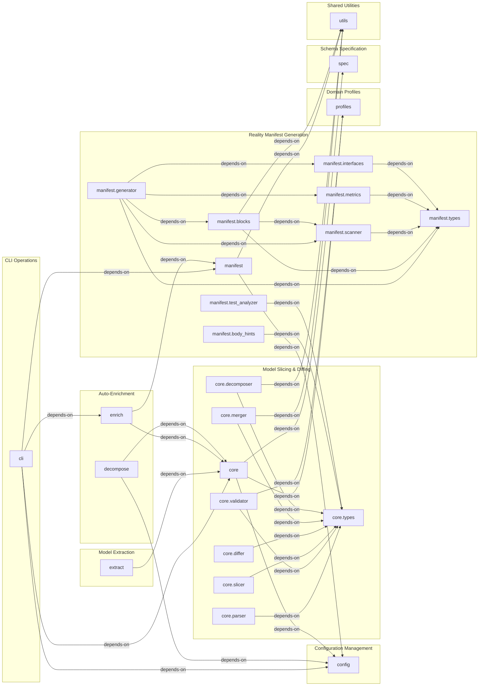

# Component Dependencies

```mermaid
flowchart LR
    subgraph F1[CLI Operations]
        COMP_CLI[cli]
    end
    subgraph F2[Configuration Management]
        COMP_CONFIG[config]
    end
    subgraph F3[Model Slicing & Diffing]
        COMP_CORE[core]
        COMP_CORE_PARSER[core.parser]
        COMP_CORE_VALIDATOR[core.validator]
        COMP_CORE_SLICER[core.slicer]
        COMP_CORE_DIFFER[core.differ]
        COMP_CORE_MERGER[core.merger]
        COMP_CORE_DECOMPOSER[core.decomposer]
        COMP_CORE_TYPES[core.types]
    end
    subgraph F4[Model Extraction]
        COMP_EXTRACT[extract]
    end
    subgraph F5[Reality Manifest Generation]
        COMP_MANIFEST[manifest]
        COMP_MANIFEST_SCANNER[manifest.scanner]
        COMP_MANIFEST_BLOCKS[manifest.blocks]
        COMP_MANIFEST_METRICS[manifest.metrics]
        COMP_MANIFEST_INTERFACES[manifest.interfaces]
        COMP_MANIFEST_BODY_HINTS[manifest.body_hints]
        COMP_MANIFEST_TEST_ANALYZER[manifest.test_analyzer]
        COMP_MANIFEST_GENERATOR[manifest.generator]
        COMP_MANIFEST_TYPES[manifest.types]
    end
    subgraph F6[Auto-Enrichment]
        COMP_ENRICH[enrich]
        COMP_DECOMPOSE[decompose]
    end
    subgraph F7[Domain Profiles]
        COMP_PROFILES[profiles]
    end
    subgraph F8[Schema Specification]
        COMP_SPEC[spec]
    end
    subgraph F9[Shared Utilities]
        COMP_UTILS[utils]
    end
    COMP_CLI -->|depends-on| COMP_CORE
    COMP_CLI -->|depends-on| COMP_CONFIG
    COMP_CLI -->|depends-on| COMP_MANIFEST
    COMP_CLI -->|depends-on| COMP_ENRICH
    COMP_CORE -->|depends-on| COMP_CONFIG
    COMP_CORE -->|depends-on| COMP_SPEC
    COMP_CORE -->|depends-on| COMP_PROFILES
    COMP_MANIFEST -->|depends-on| COMP_CONFIG
    COMP_MANIFEST -->|depends-on| COMP_UTILS
    COMP_EXTRACT -->|depends-on| COMP_CORE
    COMP_ENRICH -->|depends-on| COMP_CORE
    COMP_ENRICH -->|depends-on| COMP_MANIFEST
    COMP_CORE_PARSER -->|depends-on| COMP_CORE_TYPES
    COMP_CORE_VALIDATOR -->|depends-on| COMP_CORE_TYPES
    COMP_CORE_VALIDATOR -->|depends-on| COMP_PROFILES
    COMP_CORE_SLICER -->|depends-on| COMP_CORE_TYPES
    COMP_CORE_DIFFER -->|depends-on| COMP_CORE_TYPES
    COMP_CORE_MERGER -->|depends-on| COMP_CORE_TYPES
    COMP_CORE_MERGER -->|depends-on| COMP_UTILS
    COMP_CORE_DECOMPOSER -->|depends-on| COMP_CORE_TYPES
    COMP_CORE_DECOMPOSER -->|depends-on| COMP_UTILS
    COMP_MANIFEST_GENERATOR -->|depends-on| COMP_MANIFEST_SCANNER
    COMP_MANIFEST_GENERATOR -->|depends-on| COMP_MANIFEST_BLOCKS
    COMP_MANIFEST_GENERATOR -->|depends-on| COMP_MANIFEST_METRICS
    COMP_MANIFEST_GENERATOR -->|depends-on| COMP_MANIFEST_INTERFACES
    COMP_MANIFEST_GENERATOR -->|depends-on| COMP_MANIFEST_TYPES
    COMP_MANIFEST_BLOCKS -->|depends-on| COMP_MANIFEST_SCANNER
    COMP_MANIFEST_BLOCKS -->|depends-on| COMP_MANIFEST_TYPES
    COMP_MANIFEST_BLOCKS -->|depends-on| COMP_UTILS
    COMP_MANIFEST_SCANNER -->|depends-on| COMP_MANIFEST_TYPES
    COMP_MANIFEST_METRICS -->|depends-on| COMP_MANIFEST_TYPES
    COMP_MANIFEST_INTERFACES -->|depends-on| COMP_MANIFEST_TYPES
    COMP_MANIFEST_BODY_HINTS -->|depends-on| COMP_CORE_TYPES
    COMP_MANIFEST_TEST_ANALYZER -->|depends-on| COMP_CORE_TYPES
    COMP_DECOMPOSE -->|depends-on| COMP_CORE
    COMP_DECOMPOSE -->|depends-on| COMP_CONFIG
```
