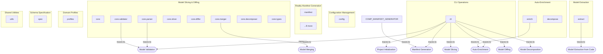

# Architecture Overview

```mermaid
flowchart TB
    subgraph F1[CLI Operations]
        COMP_CLI[cli]
    end
    subgraph F2[Configuration Management]
        COMP_CONFIG[config]
    end
    subgraph F3[Model Slicing & Diffing]
        COMP_CORE[core]
        COMP_CORE_PARSER[core.parser]
        COMP_CORE_VALIDATOR[core.validator]
        COMP_CORE_SLICER[core.slicer]
        COMP_CORE_DIFFER[core.differ]
        COMP_CORE_MERGER[core.merger]
        COMP_CORE_DECOMPOSER[core.decomposer]
        COMP_CORE_TYPES[core.types]
    end
    subgraph F4[Model Extraction]
        COMP_EXTRACT[extract]
    end
    subgraph F5[Reality Manifest Generation]
        COMP_MANIFEST[manifest]
        F5_more[...8 more]
    end
    subgraph F6[Auto-Enrichment]
        COMP_ENRICH[enrich]
        COMP_DECOMPOSE[decompose]
    end
    subgraph F7[Domain Profiles]
        COMP_PROFILES[profiles]
    end
    subgraph F8[Schema Specification]
        COMP_SPEC[spec]
    end
    subgraph F9[Shared Utilities]
        COMP_UTILS[utils]
    end
    BEH_INIT([Project Initialization])
    BEH_VALIDATE([Model Validation])
    BEH_MANIFEST([Manifest Generation])
    BEH_ENRICH([Auto-Enrichment])
    BEH_EXTRACT([Model Extraction from Code])
    BEH_SLICE([Model Slicing])
    BEH_DIFF([Model Diffing])
    BEH_MERGE([Model Merging])
    BEH_DECOMPOSE([Model Decomposition])
    COMP_CLI -->|traces-to| BEH_INIT
    COMP_CLI -->|traces-to| BEH_VALIDATE
    COMP_CLI -->|traces-to| BEH_MANIFEST
    COMP_CLI -->|traces-to| BEH_ENRICH
    COMP_CORE_PARSER -->|traces-to| BEH_VALIDATE
    COMP_CORE_VALIDATOR -->|traces-to| BEH_VALIDATE
    COMP_MANIFEST_GENERATOR -->|traces-to| BEH_MANIFEST
    COMP_ENRICH -->|traces-to| BEH_ENRICH
    COMP_EXTRACT -->|traces-to| BEH_EXTRACT
    COMP_CLI -->|traces-to| BEH_SLICE
    COMP_CLI -->|traces-to| BEH_DIFF
    COMP_CORE_MERGER -->|traces-to| BEH_MERGE
    COMP_CLI -->|traces-to| BEH_DECOMPOSE
```
